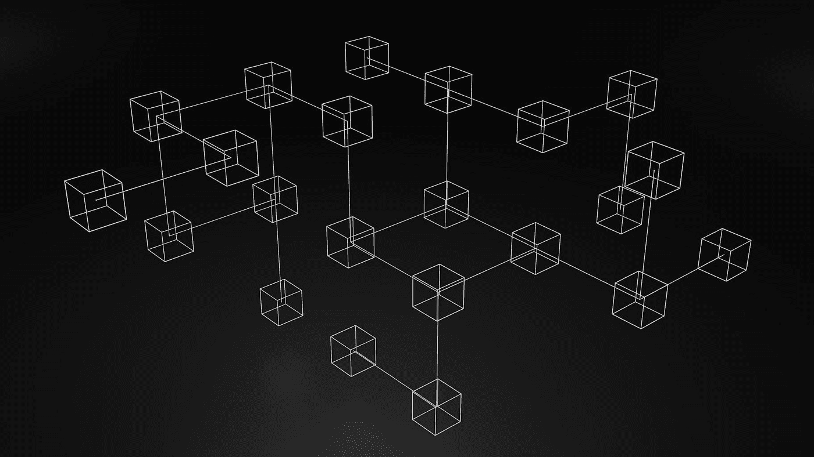

# 应该知道的 100 个 Web-3 基本概念(第 1 部分)

> 原文：<https://levelup.gitconnected.com/100-essential-web-3-concepts-that-one-should-know-about-cedf47b8b6a7>

揭开 Web-3 神秘面纱的指南

这是 100 个基本概念，将帮助你揭开 Web-3 世界的神秘面纱。

为了保证可读性，我将这些分成多篇博文。

由 [Unsplash](https://unsplash.com?utm_source=medium&utm_medium=referral) 上 [GuerrillaBuzz Crypto PR](https://unsplash.com/@theshubhamdhage?utm_source=medium&utm_medium=referral) 拍摄的照片

# 1.区块链

区块链是:

*   数据/信息的防篡改分类账
*   由密码链接的块(信息单元)组成
*   它分布在计算机网络中(称为节点)
*   它们在对等网络中相互连接
*   并使用共识机制对分类帐的状态达成一致

照片由 [Unsplash](https://unsplash.com?utm_source=medium&utm_medium=referral) 上的 GuerrillaBuzz Crypto PR 拍摄

# 2.街区

块是由数据组成的单个实体，它与其他块链接在一起形成区块链。

例如，在比特币区块链的环境中，一个块包含交易数据和对前一个块的引用。

块之间以密码方式相互链接。

这使得区块链**防篡改**成为可能，因为在区块链中，操作单个块将改变其后所有块的状态。

由[串联 X 视觉效果](https://unsplash.com/es/@tandemxvisuals?utm_source=medium&utm_medium=referral)在 [Unsplash](https://unsplash.com?utm_source=medium&utm_medium=referral) 上拍摄的照片

# 3.Web-3

Web-3 是万维网的一个去中心化的、无权限的、不可信的迭代。

在 Web-3 应用程序(称为 **Dapps** 或分散应用程序)中，数据不再存储在私有数据库中，而是存储在开放数据结构(区块链)中，任何人都可以写入、读取、证明对资源的所有权并进行验证。

来源:[https://twitter.com/himgajria/status/1266415636789334016](https://twitter.com/himgajria/status/1266415636789334016)

# 4.非集中式网络

它是一个由计算机(节点)组成的网络，不是由单个实体/组织拥有和控制的。

区块链由对等分散网络维护。

# 5.对等网络(P2P)

它是一个由计算机节点组成的网络，这些节点通过相互通信来分配任务的工作负载，并在对等节点之间保持一个共同的状态。

P2P 网络可以在有或没有中央实体(分散式网络)的情况下运行。

在维护区块链的 P2P 网络中，不涉及中央实体，对等体通过共识机制达到共同的状态。

由 [Clarisse Croset](https://unsplash.com/@herfrenchness?utm_source=medium&utm_medium=referral) 在 [Unsplash](https://unsplash.com?utm_source=medium&utm_medium=referral) 上拍摄的照片

# 6.共识机制

它是一种过程/协议，多节点系统(区块链的对等网络)中的不同节点通过该过程/协议同意达到共同的状态。

在区块链的情况下，这意味着就将添加到区块链的下一个区块的有效性达成一致。

**工作证明(PoW)** 和**利益证明(PoS)** 是区块链常用的两种共识机制。

照片由 [Cytonn 摄影](https://unsplash.com/@cytonn_photography?utm_source=medium&utm_medium=referral)在 [Unsplash](https://unsplash.com?utm_source=medium&utm_medium=referral) 上拍摄

# 7.加密散列/散列函数

它是使用哈希函数将任意大小的数据映射到固定大小的值的过程。

**散列函数**是确定性的数学单向函数。常用哈希函数的一些例子有 **RipeMD** 和 **SHA** 。

哈希运算产生一致的结果，易于执行，但难以逆转。

例如:

字符串`ashish`的 [**SHA256**](https://en.wikipedia.org/wiki/SHA-2) 哈希为`05d08de271d2773a504b3a30f98df26cccda55689a8dc3514f55d3f247553d2b`(可以通过[轻松计算出](https://emn178.github.io/online-tools/sha256.html))。

但是不能*( *直到当前日期)*执行相反的操作，即找到用于计算给定散列的字符串(除非他们使用[强力方法](/100-essential-cybersecurity-concepts-that-every-developer-must-know-part-5-41-50-2ef82ce2b867)比较所有可能的键-散列对)。

丹·克里斯蒂安·pădureț在 [Unsplash](https://unsplash.com/?utm_source=medium&utm_medium=referral) 上拍摄的照片

# 8.安全散列算法

这些是由美国[国家标准与技术研究院](https://en.wikipedia.org/wiki/National_Institute_of_Standards_and_Technology) (NIST)发布的一系列流行的散列函数。

**SHA-2** 哈希函数家族(例如 **SHA-256** )在比特币区块链中被广泛使用。

请在下面阅读更多信息:

 [## 安全散列算法-维基百科

### 安全散列算法是由美国国家安全研究所发布的一系列加密散列函数

en.wikipedia.org](https://en.wikipedia.org/wiki/Secure_Hash_Algorithms)  [## SHA-256 如何一步一步地工作

### SHA-2(安全散列算法 2)，SHA-256 是其中的一部分，是最流行的散列算法之一。一个…

博客.启动.开发](https://blog.boot.dev/cryptography/how-sha-2-works-step-by-step-sha-256/) 

# 9.凯克-256

这是以太坊区块链中使用的一种加密哈希函数。

SHA-3 散列函数家族是更广泛的密码原语家族 **Keccak** 的子集。

点击此处了解更多信息:

 [## 沙-3 -维基百科

### 设计师吉多·贝尔托尼、琼·代蒙、米歇尔·彼得斯和吉勒·范·阿舍。在基于 x86-64 的典型系统上，速度为 12.6 cpb

en.wikipedia.org](https://en.wikipedia.org/wiki/SHA-3) 

照片由 [GuerrillaBuzz Crypto PR](https://unsplash.com/@theshubhamdhage?utm_source=medium&utm_medium=referral) 在 [Unsplash](https://unsplash.com?utm_source=medium&utm_medium=referral) 上拍摄

# 10.可替代资产与不可替代资产

**可互换资产**是一种可以与同类型其他资产互换的资产。

例如，一便士可以和其他任何一便士交换。两枚硬币没有任何区别特征。

另一个例子是比特币。一个比特币和另一个比特币没有区别。

[乔丹·罗兰](https://unsplash.com/@jsrowland?utm_source=medium&utm_medium=referral)在 [Unsplash](https://unsplash.com?utm_source=medium&utm_medium=referral) 上的照片

**不可替代资产**是一种拥有独特价值的资产，它不能被另一种资产替代。

例如，蒙娜丽莎的原作不能等同于印刷复制品，也不能被印刷复制品所取代。

另一个受欢迎的例子是 NFT，这是以太坊区块链上数字资产的独特象征。

点击此处了解更多关于 NFTs 的信息:

 [## 不可替换代币(ethereum.org NFT)|

### NFT 目前正在数码艺术和收藏品领域掀起风暴。数字艺术家看到了他们的生活…

ethereum.org](https://ethereum.org/en/nft/) 

马库斯·斯皮斯克在 [Unsplash](https://unsplash.com?utm_source=medium&utm_medium=referral) 上的照片

*感谢你阅读这篇文章！下一部分再见！*

 [## 应该知道的 100 个 Web-3 基本概念(第 2 部分:11–20)

### 揭开 Web-3 神秘面纱的指南

levelup.gitconnected.com](/100-essential-web-3-concepts-that-one-should-know-about-part-2-11-20-ec997ef6dffd)  [## 通过我的推荐链接加入 Medium-Ashish Bama nia 博士

### 阅读 Ashish Bamania 博士(以及 Medium 上成千上万的其他作家)的每一个故事。您的会员费直接…

bamania-ashish.medium.com](https://bamania-ashish.medium.com/membership)