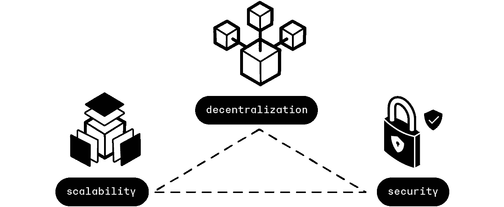
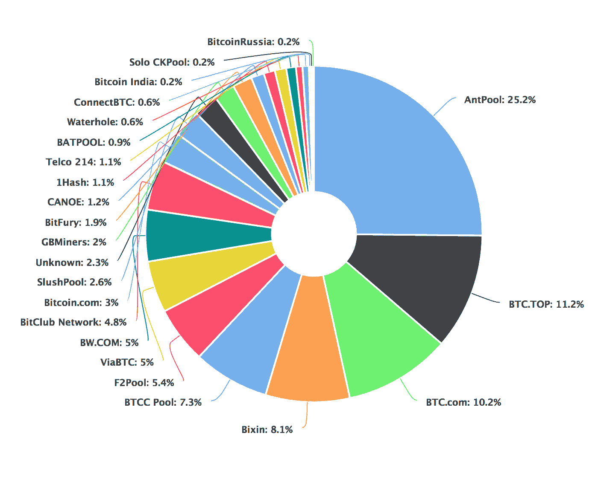

# 应该知道的 100 个 Web-3 基本概念(第 2 部分:11–20)

> 原文：<https://levelup.gitconnected.com/100-essential-web-3-concepts-that-one-should-know-about-part-2-11-20-ec997ef6dffd>

揭开 Web-3 神秘面纱的指南

这是 100 个基本概念，将帮助你揭开 Web-3 世界的神秘面纱。

为了保证可读性，我将这些分成多篇博文。

由 [La-Rel 复活节](https://unsplash.com/@lastnameeaster?utm_source=medium&utm_medium=referral)在 [Unsplash](https://unsplash.com?utm_source=medium&utm_medium=referral) 上拍摄的照片

本文前一部分的链接可以在下面找到:

 [## 人们应该知道的 100 个 Web-3 基本概念

### 揭开 Web-3 神秘面纱的指南

levelup.gitconnected.com](/100-essential-web-3-concepts-that-one-should-know-about-cedf47b8b6a7) 

# 11.拜占庭将军的问题

问题描述如下:

*   想象一下，有很多拜占庭军队的师站在一个敌人的城市外面。每个师由自己的将军领导。
*   将军们可以通过一个普通的信使互相交流。
*   进攻这座城市时，将军们需要决定一个共同的行动计划。
*   请注意，并非所有的将军都是忠诚的，少数可能是叛徒，这可能会阻止忠诚的将军达成正确的行动计划/协议。

因此，人们必须建立一个拜占庭容错模型，以便忠诚的将军们在攻击敌人城市时可以达成一致，并且不受叛徒的影响。

照片由 [Stijn Swinnen](https://unsplash.com/@stijnswinnen?utm_source=medium&utm_medium=referral) 在 [Unsplash](https://unsplash.com?utm_source=medium&utm_medium=referral) 上拍摄

在形成区块链的计算机节点的分布式网络中，也面临同样的问题。

在区块链的背景下，有两种类型的拜占庭式失败可以面对:

1.  由于技术错误，节点可以在需要时停止工作
2.  一个节点可以恶意地误导其他节点达成正确的共识。这样的节点被称为**拜占庭节点。**

**拜占庭容错** ( **BFT** )是网络对此类故障的弹性。

区块链使用密码安全的共识机制，如**工作证明/利益证明**来实现**拜占庭容错** ( **BFT** )。

阅读更多关于拜占庭将军的问题:

# 12.重复支出问题

这是数字货币系统中的一个问题，同一单位的数字货币可能会被花费多次。

这是拜占庭将军问题的一个变种。

传统的货币系统通过实现可信任的第三方(中央银行)来确保有效的交易，从而避免了这种情况。

区块链通过使用加密的安全共识机制来实现，如**工作证明/利益证明。**

由[粘土银行](https://unsplash.com/@claybanks?utm_source=medium&utm_medium=referral)在 [Unsplash](https://unsplash.com?utm_source=medium&utm_medium=referral) 上拍摄

# 13.区块链节点

它是一台运行区块链协议软件的计算机设备，有助于维护区块链网络中的公共状态。

每个节点与另一个节点通信，形成一个分散的对等网络。

称为**挖掘器节点**的特殊类型节点执行向区块链添加新块的功能。

# 14.区块链三难困境

它规定区块链只能实现三项中的两项，即:

*   安全性
*   分散
*   可量测性

区块链三难困境(来源:[https://www . ledger . com/academy/what-is-the-区块链三难困境](https://www.ledger.com/academy/what-is-the-blockchain-trilemma))

# 15.矿工

它是一个计算机节点，执行向区块链添加新数据块的功能。

“矿工”一词在上下文中属于遵循工作证明共识机制的区块链。

# 16.工作证明

这是一种[共识机制](/100-essential-web-3-concepts-that-one-should-know-about-cedf47b8b6a7)，它允许区块链网络中的节点就共同的状态达成一致。

工作证明确保挖掘器节点消耗大量的计算能力，从而在产生新块时在电力和计算机上花费金钱。

这项工作激励他们发布关于区块链的真实信息。

一个挖掘器节点通过产生一个其散列小于由区块链软件设置的目标的块来生成工作证明。

哈希是随机生成的，矿工必须生成数十亿个哈希才能找到比目标更小的哈希，因此在这些计算上花费了精力和金钱。

最早找到正确散列的挖掘者将其发布在网络上。其他节点对此进行验证，并将该块添加到区块链中。

矿工因找到这个散列并挖掘新块而获得一些加密货币。

丹·克里斯蒂安·pădureț在 [Unsplash](https://unsplash.com?utm_source=medium&utm_medium=referral) 上的照片

# 17.专用集成电路(ASIC)挖掘器

这是一个集成芯片，旨在为加密货币挖掘找到工作证据。

它通过对块头执行 [SHA-256 散列函数](https://river.com/learn/terms/s/sha-256/)来工作。

[娜娜杜瓦](https://unsplash.com/@nanadua11?utm_source=medium&utm_medium=referral)在 [Unsplash](https://unsplash.com?utm_source=medium&utm_medium=referral) 上的照片

# 18.采矿池

它是一群加密货币挖掘者联合他们的计算资源来增加找到一个块 hash 的概率，并分享挖掘奖励。

挖掘比特币池(来源:[https://en.bitcoinwiki.org/index.php?curid=271439](https://en.bitcoinwiki.org/index.php?curid=271439)

# 19.验证器

它是一个计算机节点，执行将新块添加到运行利益一致性机制证明的区块链的功能。

要成为验证者，节点必须赌上区块链的资产(持有加密货币)。

例如，要成为以太坊验证器，一个节点必须至少在存款契约中加入 **32 ETH** 。

一个验证者被随机挑选来开采区块链中的下一个区块，与他们的赌注数量成比例。

[Art Rachen](https://unsplash.com/@artrachen?utm_source=medium&utm_medium=referral) 在 [Unsplash](https://unsplash.com?utm_source=medium&utm_medium=referral) 上拍摄的照片

# 20.股权证明

这是一种共识机制，其中块由称为**验证器**的节点添加和验证。

节点通过下注区块链的资产(持有加密货币)成为验证者。

随机选择一个验证者，以便按其赌注加密货币资产的数量比例向区块链添加一个区块。

这个新添加的块由多个验证器进行验证。

一旦通过验证，它将被添加到区块链中。

验证者因向区块链添加有效块而获得加密货币奖励。

> 虽然 PoW 要求挖掘者在找到正确的块哈希时以比其他挖掘者更快的速度解决密码难题，但是 PoS 要求验证者标记令牌，以便挖掘区块链中的下一个块。

与功率相比，PoS 被认为是:

*   更安全
*   能源密集程度较低
*   更适合实施新的扩展解决方案

 [## 利害关系证明| ethereum.org

### 利害关系证明(PoS)是以太坊共识机制的基础。以太坊开启了它的赌注证明机制…

ethereum.org](https://ethereum.org/en/developers/docs/consensus-mechanisms/pos/) 

非常感谢你阅读这篇文章！下一部分再见！

 [## 通过我的推荐链接加入 Medium-Ashish Bama nia 博士

### 阅读 Ashish Bamania 博士(以及 Medium 上成千上万的其他作家)的每一个故事。您的会员费直接…

bamania-ashish.medium.com](https://bamania-ashish.medium.com/membership)