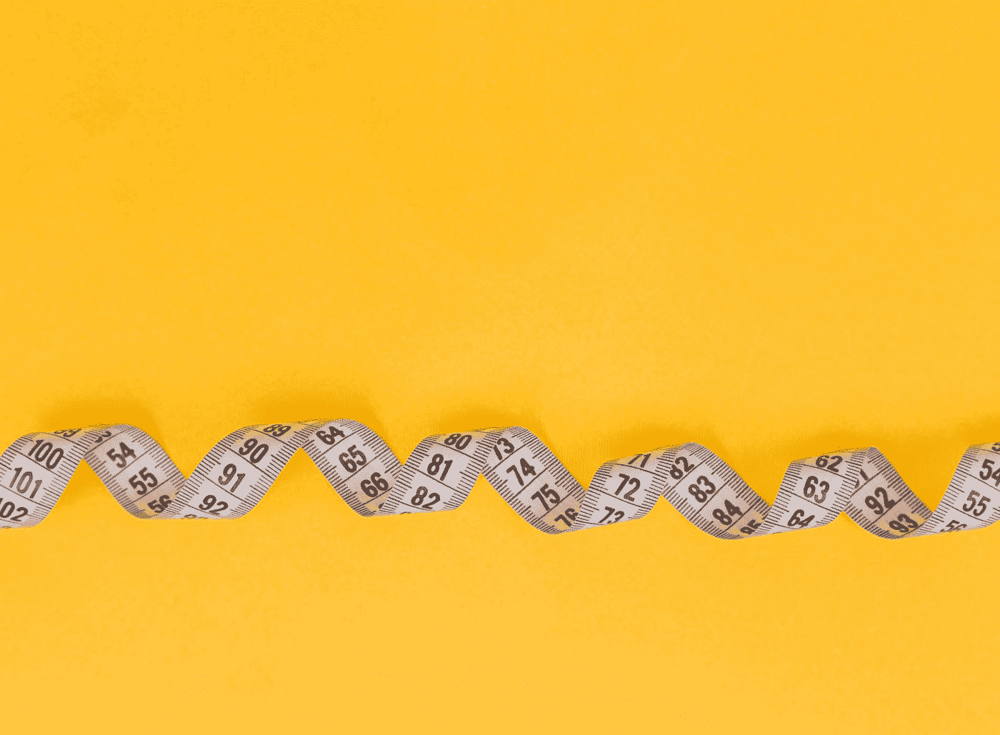
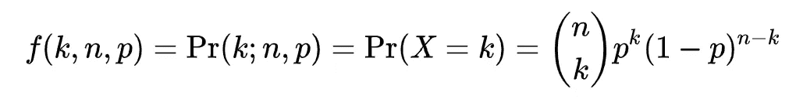
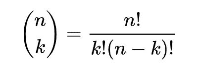

# 更好编程的 100 个统计概念(第 1 部分)

> 原文：<https://levelup.gitconnected.com/100-statistical-concepts-for-better-programming-data-science-research-1ec2aa83339a>

图片由我们的团队在 Freepik.com 拍摄

*如果你是 Python 或编程的新手，可以看看我的新书《Python 学习指南》******下面:*****

**** [## 学习 Python 的无牛指南

### 你是一个正在考虑学习编程却不知道从哪里开始的人吗？我有适合你的解决方案…

bamaniaashish.gumroad.com](https://bamaniaashish.gumroad.com/l/python-book)**** 

# ****1.统计方法****

****两种主要的统计方法用于分析数据:****

*   ******描述性统计******

****包括用于描述和总结数据的方法。****

****例如，汇总人口的身高分布。****

*   ******推断统计******

****包括用于从预先存在的数据中得出结论并将其用于概括/推断的方法。****

****例如，找出一周中某一天下雨的概率。****

********

****克里斯·利维拉尼在 [Unsplash](https://unsplash.com?utm_source=medium&utm_medium=referral) 上拍摄的照片****

# ****2.人口和样本****

******人口**是一个可以研究并从中得出结论的整个单位/测量宇宙。****

******样本**是我们选择研究的人群的子集，并使用结果得出关于人群的结论。****

********

****[布兰登·洛佩兹](https://unsplash.com/@itsbrandonlopez?utm_source=medium&utm_medium=referral)在 [Unsplash](https://unsplash.com?utm_source=medium&utm_medium=referral) 上的照片****

# ****3.观察/元素****

****这是构成总体或总体样本的单一单位。****

****例如，如果我们正在研究非英语脸书用户的样本，其中的每个人都是一个元素/观察。****

# ****4.数据类型****

1.  ******标称数据******

*   ****这种类型的数据可以归入不同的组/类别。****
*   ****这些类别没有预先存在的顺序****
*   ****比如男女，程序员或非程序员等。****

****2.**序数数据******

*   ****这种类型的数据可以组织成不同的类别****
*   ****例如，比赛的参与者可以根据他们的终点位置来排序****

****3.**区间数据******

*   ****这种类型的数据可以被组织成不同的类别，并且元素之间具有有意义的间隔。****
*   ****例如，10 伏和 20 伏之间的间隔与 20 伏和 30 伏之间的间隔相同。****

****4.**比率数据******

*   ****这种类型的数据类似于区间数据，并且元素之间有一个有意义的比率(这种数据存在一个绝对零点)。****
*   ****例如，0K 是绝对零度或表示没有热量，100K 是 200K 的两倍。****

********

****Diana Polekhina 在 [Unsplash](https://unsplash.com?utm_source=medium&utm_medium=referral) 上拍摄的照片****

# ****5.元素值的类型****

****数据中的元素可以有:****

*   ******离散值:**它们之间没有其他值。例如，二进制值可以是`o`和`1`，但不能是`0.5`****
*   ******连续值:**可以是任意值。比如一个网站的潜伏时间。****

# ****6.可能性****

****事件发生的概率(`p`)是可能发生的结果数与所有结果数之比。****

*   ****它介于`0`(事件没有发生的可能性)和`1`(事件发生的绝对确定性)之间。****
*   ****事件不发生的概率(`q`)是`1 — p`，其中`p`是事件发生的概率****

## ****加法规则****

*   ****如果两个事件**互斥**，那么某个特定事件发生的概率等于它们各自概率的**和**。****
*   ****比如一套 4 色的牌，挑到红卡的概率是`1/4 = 0.25`，挑到绿卡的概率是`1/4 = 0.25`。****

****挑红`OR`绿卡的概率是`1/4 + 1/4 = 0.25 + 0.25 = 0.5`。****

## ****乘法法则****

*   ****如果两个事件**互斥，则两个或多个
    事件同时发生的**概率等于它们各自概率的**乘积**。****
*   ****比如一套 4 色的牌，挑到红牌的概率是`1/4 = 0.25`，挑到绿卡的概率是`1/4 = 0.25`。****

****挑红`AND`绿卡的概率是`1/4 * 1/4 = 0.25 * 0.25 = 0.0625`。****

********

****照片由[马库斯·温克勒](https://unsplash.com/@markuswinkler?utm_source=medium&utm_medium=referral)在 [Unsplash](https://unsplash.com?utm_source=medium&utm_medium=referral) 上拍摄****

# ****7.二项式分布****

****二项式分布用于研究只有两种可能结果(成功/失败)的实验。****

****这种单一的成功/失败实验也被称为[伯努利试验](https://en.wikipedia.org/wiki/Bernoulli_trial)或伯努利实验。****

****分布有助于找出在一系列独立试验中获得准确成功次数的概率。****

****在 *n* 次独立伯努利试验中准确获得 *k* 次成功的概率由以下公式给出:****

********

****在哪里，****

********

****二项式系数****

****应用该公式，****

****在 10 次公平掷硬币(`n=10,k=4, p=0.5`)中获得 4 个正面的概率是`0.20508`。****

****使用二项式概率计算器让下面的事情变得简单:****

**** [## 二项式概率计算器

### 常见问题二项式实验有以下特点:实验涉及重复…

stattrek.com](https://stattrek.com/online-calculator/binomial)**** 

*****这就是本文的全部内容。感谢阅读！*****

*****查看下面这篇文章的其他部分:*****

**** [## 更好编程的 100 个统计概念(第二部分)

### 统计让每个人都轻松！

levelup.gitconnected.com](/100-statistical-concepts-for-better-programming-data-science-research-part-2-9b65a661d1e4)  [## 更好编程的 100 个统计概念(第 3 部分)

### 大家来简单统计一下吧！

bamania-ashish.medium.com](https://bamania-ashish.medium.com/100-statistical-concepts-for-better-programming-part-3-49dbf2c213d1)  [## 更好编程的 100 个统计概念(第 4 部分)

### 大家来简单统计一下吧！

bamania-ashish.medium.com](https://bamania-ashish.medium.com/100-statistical-concepts-for-better-programming-part-4-8e3e74f8a760)  [## 更好编程的 100 个统计概念(第 5 部分)

### 大家来简单统计一下吧！

bamania-ashish.medium.com](https://bamania-ashish.medium.com/100-statistical-concepts-for-better-programming-part-5-bdc216ef9797)  [## 更好编程的 100 个统计概念(第 6 部分)

### 您理解复杂统计概念的一站式解决方案！

bamania-ashish.medium.com](https://bamania-ashish.medium.com/100-statistical-concepts-for-better-programming-part-6-7b2d8e45645a)  [## 更好编程的 100 个统计概念(第 7 部分)

### 让每个人都能轻松统计数据！

bamania-ashish.medium.com](https://bamania-ashish.medium.com/100-statistical-concepts-for-better-programming-part-7-cefbf109d162)  [## 通过我的推荐链接加入 Medium——Ashish Bama nia 博士

### 阅读 Ashish Bamania 博士(以及 Medium 上成千上万的其他作家)的每一个故事。您的会员费直接…

bamania-ashish.medium.com](https://bamania-ashish.medium.com/membership) 

# 分级编码

感谢您成为我们社区的一员！在你离开之前:

*   👏为故事鼓掌，跟着作者走👉
*   📰查看[升级编码出版物](https://levelup.gitconnected.com/?utm_source=pub&utm_medium=post)中的更多内容
*   🔔关注我们:[Twitter](https://twitter.com/gitconnected)|[LinkedIn](https://www.linkedin.com/company/gitconnected)|[时事通讯](https://newsletter.levelup.dev)

🚀👉 [**加入升级达人集体，找到一份惊艳的工作**](https://jobs.levelup.dev/talent/welcome?referral=true)****