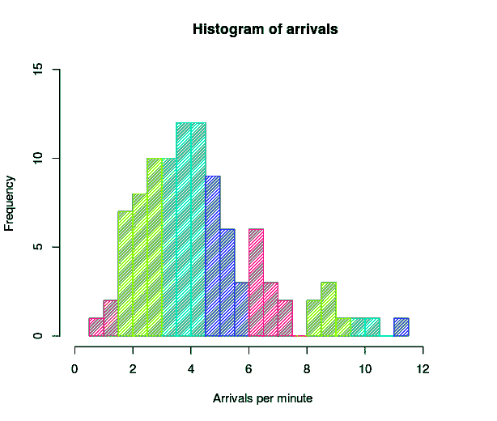
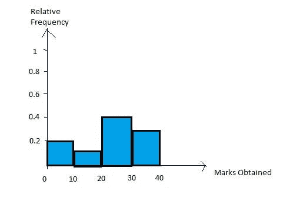
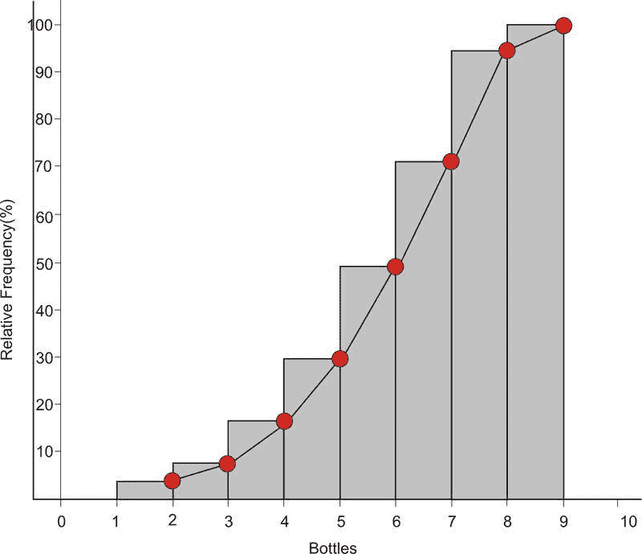
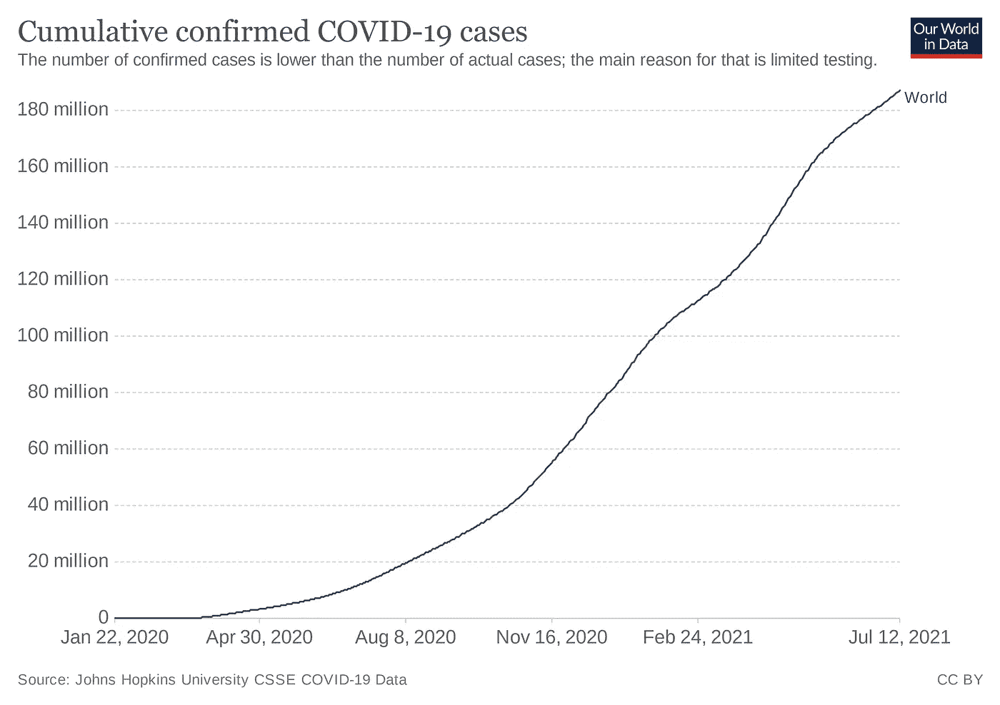
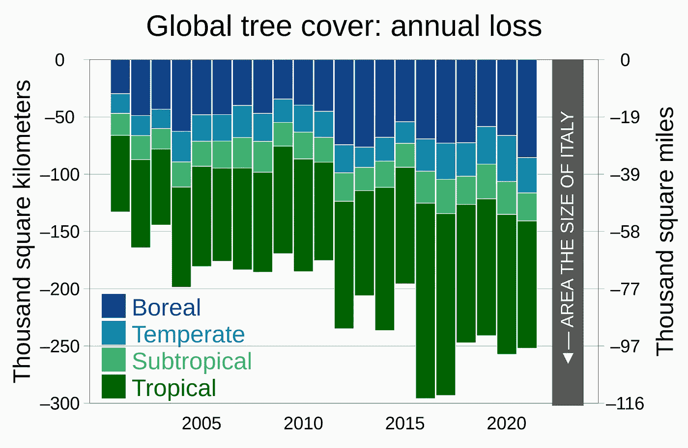
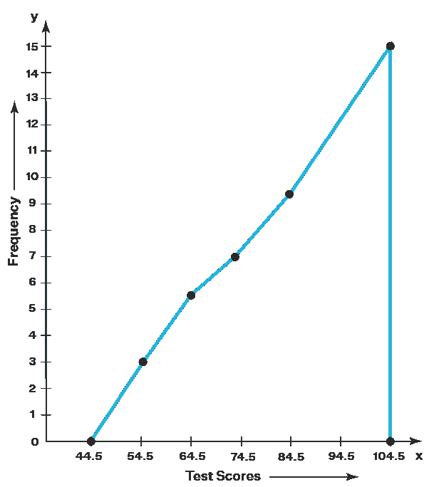
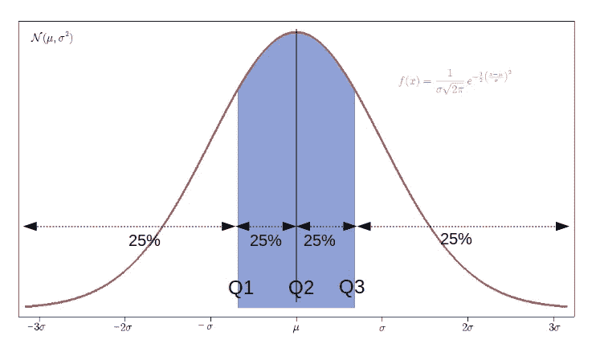

# 更好编程的 100 个统计概念(第二部分)

> 原文：<https://levelup.gitconnected.com/100-statistical-concepts-for-better-programming-data-science-research-part-2-9b65a661d1e4>

照片由[马克西姆·伯格](https://unsplash.com/@maxberg?utm_source=medium&utm_medium=referral)在 [Unsplash](https://unsplash.com?utm_source=medium&utm_medium=referral) 拍摄

# 8.频率和频率分布

频率是数据值出现的次数。

测量的频率可以用频率分布的形式来表示。

## 分组频率分布

数据首先被转换成具有**等等级间隔**的不同组/等级(即所有组/等级的最大值和最小值具有相同的差异)。

然后，通常使用**直方图**来表示这些数据，其中 X 或水平轴显示组，Y 或垂直轴显示频率。

代表每分钟到达人数的群体频率分布的直方图(图片来自维基百科)

## 相对频率分布

上述各组中的频率被转换成**百分比**，然后使用直方图绘制。

来源:[https://all thingsstatistics . com/descriptive-statistics/relative-frequency-histogram/](https://allthingsstatistics.com/descriptive-statistics/relative-frequency-histogram/)

## 累积频率分布

在标绘之前，数据被转换成累积频率组/类，每个组/类包含位于每个类间隔之内和之下的测量的百分比/数量。

来源:[https://www . ck12 . org/section/histograms-and-frequency-distributions-of-visualization-of-data/](https://www.ck12.org/section/histograms-and-frequency-distributions-of-visualizations-of-data/)

最高组的累积频率必须为 100，这表示 100%的分布位于该值或低于该值。

累积频率图形成一条 S 形曲线，称为**卵形线**。

# 9.条形图

该图用于表示[标称刻度数据](https://medium.com/gitconnected/100-statistical-concepts-for-better-programming-data-science-research-1ec2aa83339a)。

条形图使用矩形来表示不同的类别(与连续值相反)。

请注意，通常使用**直方图**来表示区间/比率标度的连续数值数据。

垂直堆积条形图(图片来自维基百科)

# 10.频数多边形

与直方图类似，频率多边形用于绘制间隔/比率标度的连续数值数据。

与使用矩形绘制数据的直方图不同，频率多边形使用线段。

频率多边形是通过将类间隔的中点与频率连接起来而创建的。

来源:https://www.cuemath.com/data/frequency-polygons/

# 11.范围和分位数

**范围**是数据集中测量值的最大值和最小值之差。

例如，在数据集(即`1,2,4,3,67`)中，范围是`67 — 1 = 66`。

**分位数**是将数据集的范围划分为相等类区间的连续区间的点。

一些常见的分位数将数据集分为以下几组:

*   四分位数:4 组
*   五分位数:5 组
*   十分位数:10 组
*   百分位数/百分位数:100 组

以四分位数形式在红色曲线下有相等面积的正态分布的概率密度图

*这就是本文的全部内容。感谢阅读！*

*其他部分再见！*

 [## 更好编程的 100 个统计概念(第 1 部分)

### 统计让每个人都轻松！

levelup.gitconnected.com](/100-statistical-concepts-for-better-programming-data-science-research-1ec2aa83339a)  [## 更好编程的 100 个统计概念(第 3 部分)

### 大家来简单统计一下吧！

bamania-ashish.medium.com](https://bamania-ashish.medium.com/100-statistical-concepts-for-better-programming-part-3-49dbf2c213d1)  [## 更好编程的 100 个统计概念(第 4 部分)

### 大家来简单统计一下吧！

bamania-ashish.medium.com](https://bamania-ashish.medium.com/100-statistical-concepts-for-better-programming-part-4-8e3e74f8a760)  [## 更好编程的 100 个统计概念(第 5 部分)

### 大家来简单统计一下吧！

bamania-ashish.medium.com](https://bamania-ashish.medium.com/100-statistical-concepts-for-better-programming-part-5-bdc216ef9797)  [## 更好编程的 100 个统计概念(第 6 部分)

### 您理解复杂统计概念的一站式解决方案！

bamania-ashish.medium.com](https://bamania-ashish.medium.com/100-statistical-concepts-for-better-programming-part-6-7b2d8e45645a)  [## 更好编程的 100 个统计概念(第 7 部分)

### 让每个人都能轻松统计数据！

bamania-ashish.medium.com](https://bamania-ashish.medium.com/100-statistical-concepts-for-better-programming-part-7-cefbf109d162) 

*如果你是 Python 或编程的新手，可以看看我的新书，书名是'* [**【没有公牛**t 学习 Python 指南**](https://bamaniaashish.gumroad.com/l/python-book) **'** *下面:*

 [## 学习 Python 的无牛指南

### 你是一个正在考虑学习编程却不知道从哪里开始的人吗？我有适合你的解决方案…

bamaniaashish.gumroad.com](https://bamaniaashish.gumroad.com/l/python-book)  [## 通过我的推荐链接加入 Medium——Ashish Bama nia 博士

### 阅读 Ashish Bamania 博士(以及 Medium 上成千上万的其他作家)的每一个故事。您的会员费直接…

bamania-ashish.medium.com](https://bamania-ashish.medium.com/membership)