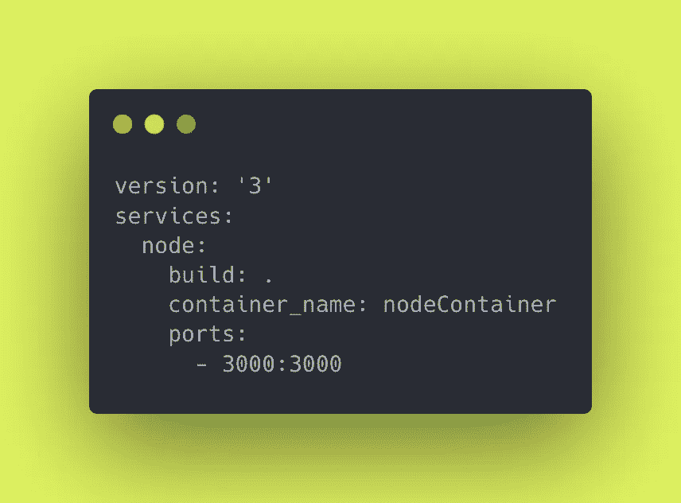
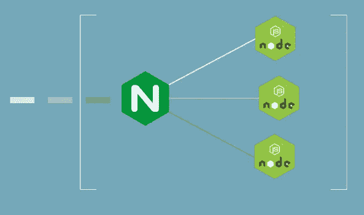
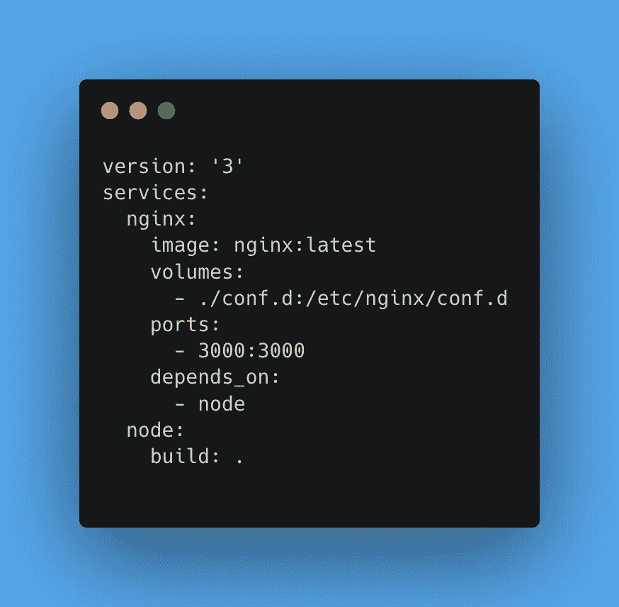
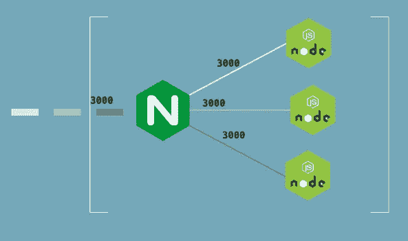
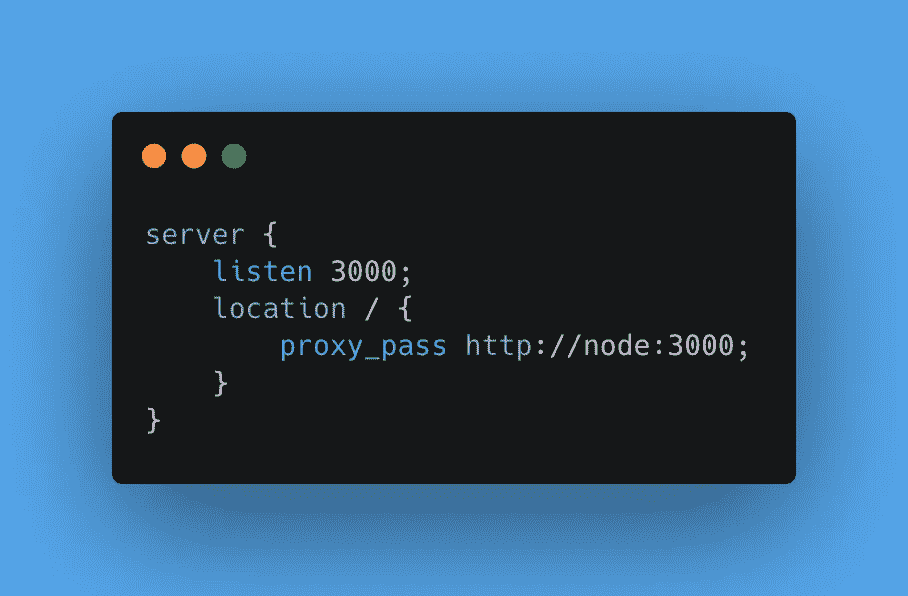
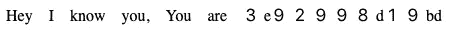

# 1000 个 Docker 容器从一个命令开始— Ultra Pro 可扩展性

> 原文：<https://levelup.gitconnected.com/1000-docker-containers-start-with-one-command-ultra-pro-scalability-9b69305459f7>


可伸缩码头

我假设你目前已经了解了 Docker 和 NodeJS 的基础知识，因为这个故事并不关注于此，而是展示了专业级别的可伸缩性。

为了让我们所有人都站在同一水平线上，我创建了一个 [GitHub 库](https://github.com/Guneetsinghtuli/1000-docker)，你可以克隆它，它有让我们所有人一起开始并把我们带到同一水平线上的基本代码。

## 是时候准备好你的枪了…

让我们从基本的 **Dockerfile 开始，作为一个梳理**。如果你对它有信心，你可以跳过它。

```
FROM node:14
WORKDIR /app
COPY package.json .
RUN npm install
COPY . .
CMD ["npm", "start"]
EXPOSE 3000
```

**从**这从 docker hub 中调出了一个节点的基本映像，我们将对其进行处理。

在我们将要处理应用程序的容器中创建一个名为 app 的文件夹。

**复制**只需将主机(你的电脑)上的 package.json 文件夹复制到容器内的 app 文件夹即可。

**运行**这将运行上面提到的命令，在容器中安装所有的依赖项，以使我们的应用程序运行

**复制**再次复制。(点)第一个点表示您的主机 pc 的当前位置，第二个点表示您的**工作目录的位置。只需将每个文件夹从主机复制到容器中。**

**CMD** 命令启动应用程序

**EXPOSE** 它将从容器向主机公开一个端口。

## 让我们从一个容器开始

要使用 dockerfile 构建映像，可以使用以下命令

```
docker build --tag nodeImage .
```

构建完映像后，现在使用我们构建的映像启动容器，命令如下

```
docker run -p 3000:3000 -d --name nodeContainer nodeImage
```

要检查是否一切顺利，请转到 localhost:3000/如果您看到的响应是**嘿，我认识你，你是——**

哇，一切都很顺利。

# 现在让我们使用多个容器

您已经看到，启动一个容器需要 2 个步骤，所以要启动 1000 个容器，我当然不会键入 2000 个命令。

为了让使用多个容器变得更容易，我会使用 **docker-compose(一种制作图像+启动容器的简单方法)**

创建一个名为 **docker-compose.yaml 的文件**



docker-compose 的代码片段

现在，docker-compose 将负责构建和运行容器。服务下面提到的**节点**是服务的**名称**你想怎么命名都行。

让我们试着用它来启动一个容器

```
docker-compose up -d
```

再次转到 localhost:3000/来检查容器是否正在运行。**如果是工作时间就去秤吧。**

# 让我们扩大规模

首先用以下方法取下旧容器

```
docker-compose down -v
```

**告诉过你 docker-compose 是❤️.**现在，对于启动程序，只需将其扩展到 2 个容器。您可以使用 scale 标志启动两个容器，并为 docker-compose 中提到的服务名指定容器的数量。

```
docker-compose up -d --scale node=2
```

不要在没有尝试过这个之前就继续，如果你已经尝试过了**恭喜**。

很有趣，我知道你面临一个错误。但是你可能已经猜到了问题所在。

**2 docker-container 不能与我们在 docker-compose 文件中指定的名字**相同，所以让 **docker** 随意命名我们的容器，我个人喜欢 docker 容器有趣的名字，它自己命名。

只需对指定名称***container _ name:node container 的行进行注释。***

如果容器已经在工作，就把它拿下来，让我们再试一次。

```
docker-compose up -d --scale node=2
```

又是一个错误😂😂现在再想一想，两个不同的容器如何连接到主机的同一个 3000 端口。如果你在没有 docker 的情况下尝试运行两个应用程序，你可能会遇到同样的错误。

# 对此的解决方案

所以我们需要一个中间人，他在主机的一个端口上工作，并自己处理所有其他节点容器。



Nginx 作为反向代理

是的，我们需要 Nginx 作为 [**一个反向代理服务器**](https://www.cloudflare.com/learning/cdn/glossary/reverse-proxy/?utm_source=pocket_mylist) **和负载均衡**。所以 Nginx 将是我们的节点服务器和主机之间的中间人。

如果您以前没有使用过 Nginx，请不要担心，尝试让它成为您的第一次。

所以是时候为 Nginx 再设置一个服务了，你可能猜对了，这是 docker-compose.yaml 文件中的一个服务。



现在 Nginx 容器将通过 **3000** :3000 中提到的一个单端口 3000 端口连接到我们的主机，下一个 3000 是在告诉 Nginx 已经打开了一个连接节点容器的端口 3000。



nginx 端口配置

现在是时候配置我们的 Nginx 了，如果你是第一次使用它，不要太投入配置，很可能你会有点困惑。

创建一个名为 conf.d 的文件夹，并在这个**中创建一个名为 nginx_conf.conf 的文件，然后复制下面几行或者自己写。**



但是要在 docker Nginx 容器**中发送这个文件，我们需要一个卷来附加我们的本地文件夹 conf.d。这就是 docker-compose 中的卷的目的。**

现在我们准备好了，让我们旋转 2 个容器。

```
docker-compose up -d --scale node=2
```

现在转到 localhost:3000/来检查是否一切正常，你将会看到类似于**嘿，我认识你，你是<容器 ID >**



如果您现在刷新它，您将看到第二个节点容器的不同容器 id，因为我们已经将其扩展到 2 个容器。和负载平衡器使请求在每个容器上均衡。


# 是时候享受真正的乐趣了

运行 1000 个容器时，确保你准备好灭火器以防万一。我当然不会冒险，但是您可以使用扩展到 1000 个容器

```
docker-compose up -d --scale node=1000
```

如果你的电脑幸存下来，恭喜你。

> *我希望你喜欢它，并从这个故事中学到很多，如果你不想错过我发布另一个故事的任何时间，请确保关注我并订阅以获得电子邮件更新。*

你可以在 [**Twitter**](https://twitter.com/Guneetsingh02) 和 [**LinkedIn**](https://www.linkedin.com/in/guneetsinghtuli/) 上关注我，我会分享更多信息。

如果你认为你对这篇文章有更好的或不同的观点，不要忘了评论，我可能会把它和你的名字放在一起。