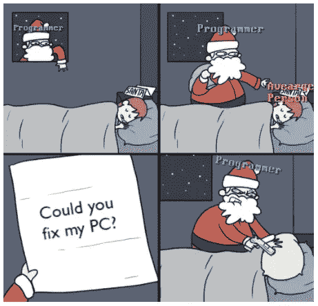
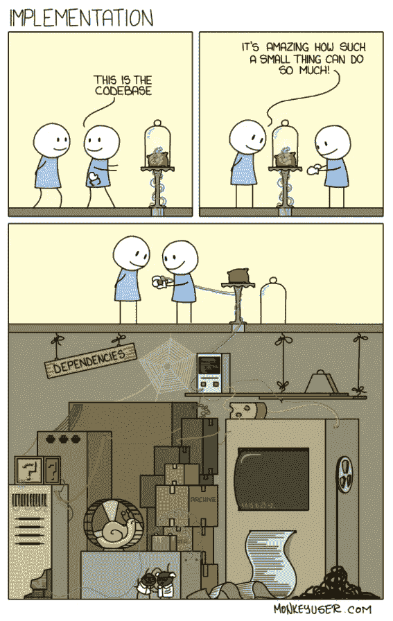
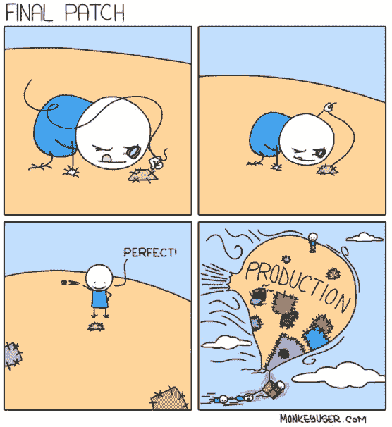
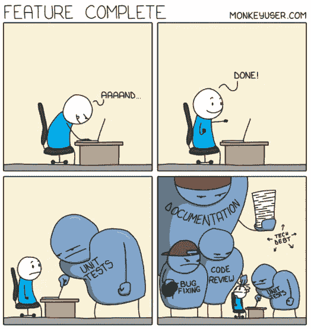
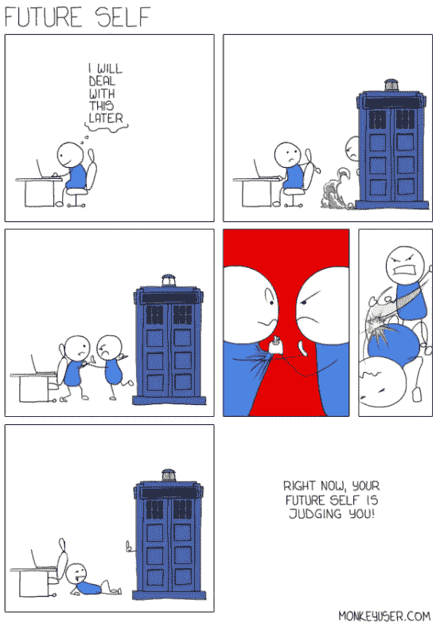

# 3 分钟内 101 个令人捧腹的编程笑话

> 原文：<https://levelup.gitconnected.com/101-hilarious-programming-jokes-in-3-minutes-6a2ebcd81f56>

## 幽默

## 你了解二进制吗？别担心，这些笑话仍然会逗得你捧腹大笑。

作者使用 kapwing.com 的图片

朋友们好，我又回来了，带来每月一次的爆笑编程笑话来逗你们开心。这一次我有 101 个疯狂的笑话给你，让你享受圣诞节的假期。

不用担心文章里的副标题。如果你不理解二进制数字系统，你将以一种有趣的方式学习它。

> **注意:**如果您正在喝热饮，请在继续阅读前安全放下。

# 0.十二月是圣诞老人的月份。让我们以他为例开始第一个笑话。

难道我们——*程序员*——不喜欢我们的亲戚或家人让我们修理他们的电脑或手机吗？😈

【9gag.com 

> ***注:*** 没有一个‘一般人’在制作这部漫画时受到伤害。*👼*

# 1.对应用程序的内部工作方式了解得越少越好。

在为人类服务了几年的存在和数百万个补丁之后，每一个漂亮的应用程序都注定有一个意大利面条式的代码。

[monkeyuser.com](https://www.monkeyuser.com/2018/implementation/)

# 2.“最终”这个词在软件开发中有了新的含义。

它更好地被称为生产发布前的最后一个补丁。应用程序上线后，总会有更多的补丁。😜

[monkeyuser.com](https://www.monkeyuser.com/2018/final-patch/)

# 3.你知道“Done Done”这个短语是从哪里来的吗？

你可以完成你的代码，但是你永远不会完成，除非你花 25 倍的精力在所有的辅助工作上。

[monkeyuser.com](https://www.monkeyuser.com/2020/feature-complete/)

# 4.除非我有时间机器！

在为同一个应用程序工作了十多年之后，如果有时光机的话，我肯定会使用它。

[monkeyuser.com](https://www.monkeyuser.com/2017/future-self/)

# 等等！就这样吗？

> “这只是五个笑话。你说他们有 101 个人！！!"
> ——**匿名编程笑话范**

好吧，如果你问这个，这是我专门为你做的视频。

作者使用 doodly 制作的视频

# 奖金:我知道我们都喜欢一点点奖金

这次作为奖励，我将引用艾伦·沃茨的一段话留给你们。我们——开发者，知道深度幽默的真正含义，因为我们都可以对自己开的玩笑开怀大笑。

> 幽默是一件非常有趣的事情。基本上，幽默是一种对自己笑的态度。有恶意的幽默，是在嘲笑其他人。但是真正深刻的幽默是对自己的嘲笑。
> ——**艾伦·沃茨**

**感谢阅读时的欢笑。你可能也喜欢阅读:**

 [## 如何成为一名优秀的软件开发人员

### #3 客户永远是对的——直到你证明他们是错的。

levelup.gitconnected.com](/how-to-become-an-outstanding-software-developer-8409f23716a)  [## 影响开发人员职业生涯的关于编码的最大误区

### 摆脱这些误解，在软件开发中有一个加速的职业生涯

levelup.gitconnected.com](/greatest-myths-about-coding-that-impact-developers-career-3ec599eee1cf)