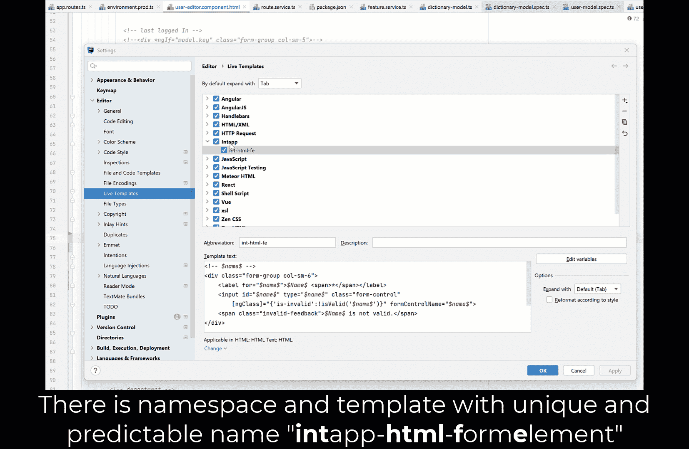
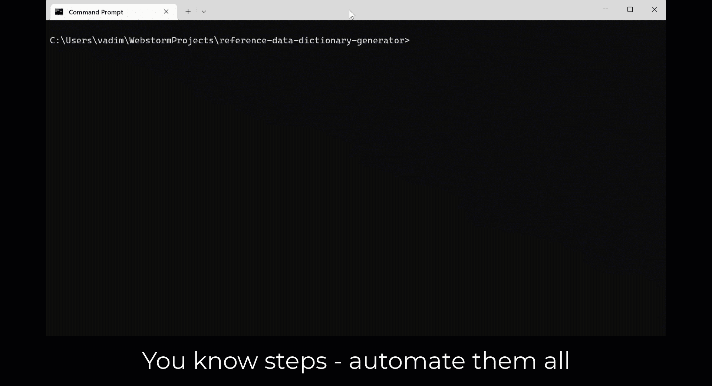

# 10x 系列:保持头脑冷静，避免重复性工作

> 原文：<https://levelup.gitconnected.com/10x-series-keep-your-mind-calm-and-avoid-repetitive-work-89eb0d9561eb>

> 当你读这篇文章的时候，我勇敢的祖国乌克兰正在和俄罗斯恐怖分子战斗。每个人都可以向支持基金捐款，并通过关注 21 世纪欧洲最大的战争来提供帮助。不要沉默。

由[肯尼·埃利亚松](https://unsplash.com/@neonbrand?utm_source=medium&utm_medium=referral)在 [Unsplash](https://unsplash.com?utm_source=medium&utm_medium=referral) 上拍摄的照片

250 万千兆字节是人类大脑的平均记忆容量。即使与现有技术存储设备的当今标准相比，这也是一个巨大的存储量。

那么这是否意味着——我们可以记住我们消费的所有信息？嗯，不…

> 人类保留不同类型记忆的时间长度不同。短期记忆持续数秒到数小时，而长期记忆持续数年。我们也有一个工作记忆，它让我们通过重复某件事，在有限的时间内将它保留在脑海中。每当你一遍又一遍地对自己说一个电话号码来记住它的时候，你都在使用你的工作记忆。
> 
> 国家地理

利用我们的工作记忆，我们可以很容易地记住所需的信息，但时间很短。但是，如果我们想把它永远留在我们的记忆中，一个叫做“记忆巩固”的特殊过程就会发生。

在这个过程中，信息不仅仅是移入特定的脑细胞；特定区域内的神经元连接拓扑正在发生变化，产生新的连接。所以这是一个耗费时间和资源的过程，但是如果我们将来需要这些信息，这是非常可靠的。

我们的大脑是一个实用的技术专家，也受我们的情绪驱动。如果我们已经决定需要记住斐波那契公式，因为它在每个技术面试中都要用到——大脑会处理这个请求，尽管它需要内在的努力和实际的未来需求。

作为开发人员，我们正在犯的最大错误是试图记住周围区域的所有可用信息，对任何严重性类型的信息运行这种复杂的深度记忆过程。此实用程序方法的参数？简单。公共表单元素的 DOM 树？简单。所有可用的 maven 命令？轻松点。

太好了，我们被离我们只有一次点击的信息淹没了，而不是创建一个有效的搜索索引，以便在我们每次需要它的时候都能轻松快速地找到它。

# **定义常用模式**

你还记得在电视行业数字化开始之前制作的老好漫画吗？像汤姆和杰瑞，米老鼠。如果花一些时间来检查主要人物，我们可以承认他们是使用最简单的基本元素构建的，以保持良好的外观。这在当时非常重要，因为最简单的动画需要同一角色的几十种不同状态。绘制每一帧所花费的时间与角色的复杂程度有关。

在软件设计中，我们可以遵循相同的原则来获得相同的结果——提高设计速度。坦率地说，好的设计**不可避免地**需要长期遵循这些规则，作为进化架构中 API 一致性的先决条件。随着发展，您将考虑使用更多具有通用流的泛型、具有基本行为的基类以及具有封装和链接原语的高级组件。因此，这限制了单个项目中相似控件和各种使用模式之间的差异。

那么为什么不为最常用的代码构造提供代码生成，而不是记忆它们呢？

## **代码片段**

提高设计速度的最有效方法是不要重复相同的代码两次，而是使用代码片段。

在 IDEA 中使用实时模板

写一次——可以根据需要重复多次。当 UI/UX 需求迫使我们为 HTML 原语保留复杂的标记时，这对于标记尤其重要。背下来？复制粘贴？不，通过提供易于记忆的代码片段密钥来自动生成代码。

## **代码模板**

用新的实体扩展领域模型通常反映在不同的层上创建一堆不同的服务(管理 it、业务、数据、缓存等的表示)。但是在大多数情况下，创建新的服务和提供者来管理新的实体的方式是基于我们需要符合的架构而已知的。因此，在这里创建代码生成器非常合适——速度和准确性是额外的好处。

市场上有许多代码生成技术可以显著加快将业务需求转化为技术设计的过程，从数据库优先的企业工具(如 [CodeSmithTools](https://www.codesmithtools.com/product/generator) 或 [JOOQ](https://www.jooq.org/) 基于关系数据库模式生成完整的项目)开始，到使用 [Yeoman](https://yeoman.io/) 或 [NX](https://nx.dev/) 脚手架工具(基于用户交互式 CLI 输入生成项目或模块)的手写生成器结束。

自动化整个设计流程—从提取母版到合并等待批准的请求

所有这些解决方案不仅旨在显著减少编码时间，还旨在控制一致性和使用模式，因为所有生成的代码都基于模板，这些模板由核心工程团队定期验证，并在架构发生变化时进行审查。此外，它是完整的(包括所需的测试，文件等)，因为“丰满度”可以审查一次，然后在每个回合使用。

## 摘要

使用代码模板和代码片段不仅可以通过更快地生成代码来提高自己的生产力，而且对整个团队的绩效也有积极的影响，因为高效的工程技术可以在不同成熟度级别的所有开发人员之间轻松重用，并允许保持整个编码规程更加面向使用通用实践和代码重用。

换句话说——当一致性和可重用性在演进架构中受到重视时，团队可以从不同的视角观察解决方案。

感谢阅读。享受其他岗位

 [## 10x 系列:有效使用开发工具

### 你有没有想过这个神奇的 10x 测量？为什么是 10？为什么不是 15 岁，或者 5 岁？也许这与……有某种关联

levelup.gitconnected.com](/10x-series-using-development-tools-efficiently-c05719a2ddf)  [## 软件架构来源于通信模型

### 当你读这篇文章的时候，我勇敢的祖国乌克兰正在和俄罗斯恐怖分子战斗。每个人都可以…

levelup.gitconnected.com](/software-architecture-is-derived-from-the-communications-model-fb55ef211ee8)  [## 我是一个开发者，我在拖延

### 这不是什么大秘密，开发人员工作日通常由一小部分任务组成，这些任务有助于成长自己和…

medium.com](https://medium.com/codex/im-a-developer-and-i-m-procrastinating-3a108fad651d)