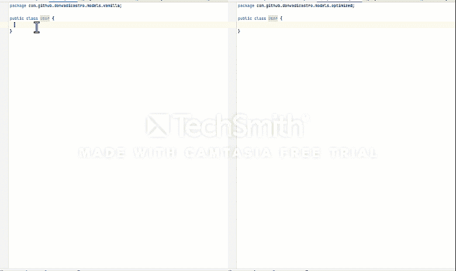
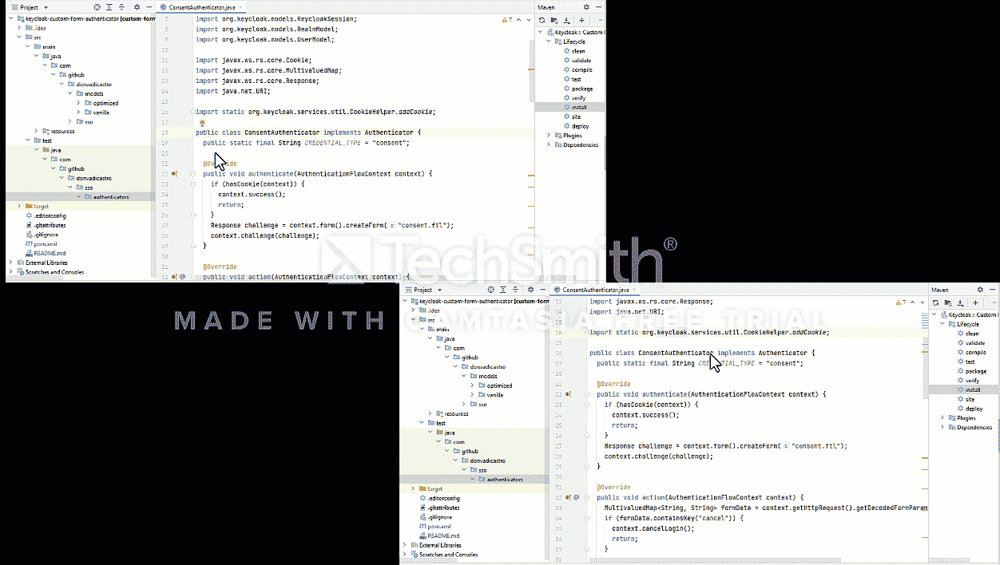
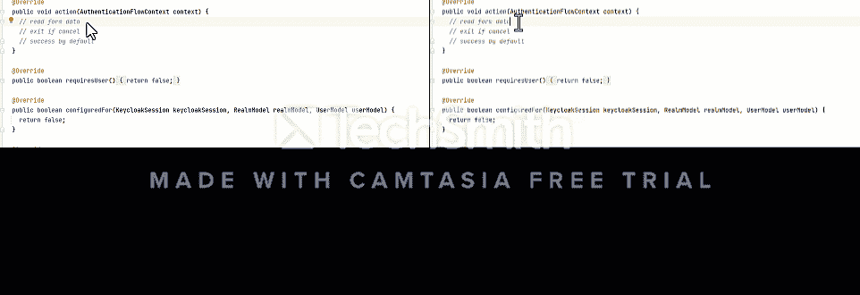
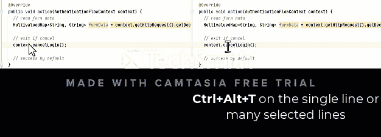
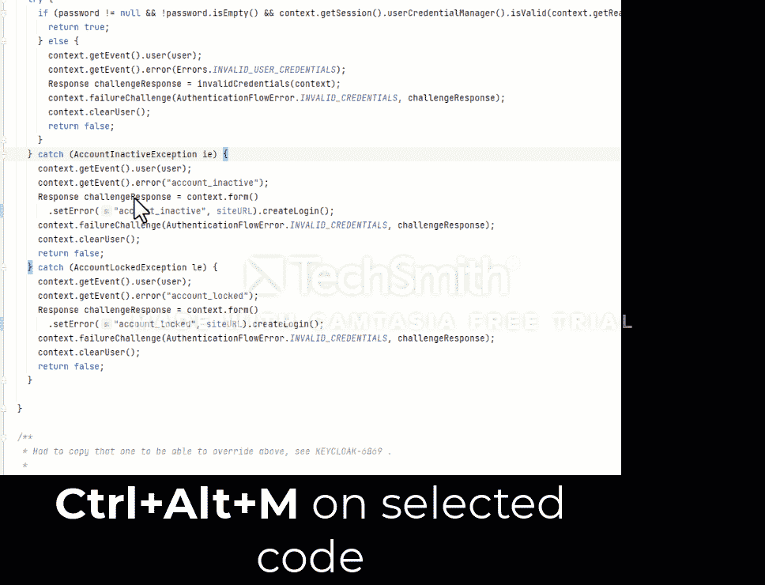
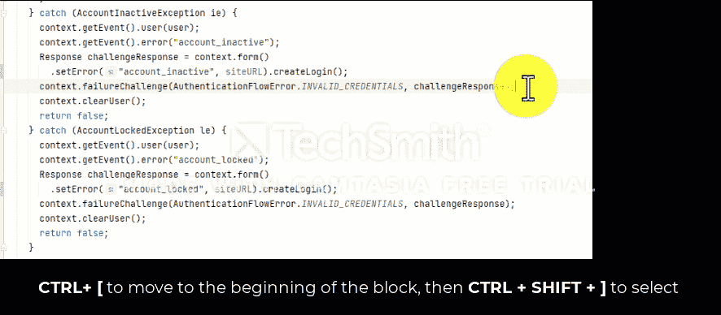
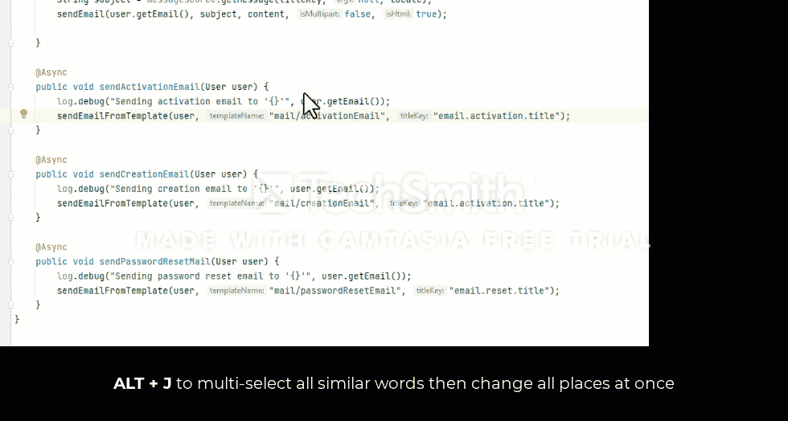
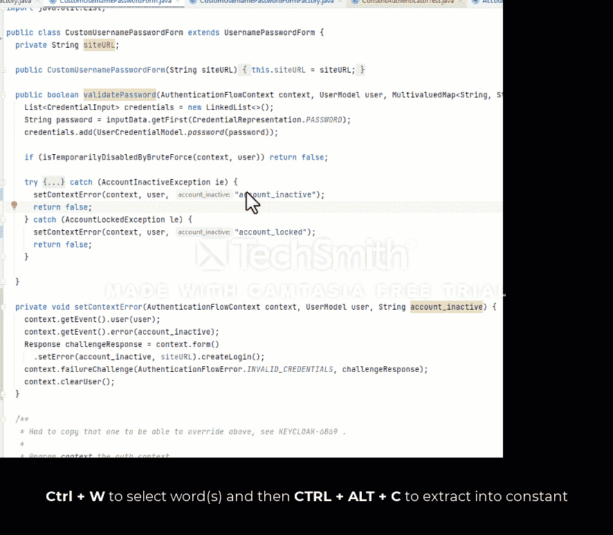
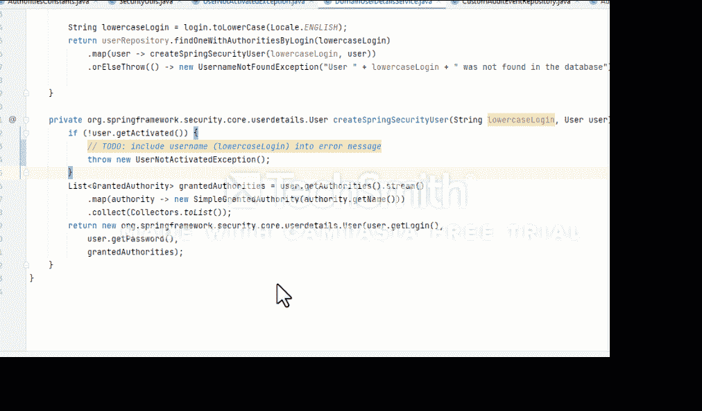
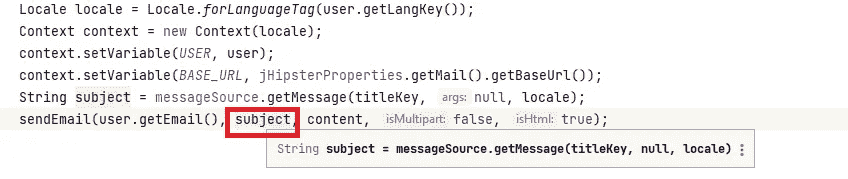

# 10x 系列:有效使用开发工具

> 原文：<https://levelup.gitconnected.com/10x-series-using-development-tools-efficiently-c05719a2ddf>

你有没有想过这个神奇的 **10x** 测量？为什么是 10？为什么不是 15 岁，或者 5 岁？也许这与普通人的体能和已知的极限有某种关联？

[乌塞恩博尔特](https://en.wikipedia.org/wiki/Usain_Bolt)

[尤塞恩·博尔特](https://en.wikipedia.org/wiki/Usain_Bolt)是有史以来最伟大的短跑运动员。他赢得了几届奥运会和许多世界冠军。他的个人最好成绩是 100 米跑 9.58 秒。一般学校标准是**~ 15–17**秒。所以这比世界上跑得最快的人差不到两倍。看起来要么是尤塞恩博尔特不是我们梦之队足够好的成员，要么是这种运动不适合比较。

让我们承认我们是进化中的好赛跑者，因为我们提高了这种逃离野生动物并生存下来的能力。因此，我们已经几乎达到了我们所能达到的最高水平，没有很大的提升空间。

好吧，也许游泳？这种能力并不是生存最需要的。所以默认情况下没有改进。

[凯尔·查默斯](https://en.wikipedia.org/wiki/Kyle_Chalmers)

凯尔·查默斯是世界上最快的游泳运动员之一。他的个人最好成绩是用自由泳技术跑 100 米大约 48 秒。奥林匹克运动会，世界锦标赛，以及其他许多成就。

要声称你能比平均水平游得更好，你必须在 2 分钟内拿出成绩。仅比业内最佳产品慢 2-3 倍。不会又是 10x 吧，奇怪？也许游泳也不太需要体力，更需要正确的技术？

奥莱克西·诺维科夫

乌克兰强人奥莱克西·诺维科夫几年来一直被认为是世界上最强壮的人。他个人最好成绩之一是燧石族杠铃(颈后)压机 **246 kg** 。惊人的重杠铃。光是看这样的数字就让我填不舒服。但是……在健身房锻炼的头两个月之后，你已经能承受的平均体重大约是 50-60 公斤。比这个行业的顶级玩家轻 4-5 倍左右。

因此，我们的身体极限大约是平均水平的 3 倍(T2 是真正极端情况的 5 倍，T3 是例外)。

好了，让我们从肌肉切换到大脑活动。成年人的平均阅读速度约为每分钟 220-350 个单词。平均速读课程承诺将这一速度提高到每分钟 1500 字左右，以保持阅读的全面性和思想性。这也是平均水平的 5 倍**。**

**最激动人心的是这方面的极端案例。霍华德·伯格是世界上最快的读者，个人最好成绩为每分钟 25，000 字，比平均水平高出 100 倍。这就像在 1 分钟内阅读 80 页书。令人惊讶。**

****

**因此，我们可以得出结论，我们的身体和精神极限在相对相同的范围内，唯一的精神极限在极端情况下要高得多。所以仍然不完全清楚什么是魔术师 10x？为什么我们期望任何一个普通的工程师都比同一个房间里的 10 个工程师强呢？**

**10x developer 的概念在于常规任务优化的空间。常规任务的优化总和将比非优化流程产生更好的结果。**

# **我们在衡量什么？**

**对于软件开发人员来说，第一个也可能是最重要的是用代码表达商业理念。你的打字速度有多快并不重要，重要的是你能多有效地使用开发者环境来满足商业需求。这包括更有效地使用开发工具。**

**让我们比较一下使用和不使用任何开发工具提供的热键时代码编写的速度。我们可以使用 IntelliJ Idea 作为编码工具。**

****代码生成****

**大多数项目都使用领域模型对象进行操作，这些对象用特定于语言的结构表示，例如 OOP 中的类或 FP(函数式编程)中的函数。通常，最小的项目可能有几十个类来表示业务模型和传输对象。所以在设计行为和交互之前，我们需要在项目中重新创建几十个领域模型视图。总结一下，我们花在定义原语上的时间乘以这些原语的数量会产生巨大的差异。**

**让我们测量一下使用普通编码和使用 IDE 快捷键和热键定义一个具有几个属性(还有一个初始化属性的构造函数和 getters)的类(record 或类似 DTO 的类)所花费的时间。**

****

**使用快捷键“ALT + Insert”来创建构造函数/getter/setter，而不是手动声明**

**根据字段的数量，只有基本的 IDE 快捷键可以将您的设计效率至少提高**3 倍**倍。**

**到目前为止一切顺利。最常规的工作(需要很少的工程)我们可以做几次。我们继续吧。考虑到在大多数情况下，我们可能已经为每个业务实体链接了测试类(如果遵循 TDD ),我们可以为我们也需要支持的十几个测试类度量生产率的提高。**

****

**使用快捷键:“CTRL + ALT + T”用 IF、TRY/CATCH、FOR 和许多其他语句包装代码**

**通过使用基本的 IDE 热键，用测试方法声明测试类至少可以快 6 倍。太棒了。**

**但是您会感到惊讶——即使是原始的过程调用和将结果存储到变量中也至少有 **2x** 的性能。**

****

**同样，简单的条件执行可以优化大约 **2x** 次。**

****

****其他时间提升技巧:****

**重构时——通常需要将特定的行为封装在私有方法中，以便进一步重用。**

****

**使用快捷键:CTRL + ALT + M 将一段代码移动到一个单独的方法中**

**其他有趣的快捷方式。**

****代码间跳转****

*   **CTRL + SHIFT +左/右—选择上一个/下一个单词**
*   **CTRL + ]/[ —移动到当前代码块的结尾/开头**
*   **CTRL + SHIFT + ]/[ —选择代码块的结束/开始**
*   **CTRL + M —滚动到中心**

****

****重新格式化代码****

*   **CTRL + ALT + O —优化导入**
*   **CTRL + ALT + L —重新格式化代码**
*   **SHIFT + ALT +向上/向下—移动选定的代码**
*   **CTRL + SHIFT +向上/向下—移动方法**
*   **ALT+J-选择相似的单词**

****

*   **CTRL/SHIFT+Enter——在当前行之后/之前插入新行，并跳转到此处(非常重要，我保证，当需要在块的开头或结尾添加时会更安全)**

****

****提取代码****

*   **CTRL + W —选择单词**
*   **CTRL+ALT+V-提取到变量**
*   **CTRL+ALT+M-提取到方法**
*   **CTRL+ALT+F-提取到字段**
*   **CTRL+ALT+C-提取到常数**
*   **CTRL+ALT+P-提取到当前函数的参数**

********

****检查:****

**代码检查技术提高了设计速度，因为我们可以更快地获得关于周围环境的反馈，从而做出更快更好的决策。**

*   **CTRL + H —查看类层次结构**
*   **Ctrl + P —更详细地显示支持的参数，而不深入研究实现**
*   **CTRL+Q-显示有关当前选择的数据，例如，如何声明变量以了解它包含哪些数据**

****

*   **CTRL + B —转到声明**
*   **Ctrl + Alt + B —转到实现**

****剪贴板****

**作为开发人员，我们确实经常需要依赖剪贴板数据，所以这里的卫生也大大提高了编写代码的速度。**

*   **ctrl+Y-删除行而不移动到剪贴板**
*   **ctrl+Shift+V-从多个可用副本中粘贴(内存中所有以前的副本)**

**和许多其他有用的编码技术，使日常工作在许多时候更快。**

# **摘要**

**正如我们所见——只要开始定期使用快捷方式和热键，我们的工作效率至少可以提高 3 倍。因此，我们已经实现了 10 倍性能的 30%。要做到这一点，我们需要做的就是把最重要的快捷方式打印出来，挂在我们面前的墙上。**

**但是，考虑到最初的假设，这是这个旅程中最简单的一部分——业务意图已经制定，非常清楚，并且得到了工程师的正确认可。在没有商业意义的活动中，或者当意图被错误地解释给工程师时，没有理由取得好的业绩。因此，接下来的 70%是与业务层有效沟通的一部分，引导自己支持不断变化的环境和业务目标波动。我们可以在下一篇文章中讨论这个问题。**