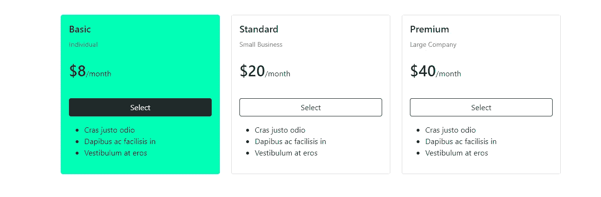
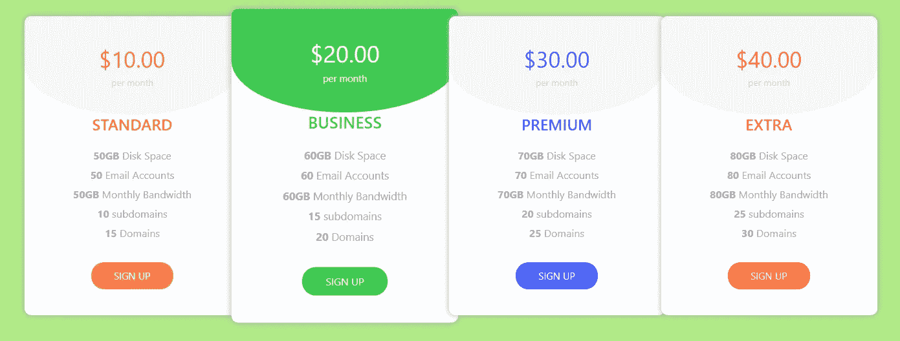

# 11 引导定价表示例

> 原文：<https://levelup.gitconnected.com/11-bootstrap-pricing-table-examples-dcdc520c42e>


价格表是用户直接比较套餐的好方法。在提供 CodePen 上的其他 Bootstrap 定价表之前，我将提供一些 Bootstrap 5.0 定价表。

# **Bootstrap 5.0 定价表**

如果你不熟悉 Bootstrap checkout [前 3 名 CSS 框架](../../../blog/article/top-3-css-frameworks)，可以简单了解一下如何添加 cdn 以及使用自定义类属性值。

**Bootstrap 5.0 定价表—示例 1**

这是一个简单的价格表，在鼠标悬停时，可以放大卡片，隐藏用户部分，并改变按钮颜色。


```
<!doctype html>
<html lang="en">
<head>
  <!-- Required meta tags -->
  <meta charset="utf-8">
  <meta name="viewport" content="width=device-width, initial-scale=1">

  <!-- Bootstrap CSS -->
  <link href="https://cdn.jsdelivr.net/npm/bootstrap@5.0.0-beta1/dist/css/bootstrap.min.css" rel="stylesheet" integrity="sha384-giJF6kkoqNQ00vy+HMDP7azOuL0xtbfIcaT9wjKHr8RbDVddVHyTfAAsrekwKmP1" crossorigin="anonymous">

  <title>Bootstrap 5.0 Pricing Table</title>

  <style>
    .card {
      border:none;
      padding: 10px 50px;
    }

    .card::after {
      position: absolute;
      z-index: -1;
      opacity: 0;
      -webkit-transition: all 0.6s cubic-bezier(0.165, 0.84, 0.44, 1);
      transition: all 0.6s cubic-bezier(0.165, 0.84, 0.44, 1);
    }

    .card:hover {

      transform: scale(1.02, 1.02);
      -webkit-transform: scale(1.02, 1.02);
      backface-visibility: hidden; 
      will-change: transform;
      box-shadow: 0 1rem 3rem rgba(0,0,0,.75) !important;
    }

    .card:hover::after {
      opacity: 1;
    }

    .card:hover .btn-outline-primary{
      color:white;
      background:#007bff;
    }

  </style>

</head>
<body>

  <div class="container-fluid" style="background: linear-gradient(90deg, #00C9FF 0%, #92FE9D 100%);">
    <div class="container p-5">
      <div class="row">
        <div class="col-lg-4 col-md-12 mb-4">
          <div class="card h-100 shadow-lg">
            <div class="card-body">
              <div class="text-center p-3">
                <h5 class="card-title">Basic</h5>
                <small>Individual</small>
                <br><br>
                <span class="h2">$8</span>/month
                <br><br>
              </div>
              <p class="card-text">Some quick example text to build on the card title and make up the bulk of the card's content.</p>
            </div>
            <ul class="list-group list-group-flush">
              <li class="list-group-item"><svg  width="16" height="16" fill="currentColor" class="bi bi-check" viewBox="0 0 16 16">
                <path d="M10.97 4.97a.75.75 0 0 1 1.07 1.05l-3.99 4.99a.75.75 0 0 1-1.08.02L4.324 8.384a.75.75 0 1 1 1.06-1.06l2.094 2.093 3.473-4.425a.267.267 0 0 1 .02-.022z"/>
              </svg> Cras justo odio</li>
              <li class="list-group-item"><svg  width="16" height="16" fill="currentColor" class="bi bi-check" viewBox="0 0 16 16">
                <path d="M10.97 4.97a.75.75 0 0 1 1.07 1.05l-3.99 4.99a.75.75 0 0 1-1.08.02L4.324 8.384a.75.75 0 1 1 1.06-1.06l2.094 2.093 3.473-4.425a.267.267 0 0 1 .02-.022z"/>
              </svg> Dapibus ac facilisis in</li>
              <li class="list-group-item"><svg  width="16" height="16" fill="currentColor" class="bi bi-check" viewBox="0 0 16 16">
                <path d="M10.97 4.97a.75.75 0 0 1 1.07 1.05l-3.99 4.99a.75.75 0 0 1-1.08.02L4.324 8.384a.75.75 0 1 1 1.06-1.06l2.094 2.093 3.473-4.425a.267.267 0 0 1 .02-.022z"/>
              </svg> Vestibulum at eros</li>
            </ul>
            <div class="card-body text-center">
              <button class="btn btn-outline-primary btn-lg" style="border-radius:30px">Select</button>
            </div>
          </div>
        </div>
        <div class="col-lg-4 col-md-12 mb-4">
          <div class="card h-100 shadow-lg">
            <div class="card-body">
              <div class="text-center p-3">
                <h5 class="card-title">Standard</h5>
                <small>Small Business</small>
                <br><br>
                <span class="h2">$20</span>/month 
                <br><br>
              </div>
              <p class="card-text">Some quick example text to build on the card title and make up the bulk of the card's content.</p>
            </div>
            <ul class="list-group list-group-flush">
              <li class="list-group-item"><svg  width="16" height="16" fill="currentColor" class="bi bi-check" viewBox="0 0 16 16">
                <path d="M10.97 4.97a.75.75 0 0 1 1.07 1.05l-3.99 4.99a.75.75 0 0 1-1.08.02L4.324 8.384a.75.75 0 1 1 1.06-1.06l2.094 2.093 3.473-4.425a.267.267 0 0 1 .02-.022z"/>
              </svg> Cras justo odio</li>
              <li class="list-group-item"><svg  width="16" height="16" fill="currentColor" class="bi bi-check" viewBox="0 0 16 16">
                <path d="M10.97 4.97a.75.75 0 0 1 1.07 1.05l-3.99 4.99a.75.75 0 0 1-1.08.02L4.324 8.384a.75.75 0 1 1 1.06-1.06l2.094 2.093 3.473-4.425a.267.267 0 0 1 .02-.022z"/>
              </svg> Dapibus ac facilisis in</li>
              <li class="list-group-item"><svg  width="16" height="16" fill="currentColor" class="bi bi-check" viewBox="0 0 16 16">
                <path d="M10.97 4.97a.75.75 0 0 1 1.07 1.05l-3.99 4.99a.75.75 0 0 1-1.08.02L4.324 8.384a.75.75 0 1 1 1.06-1.06l2.094 2.093 3.473-4.425a.267.267 0 0 1 .02-.022z"/>
              </svg> Vestibulum at eros</li>
            </ul>
            <div class="card-body text-center">
              <button class="btn btn-outline-primary btn-lg" style="border-radius:30px">Select</button>
            </div>
          </div>
        </div>
        <div class="col-lg-4 col-md-12 mb-4">
          <div class="card h-100 shadow-lg">
            <div class="card-body">
              <div class="text-center p-3">
                <h5 class="card-title">Premium</h5>
                <small>Large Companies</small>
                <br><br>
                <span class="h2">$40</span>/month
                <br><br>
              </div>
              <p class="card-text">Some quick example text to build on the card title and make up the bulk of the card's content.</p>
            </div>
            <ul class="list-group list-group-flush">
              <li class="list-group-item"><svg  width="16" height="16" fill="currentColor" class="bi bi-check" viewBox="0 0 16 16">
                <path d="M10.97 4.97a.75.75 0 0 1 1.07 1.05l-3.99 4.99a.75.75 0 0 1-1.08.02L4.324 8.384a.75.75 0 1 1 1.06-1.06l2.094 2.093 3.473-4.425a.267.267 0 0 1 .02-.022z"/>
              </svg> Cras justo odio</li>
              <li class="list-group-item"><svg  width="16" height="16" fill="currentColor" class="bi bi-check" viewBox="0 0 16 16">
                <path d="M10.97 4.97a.75.75 0 0 1 1.07 1.05l-3.99 4.99a.75.75 0 0 1-1.08.02L4.324 8.384a.75.75 0 1 1 1.06-1.06l2.094 2.093 3.473-4.425a.267.267 0 0 1 .02-.022z"/>
              </svg> Dapibus ac facilisis in</li>
              <li class="list-group-item"><svg  width="16" height="16" fill="currentColor" class="bi bi-check" viewBox="0 0 16 16">
                <path d="M10.97 4.97a.75.75 0 0 1 1.07 1.05l-3.99 4.99a.75.75 0 0 1-1.08.02L4.324 8.384a.75.75 0 1 1 1.06-1.06l2.094 2.093 3.473-4.425a.267.267 0 0 1 .02-.022z"/>
              </svg> Vestibulum at eros</li>
            </ul>
            <div class="card-body text-center">
              <button class="btn btn-outline-primary btn-lg" style="border-radius:30px">Select</button>
            </div>
          </div>
        </div>
      </div>    
    </div>
  </body>

  <!-- Option 1: Bootstrap Bundle with Popper -->
  <script src="https://cdn.jsdelivr.net/npm/bootstrap@5.0.0-beta1/dist/js/bootstrap.bundle.min.js" integrity="sha384-ygbV9kiqUc6oa4msXn9868pTtWMgiQaeYH7/t7LECLbyPA2x65Kgf80OJFdroafW" crossorigin="anonymous"></script>

</body>
</html>
```

**Bootstrap 5.0 定价表—示例 2**

这种价格设计的特点是悬停时翻牌。


```
<!doctype html>
<html lang="en">
<head>
  <!-- Required meta tags -->
  <meta charset="utf-8">
  <meta name="viewport" content="width=device-width, initial-scale=1">

  <!-- Bootstrap CSS -->
  <link href="https://cdn.jsdelivr.net/npm/bootstrap@5.0.0-beta1/dist/css/bootstrap.min.css" rel="stylesheet" integrity="sha384-giJF6kkoqNQ00vy+HMDP7azOuL0xtbfIcaT9wjKHr8RbDVddVHyTfAAsrekwKmP1" crossorigin="anonymous">

  <title>Bootstrap 5.0 Pricing Table</title>

  <style>

    .header {
      background:#00C9FF;
    }
    .bi {
      color:#00C9FF;
    }

    .price {
      color:white;
      font-size: 150px;
      font-weight: 800;
      padding-top:-80% !important;
    }

    /* The flip card container - set the width and height to whatever you want. We have added the border property to demonstrate that the flip itself goes out of the box on hover (remove perspective if you don't want the 3D effect */
    .flip-card {
      background-color: transparent;
      width: auto;
      height: auto;
      perspective: 1000px; /* Remove this if you don't want the 3D effect */
    }

    /* This container is needed to position the front and back side */
    .flip-card-inner {
      position: relative;
      width: 100%;
      height: 100%;
      text-align: center;
      transition: transform 0.8s;
      transform-style: preserve-3d;
    }

    /* Do an horizontal flip when you move the mouse over the flip box container */
    .flip-card:hover .flip-card-inner {
      transform: rotateY(180deg);
    }

    /* Position the front and back side */
    .flip-card-front, .flip-card-back {
      position: absolute;
      width: 100%;
      height: 100%;
      -webkit-backface-visibility: hidden; /* Safari */
      backface-visibility: hidden;
    }

    /* Style the front side (fallback if image is missing) */
    .flip-card-front {
      background-color: #00C9FF;
      color: white;
      height: auto;
      padding:50px 0px;
    }

    /* Style the back side */
    .flip-card-back {
      background-color: white;
      color: black;
      transform: rotateY(180deg);
      padding:50px 0px;
    }
  </style>

</head>
<body>

  <div class="container p-5">
    <div class="row">
      <div class="col-lg-4 col-md-12 mb-4">
        <div class="h-100 flip-card">
          <div class="flip-card-inner">
            <div class="flip-card-front">

              <span class="price">$8</span><br>/month 
              <br>
              <h2 class="card-title">Basic</h2>
              <small>Individual</small>
            </div>
            <div class="flip-card-back">
             <ul class="list-group list-group-flush">
              <li class="list-group-item"><svg  width="16" height="16" fill="currentColor" class="bi bi-check" viewBox="0 0 16 16">
                <path d="M10.97 4.97a.75.75 0 0 1 1.07 1.05l-3.99 4.99a.75.75 0 0 1-1.08.02L4.324 8.384a.75.75 0 1 1 1.06-1.06l2.094 2.093 3.473-4.425a.267.267 0 0 1 .02-.022z"/>
              </svg> Cras justo odio</li>
              <li class="list-group-item"><svg  width="16" height="16" fill="currentColor" class="bi bi-check" viewBox="0 0 16 16">
                <path d="M10.97 4.97a.75.75 0 0 1 1.07 1.05l-3.99 4.99a.75.75 0 0 1-1.08.02L4.324 8.384a.75.75 0 1 1 1.06-1.06l2.094 2.093 3.473-4.425a.267.267 0 0 1 .02-.022z"/>
              </svg> Dapibus ac facilisis in</li>
              <li class="list-group-item"><svg  width="16" height="16" fill="currentColor" class="bi bi-check" viewBox="0 0 16 16">
                <path d="M10.97 4.97a.75.75 0 0 1 1.07 1.05l-3.99 4.99a.75.75 0 0 1-1.08.02L4.324 8.384a.75.75 0 1 1 1.06-1.06l2.094 2.093 3.473-4.425a.267.267 0 0 1 .02-.022z"/>
              </svg> Vestibulum at eros</li>
            </ul>
            <button class="my-5 btn btn-outline-success btn-lg">Select</button>
          </div>
        </div>
      </div>
    </div>

    <div class="col-lg-4 col-md-12 mb-4">
      <div class="h-100 flip-card">
        <div class="flip-card-inner">
          <div class="flip-card-front">

            <span class="price">$20</span><br>/month 
            <br>
            <h2 class="card-title">Standard</h2>
            <small>Small Business</small>
          </div>
          <div class="flip-card-back">
           <ul class="list-group list-group-flush">
            <li class="list-group-item"><svg  width="16" height="16" fill="currentColor" class="bi bi-check" viewBox="0 0 16 16">
              <path d="M10.97 4.97a.75.75 0 0 1 1.07 1.05l-3.99 4.99a.75.75 0 0 1-1.08.02L4.324 8.384a.75.75 0 1 1 1.06-1.06l2.094 2.093 3.473-4.425a.267.267 0 0 1 .02-.022z"/>
            </svg> Cras justo odio</li>
            <li class="list-group-item"><svg  width="16" height="16" fill="currentColor" class="bi bi-check" viewBox="0 0 16 16">
              <path d="M10.97 4.97a.75.75 0 0 1 1.07 1.05l-3.99 4.99a.75.75 0 0 1-1.08.02L4.324 8.384a.75.75 0 1 1 1.06-1.06l2.094 2.093 3.473-4.425a.267.267 0 0 1 .02-.022z"/>
            </svg> Dapibus ac facilisis in</li>
            <li class="list-group-item"><svg  width="16" height="16" fill="currentColor" class="bi bi-check" viewBox="0 0 16 16">
              <path d="M10.97 4.97a.75.75 0 0 1 1.07 1.05l-3.99 4.99a.75.75 0 0 1-1.08.02L4.324 8.384a.75.75 0 1 1 1.06-1.06l2.094 2.093 3.473-4.425a.267.267 0 0 1 .02-.022z"/>
            </svg> Vestibulum at eros</li>
          </ul>
          <button class="my-5 btn btn-outline-success btn-lg">Select</button>
        </div>
      </div>
    </div>
  </div>

  <div class="col-lg-4 col-md-12 mb-4">
    <div class="h-100 flip-card">
      <div class="flip-card-inner">
        <div class="flip-card-front">

          <span class="price">$40</span><br>/month 
          <br>
          <h2 class="card-title">Premium</h2>
          <small>Large Company</small>
        </div>
        <div class="flip-card-back">
         <ul class="list-group list-group-flush">
          <li class="list-group-item"><svg  width="16" height="16" fill="currentColor" class="bi bi-check" viewBox="0 0 16 16">
            <path d="M10.97 4.97a.75.75 0 0 1 1.07 1.05l-3.99 4.99a.75.75 0 0 1-1.08.02L4.324 8.384a.75.75 0 1 1 1.06-1.06l2.094 2.093 3.473-4.425a.267.267 0 0 1 .02-.022z"/>
          </svg> Cras justo odio</li>
          <li class="list-group-item"><svg  width="16" height="16" fill="currentColor" class="bi bi-check" viewBox="0 0 16 16">
            <path d="M10.97 4.97a.75.75 0 0 1 1.07 1.05l-3.99 4.99a.75.75 0 0 1-1.08.02L4.324 8.384a.75.75 0 1 1 1.06-1.06l2.094 2.093 3.473-4.425a.267.267 0 0 1 .02-.022z"/>
          </svg> Dapibus ac facilisis in</li>
          <li class="list-group-item"><svg  width="16" height="16" fill="currentColor" class="bi bi-check" viewBox="0 0 16 16">
            <path d="M10.97 4.97a.75.75 0 0 1 1.07 1.05l-3.99 4.99a.75.75 0 0 1-1.08.02L4.324 8.384a.75.75 0 1 1 1.06-1.06l2.094 2.093 3.473-4.425a.267.267 0 0 1 .02-.022z"/>
          </svg> Vestibulum at eros</li>
        </ul>
        <button class="my-5 btn btn-outline-success btn-lg">Select</button>
      </div>
    </div>
  </div>
</div>

</div>    
</div>

</body>

<!-- Option 1: Bootstrap Bundle with Popper -->
<script src="https://cdn.jsdelivr.net/npm/bootstrap@5.0.0-beta1/dist/js/bootstrap.bundle.min.js" integrity="sha384-ygbV9kiqUc6oa4msXn9868pTtWMgiQaeYH7/t7LECLbyPA2x65Kgf80OJFdroafW" crossorigin="anonymous"></script>

</body>
</html>
```

**Bootstrap 5.0 定价表—示例 3**

我要提供的最后一个例子是一个简化版的价格表。该卡只有悬停时才有颜色。



```
<!doctype html>
<html lang="en">
<head>
  <!-- Required meta tags -->
  <meta charset="utf-8">
  <meta name="viewport" content="width=device-width, initial-scale=1">

  <!-- Bootstrap CSS -->
  <link href="https://cdn.jsdelivr.net/npm/bootstrap@5.0.0-beta1/dist/css/bootstrap.min.css" rel="stylesheet" integrity="sha384-giJF6kkoqNQ00vy+HMDP7azOuL0xtbfIcaT9wjKHr8RbDVddVHyTfAAsrekwKmP1" crossorigin="anonymous">

  <title>Bootstrap 5.0 Pricing Table</title>

  <style>

    .card1:hover {
      background:#00ffb6;
      border:1px solid #00ffb6;
    }

    .card1:hover .list-group-item{
      background:#00ffb6 !important
    }

    .card2:hover {
      background:#00C9FF;
      border:1px solid #00C9FF;
    }

    .card2:hover .list-group-item{
      background:#00C9FF !important
    }

    .card3:hover {
      background:#ff95e9;
      border:1px solid #ff95e9;
    }

    .card3:hover .list-group-item{
      background:#ff95e9 !important
    }

    .card:hover .btn-outline-dark{
      color:white;
      background:#212529;
    }

  </style>

</head>
<body>

  <div class="container-fluid">
    <div class="container p-5">
      <div class="row">
        <div class="col-lg-4 col-md-12 mb-4">
          <div class="card card1 h-100">
            <div class="card-body">

              <h5 class="card-title">Basic</h5>
              <small class='text-muted'>Individual</small>
              <br><br>
              <span class="h2">$8</span>/month
              <br><br>
              <div class="d-grid my-3">
                <button class="btn btn-outline-dark btn-block">Select</button>
              </div>
              <ul>
                <li>Cras justo odio</li>
                <li>Dapibus ac facilisis in</li>
                <li>Vestibulum at eros</li>

              </ul>
            </div>

          </div>
        </div>
        <div class="col-lg-4 col-md-12 mb-4">
          <div class="card card2 h-100">
            <div class="card-body">

              <h5 class="card-title">Standard</h5>
              <small class='text-muted'>Small Business</small>
              <br><br>
              <span class="h2">$20</span>/month
              <br><br>
              <div class="d-grid my-3">
                <button class="btn btn-outline-dark btn-block">Select</button>
              </div>
              <ul>
                <li>Cras justo odio</li>
                <li>Dapibus ac facilisis in</li>
                <li>Vestibulum at eros</li>

              </ul>
            </div>

          </div>
        </div>
        <div class="col-lg-4 col-md-12 mb-4">
          <div class="card card3 h-100">
            <div class="card-body">

              <h5 class="card-title">Premium</h5>
              <small class='text-muted'>Large Company</small>
              <br><br>
              <span class="h2">$40</span>/month
              <br><br>
              <div class="d-grid my-3">
                <button class="btn btn-outline-dark btn-block">Select</button>
              </div>
              <ul>
                <li>Cras justo odio</li>
                <li>Dapibus ac facilisis in</li>
                <li>Vestibulum at eros</li>

              </ul>
            </div>

          </div>
        </div>
      </div>    
    </div>
  </body>

  <!-- Option 1: Bootstrap Bundle with Popper -->
  <script src="https://cdn.jsdelivr.net/npm/bootstrap@5.0.0-beta1/dist/js/bootstrap.bundle.min.js" integrity="sha384-ygbV9kiqUc6oa4msXn9868pTtWMgiQaeYH7/t7LECLbyPA2x65Kgf80OJFdroafW" crossorigin="anonymous"></script>

</body>
</html>
```

# **CodePen 引导定价表**

现在来看一些 CodePen Bootstrap 定价表的例子。除了代码链接之外，下面还列出了每个 CodePen 的创建者。

**自举定价表**

*由 Prem Regmi*

定价表与其说是一套卡片，不如说是一张表格。它旨在直接比较每个特征。

 [## CodePen 嵌入式引导定价表

### 定价{ margin:40px 0px；} .定价。表{ border-top:1px solid # DDD；背景:# fff} .定价。表四，.定价…

codepen.io](https://codepen.io/regmiprem/embed/preview/NRQZYz?height=265&theme-id=dark&default-tab=html,result) 

**三维自助定价表**

*由 Aashima*

下一个 CodePen 示例是一个价格卡，在悬停时颜色变为薄荷绿。

有角度的/3d 设计提供了典型自举卡的良好扭曲。

 [## CodePen 嵌入式三维定价表

### 定价表{ margin-top:30px；文本对齐:居中；位置:相对；} .定价表。定价 _ 标题:在{内容之后…

codepen.io](https://codepen.io/Aashima/embed/preview/PKgeoz?height=265&theme-id=dark&default-tab=css,result) 

**响应式引导定价表**

*作者 Anisur*

有时候，在比较 Bootstrap 价格表中的几个产品包时，简单是最好的方法。

这种设计是平面的，直到你把鼠标悬停在一张卡片上，就会露出一点点的盒状阴影。此外，当鼠标悬停在按钮上时，按钮会从左向右填充。

 [## CodePen 嵌入式响应引导定价表

### 响应式引导定价表基本计划基本用户 30 美元/月 10 个免费 PSD 文件 10 个免费 PSD 文件 10 个免费…

codepen.io](https://codepen.io/idanisur/embed/preview/ZpPoKj?height=265&theme-id=dark&default-tab=html,result) 

**扁平响应引导定价表**

*作者 Anisur*

最后一个创造者也做了这支笔。悬停时，缩放后的卡片后面会出现一个阴影。

 [## CodePen Embed - Flat 响应式引导定价表

### 平面响应引导定价表基本计划基本用户 30 美元/月 10 个免费 PSD 文件 10 个免费 PSD 文件 10 个免费…

codepen.io](https://codepen.io/idanisur/embed/preview/amrEdQ?height=265&theme-id=dark&default-tab=css,result) 

**自举定价表**

*由戈斯尼佩茨*

这是一个比较独特的自举定价表。卡片从左到右堆叠，标题在悬停时会改变颜色。

 [## CodePen 嵌入式引导定价表

### 正文{背景:# B1EA86padding:30px 0 } a { text-decoration:none；} .定价表{ text-align:居中…

codepen.io](https://codepen.io/gosnippets/embed/preview/OJXZNRW?height=265&theme-id=dark&default-tab=html,result) 

**引导定价表**

*作者萨哈尔·阿里·拉扎*

CodePen 用户萨哈尔采用了一种角度的方法来展示包装类型和价格。这是一个简洁、大胆的设计。

 [## CodePen Embed - Bootstrap 定价表 2019(演示 2)

### @ charset“utf-8”；/* CSS 文档*/@导入…

codepen.io](https://codepen.io/mrsahar/embed/preview/oOrWEm?height=265&theme-id=dark&default-tab=css,result) 

**自举定价表**

萨哈尔·阿里·拉扎

由同一用户制作的另一个代码笔，这个 Boostrap 定价表是一个稍微不那么棱角分明的方法，使用了更浅的调色板。

 [## CodePen 嵌入式引导定价表

### = = = = = = = = = = = = = = = = = = = = = = = = = = = = = *//*赛义德·萨哈尔·阿里·拉扎*//* = = = = = = = = = = = = = = = = = = = = = = = = = = = = */@导入…

codepen.io](https://codepen.io/mrsahar/embed/preview/yOVGBQ?height=265&theme-id=dark&default-tab=css,result) 

**自举定价表**

*由占卜者*

我将展示的最后一个引导定价表反转了悬停时的颜色。

 [## CodePen 嵌入式引导定价表

### 单一价格{ text-align:center；背景:# 262626；过渡:. 7s；边距-顶部:20px} .单一价格 h3 {…

codepen.io](https://codepen.io/divinector/embed/preview/KKPvKLz?height=265&theme-id=dark&default-tab=html,result) 

*原载于*[*https://www.ordinarycoders.com*](https://www.ordinarycoders.com/blog/article/bootstrap-pricing-table-example)*。*