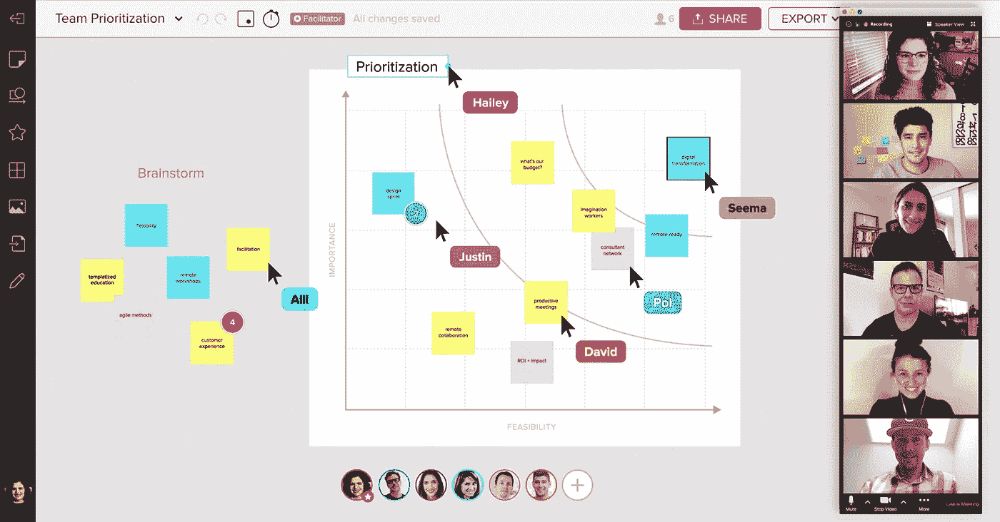
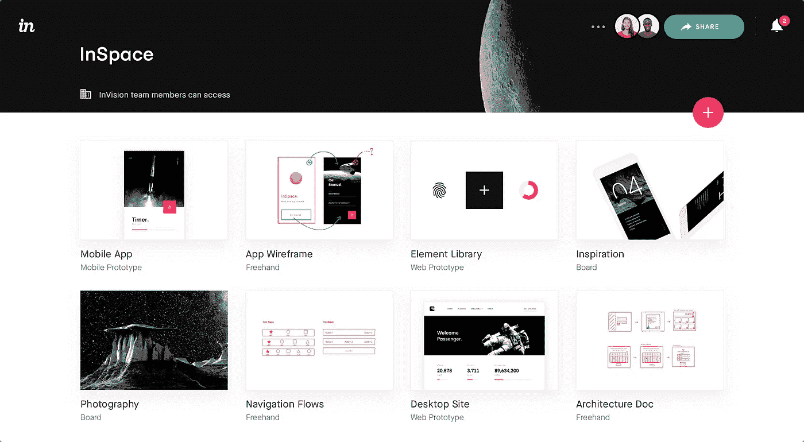
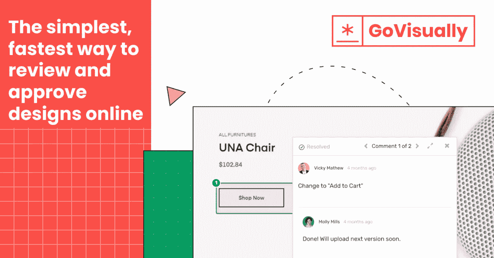
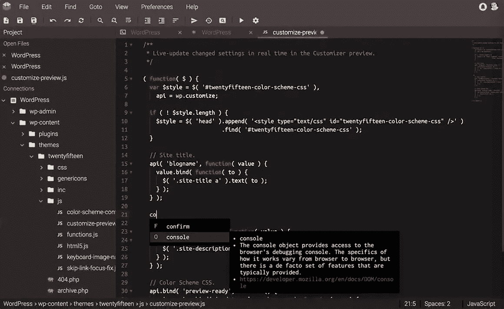
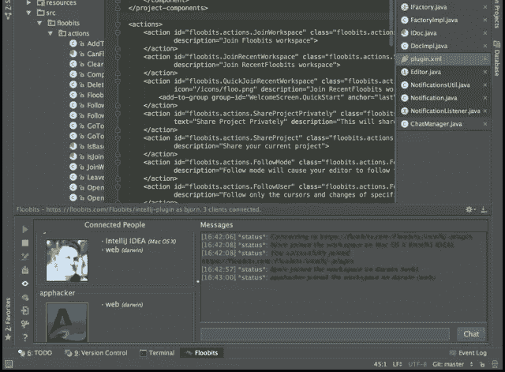
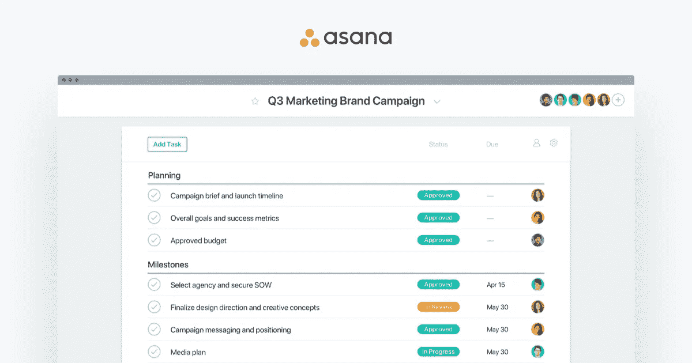
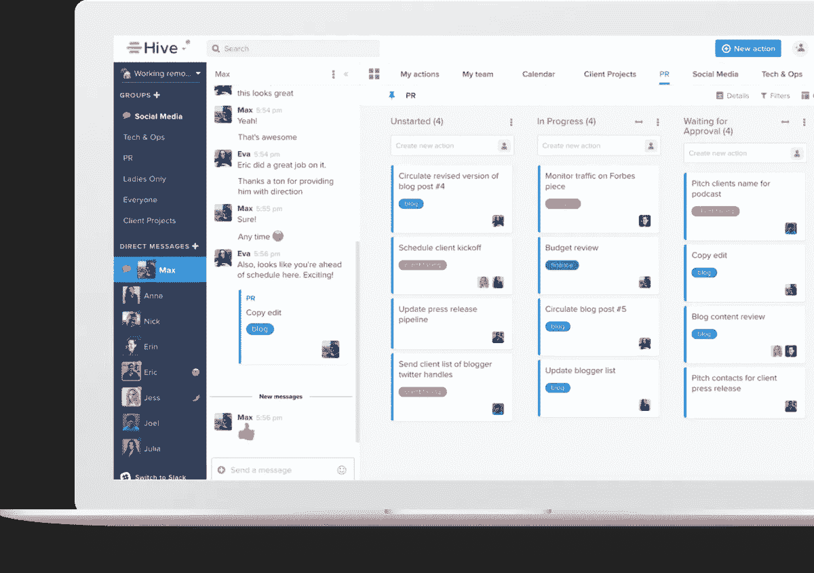
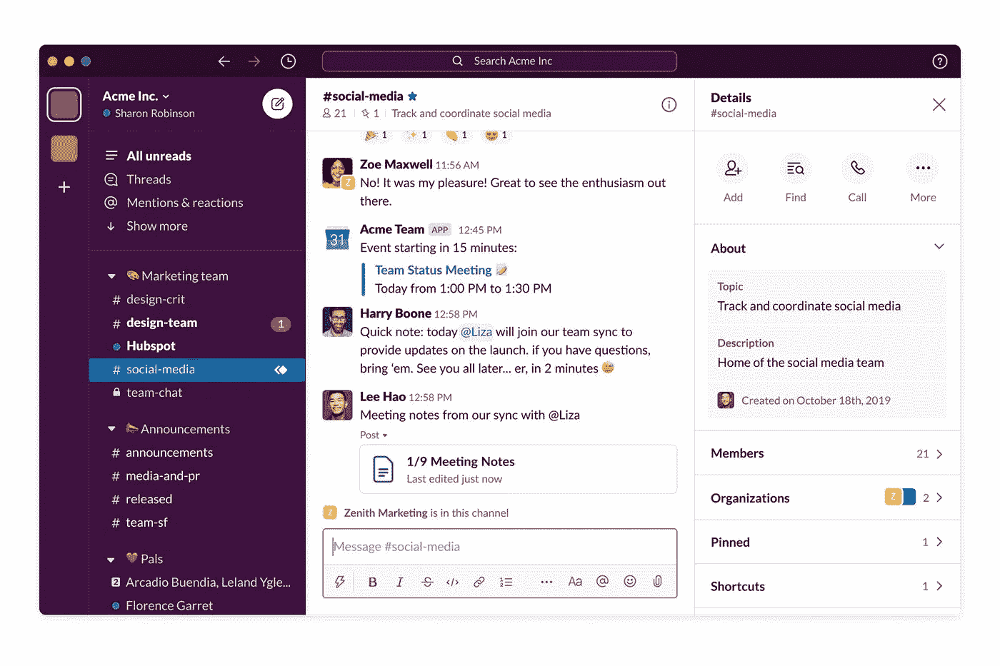
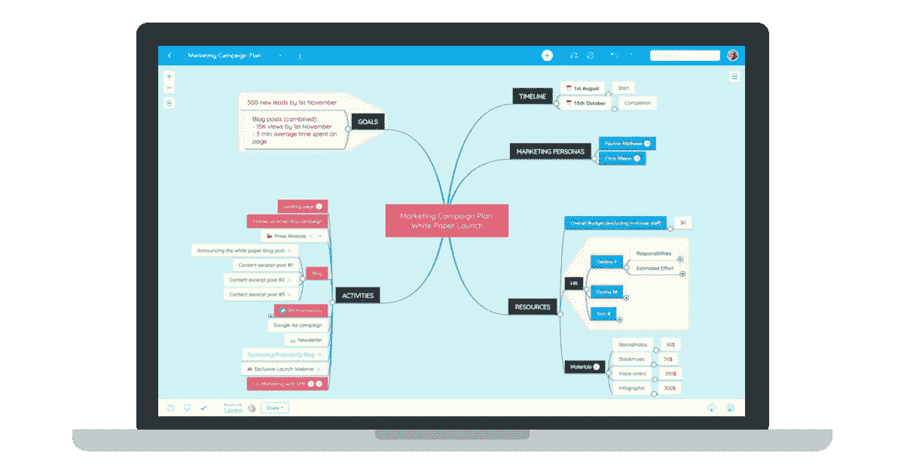

# 面向设计师、开发人员和项目经理的 11 种协作工具

> 原文：<https://levelup.gitconnected.com/11-collaboration-tools-for-designers-developers-and-pms-1230b078f6c1>

有一个工具适用于所有人和所有事(好吧，几乎如此，坚持到最后)。但是如何找到最适合您的团队以及满足您远程协作需求的解决方案呢？

我们已经为我们所有的设计师、开发人员和项目经理整理了一个工具列表来解决这个问题。所以，事不宜迟，让我们开始吧

# UX/UI 专家的最佳协作工具

在世界各地的设计团队中，经常可以看到一些列出的工具是不可或缺的一部分。更有趣和实用的是，在远程协作环境中大规模地做同样的事情是多么容易。以下是其中的一些工具:

**壁画**

白板是设计头脑风暴的重要组成部分，而壁画在创造视觉效果方面做得很好。拖放功能使得添加想法、链接、文档、帖子、草图等等变得很容易。您可以自由移动它们，进行更改，并实时查看它们。所有这些特性都有助于快速达成共识，让每个人都了解情况。

**视野**

Vision 不仅仅将协作局限于您的设计团队。您的市场营销、开发、销售团队以及您的客户也可以在编码开始之前参与进来。它允许你创建带有手势、动画和过渡的功能原型。每个人都可以在 Vision 中通过评论提供反馈、自由绘制草图和表达自己的观点

**官方**

作为一名设计师，有时会错过通过大量电子邮件分享的反馈。GoVisually 是一个不太受欢迎的设计工具，但它的极简主义方法对设计师很有吸引力。它还带有概念验证功能，只需几个简单快捷的步骤，就能实现轻松无缝的协作。您的客户可以通过简单的链接共享看到该项目，也不需要注册。所有这些都使得查看、编辑和共享相关的变更变得容易。

# 开发人员的最佳协作工具

在这些工具出现之前，开发人员的远程协作从来都不是一件容易的事情。

**Codeanywhere**

顾名思义，Codeanywhere 允许您通过平板电脑、电话或 web 客户端随时随地编写代码。它支持 75 种语言，并提供基于云的环境。这个 Google Docs like 编辑器支持实时配对编程，对合作者的数量没有限制。这里的重点完全是通过实时代码共享和可共享链接实现轻松协作。

**飞絮**

这个用于 Sublime Text、Atom、IntelliJ IDEA 的交叉文本编辑器为您的开发人员提供了聊天和实时协作选项。您可以自由设置公共或私人工作区，集成 WebRTC 和 IRC 分别用于视频和文本聊天。在这里，你也可以同时拥有许多用户，从而使团队很容易在一个项目上走到一起。

要获得更多专门针对开发人员的生产力工具，请点击此[链接。](/6-productivity-tools-that-all-developers-should-try-252191e523e4)

# 项目经理的最佳协作工具

1, 2, 5, 10….不要误解我们的意思(我们确实知道如何计数)，但是作为一个项目经理，处理这么多任务是一件很平常的事情，有时会有点忙乱。但是就像我们之前说的，存在的每个问题都有一个工具。我们的项目经理宁愿使用以下工具，也不愿失去理智:

**体式**

Asana 因其多样的功能和简单的用户界面而值得一提。它使管理任务变得容易。无论是设计、开发、内容管理，还是任何可能的部门。你可以组织任务，在一个地方收集所有相关的链接和文档，跟踪进度，添加队友，创建子任务，列表是无穷无尽的。有 100 个集成可用于确保没有重要信息丢失。您需要亲自看看它，看看它是如何以最小的努力简化工作的。

【Monday.com 

让我们来谈谈 2019 年威比奖得主 monday.com。你可以通过一个简单的可定制的用户界面来组织你的任务。您可以跟踪所有的实时更新，设置截止日期，拥有一个集中的交流场所，等等。体式和 monday.com 有很多相似之处。在这里，成本可能是一个决定性因素。

**蜂巢**

星巴克、优步、IBM 等企业都为 Hive 做担保。这背后的众多原因之一是强大的基于人工智能的分析，它有助于突出可能的低效率，并建议相应的改变。作为用户，您可以使用甘特图、表格、看板甚至日历来查看您的项目。还有其他功能，如时间跟踪、个人待办事项列表、简单的资源分配等。选择 hive 可以让你在一个地方管理所有不同的团队。

# 荣誉奖——沟通工具

是的，有大量的交流工具，但是它们能满足你所有的商业需求吗？

**聊天室**

Talkroom 像大多数 Google meet 和 Discord 一样基于 WebRTC。这是为您的团队创建个性化视频聊天室的最简单方法。你所要做的就是输入你的名字和你的视频聊天室的名字，然后和你的队友分享链接。不相信我们？点击[这里](https://talkroom.io/)自己看。

WebRTC 为您提供了一个机会，让您可以借助简单的 API 来陈述跨移动设备和浏览器进行实时通信的需求。您可以选择功能、实时屏幕共享、与您当前的工具集成、只为所需的号码付费等。我们知道您了解 WebRTC，那么为什么不尝试一下呢？

有些工具被所有人使用和喜爱，所以它们值得一提。

**懈怠**

这是所有远程团队的老师宠。它被用于各种各样的交流、设计、开发，甚至办公室玩笑，你可以有一个所有谈话的渠道。此外，你可以控制你花的时间，因为你可以根据自己的判断关闭任何频道。你可以过滤内容，保存文档，回到以前的对话，甚至给人加标签。

所以，有了 Slack，总会有事情发生，你可以和你的队友保持联系。

**明德梅斯特**

思维导图一直是激发我们创造力的东西。像 Mindly 和 MindMeister 这样的软件很有帮助。我们专注于 MindMeister，因为它可以在网络、Android 和 iOS 上使用。它可以让你进行民意调查，嵌入直播视频，通过评论留下你的观点，等等。

远程工作模式已经存在，那么为什么不在团队之间实现更好的协作呢？我们的团队使用所有列出的工具，许多行业专家也为它们作证。

**关于银河网络链接**

我们专注于为全球客户提供以人为中心的设计和开发服务。我们的创新理念、行业最佳实践和流程帮助我们提高用户满意度，并为客户解决复杂问题。[联系我们](https://www.galaxyweblinks.com/contactus/)免费咨询！