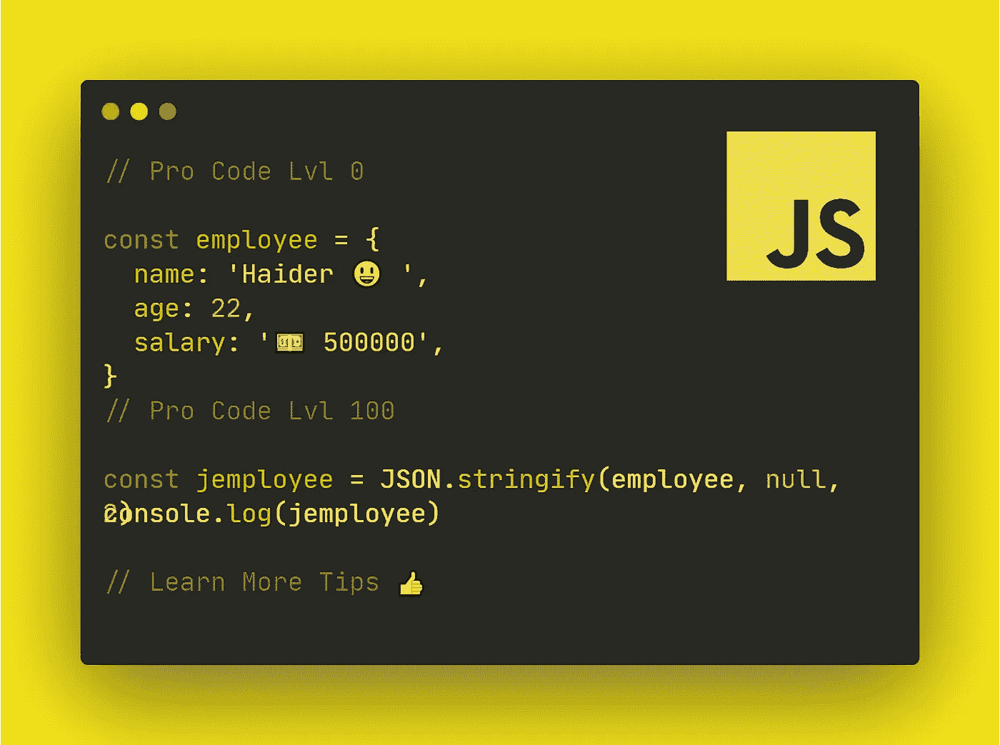

# 提升技能的 11 个 JavaScript 技巧

> 原文：<https://levelup.gitconnected.com/11-javascript-tricks-to-boost-your-skills-93c2fe1cd057>

## 大多数开发人员不知道这些专业 JavaScript 技巧



@归功于 CodeDev101(我自己)

当我开始学习 JavaScript 时，我总是很好奇，想找到能节省我的时间和提高编码效率的技巧和窍门。我总是在 Stackoverflow 上搜索，也阅读许多媒体文章。

在这篇文章中，我将分享我发现的 11 个最好的 JavaScript 技巧，它们将提升你的技能，让你像专业程序员一样工作。不浪费任何时间，让我们开始吧。

# 👉1# —需要过滤掉假值吗？

这个技巧一定会帮助你摆脱假值，如假，" "，0，未定义的空值。为了更好地理解，请查看下面的示例代码。

```
//example codeconst array = [1, 0, false, "", 2, null, 3]
const farray = array.filter(Boolean)console.log(farray) // [1, 2, 3]
```

# 👉2# —消除重复

我们在 JavaScript 编程中都遇到过重复值，最常用的消除方法是结合循环使用 **indexOf()** 方法。但是这个技巧会告诉你两个快速的方法。

```
//example code//method 1
const array = [1, 2, 1, 3, 3, 2, 4, 5, 5, 6, 1]
const farray=array.filter((item,idx,arr)=>arr.indexOf(item)===idx)
console.log(farray) // [1, 2, 3, 4, 5, 6]//method 2
const farray2 =[...new Set(array)];
console.log(farray2) // [1, 2, 3, 4, 5, 6]
```

# 👉3# —在 JavaScript 中运行数组

这个技巧我主要用来缩短我的大数组或者让它变空。我们将使用数组的长度参数并用一个值初始化它。该值可以是任何正数。

该值将根据您传递的大小截断您的数组。为了更好地理解，请看下面的示例代码。

```
// example codeconst arr1 = [1, 2, 3, 4, 6]
arr1.length=2
console.log(arr1) // [1, 2]const arr2 = [5, 4, 3, 9, 100, 101]
arr2.length=0
console.log(arr2) //[]const arr3 = [5, 4, 3, 9, 100, 101]
arr3.length=7
console.log(arr3) //[5, 4, 3, 9, 100, 101, undefined]
```

# 👉4# —合并多个对象

比方说，你需要在 JavaScript 中将两个对象合并成一个，以获得更好的信息。对于此任务，您可以使用 Spread 运算符(…)。这个运算符由三个点(…)表示。

这在许多情况下非常有用，我们将尝试其中一种方法，将两个数组合并为一个。查看下面的示例代码。

```
// example codelet employee = {
 'id': 'S129',
 'name': 'Haider',
 'age': 22,
 'addr': 'USA'
}let job = {
  'title': 'Software Engineer',
  'location': 'Canada'
}// merging them into one object// using spread operator
 let merge = {...employee, ...job};
 console.log('Final Merged', merge);//output:
// {
//    'id': 'S129',
//    'name': 'Haider',
//    'age': 22,
//    'addr': 'USA'
//    'title': 'Software Engineer',
//   'location': 'Canada'
// }
```

# 👉5# —使用析构的简单交换

在其他编程语言中，交换是在第三个变量的帮助下完成的，通常命名为`temp`。但是在 JavaScript 中，您可以使用析构方法在两个对象之间交换。为了更好地理解，请查看下面的代码示例。

```
// example codelet x = 5;
let y = 9;
console.log(x, y); // 5 9[x, y] = [y, x]; //swapingconsole.log(x, y); // 9 5
```

# 👉6# —将十进制转换为六进制和二进制

这个惊人的技巧将帮助你使用内置方法`toString()`将十进制转换成十六进制和二进制值。

```
//example code
const deci = 500console.log(deci.toString(2)) // 111110100console.log(deci.toString(16)) // 1f4console.log(deci.toString(8)) // 764
```

# 👉7# —一行回文检查

这个简短的代码技巧将教你如何检查一个字符串是否是 palindarom

```
// example codefunction isPalindrome(str)
{
  return str === str.split('').reverse().join('')

}console.log(isPalindrome("mom")) // true
console.log(isPalindrome("ball")) // false
console.log(isPalindrome("maham")) // true
```

# 👉8# —带有空格的 JSON 输出

让 JSON 更整洁的一个简单方法是在其格式中提供空格和缩进。这个技巧将帮助你使你的 JSON 代码看起来更干净，更易读。查看下面的代码示例。

```
//example codeconst employee = {
  name : "Haider",
  age : 22,
  salary : 500000
}const jemployee = JSON.stringify(employee, null, 2)console.log(jemployee)//output:// {
//  "name": "Haider",
//  "age": 22,
//  "salary": 500000
// }
```

# 👉9# —代码的执行时间

为了计算你的代码执行时间，这个技巧将向你介绍`console`的`time`和`timeEnd`方法。

```
//example codeconsole.time("timer-1")var a = 20
var b = 3
for(let i = b; i < a; i++)
{
  // do something
}console.timeEnd("timer-1") // timer-1: 1ms
```

# 👉10# —检查 isArray

如果你想检查你的对象是否是一个数组，这个技巧将会派上用场。我们将使用一个简单的接受参数对象的 JavaScript 内置方法。

```
//example codeconst array1 = [1, 3, 4, 5]
console.log(Array.isArray(array1)) // trueconst array2 = {}
console.log(Array.isArray(array2)) // false
```

# 👉11 #—JavaScript 中的快速增强方法

计算功率的一种方法是调用`Math.pow()`方法并向其传递值，但是您也可以使用`**`。

```
//example codeconsole.log("New Method Power of 2 ^ 3 ", 2**3);   // 8 
console.log("Old Method Power of 2 ^ 3 ", Math.pow(2,3));  //8
```

# 👉最后的想法

所以你已经看到了 11 个最好的 JavaScript 技巧和窍门来提高你的技能和节省你宝贵的编码时间。我希望你喜欢这篇文章，不要忘记与 JavaScript 社区分享你的回答或任何有用的技巧，我们随时准备学习新的东西。

**快乐的 JavaScript 编码！**

# 👉永远不要停止学习

如果你喜欢这篇文章，那么你会喜欢阅读其他充满新事物和知识的编程文章，**看看下面吧。**

[](/15-magical-javascript-tips-for-every-web-developer-3301feb0b70c) [## 给每个 Web 开发者的 15 个神奇的 JavaScript 技巧

### 15 个神奇的 JavaScript 技巧和窍门，节省您作为 Web 开发人员的宝贵时间

levelup.gitconnected.com](/15-magical-javascript-tips-for-every-web-developer-3301feb0b70c) [](/12-smart-ways-to-earn-as-a-developer-4131def3b0a5) [## 作为开发人员的 12 种聪明的赚钱方法

### 除非你能在床上赚钱，否则不要呆在床上

levelup.gitconnected.com](/12-smart-ways-to-earn-as-a-developer-4131def3b0a5) [](/12-python-tricks-to-make-your-life-easier-b4a88e4c6767) [## 让你的生活更轻松的 12 个 Python 技巧

### 节省您宝贵时间的 Python 技巧和窍门

levelup.gitconnected.com](/12-python-tricks-to-make-your-life-easier-b4a88e4c6767) [](/20-funny-jokes-that-only-a-programmer-can-understand-62d4723a8dca) [## 20 个会让你 LOL 的搞笑编程笑话

### 每个程序员和开发人员的小喜剧。

levelup.gitconnected.com](/20-funny-jokes-that-only-a-programmer-can-understand-62d4723a8dca) [](/12-javascript-features-youve-probably-never-used-db932c413cdd) [## 您可能从未使用过的 12 个 JavaScript 特性

### 大多数人不知道 JavaScript 令人难以置信的特性

levelup.gitconnected.com](/12-javascript-features-youve-probably-never-used-db932c413cdd) [](/17-clever-javascript-tricks-that-every-developer-should-use-e7f299e49896) [## 每个开发人员都应该使用的 17 个聪明的 JavaScript 技巧

### 每个开发人员都应该知道的 JavaScript 技巧

levelup.gitconnected.com](/17-clever-javascript-tricks-that-every-developer-should-use-e7f299e49896) [](/15-python-hidden-features-youve-probably-never-used-bb59bb3138b6) [## 你可能从未用过的 15 个 Python 特性

### 大多数人不知道 Python 的这些不可思议的特性。

levelup.gitconnected.com](/15-python-hidden-features-youve-probably-never-used-bb59bb3138b6) [](/25-useful-python-snippets-for-everyday-problems-4e1a74d1abae) [## 针对日常问题的 25 个有用的 Python 片段

### 以下是我为您的日常 Python 问题提供的 25 个有用且省时的片段

levelup.gitconnected.com](/25-useful-python-snippets-for-everyday-problems-4e1a74d1abae) [](/20-ways-to-make-money-online-while-learning-to-code-9aec753b742d) [## 学习编码的同时在线赚钱的 20 种方法

### 如果你是一名程序员，却没有在网上赚到钱，那你就错过了一个大好机会

levelup.gitconnected.com](/20-ways-to-make-money-online-while-learning-to-code-9aec753b742d) [](/master-object-oriented-programming-oop-in-python-3-c69a1e8a6d3d) [## 掌握 Python 的面向对象编程(OOP)

### 通过掌握面向对象编程(OOP ),学习用 Python 编写更简洁、更模块化的代码。

levelup.gitconnected.com](/master-object-oriented-programming-oop-in-python-3-c69a1e8a6d3d) [](/pyqt5-tutorial-learn-gui-programming-with-python-and-pyqt5-df4225d2e3b8) [## PyQt5 教程:用 Python 和 PyQt5 学习 GUI 编程

### Pyqt5 是图形用户界面小部件工具包。它是最强大和最流行的 python 接口之一…

levelup.gitconnected.com](/pyqt5-tutorial-learn-gui-programming-with-python-and-pyqt5-df4225d2e3b8) [](/build-a-desktop-app-with-python-4a847e3b596c) [## 用 Tkinter 和 Python 构建桌面应用程序

### 在本文中，我们将学习如何使用 python 和 Tkinter 模块开发现代桌面应用程序。一个…

levelup.gitconnected.com](/build-a-desktop-app-with-python-4a847e3b596c) [](/a-beginners-guide-to-tesseract-ocr-using-pytesseract-23036f5b2211) [## 使用 Pytesseract 的 Tesseract OCR 初学者指南

### 光学字符识别或光学字符阅读器(OCR)是电子或机械转换的图像…

levelup.gitconnected.com](/a-beginners-guide-to-tesseract-ocr-using-pytesseract-23036f5b2211) [](/how-to-make-your-python-code-run-10x-times-faster-5690f5d4d7aa) [## 如何让你的 python 代码运行速度提高 10 倍

### 让您的 python 代码运行速度提高 10 倍的简单提示和指南

levelup.gitconnected.com](/how-to-make-your-python-code-run-10x-times-faster-5690f5d4d7aa)