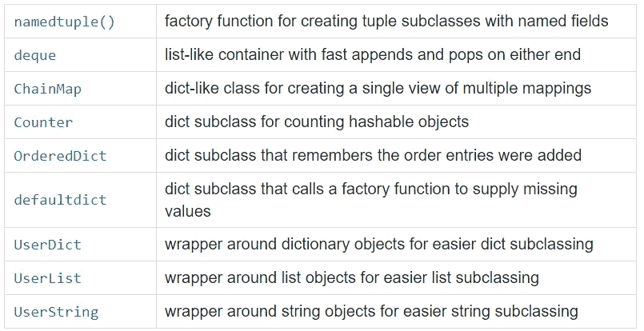

# 您可能还不知道的 11 个最有用的内置 Python 模块

> 原文：<https://levelup.gitconnected.com/11-most-useful-built-in-python-modules-you-might-not-know-yet-eff3e0e6f586>

## 大蟒

## 你不必从头开始写代码。

由 [Karolina Grabowska](https://www.pexels.com/fr-fr/@karolina-grabowska?utm_content=attributionCopyText&utm_medium=referral&utm_source=pexels) 在[像素上拍摄的照片](https://www.pexels.com/fr-fr/photo/mur-maison-table-empiler-4498124/?utm_content=attributionCopyText&utm_medium=referral&utm_source=pexels)

当我们开始一个项目时，我们经常需要一些库和模块的帮助来克服一些问题和加速工作流。

幸运的是，Python 有大量有用的内置模块，以及针对不同用例的第三方库和模块。在本文中，我们将只查看和研究一些有趣的内置模块，它们对您的项目非常有益。

# 1.[关于](https://docs.python.org/3.7/library/re.html?highlight=re#module-re) —正则表达式运算

几乎所有语言都使用正则表达式。这是一个非常强大的工具，**允许您检查变量**的内容是否具有您期望的形式。

> 正则表达式是构成搜索模式的一系列字符。

我们使用有意义的符号:

**注意**:可以用下面的语法强加出现次数:

## 搜索表达式

`findall()`函数返回一个包含所有匹配的列表。

如果匹配，函数返回一个匹配对象，否则返回 None。

## 替换表达式

为了替换一个表达式，我们使用了`sub()`方法。

**例子**:提取邮件的正则表达式。

# 2.[集合](https://docs.python.org/fr/3/library/collections.html) —容器数据类型

该模块提供了专门的容器数据类型，作为一般用途的基本容器类型的替代，如`dict`、`list`、`set`和`tuple`。`collections`模块为那些内置的集合提供了额外的功能。如果我们从`collections`中取出`Counter`，它是一个用于计算可散列对象的 dict 子类，或者说`deque`看起来更像一个 Python 列表。但是我们可以从两边推动和弹出物品。

使用`collections.Counter`的例子:

我们在模块集合中还有其他数据集合。以下是其中的一些:

来源:[模块集合文档](https://docs.python.org/3/library/collections.html#module-collections)

# 3.[时间](https://docs.python.org/3/library/time.html) —时间访问和转换

Python `time`模块提供了各种与时间相关的函数。默认情况下，python 中的时间是表示秒的数字。例如，这允许等待一定的秒数，以特定的格式显示日期，或者知道从**纪元 Unix** 以来经过的秒数，这是一个参考日期(1970 年 1 月 1 日 00:00) …不一定有用，但却是可能的。

## 自 Unix 纪元以来经过的时间戳。

## 当地日期和时间

## 测量经过的时间。

我们在下面测量 while 循环的执行时间。(这是一个例子，我们可以测量任何函数的执行时间)。我们实际上使用时间模块来检查下一个模块(多处理)的执行时间差。

或者我们可以使用`time.pref_couter()`功能

# 4.[多重处理](https://docs.python.org/fr/3/library/multiprocessing.html) —同时运行多个功能

多重处理允许我们同时运行多种功能。

> 同步编程和异步编程有什么区别？

**同步**编程，基本上只是意味着一个程序**按照指令**的顺序运行，通常 python 会这样做，如果你给它几条指令，它会连续运行指令**。不像， **a-synchronously** 功能，这意味着你将能够同时**运行多个功能**。**

**当我们在一个**同步**方法中运行函数时，当我们作为一个**同步方法**运行时，**应该比**花费更长的时间 **。为了证明这一点，我们将使用`time`模块来计算函数执行需要多长时间。****

**现在，既然我们了解了什么是多重处理，让我们看看我们将如何使用多重处理来实际了解如何同时运行两个功能。**

# **5. [Tkinter](https://docs.python.org/fr/3/library/tkinter.html) — GUI 应用程序**

**Tkinter 是一个用于开发 GUI(图形用户界面)应用程序的集成模块。对于初学者来说很方便。我们可以开发 GUI 应用程序，如计算器、登录系统、文本编辑器等。，有很多学习用 Tkinter 开发 GUI 的资源。**

**最好的支持就是跟随官方[文档](https://docs.python.org/3/library/tk.html)。要开始使用 Tkinter，请访问[文档](https://docs.python.org/3/library/tk.html)，开始创建漂亮的 GUI 应用程序。**

****

**输出结果**

# **6. [http](https://docs.python.org/fr/3/library/http.html) —超文本传输协议**

**在某些情况下，在您的应用程序中实现一个 **web 服务器**可能会很有趣。这允许通过浏览器在你的程序之间进行通信。**

**这个包收集了几个使用**超文本传输协议**的模块，例如 [http.client](https://docs.python.org/3.7/library/http.client.html#module-http.client) (低级 http 协议客户端)、 [http.server](https://docs.python.org/3.7/library/http.server.html#module-http.server) (包括基于 [socketserver](https://docs.python.org/3.7/library/socketserver.html#module-socketserver) )、 [http.cookiess](https://docs.python.org/3.7/library/http.cookies.html#module-http.cookies) 和 [http.cookiejar](https://docs.python.org/3.7/library/http.cookiejar.html#module-http.cookiejar) (提供 cookie 的持久性)的基本 HTTP 服务器类。**

**创建 web 客户端的示例:**

**在 Python 中，创建 web 服务器只需几行代码:**

# **7. [hashlib](https://docs.python.org/3/library/hashlib.html) —安全散列和消息摘要**

**该模块实现了一个**通用接口，用于众多安全哈希和消息摘要算法**，如 FIPS 安全哈希算法 SHA1、SHA224 等，以及 RSA 的 MD5 算法。**

# **8. [json](https://docs.python.org/3.7/library/json.html) — JSON 编码器和解码器**

**JSON 是一种开放的标准文件格式和数据交换格式，它使用人类可读的文本来存储和传输由属性值对和数组(或其他可序列化的值)组成的数据对象。**

**它是一种非常常见的数据格式，有各种各样的应用程序，例如与服务器通信的 web 应用程序。**

**JSON 模块**公开了一个 API** ，看起来类似于标准库[编组](https://docs.python.org/3.7/library/marshal.html#module-marshal)和[腌制](https://docs.python.org/3.7/library/pickle.html#module-pickle)模块**

# **9. [CSV](https://docs.python.org/3/library/csv.html) —管理 CSV 文件**

**我们可以使用 CSV(逗号分隔值)文件**来存储表格数据**。用于从**电子表格**和**数据库**导入和导出数据的**最常用格式**。Python 附带了一个名为 CSV 的模块来处理 CSV 文件。该模块允许我们**加载或保存数据**到一个 CSV 文件。**

**假设我们有这样的数据:**

**将此数据加载到 python 脚本的代码示例:**

# **10.[复制](https://docs.python.org/3/library/copy.html) —浅层和深层复制操作**

**允许您复制数据结构:**

1.  ****浅抄** : `y = copy.copy(x)`:单级抄。如果我们修改 x 的值，y 的值不会被修改，但是如果我们修改 x 的一个对象的值，它们将在 y 中被修改。**
2.  ****深度复制** : `y = copy.deepcopy(x)`:递归复制。x 和 y 是完全独立的。**

# **11.[随机](https://docs.python.org/fr/3/library/random.html) —生成伪随机数**

**Python 有一个叫做`random`的模块，允许随机生成数据。通过使用不同的随机模块方式，我们可以随机生成任何东西。**

**为了生成一个随机的浮点数，我们可以使用函数`random()`。**

**让我们看一个简单的代码，从给定的范围生成随机整数。**

# **摘要**

***库是*包含其他程序使用的功能的文件(称为*模块*)的集合，它们使工作流程变得更简单，节省了我们很多时间。**

**Python 有很多第三方模块，尤其是在数据科学、机器学习等方面。我们很快会在另一篇文章中看到它们。**

# **资源:**

*   **[https://www.w3schools.com/python/python_regex.asp](https://www.w3schools.com/python/python_regex.asp)**
*   **[https://python . doctor/page-expressions-regulaires-regular-python](https://python.doctor/page-expressions-regulieres-regular-python)**
*   **https://en.wikipedia.org/wiki/JSON**