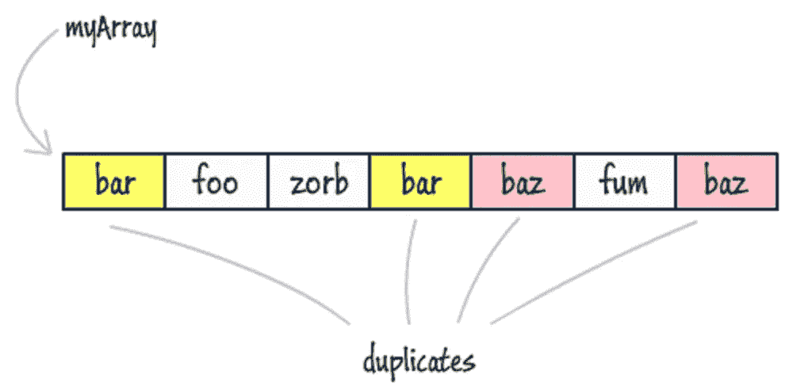
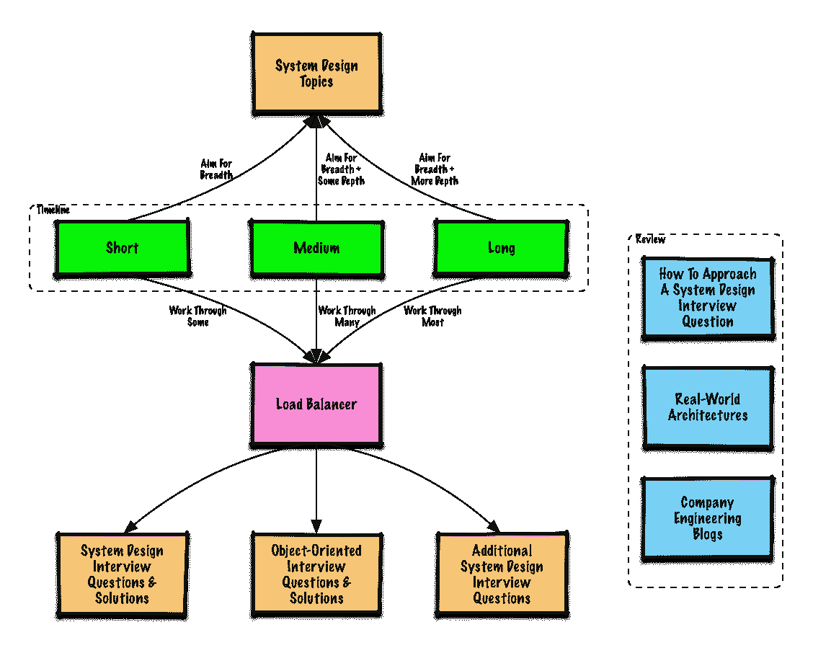
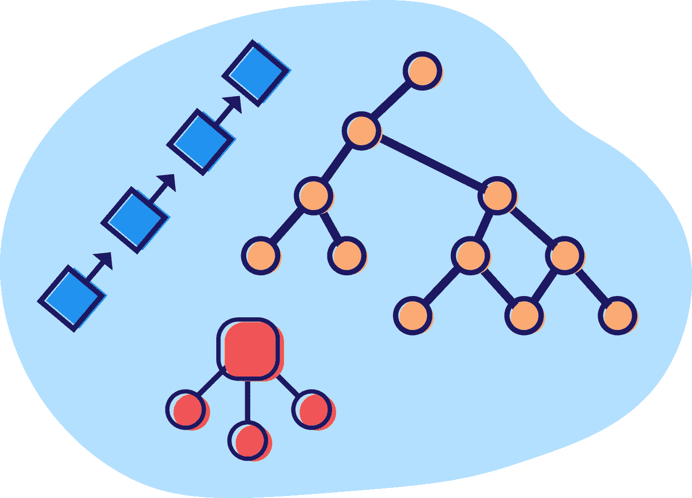

# 破解下一次编码面试的 11 个技巧

> 原文：<https://levelup.gitconnected.com/11-tips-for-cracking-your-next-coding-interview-4e8a1a6fb4>

乔纳森·博尔巴在 [Unsplash](https://unsplash.com?utm_source=medium&utm_medium=referral) 上的照片

大家好，作为 Java 博客的作者，我经常收到关于如何在技术面试中表现出色的问题？嗯，这是一个非常广泛的话题，因为不同的公司有不同的方法来进行技术面试，我将分享一些在传统的[编码面试](https://medium.com/javarevisited/10-data-structure-algorithms-and-programming-courses-to-crack-any-coding-interview-e1c50b30b927)中表现出色的技巧，在这些面试中，你需要面对面、在白板上或在电话中解决[编码问题](https://codeburst.io/100-coding-interview-questions-for-programmers-b1cf74885fb7)。这里重要的是一个人在面试你。

在不浪费你更多时间的情况下，这里是我 15 年编程生涯中来之不易的一些技巧，我曾作为候选人和面试者站在桌子两边:

## 1.尽可能多地练习编码问题

要想在[编码面试](https://medium.com/javarevisited/11-best-educative-courses-for-coding-interviews-and-software-development-339ad82fee50)中表现出色，没有比练习尽可能多的编码问题更好的方法了。这不仅会训练你的大脑识别问题中的算法模式，还会给你解决你从未见过的问题所急需的信心。

了解滑动窗口、两个指针、快慢指针、合并间隔、循环排序和 Top K 元素等有用的编码模式可以帮助您解决常见的编码问题。

如果你需要一些编码问题来练习，那么你可以看看这个 [**50+面试编码问题**](https://medium.com/hackernoon/50-data-structure-and-algorithms-interview-questions-for-programmers-b4b1ac61f5b0) 的列表。它包含了采访中常见的数据结构和算法问题。

## 2.致力于软件设计技能

技术面试中一些最棘手的问题是软件设计和系统设计。像[你如何设计下一个脸书](https://www.java67.com/2018/05/top-20-system-design-interview-questions-answers-programming.html)或者亚马逊这样的问题经常会让应聘者不知所措，因为他们不知道从哪里开始，从哪里结束。

他们不知道 [*如何设计系统*](https://javinpaul.medium.com/hello-guys-if-you-are-preparing-for-system-design-interview-or-just-want-to-improve-your-software-7bc0034ac015?source=explore---------0-2--------------------ded5ccea_c2d8_420d_8fb9_1640fcdec58f-------15) 以及系统的不同部分如何协同工作来完成共同的任务。这就是为什么你了解[软件设计](https://javarevisited.blogspot.com/2022/08/top-7-websites-to-learn-system-design.html)并理解你所做的每一个设计决策的利弊是非常非常重要的。

在现实世界中，这往往是一种取舍。例如，如果你需要速度，你需要花费更多的内存，类似地，**如果你想减少内存，你需要与速度妥协**。世界上没有完美的系统，但这些明智的权衡决定了系统的成败。

所以我强烈建议一些设计问题比如[设计一个 TinyURL 和 Instagram](https://medium.com/javarevisited/top-30-system-design-interview-questions-and-problems-for-programmers-417e89eadd67) 。如果你需要更多这样的问题进行练习，你也可以看看这个 [25 个面试用软件设计问题的列表](https://medium.com/javarevisited/25-software-design-interview-questions-to-crack-any-programming-and-technical-interviews-4b8237942db0)。

## 3.学习所有基本数据结构和算法

我的第三个建议是学习尽可能多的数据结构和算法。这是前一个技巧的延伸，但它也包括阅读，而不仅仅是练习。

你应该知道所有基本的数据结构，比如数组[、](https://medium.com/javarevisited/20-array-coding-problems-and-questions-from-programming-interviews-869b475b9121)、[链表](https://medium.com/javarevisited/top-20-linked-list-coding-problems-from-technical-interviews-90b64d2df093)、[字符串](https://medium.com/javarevisited/top-21-string-programming-interview-questions-for-beginners-and-experienced-developers-56037048de45)、哈希表、二叉树等等。例如，如果你知道哈希表，你也可以很容易地解决数组和计数器的问题。树和图也是如此。

> 选择正确的数据结构是软件开发和编码面试中非常重要的一部分，除非你了解它们，否则你无法选择。

如果你需要资源，我分享了一些有用的[书](https://medium.com/javarevisited/10-best-books-for-data-structure-and-algorithms-for-beginners-in-java-c-c-and-python-5e3d9b478eb1) s 和[免费在线课程](https://medium.com/free-code-camp/these-are-the-best-free-courses-to-learn-data-structures-and-algorithms-in-depth-4d52f0d6b35a)学习数据结构算法，你可以在方便的时候查阅一下。

## 4.给自己计时

在时限内快速解决面试问题的候选人更有可能在面试中表现出色，所以你也应该给自己计时。

## 5.边缘案例和测试

始终考虑边缘情况，并通过它们运行您的代码。一些好的边缘情况可能是空输入、一些奇怪的输入或一些非常大的输入，以测试边界条件和限制。

## 6.向朋友或同事解释

解决问题后，尝试向朋友或同事解释 how 也对编码问题感兴趣。这会告诉你你是否真正理解了这个问题。

> ***如果你能简单地解释，就意味着你理解了*** 。

此外，讨论让你的大脑工作，你可以想出一个替代的解决方案，并能够找到你现有算法中的一些缺陷。

## 7.接受编码面试，但不要错过最好的机会

在[编码面试](https://javarevisited.blogspot.com/2018/02/10-courses-to-prepare-for-programming-job-interviews.html)中脱颖而出的另一个有用的技巧是**出现在编码面试中，而且很多次。**

你会发现自己在每次面试后都变得更好，这也有助于你获得多个报价，进一步让你更好地谈判，并获得额外的 3 万到 5 万英镑，如果你手头只有一个报价，你通常会把它们放在桌子上。

## 诚实

不知道答案？承认吧。是的，说服面试官并试图回答是没有意义的，因为这为你的弱点打开了大门，最好承认它，然后继续前进。

## 9.从简单的解决方案开始

你被困在一个[算法](https://medium.com/javarevisited/top-10-free-data-structure-and-algorithms-courses-for-beginners-best-of-lot-ad807cc55f7a)或者编码问题上，那么最好的解决方法就是使用强力算法，然后优化它。尽管了解一些编码模式很有帮助

## 10.提问

你应该总是问澄清性的问题，因为没有问题是愚蠢的问题，当你问问题时，你的大脑就会工作，否则你不会更好地理解问题。

提问也表明你有信心和沟通技巧来问正确的问题，并向面试官展示你的人际交往能力。由于你经常需要在团队中工作，这些人际交往技能发挥着重要作用。

## 11.大声说出你的想法

当你在解决一个编码问题时，你应该说出你的想法，让面试官知道你的思考过程。不要让沉默悄悄进来，你应该让面试官参与进来。

他是来帮助你的。

此外，谈论你的想法会给你的大脑提供指示，我已经看到了这种结果，即更好的思考过程、尽职调查，以及最终更好的解决方案。

## 12.不要气馁

我的最后一个建议是，如果你没有通过审查，不要气馁。我们都会在技术面试中失败，很少有人在一次面试中就获得了这份工作。这是一项必须练习的技能。坚持练习，思考你本可以做得更好的地方。

> 祝你下次编码面试一切顺利。

 [## 编写面试问题

### 一个完整的平台，在这里我会教你找到下一份工作所需的一切，以及…

技术开发](https://skilled.dev)