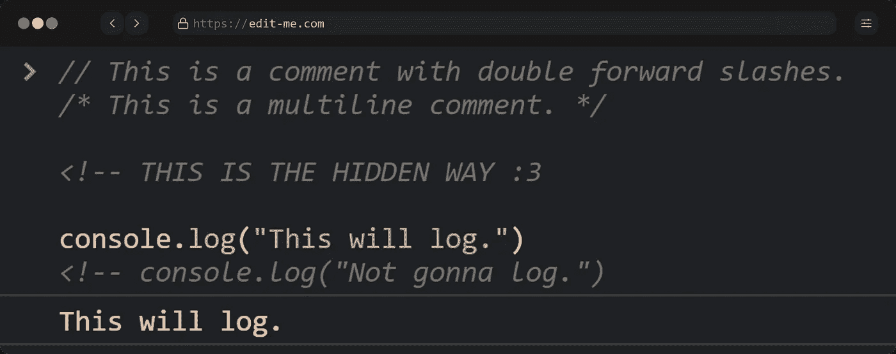
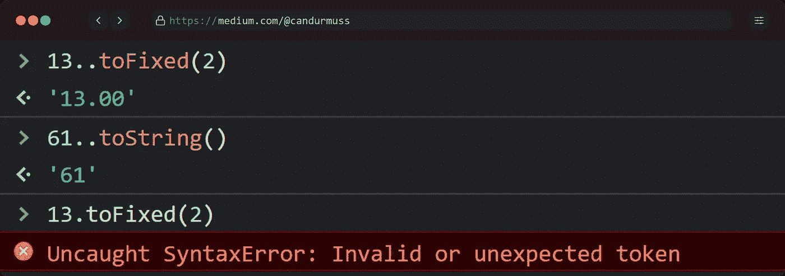
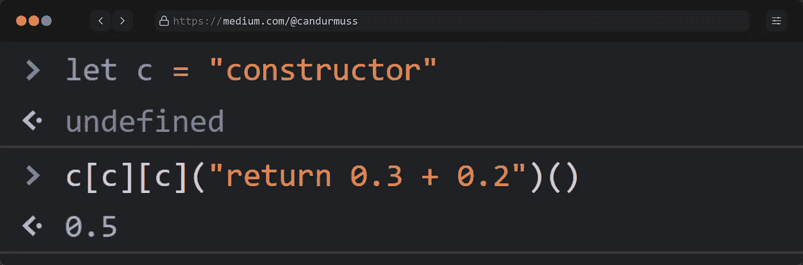
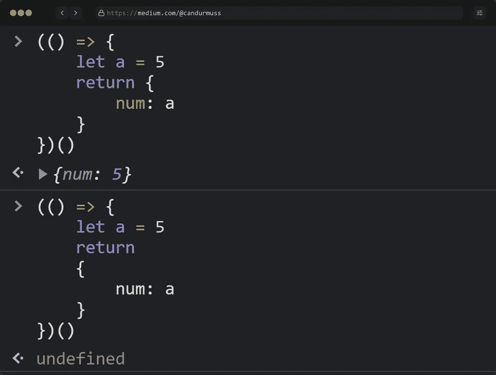
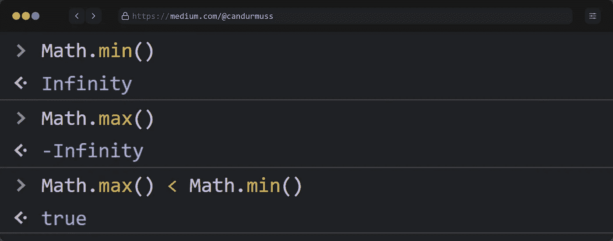
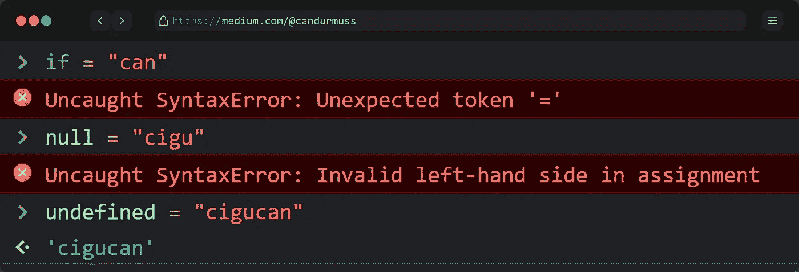
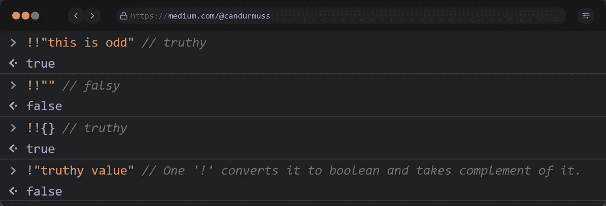
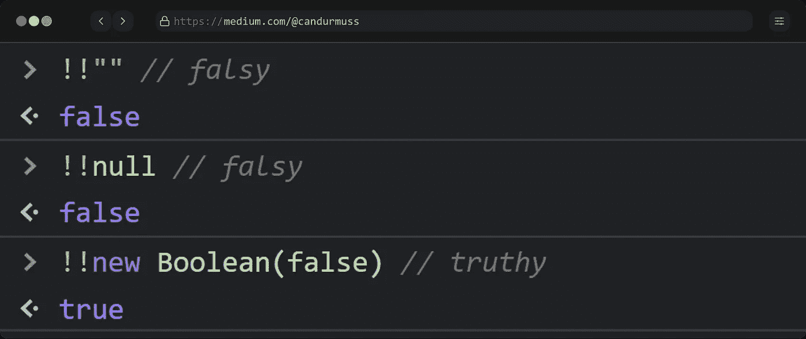
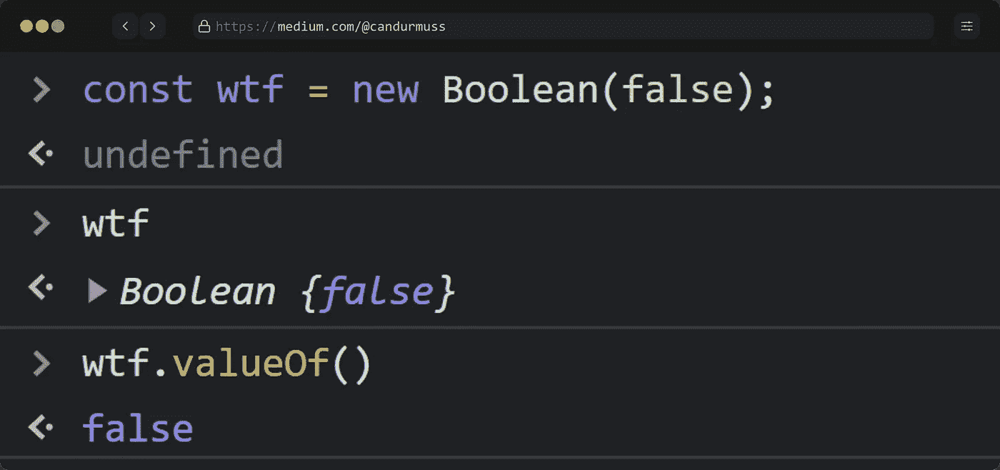
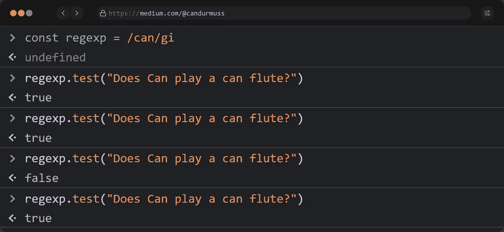

# JavaScript 中让你震惊的 11 个未提及的 WTF 时刻

> 原文：<https://levelup.gitconnected.com/11-unmentioned-wtf-moments-in-javascript-that-will-shock-you-9b654577dce3>

## Web 开发技巧

## 是的… JS 是个怪人，很不幸。


截图，[海绵宝宝:方块裤](https://en.wikipedia.org/wiki/SpongeBob_SquarePants)

JavaScript 是一种被广泛采用的多范例编程语言，由 Brendan Eich 于 1995 年末创建。由于它拥有活跃的社区和丰富的库，你基本上可以用它来创建任何东西。

然而，成为最流行的语言并不意味着它是最一致和稳定的语言。甚至，JavaScript 因为一些怪异的行为被称为*编程界的醉鬼*。毕竟，用固体力学在 [10 天](https://thenewstack.io/brendan-eich-on-creating-javascript-in-10-days-and-what-hed-do-differently-today/)内创造一门编程语言几乎是不可能的。

所以，这里是我在 JavaScript 中发现的 11 个未提及的 *WTF 时刻*。

# 1.新的注释样式(

Most of the symbols, operators, and methods in JavaScript are well-documented and used daily by developers. However, there still are a few of them that is not known even by senior developers. Here’s one: JavaScript has a hidden way to create single-line comments other than 【 .



HTML comments are valid in JavaScript.

Yes, it is pretty surprising but 【 creates a single-line comment in JavaScript. This is a legacy rule coming from the times when developers were writing JavaScript codes directly into HTML, using 【 tags. Since the JavaScript code is in an HTML file, the HTML comment rule must be valid in the 【 tags, as well. That’s why you can use 【 to create comments in JavaScript.

# 2\. Double Dot Operator?

With ES6 (2015), we met with a magical operator: [*三点*](https://developer.mozilla.org/en-US/docs/Web/JavaScript/Reference/Operators/Spread_syntax) )。但是，你知道自从 JS 创建以来，就有一个隐藏的双点运算符吗？



对 number 方法使用单个点会引发语法错误。

而调用整数的方法如`toString()`会抛出语法错误。但是为什么呢？给你个提示。数字在小数点后可以有小数部分。至少当你用一个点来调用方法时，JS 引擎是这么认为的。点之后的部分被解释为小数部分，因为`toString`不是一个数字，我们得到一个错误。为了防止这种行为，您在整数后添加一个点，并使其成为`61.0`，这样您就可以在小数部分后调用该方法。

```
61..toString() => 61.0.toString()
```

# 3.花括号失控了

花括号是 JavaScript 不可或缺的一部分。它们可用于许多目的，如对象创建、函数定义、`if`语句等。它们无处不在，乐趣来了。

`{}{}`未定义，`({}{})`是语法错误。然而，具有讽刺意味的是，当你创建一个非空对象时，它将返回最后一个键的最后一个值。

如果你稍微思考一下，你可以很容易地解释这个。花括号用于 JavaScript 中的两个主要结构:块或对象。例如，if 语句、函数表达式和声明、switch-case 语句中的花括号代表一个代码块。然而，要用花括号创建一个对象，你必须把它赋给一个变量，从一个函数返回它，或者把它作为一个参数传递。

# 4.这个数组的长度是多少？

```
let thisArrray = [, , , ,]
```

是的，长度是多少？我听到你喊 5 是因为逗号之间有间隔。但是看这个:


这个数组的长度是 4，不是 5。

这确实是 JavaScript 有意为之的行为。如果后面没有任何东西，它就忽略最后一个逗号。以便您可以复制和粘贴行，而不会得到不希望的结果。

```
let longArray = [
                 "cigu",
                 "cigu",
                 "cigu",
                 "cigu",
                 "cigu",
                 "cigu",
                 "cigu", // this last comma is ignored
                 ]
```

# 5.还有一种创建函数的方法

就函数定义而言，JavaScript 中有大量的函数定义。你可以使用匿名函数表达式，箭头函数，函数声明…然而，正如你所猜测的，还有一个怪异的，有资格在这个故事中发生: **c** 。



您可以通过访问元素的构造函数来创建函数。

JavaScript 将所有东西都视为对象。我是认真的，从函数到字符串，一切都是对象。这就是为什么他们有构造函数。在上面的控制台打印中，我们在变量`c`中存储了一个`"constructor"`字符串。使用括号，我们得到了对象(字符串)的`"constructor"`键。对于另一个，我们可以访问构造函数的构造函数，这是一个我们可以覆盖的函数。在最后一个括号中，函数被调用，我们在控制台中看到结果。

# 6.这是永恒问题的答案

大括号的位置多年来在程序员中一直有争议。它们应该在下一行还是必须从关键字行开始？如果你是一个在乎的人，你会说“谁在乎？”。然而，这很重要。



如果你想返回一个对象，大括号不能在下一行。

如果你想从一个函数返回任何东西，你必须在`return`之后立即开始，因为在`return`之后的东西会被忽略。在上面的例子中，第二个[life](https://developer.mozilla.org/en-US/docs/Glossary/IIFE)将花括号视为一个块而不是一个对象，因为它没有连接到 return 语句。所以，争议到此结束。

# 7.无穷大是我拥有的最小值

如果你是一名 6 个月以上的 JavaScript 开发人员，我敢肯定你已经听说过`Math.max`和`Math.min`的奇怪行为。它们返回的结果与它们的名字所描述的完全相反。



出乎意料的是，这些方法返回相反的结果。

但是，当你稍微想一想，确实有道理。这些是比较数字的功能，与`Math.NEGATIVE_INFINITY`和`Math.INFINITY`不同。因此，它有一个不影响结果的默认参数。对于`min`，它是*无穷大*因为你放在无穷大旁边的东西会比无穷大小，对于`max`，它是*-无穷大*。

```
Math.min(3, 8, 99) // the minimum of the set [3, 8, 99, ***Infinity***]
Math.max(85, 1, 2) // the maximum of the set [85, 1, 2, **-*Infinity***]
```

因此，当你不带参数调用这些函数时，它们将简单地返回缺省的且唯一的参数。

# 8.未定义，但是是吗？

保留字使编程语言具有功能性。它们可以是一些影响程序流程的常量或语句，如`if`或`null`。然而，这里有一个令人困惑的问题:你可以定义`undefined`。



令人惊讶的是，**未定义的**并不是 JavaScript 中的保留字。

是的，如果你试图给`undefined`赋值什么，JavaScript 都不会冲你吼。这是因为与`if`或`null`不同，`undefined`不是保留关键字。这里有一个[保留的](https://developer.mozilla.org/en-US/docs/Web/JavaScript/Reference/Lexical_grammar#keywords)关键字列表，这样你可以检查一下。

# 9.一个未知的操作符(！！)

要将一个值转换成布尔值，你可以使用`Boolean()`或者可以使用`[!!](https://stackoverflow.com/questions/784929/what-is-the-not-not-operator-in-javascript)` [运算符](https://stackoverflow.com/questions/784929/what-is-the-not-not-operator-in-javascript)。但是你知道吗,`!!`不是官方运营商，而是两个*不是*运营商粘在一起的。



要将一个值转换为布尔值，可以使用“！!'。

如你所见，`!!`将后面的内容转换成它的布尔等价形式[。第一个`!`将值转换为布尔值，并接受补码。之后，为了得到初始值，我们必须用一个`!`再补一次。](https://dev.to/osumgbachiamaka/javascript-truthy-and-falsy-values-3hm0)

# 10.假即是真

还有一堆 falsy 值比如`“”, 0, null, undefined, NaN`。当您将它们包含在布尔运算中时，它们将被视为`false`。然而，这个 *WTF 时刻*的明星是真实的`false`是真实的。你不相信我吗？看看这个控制台打印。



**new Boolean(false)** 是 truthy，因为 new 关键字 front。

正如您在上一篇技巧文章中所知道的，`!!`将值转换成它们对应的布尔型。但是为什么`new Boolean(false)`是真实的呢？

在 JavaSript 中，`new`关键字用于创建一个类的实例，它是一个对象。所以，你用`new Boolean`创建的是一个包含布尔值的对象，而不是一个真正的布尔值，默认情况下，对象是真的。



要访问布尔值，可以对 Boolean 对象使用“valueOf”方法。

# 11.函数式编程正在打破…

函数方法是关于函数的输入和你得到的输出，这是这个范例不可改变的事实:

> 在纯函数中，相同的输入应该产生相同的输出。(λ)

然而，由于它在一个 *WTF 时刻*列表中，我发现了一个奇怪的现象。当您使用相同的输入多次运行 RegExp `test`函数时，它会给出不一致的结果。



当用相同的参数调用一个函数时，它必须给出相同的结果，不像这个。

从表面上看，这看起来不一致，因为我们用相同的参数运行函数。然而，当我们在具有全局标志(g)的 RegExp 上运行`test`时，我们[不知不觉地更新了](https://developer.mozilla.org/en-US/docs/Web/JavaScript/Reference/Global_Objects/RegExp/test#Using_test()_on_a_regex_with_the_global_flag)的`lastIndex`。因此，测试在第一次匹配后开始，直到结束并返回`false`。为了防止这种行为，你必须在每次调用测试时重置`lastIndex`。

```
regexp.lastIndex = 0
```

# 结论

就是这样，各位！现在你知道了 JavaScript 中的 11 个 WTF 时刻。我试着挑选那些不太受欢迎和知名的，这样你可以学到新的东西。

[](https://mailchi.mp/a45f8fb96cc9/subscribe)

订阅获得你的**免费*订户专属*故事。**

感谢您的阅读。如果你喜欢它，一定要鼓掌，如果你对这篇文章有什么要说的，请留下回应。下一个故事再见。

喜欢看这样的故事，想支持我当作家？考虑[报名成为中等会员](https://candurmuss.medium.com/membership)。每月 5 美元，你可以无限制地阅读媒体上的故事。如果你用我的链接注册，我会赚一点佣金。

[](https://candurmuss.medium.com/membership) [## 通过我的推荐链接加入 Medium—Can dur mus

### 作为一个媒体会员，你的会员费的一部分会给你阅读的作家，你可以完全接触到每一个故事…

candurmuss.medium.com](https://candurmuss.medium.com/membership) 

## 进一步阅读

[](/another-attempt-to-overthrow-vs-code-jetbrains-fleet-6d96bd835b89) [## 推翻 VS 代码的又一次尝试:JetBrains Fleet

### VS Code 的市场份额正以闪电般的速度增长。JetBrains 能够阻止它并主导市场吗？

levelup.gitconnected.com](/another-attempt-to-overthrow-vs-code-jetbrains-fleet-6d96bd835b89) [](https://betterprogramming.pub/3-marvelous-javascript-tips-to-speed-up-the-development-process-ba1bb8e3fb7a) [## 加速开发过程的 3 个奇妙的 JavaScript 技巧

### 下面是我最喜欢的节省时间的 JavaScript 技巧

better 编程. pub](https://betterprogramming.pub/3-marvelous-javascript-tips-to-speed-up-the-development-process-ba1bb8e3fb7a) [](https://betterprogramming.pub/11-rare-javascript-one-liners-that-will-amaze-you-331659832301) [## 11 个罕见的 JavaScript 一行程序会让你大吃一惊

### 因为谁不喜欢只用一条线来建造东西呢

better 编程. pub](https://betterprogramming.pub/11-rare-javascript-one-liners-that-will-amaze-you-331659832301)