# 12 个最佳 CSS 动画库😍

> 原文：<https://levelup.gitconnected.com/12-best-css-animation-libraries-7d1b0848dfca>

无论你在寻找什么，无论是干净简单还是有趣古怪，你一定会在这些 CSS 动画库中找到适合你的库。下面是**最好的 12 个 CSS 动画库！**

那么，我们就不多说了，开始吧！

**1。**[**CSS**动画](https://animate.style/)

Animate css 是一个随时可用的跨浏览器动画库，可用于您的 web 项目。非常适合强调、主页、滑块和引导注意力的提示。

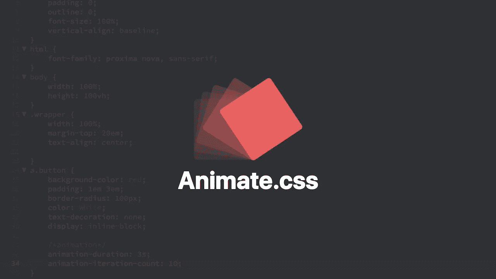

**2。** [**魔法效果**](https://www.minimamente.com/project/magic/)

魔术 CSS 是一组简单的动画，包括在您的 web 或应用程序项目中。

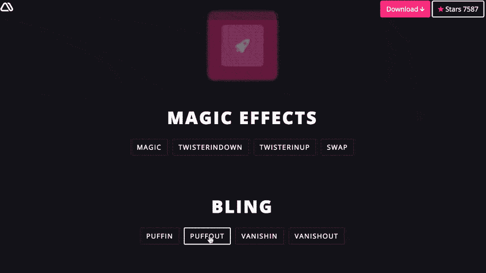

**3。**[**Animista**](https://animista.net/)

Animista 是一个 CSS 动画库，你可以在这里玩现成的 CSS 动画，并且只下载那些你会用到的。

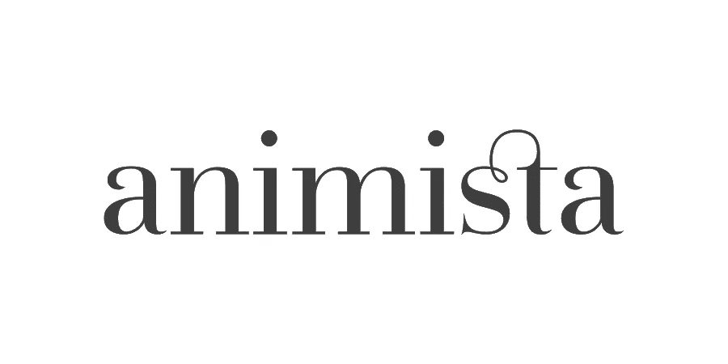

**4。** [**动画库**](http://animation.kaustubhmenon.com/)

这是一个纯 CSS 动画的集合。您可以覆盖对象的动画类名，使其具有动画效果。您可以更改与元素相关联的类名来激活其转换。

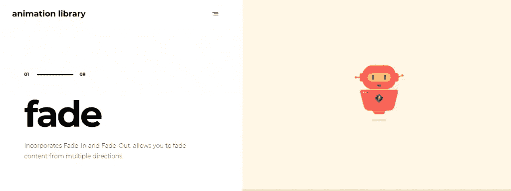

**5。** [**汉堡**](http://jonsuh.com/hamburgers)

汉堡包是一个 CSS 汉堡包动画的 10+例子的集合，非常适合移动设备的导航。

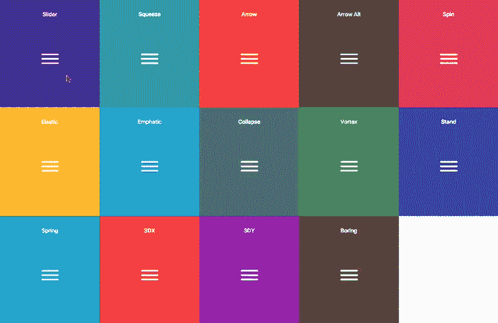

**6。** [**旋转**](http://whirl.netlify.app)

Whirl 是 CSS 加载动画的一个策展。它减轻了开发者的痛苦，因为它已经有 106 个或更多的旋转。

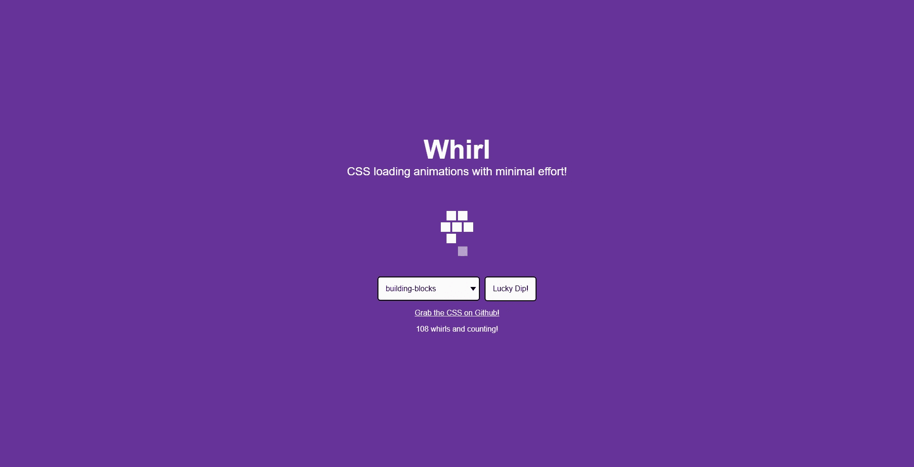

**7。** [**缺德 CSS**](https://kristofferandreasen.github.io/wickedCSS/)

对于那些希望用一些可爱的动画效果来增加网站趣味的人来说。在网站上找到您需要的所有内容，并下载 CSS 文件。然后，您就可以开始用简单的类向内容添加动画了。

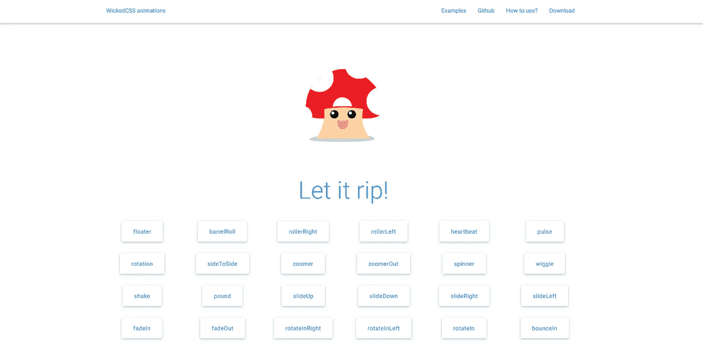

**8。** [**三个圆点**](https://nzbin.github.io/three-dots/)

三点是一组 CSS 加载动画，只用一个元素制作。我认为该项目不仅可以提高你的 CSS 技能，还可以提高你的想象力。

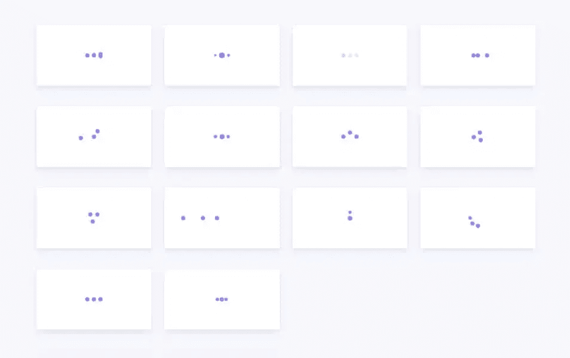

**9。** [**CSShake**](https://elrumordelaluz.github.io/csshake/)

一些 CSS 类来移动你的 DOM！易于使用的类，将添加不同种类的动摇到你的网站的每个部分。

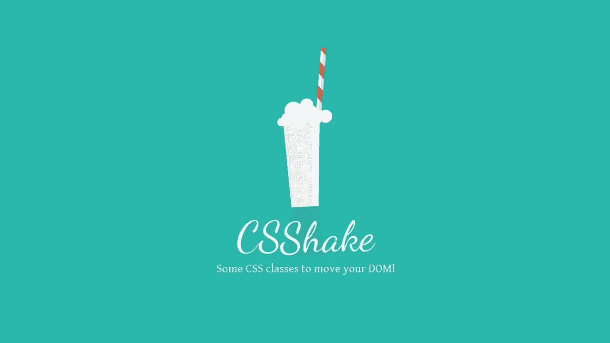

10。 [**VOV CSS**](https://vaibhav111tandon.github.io/vov.css/)

这个 CSS 库中包含了几个功能，包括淡入淡出、缩放、滚轮、摇动、旋转、模糊、滚动和滑动。

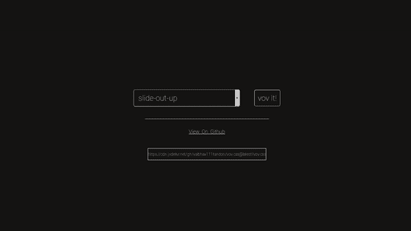

**11。** [**模仿 CSS**](https://erictreacy.github.io/mimic.css/)

与框架不同，Mimic CSS 是内联 CSS..这个 CSS 框架非常好用。

**12。**

**只需加水的 CSS 动画片段。它包括弹跳、闪光、脉冲、橡皮筋、摇动、摇摆、tada、摇摆、果冻、心跳、弹跳等等。**

**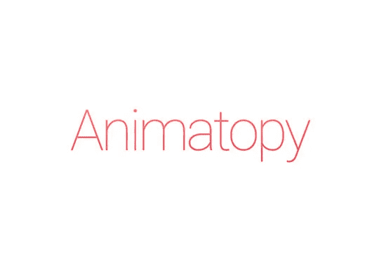**

****结论****

**感谢阅读，如果你喜欢这篇文章，请分享🤞💜**

**查看我的[Twitter](https://twitter.com/souptikdn)&[LinkedIn](https://www.linkedin.com/in/souptikdn/)更多精彩内容。**

**立即创建您的 [Fueler](https://fueler.io/register) 个人资料！**

****

> **免费 [600+免费设计资源](http://Free 600+ Free design resources.)**

# **分级编码**

**感谢您成为我们社区的一员！在你离开之前:**

*   **👏为故事鼓掌，跟着作者走👉**
*   **📰查看[升级编码出版物](https://levelup.gitconnected.com/?utm_source=pub&utm_medium=post)中的更多内容**
*   **🔔关注我们:[Twitter](https://twitter.com/gitconnected)|[LinkedIn](https://www.linkedin.com/company/gitconnected)|[时事通讯](https://newsletter.levelup.dev)**
*   **🚀👉 [**软件工程师的顶级工作**](https://jobs.levelup.dev/jobs?utm_source=pub&utm_medium=post)**