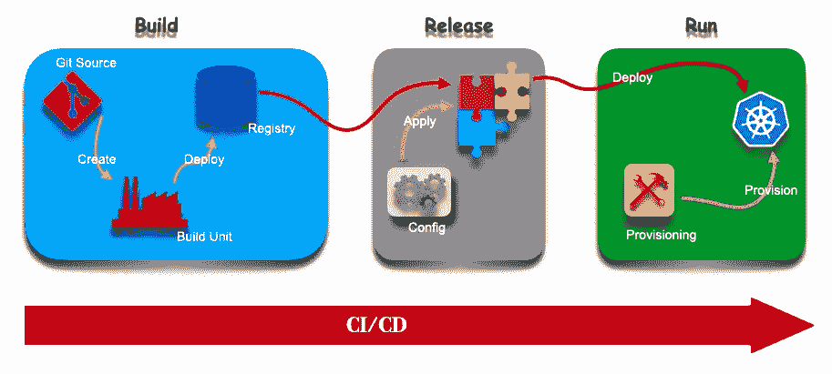

# 12 个因素和云原生微服务

> 原文：<https://levelup.gitconnected.com/12-factors-and-cloud-native-microservices-f3208a03295c>

## 从 12 个因素的角度看云原生服务🔎


作为 Kubernetes 容器的云原生微服务需要考虑的 12 个因素

我们处在一个 [*一切即服务*](https://simple.wikipedia.org/wiki/Everything_as_a_service) ( *EaaS* )的世界，这在现在变得越来越普遍。当软件作为服务提供时，它意味着一些特性，即安全性、可伸缩性、可靠性和性能必须是隐含的。

为了满足这一需求，开发了云原生应用。云原生应用最好定义为具有一系列区别于传统应用的特征的应用。云原生应用是架构性质的微服务。它们符合 *12 因子应用*的原则。用 12 因素原则*开发的应用可以在任何 PaaS* 基础设施中运行。所有服务对服务的通信都通过*API*进行。这些应用可以按需扩展。


12 因素网站横幅；资料来源:12factor.net

在本文中，我们将看到如何在设计和开发一个现代的云原生应用程序时应用一组 [***十二要素***](https://12factor.net/)*。*

# **一、代码库**

> *在修订控制中跟踪一个代码库，部署多个。*

*12 因子 app 主张，在 git 这样的版本控制系统中，每个应用或服务都应该有自己的代码库。即使是在为移动、Windows、Linux、Mac 或任何其他平台等跨平台构建时，也不应该为同一个应用程序或服务创建多个代码库。在多个环境中部署应用程序或服务时，也必须遵循这一原则。、开发、试运行、生产等。*

*当需要为多个应用程序共享相同的代码库时，那么共享的代码应该被建模为一个库，并且这个库应该有自己的存储库。这确保了代码库和应用程序或服务之间存在一一对应的关系。*

*应该创建多个分支来处理版本控制系统中应用程序或服务的各种功能、修复和增强。将代码库存储在版本控制系统中为解决合并冲突铺平了道路，并且能够将代码回滚到以前的历史版本。这是一个团队可以计划进行持续集成(CI)和持续部署(CD)的地方。*

**

*多个 git 分支和一个存储库，带有到多个环境的 CI/CD*

# *二。属国*

> *显式声明并隔离依赖关系。*

*这是与 12 因素应用程序相关的两个注意事项。声明依赖关系并隔离它们。*

*通过这样做，可以消除一个主要问题，即，*它在我的机器上工作*场景。添加到依赖项的显式声明中，添加依赖项版本锁定文件(如果适用于`go.sum`、`package-lock.json`、`yarn.lock`等语言)。，将确保在任何地方构建应用程序时都使用相同版本的依赖项。这也将确保所有环境同步，并重现相同的行为。*

*由于 12 因素应用程序建议是每个应用程序一个代码库，因此“团队”有责任确保没有人会在没有测试的情况下将任何升级版本的依赖项意外合并到主分支。*

*在隔离部分，依赖关系应该总是从语言对应的注册表中提取。这些不能打包成应用程序的一部分。12 因素应用程序也将操作系统实用程序的使用视为依赖因素。例如，如果需要使用`sleep, wget,` 等。，也被视为依赖项。即使这些功能可能存在于操作系统中，应用程序开发人员也必须确保所有功能都可供应用程序使用。*

*对于容器化的环境，Dockerfile 也用于添加 os 级依赖项。*

**

*package-lock.json 和 go.sum 文件的屏幕截图*

# *三。配置*

> *将配置存储在环境变量中。*

*所有现代的应用程序都需要一些配置。这些必须总是与功能代码分开。任何因环境而异的东西，比如开发、测试和生产，都被认为是配置。配置和代码应该严格分开，因为它们通常是服务帐户凭证、后端数据库的资源句柄或应用程序运行时属性。不管应用程序部署在哪里，代码都应该保持不变，但是这些配置可以不同。*

*此外，将配置与代码隔离开来简化了更新配置值的过程。这也有助于消除在某些配置值发生变化时重新部署应用程序的需要。*

*在 *Kubernetes* 范例中，我们有各种选项将配置从代码中分离出来。可以使用`configMap`，它以纯文本格式保存键-值对。配置图示例如下所示。*

*在上面的配置图示例中，我们有三组不同的属性，即。、`app_mode`、`game.properties`和`ui.properties`。这可以用作环境变量或容器内的文件，并使代码引用这些变量。*

*对于环境变量，容器的规范将包括下面的代码片段*

*在 pod 部署中使用上述 env 配置，容器中的 env 变量`APP_MODE`将等于配置图中变量`app_mode`的值，如下所示。*

**

*注入容器的配置值*

*环境变量可能适合所有的用例。如果从容器中访问作为文件的 *configMap* 数据，您可以在部署中将其作为数据卷挂载，如下所示。*

*使用上面的代码片段，配置映射中的所有键都将被称为容器中的一个文件，如下所示。*

**

*作为文件装载到容器的 configMap 值*

*这些不是访问配置的唯一方式。您也可以通过一种更加云本地的方式来访问这些配置。例如，如果您想通过 *GoLang* 微服务访问存储在 Kubernetes configMap 中的配置，您可以包含这个 [k8s-discovery](https://pkg.go.dev/github.com/gkarthiks/k8s-discovery) 模块并传递 configMap。更多细节可以在[这里](https://medium.com/swlh/clientset-module-for-in-cluster-and-out-cluster-3f0d80af79ed)找到。这样，如果 configMap 中的值发生了任何变化，我们就不需要等待这些变化反映到容器中，因为该模块会查询 Kubernetes API 以获取每个引用。*

*这些是应用程序的配置，甚至可以以纯文本的形式存储在 git repo 中。但是，为了将一些敏感数据从功能代码中分离出来，Kubernetes 提供了一种方法来将其编码并存储为二进制数据。这些被称为*秘密*。这些秘密也可以像配置映射一样作为环境变量和文件挂载。例如，您有一个用户名和密码，如下所示。*

```
*username: admin
pasword: 1f2d1e2e67df*
```

*现在您想将它添加到微服务容器的环境变量中。为此，我们需要首先在 Kubernetes 中创建秘密。关于管理机密的方法，请参考 [k8s 文档。在 Kubernetes 中创建了秘密之后，K8s 资源 YAML 将如下所示。](https://kubernetes.io/docs/tasks/configmap-secret/managing-secret-using-kubectl/)*

*我们的用户名和密码用 base64 编码并存储在那里。要从中获取普通数据，请在终端中执行以下命令并进行验证。*

```
*echo "YWRtaW4=" | base64 -d
echo "MWYyZDFlMmU2N2Rm" | base64 -d*
```

*现在我们有了秘密，让我们把它注入吊舱并验证它。添加 secret 作为环境变量和卷，如下所示。*

*现在，如果您执行容器并查看，您可以看到文件和环境变量中的解码值，如下所示。*

**

*机密作为 env 值和文件被注入并装载到容器中*

*现在有一个问题。是的，我们不希望敏感信息这样暴露。任何有权访问容器的人都可以看到这些数据。因为这只是在注入到容器中时被编码和解码的。为了避免这种情况，存储敏感数据(如密码、证书、密钥等)的最佳方式是。就是使用容器外的安全保险库。许多这样的解决方案是可用的，例如 *Hashicorp 金库*、*赛博方舟魔法*、 *AWS 秘密管理器*、 *Azure Key 金库*等等。并且对这些服务的访问应该基于附加有 TTL 的令牌来提供。*

# *四。后勤服务*

> *将后台服务视为附属资源。*

*任何需要通过网络访问以实现应用程序功能的东西都被认为是后台服务。这些主要是数据库、秘密存储、消息队列、缓存服务等服务。确保将这些支持服务从核心功能代码中分离出来，并将它们视为附属服务，这将有助于提高可移植性。这也有助于将资源从一个服务提供商交换到另一个服务提供商，消除供应商锁定的情况。*

*应该从配置中获取这些支持服务或附加资源的连接句柄、URL 或凭据。任何附加到应用程序的独特服务都应该被视为单独的资源。*

**

*将数据库和消息服务附加为支持服务的应用程序；与应用程序隔离*

*在*微服务和 Kubernetes* 范例中，服务之外的任何东西都被视为附属资源。容器和 Kubernetes 还有一个重要的行为需要注意。当默认情况下部署容器时，流量从服务定向到容器。Kubernetes 作为一个编排者不知道这个容器本身的后台服务是什么。但是当被指示时，我们可以让 Kubernetes 在流量被路由之前等待容器的支持服务可用。*

*当接收到请求时，开发人员检查后备服务列表的责任对于容器来说是可用的和可访问的，以实现功能。为了实现这一点，Kubernetes 提供了*探针*来使用。*

> *Probe 描述了对容器执行的健康检查，以确定它是否处于活动状态或准备好接收流量。*

**探头*有三种，即*。、* `*startupProbe*` *、* `*livenessProbe*`和`*readinessProbe*` 下面解释。*

*   *`***startupProbe***`用于确定容器内的应用程序/功能是否启动并准备好进一步处理。其他探头被禁用，直到*启动探头成功*。如果失败，容器将根据定义的`restartPolicy`重新启动。*
*   *`***readinessProbe***` 用于确定容器是否用于确定它是否准备好服务任何请求。*
*   *`***livenessProbe***` 用于判断容器是否正在运行。如果失败，`*kubelet*`将根据`restartPolicy`重启容器。*

*应用程序应该有一个特殊的方法来验证端点或命令中所有支持服务的可用性和可访问性。因为这些可以在`readinessProbe`中用于确定容器是否准备好服务请求。*

*关于探测器的更多细节可以在 Kubernetes 网站上找到。*

# *动词 （verb 的缩写）构建、发布、运行*

> *严格分离构建和运行阶段。*

*每个应用程序或服务都应该有自己的构建、发布管道。因为所有服务都有自己的存储库，所以很容易为存储库建立专用管道。可以使用管道的通用模板。但不是为多平台构建的相同代码的专用管道。尽可能地利用`Makefile`在相同的代码库中实现多平台构建。*

*在我们的容器场景中，构建阶段将代码库转换成容器映像。在构建阶段，应该考虑所有的供应商依赖关系，并且必须将系统依赖关系融入到映像中。例如，在实现 gRPC 容器的健康检查时，建议在构建阶段将 [grpc-health-probe](https://github.com/grpc-ecosystem/grpc-health-probe) 二进制文件添加到映像中。gRPC 健康检查实现的详细信息可以在本文[的](https://medium.com/@github.gkarthiks/implementing-healthchecks-in-grpc-containers-for-kubernetes-d5049989ab12)中找到。*

**

*12 因素应用程序的构建、发布和运行阶段*

*类似地，在构建阶段，每个构建管道都有一个运行 id。容器映像必须嵌入代码提交 SHA 或生成管道运行 id。编写代码时，应该将这个 id 与日志消息一起记录下来，这有助于在出现任何问题时轻松地追溯到已经构建并作为容器运行的源代码。例如，在 GoLang 容器中，这可以通过使用`ldflags.`来实现，以下面的方式运行`go build`命令将覆盖变量`Version.`中提供的版本*

```
*go build -ldflags="-X main.Version=0.1.0" .*
```

*发布阶段采用构建阶段生成的构建，并结合当前配置，使其可在执行环境中立即执行。例如，用于将容器映像部署到 Kubernetes 集群中的最主要的包管理器是 [helm](https://helm.sh) 。发布阶段指定 helm 应该拥有特定执行环境的相应文件。除此之外，Helm 的后期渲染技术允许具有高级配置需求的用户能够使用`kustomize`等工具来应用配置，而无需修改图表。*

*运行阶段(也称为“运行时”)通过针对选定版本启动一些应用程序流程，在执行环境中运行应用程序。必须对运行进行版本控制。例如，就像在掌舵图中一样，每次运行都有一个发布版本。这允许应用程序在需要时回滚到以前的版本。这使得*蓝绿色*部署可以在生产中使用版本 N 和 N-1，并且易于回滚。*

*在 Kubernetes 中，当一个操作符被创建时，这些运行阶段应该被精心设计，以便在必要时利用舵图或它自己的定制方式来维护回滚的发布。*

# *不及物动词处理*

> *将应用程序作为一个或多个无状态进程执行。*

*从功能角度来看，服务应该是无状态的，因为应该有一个从配置中读取并用于数据持久性的支持服务。就容器而言，这非常重要，因为容器本身是短暂的。它们很容易频繁重启，因此存储在容器中的任何数据都会消失。12 因素应用程序认为进程是无状态的，不共享任何东西。*

*当处理微服务和容器时，最好是每个容器每个微服务一个函数。例如，在购物网站的例子中；库存服务应该是在它自己的容器中运行的一个单独的服务，而结帐服务是在它自己的容器中运行的另一个单独的服务，同样地，它继续下去。*

*这可以降低操作的复杂性，也可以在断电时减小*爆炸半径*。例如，如果搜索服务关闭，它不会影响客户进行结帐过程，因为结帐服务是从不同的容器运行的。还支持服务按需扩展。在这种情况下，结帐服务不会面临与搜索服务相同的负载/流量。因此，扩大搜索服务来满足需求就足够了。*

**

*搜索 API 已经独立扩展到 2 个实例*

*另一个最重要的最佳实践是将服务作为*非根进程*运行。这一点经常被忽视，从而导致非常高的安全风险。确保让服务作为非根用户*运行，并在构建它时在映像中提供这个`uid`。

此外，在处理容器中的数据时，确保永久数据不会直接存储在容器中，而是存储在相应的存储卷或挂载点上。这样，新引入的非超级用户 uid 必须能够访问这些卷以实现其功能。**

*这可以在构建容器映像时轻松实现。同时创建任意用户和用户组；为了使该 uid 可以访问文件和目录，这些文件和目录被 chmod。这将使 Dockerfile 稍微有些臃肿，并不必要地增加构建过程的复杂性和规模。最佳实践是在基本映像中使用现有的最低特权用户。两个主要的基本映像`Ubuntu`和`Alpine`有一个名为`nobody`的公共用户，其 uid 为`65534`。因此，这应该用于创建目录和作为运行用户。

例如在`Dockerfile`中，在创建目录以许可 *nobody* 时，执行以下操作以有效使用 *nobody**

```
*RUN mkdir -p /src/app
RUN chown nobody:nobody /src/app*
```

*并以*无名小卒*的身份运行容器*

```
*USER nobody*
```

*在 Kubernetes 中，如果容器运行多个进程，这意味着容器需要资源，即。、CPU 和内存来运行这些进程，下面的情况可能会发生。最终过度利用集群中的资源。如果为容器指定了资源限制，这将导致在 OOM 错误后突然重启容器，从而终止正在运行的进程。因此，遵循 12 因素应用程序并为每个容器运行一个流程非常重要。

此外，您不能保证所有构建的映像都考虑通过非根用户运行。但是在 Kubernetes 中，使用*安全上下文*，容器可以被限制为对特定的非根用户执行。该安全上下文定义了 Pod/容器的权限和访问控制设置。*

*安全上下文是在 pod 的规范下定义的，如下面的代码片段所示*

*如果在具有上面指定的安全上下文的容器上运行一个`whoami`命令，它将如下所示*

**

*使用容器内的`*whoami*`命令检查用户 id*

*现在出现了多个容器在一个 Pod 中运行的情况，并且可能需要以不同的用户 id 运行。在这个场景中，特定于容器的安全上下文也可以以与应用 Pod 安全上下文相同的方式来应用。容器安全上下文的一个示例如下*

*在这种情况下，具有特定上下文的容器将按指定方式运行，其余容器将按 pod 级别上下文中的指定方式运行。*

# *七。端口绑定*

> *使用端口绑定导出服务。*

*传统的应用程序部署在 web 服务器容器中。例如，一旦构建了应用程序，它将被部署到 Apache Tomcat、GlassFish、WebLogic 等中。，但对于现代的云原生应用程序，它们将作为应用程序本身的一部分与 webserver 库打包在一起。*

*在这些场景中，对于微服务和容器，最佳实践是在从环境变量或配置中读取的特定端口号中公开服务。这被归类为应用程序的*引导参数*之一。设计容器化应用程序的另一个重要方面是，服务必须在配置中指定的`0.0.0.0`和端口上监听请求，而不是在`loopback`地址上。*

*遵循这种模式可以提高在平台即服务提供商之间进行选择的可移植性。由于 Kubernetes 内置的服务发现模型，这些端口绑定可以用映射服务进行抽象，映射服务会将流量路由到容器。*

*在每种语言中，都有一种优雅的方式来做到这一点。例如，在简单的 GoLang 服务器中，下面的代码片段显示了如何从环境变量中读取端口值。*

# *八。并发*

> *通过流程模型向外扩展。*

*这些进程是 12 因素应用程序中的一等公民。应用程序应该设计为多个分布式进程，这些进程可以独立地执行工作块，并通过添加更多的进程进行扩展。*

*拥有微服务和容器的最大优势是按需扩展单个服务。这些单独的服务可以在不干扰任何其他服务的情况下进行扩展。*

*这种扩展称为*水平扩展*，因为同一服务或应用有多个实例。在同一台机器上为应用的使用增加内存和 CPU 称为*垂直缩放*。请参考 VI 中的图像。服务的个体扩展过程。接收高流量的“搜索 API”已经被扩展以处理大量的输入流量。*

*这也是应用程序或服务应该是无状态的，并且没有数据必须存储在容器中的原因。*

*在 Kubernetes 中，水平缩放由名为 [*水平 Pod 自动缩放器(HPA)*](https://kubernetes.io/docs/tasks/run-application/horizontal-pod-autoscale/) *的内置监视器负责。*HPA 根据观察到的指标自动调整 pod 的数量。HPA 可以针对内置 CPU 指标或自定义指标进行配置，即每秒的请求数等。,*

> ***注意**:你也可以使用[*【VPA】*](https://github.com/kubernetes/autoscaler/tree/master/vertical-pod-autoscaler#vertical-pod-autoscaler)来增加资源，但是它没有解释应用的并发因素。*

*简单的 HPA 清单如下所示*

*样本水平 Pod 自动缩放器*

*第 6 行和第 7 行说明了当第 12 行上的给定度量阈值是 CPU 百分比 75 时，用第 8 行到第 11 行的引用选择的 pod 的最大和最小实例数。类似地，HPA 也可以使用自定义指标进行纵向扩展和横向扩展。更多详情，请参考[客户指标 API](https://github.com/kubernetes/community/blob/master/contributors/design-proposals/instrumentation/custom-metrics-api.md) 。*

*当 pod(或容器)扩展到多个实例时，每个实例都将在 Kubernetes 集群中分配其唯一的 IP 地址。尽管它们具有不同的 IP 地址，但是集群内的通信并不附属于 IP 地址。这些是由 Kubernetes 服务用匹配选择器标签抽象出来的。这些服务将负责在这些扩展的 pod 之间路由流量。*

> ***注意** : HPA 不能用于*daemensets*中的吊舱。 ***💡****

*Kubernetes 的 HPA 特性支持 12 因子 App 的*并发*。但是，如果所有扩展的 pod 都部署在集群中的同一个工作节点上，并且如果工作节点由于某种原因出现故障，则应用程序的弹性会失败。为了避免这一点，Kubernetes 提供了另一个叫做*反亲和的特性。*在 Kubernetes 中，有多种方法可以将 pod 调度到一个节点。但是反亲缘性特征提供了一种不在匹配某些条件的节点上调度 pod 的方法。*

*例如，如果已经有一个 pod 实例在同一个 worker 节点上运行，则可以限制在该节点上调度该 pod 的其他实例。*

*Pod 反亲和规格*

*在上面的 YML 清单片段中，pod 反关联性被设置为硬规则，不会将 Pod 的另一个实例调度到同一个 Kubernetes 主机中。因为第 5 行的 Kubernetes 主机名上设置了反相似性，而第 8 行和第 9 行的 pod 上有匹配的标签。这将确保在 Kubernetes worker 机器上分布 pod，而不是在同一个节点上部署所有的 pod。*

# *九。一次性*

> *十二因素应用程序的过程是一次性的，这意味着它们可以随时启动或停止。*

*云原生应用或服务的底层基础设施应始终被视为可任意处置的。这加强了应用或服务的[仅崩溃设计](http://lwn.net/Articles/191059/)。这意味着应用程序应该处理底层基础设施的暂时丢失和/或构成底层基础设施的应用程序或系统的突然崩溃。*

*在这种情况下，后台服务应该与主进程/应用程序隔离开来。参见*四。后台服务*了解如何隔离以及从功能应用中隔离哪些流程的详细信息。此外，应用程序的配置应与主应用程序隔离，参见 *III。配置*因素，了解更多详细信息。*

*可处置性如此重要的另一个原因是应用程序的可伸缩性。快速启动和关闭的过程允许具有可自动伸缩的应用实例的环境。这种模型的好处是，在较高的负载下会动态地创建更多的实例，然后随着负载的降低，实例的规模会缩小。这允许在没有重大延迟的情况下满足用户需求，同时还通过防止资源的过度利用来避免不必要的成本。*

*最小化启动时间对于利用一次性方面更重要。对于 Kubernetes 环境中的 cron-jobs 和任何无服务器定制的运行时映像来说，这一点非常重要。*

*应用程序的设计应该能够处理正常关机和重启。这可以通过监听 *SIGTERM* 信号并在应用程序关闭前做一些例行工作来实现。例如，如果应用程序是一个 web 服务，侦听 SIGTERM，并且很快收到它，应用程序应该停止接收任何新的 HTTP 请求，并完成正在处理的任何挂起的以前的请求。在其他情况下，应该将应用程序设计为在关闭应用程序之前释放 SIGTERM 信号时释放任何资源锁。例如，任何数据库连接处理程序、数据库上的任何记录锁等都应该在关闭之前释放。*

*在使用微服务和容器时，最大程度地遵循了可处置性原则。在将请求、会话和状态从应用程序容器中分离出来时，还需要考虑其他一些因素。使用健壮的消息队列可以进一步实现这一点。Kafka、NATS 等排队技术的使用将处理未处理的请求，并在应用程序意外崩溃后重新启动时尝试重新连接。*

*下面的 Golang 示例片段描述了如何在 web 服务器代码中处理 SIGTERM。*

*在 GoLang Web 服务器中处理 SIGTERM*

*在上面的 golang 代码片段中，在第 12 行，创建了一个通道并监听第 14 行。然后，在特定时间段内，使用后台功能创建新的上下文。如果有任何进程需要完成，可以在这段时间内完成，然后关闭服务器。*

# *X.开发/生产平价*

> *让开发、试运行和生产尽可能相似。*

*12 因素应用程序方法建议尽可能缩小开发环境和生产环境之间的差距。环境中的差异会导致与不兼容相关的问题。*

*在微服务架构上设计和开发应用程序，并通过容器进行部署，可以最大限度地减少环境之间的差异。使用模板化的配置使它变得更容易。像[](https://helm.sh/)*[*Kustomize*](https://kustomize.io/)*[*Kosko*](https://kosko.dev/)等工具有助于进行模板化配置。***

****

**通过 CI/CD 使用模板化配置部署的类似应用程序**

***十二要素开发者抵制在开发和生产之间使用不同支持服务的冲动。轻量级的本地服务没有以前那么吸引人了。现代的后台服务，如 Memcached、PostgreSQL 和 RabbitMQ，安装和运行起来并不困难。将 [Docker](https://www.docker.com/) 和[vagger](https://www.vagrantup.com/)用于这些技术有助于在本地运行那些非常接近生产环境的技术。与开发/生产平价和持续部署的优势相比，安装和使用这些系统的成本较低。***

**对于 Kubernetes 集群，有许多本地集群工具可用。有[类](https://kind.sigs.k8s.io/)、 [minikube](https://minikube.sigs.k8s.io/docs/) 、 [microK8s](https://microk8s.io/) 等工具模拟生产 Kubernetes 集群。应该利用这些集群来部署后备服务，以便与生产环境最大程度地相似。在开发环境中这样做将最大限度地减少由技术之间的兼容性引起的问题。**

# **XI。日志**

> **将日志视为事件流。**

**日志为正在运行的应用程序的行为提供了最重要的信息。尤其是帮助解决运行应用程序或服务时可能出现的问题。日志被视为事件发生时触发的关键数据流。应用程序应设计为记录`stdout`中的信息，不应试图写入或管理日志文件。一个 12 因素的应用程序从不关心其输出流的路由或存储，它不知道日志基础设施。**

**日志应该始终与应用程序分离，当应用程序需要动态伸缩时，日志非常有用。由于动态伸缩的特性，当日志记录基础设施被分离时，它减少了管理日志存储位置的开销。**

**有许多工具可以进一步整理来自应用程序的日志，并可用于分析。非常丰富的日志信息可以进一步用于研究和主动警告流程所有者即将发生的崩溃。**

**在容器中，拥有一个结构化的日志非常重要。由于通过 CI/CD 构建和部署容器只需几个小时，如果可能的话，构建的应用程序版本也应该作为日志信息的一部分记录下来。这有助于减少在运行的应用程序中报告问题时回溯代码提交版本所花费的时间。关于 GoLang 语言中用于将构建版本注入容器映像的工具链，请参考“ *V. Build，release，run”*因子。**

# **十二。管理流程**

> **作为一次性流程运行行政/管理任务。**

**根据 12 因素应用程序，管理任务是一次性任务。对于云原生应用程序，这些任务可以是一次性任务，也可以是定时的可重复任务，如运行报告、备份数据库等。本节将讨论云原生应用程序的那些定时作业。**

**定时作业通常作为 cron 执行，由应用程序自己处理。这引入了 cron 逻辑与应用程序逻辑的紧密耦合。如果这些应用程序跨时区，还会增加动态扩展应用程序的维护开销和非常高的维护成本。**

**总是建议将这些类型的定时逻辑作为一个单独的应用程序单独使用。这也遵循所有 12 因素方法。**

**在 Kubernetes，这些人被作为 *CronJobs* 处决。克朗乔布斯是库伯内特资源的一等公民。这遵循 Cron 时间表来执行。CronJob YAML 清单示例如下所示。**

**上面的 cronjob 每小时执行一次，并打印日期。第 6 行的*调度*用于运行调度，遵循 cron 语法。让 CronJob 的容器映像真正轻量级是很重要的。cron 作业还有其他已知的限制，可以在这里找到。**

**一次性管理任务，如预热缓存、引导数据库等。，也可以在应用程序内处理。但是如上所述，这些增加了管理任务逻辑与应用程序逻辑的紧密耦合。这些可以被隔离并部署为单独的专用容器，在 pod 中的应用程序容器之前运行。这些被称为 *Init 容器。***

**Init 容器可以包含应用程序映像中不存在的实用程序或设置脚本。遵循类似的 12 因素应用程序方法，init 容器作为应用程序自行构建。在应用程序的发布阶段，这些初始化容器被添加到运行中。一个应用程序可以有多个一次性启动进程。类似地，可以有任意数量的 init 容器。清单中 init 容器的顺序决定了执行的顺序。**

**上面的代码片段显示了等待数据库可用的 init 容器。在 init 容器成功运行之前，主应用程序容器不会启动，因为这是执行的顺序。**

**遵循开发云原生应用程序的 12 要素应用程序原则将产生更标准、更健壮、更高效、更可移植的应用程序，这些应用程序使用声明式格式，适合在任何平台上部署，最大限度地减少开发和生产环境之间的差异，并且可以按需扩展。**

**但是十二因素方法论可能不是解决分布式计算的灵丹妙药。此外，如果您正试图克服传统本地应用程序的负担，12 因素还不适合您。**

***下一步是什么？*查看[应用连续体](https://www.appcontinuum.io/)，了解更多关于云原生架构的信息。**

**如果你喜欢这篇文章，请通过鼓掌帮助其他人找到它，并在这里和 Twitter 上关注我以获得更多更新。**

# **参考资料:**

*   **[12 因子 App](https://12factor.net/)**
*   **[一切即服务](https://simple.wikipedia.org/wiki/Everything_as_a_service)**
*   **[K8s 发现](https://pkg.go.dev/github.com/gkarthiks/k8s-discovery)**
*   **[Kubernetes 文档](https://kubernetes.io/)**
*   **[自定义指标 API](https://github.com/kubernetes/community/blob/master/contributors/design-proposals/instrumentation/custom-metrics-api.md)**
*   **[仅崩溃软件设计](https://lwn.net/Articles/191059/)**
*   **[码头工人](https://www.docker.com/)**
*   **[流浪汉](https://www.vagrantup.com/)**
*   **[善良](https://kind.sigs.k8s.io/)**
*   **[Minikube](https://minikube.sigs.k8s.io/docs/)**
*   **[MicroK8s](https://microk8s.io/)**
*   **[应用连续体](https://www.appcontinuum.io/)**