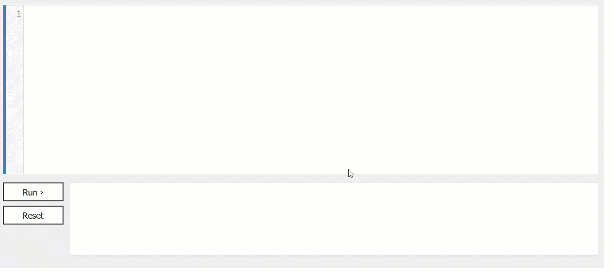
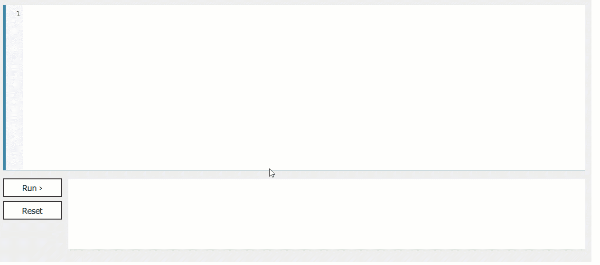
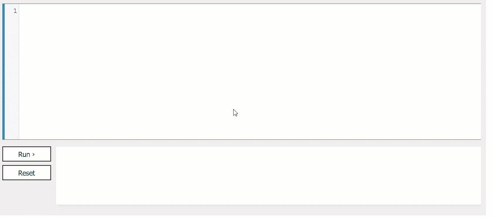
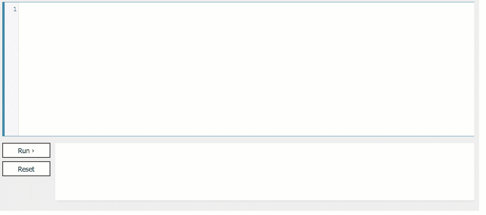
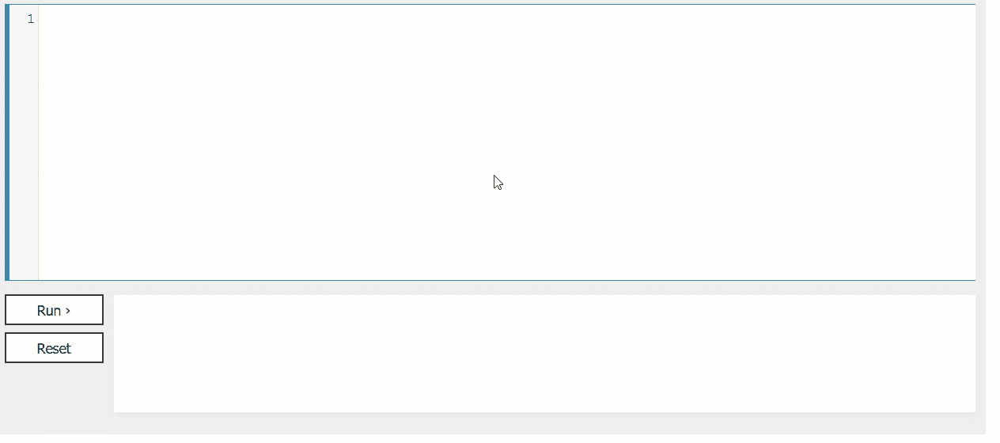
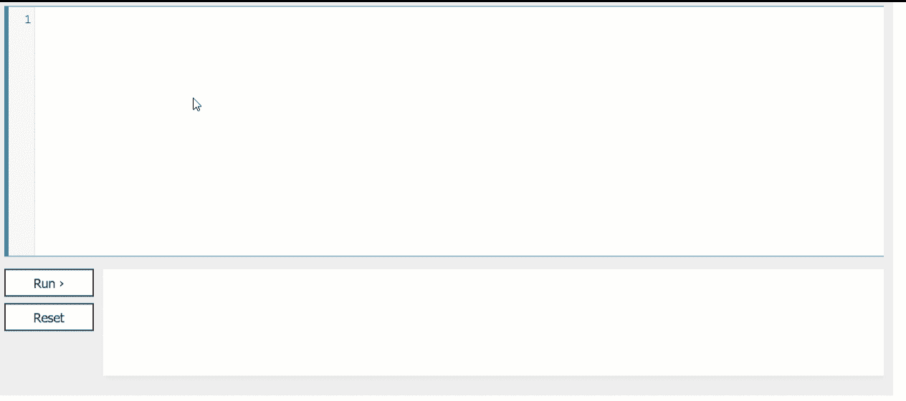
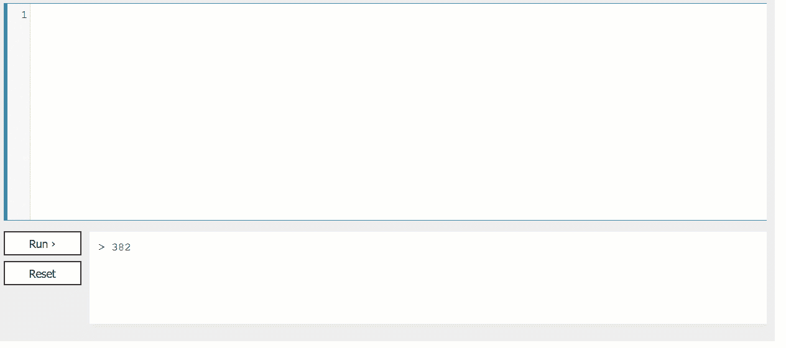
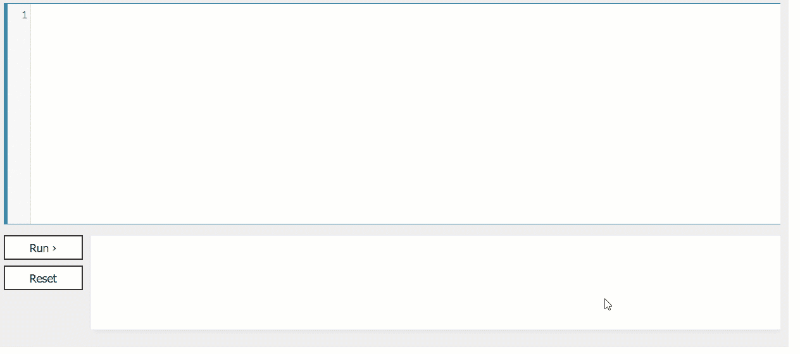
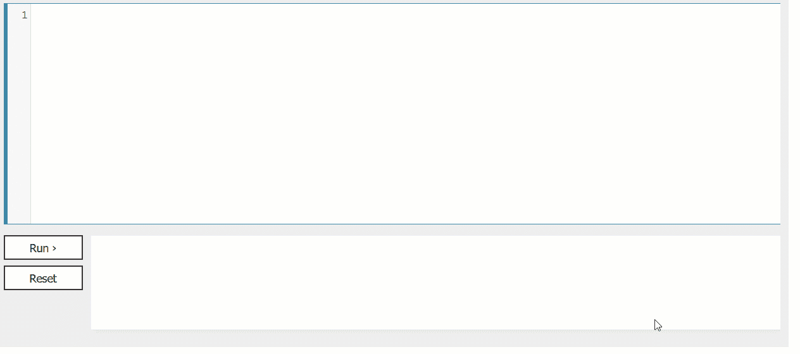

# 每个 Web 开发人员的 16 个终极 Javascript 技巧

> 原文：<https://levelup.gitconnected.com/12-javascript-hacks-every-web-developer-should-know-94b59338a672>

## 这些很酷的技巧可以让你的代码干净、优化、高效


图片由 [**cottonbro**](https://www.pexels.com/@cottonbro?utm_content=attributionCopyText&utm_medium=referral&utm_source=pexels) 来自 [**Pexels**](https://www.pexels.com/photo/boy-in-white-t-shirt-sitting-on-chair-in-front-of-computer-4709285/?utm_content=attributionCopyText&utm_medium=referral&utm_source=pexels)

本文将介绍 16 个 javascript 技巧，每个 web 开发人员都可以尝试使用它们来使代码变得干净、优化和高效。

# 0.使用模板字符串而不是字符串串联

当我们有一个包含一些动态变量的大字符串时，使用“+”操作符来连接字符串的各个部分会非常令人沮丧。这也有点过时了。下面是一个用“+”运算符连接字符串的示例。

```
let name = 'Pranjal';
let city = 'Pilibhit';
let primeCheck = bit => {
  return (bit === 'P' ? 'Prime' : 'Non-Prime');
}

// string concatenation using + operator
**let messageConcat = 'Mr. ' + name + ' is from ' +** city **+ '. He is a' + ' ' +** primeCheck**('P') + ' member.'** console.log(**messageConcat**);
```



更好的方法是使用模板字符串。模板字符串利用动态值的占位符。这些由美元符号和花括号`${expression}`标记。

下面是一个模板字符串的示例:

```
let name = 'Pranjal';
let city = 'Pilibhit';
let primeCheck = bit => {
  return (bit === 'P' ? 'Prime' : 'Non-Prime');
}

// using template string
let messageTemplateStr = `Mr. ${name} is from ${city}. He is a ${primeCheck('P')} member.`
console.log(messageTemplateStr);
```



# 1.使用`isInteger`

我们经常需要检查任何值是字符串还是数字。Javascript 有一个名为`isInteger`的函数，在 number API 下提供。`isInteger`函数可以检查任何对象是否是一个数字串。

这里有一个使用`isInteger`的例子。

```
let numcheck = 1569;
let strNum= "1569";

console.log(`${numcheck} is a number?`, Number.isInteger(numcheck));
console.log(`${strNum} is a number?`, Number.isInteger(strNum));
```

## 输出


```
1569 is a number? true
1569 is a number? false
```

# 2.与 and 连用的速记用法

假设我们想要运行任何函数，只要满足任何条件。我们通常使用`if`条件来检查条件是否满足，并基于此做出某些决定。

更有效的方法是使用简写的 AND(&&)运算符。下面是如何使用相同的。

```
let isPrime = true;
const startWatching = () => {
    console.log('Started Watching!');
}**isPrime && startWatching();**
```

首先，它将检查`isPrime`是否返回 true，并基于此调用`**startWatching()**` 函数**。**


# 3.合并多个对象

我们经常需要根据需求合并多个对象。Javascript 提供了一个三点运算符`…`。使用这三个点，我们可以合并任意数量的对象。这是你如何使用它。

```
let emp = {
 'id': 'EP01',
 'name': 'Pranjal',
 'age': 24,
 'addr': 'India'
};

let job = {
 'title': 'Data Scientist',
  'location': 'India'
};
```

现在，让我们合并这两个对象。

```
// Using spread operator
**let merged = {...emp, ...job};**
console.log('Final merged', merged);
```



# 4.交换变量

使用析构的概念，我们可以用一行代码交换两个变量。以下是如何做到这一点。

```
let fire = '🔥';
let fruit = '🍉';

[fruit, fire] = [fire, fruit];
console.log(fire, fruit);
```


# 5.用数组方法编写更短的循环

假设我们想把数组中的每个元素都转换成浮点型。一种方法是循环它并将数组的每个元素转换为 float。更高效的方法是在 javascript 中使用`map`方法。

这是你可以做到的。

```
**const prices = ['1.0', '2.15'];
const formattedPrices = prices.map(price => parseFloat(price));**
console.log(formattedPrices)
```



# 6.检查对象是否有值

假设您想检查一个对象是空的还是有一些值。Javascript 提供了一行快捷方式来检查这一点。

假设我们有一个名为"`obj4`"的对象，我们想知道它是否为空。Javascript 有一个名为`Object.keys()`的函数，使用它我们可以检查对象是否有元素。这是你可以做到的。

```
Object.keys(obj4).length
```

# 7.`isArray`功能

当我们必须检查输入是字符串还是数组时，这非常有用。这可以使用 javascript 中的`isArray`函数来检查。

这是你可以做到的。

```
let emoji_list = ['[🌀](https://emojipedia.org/cyclone/)', '⏲️', '🏆', '🛑'];
**console.log(Array.isArray(**emoji_list**));**
```



# 8.给多个变量赋值

当我们必须给多个变量赋值时，一次只能给一个变量赋值，如下所示。

```
let var1, var2, var3;
var1 = 1;
var2 = 2;
var3 = 3; 
```

另一个有效的方法是成为研究员。

```
let [var1, var2, var3] = [1, 2, 3];
```

# 9.箭头功能的使用

当你有更小的函数时，这是对 web 开发者最有用的函数之一。这是一个用老方法制作函数的例子。

```
function add(a, b) { 
   return a + b; 
}
```

而且，如果我们使用箭头函数，我们可以在一行代码中完成，如下所示。

```
const add = (a, b) => a + b;
```

# 10.多次重复对象

我们可以使用循环，一遍又一遍地重复同一个对象。但是，如果我们只用一行代码就能做到呢？

这是重复物体的老方法。

```
let test = 'Pranjal '; for(let i = 0; i < 5; i ++) { 
  test += 'Pranjal '; 
}
**console.log(**test**);**
```



这里是我们如何利用重复功能。

```
let test = 'Pranjal ';
test=test.repeat(5);
**console.log(**test**);**
```


# 11.切换人手不足

如果条件的数量增加，使用开关条件的旧方法是一个非常无聊的过程。这是我们以前的做法。

```
switch (data) {
  case 1:
    test1();
  break;

  case 2:
    test2();
  break;

  case 3:
    test();
  break;
  // And so on...
}
```

这是完成同样任务的新捷径。

```
var data = {
  1: test1,
  2: test2,
  3: test
};

data[something] && data[something]();
```

# 12.查找数组中的最大值和最小值

Javascript 提供了一个使用`Math`对象的方法，可以帮助我们使用 spread 操作符`…`找到数组中的最小和最大元素。遵循下面的代码来实现相同的。

```
const numbers = [1, 2, 3];console.log(Math.max(...numbers));
console.log(Math.min(...numbers));
```


# 13.**获取特定范围内的随机数**

javascript 中的数学对象可以帮助我们完成同样的任务。遵循下面的代码片段。

```
let anyNumRange=500;
let v1= Math.floor(Math.random()*anyNumRange);
console.log(v1);
```



# 14.**将一个数组追加到另一个数组**

我们通常需要合并两个数组的元素。让我们看看如何用 javascript 实现它。

```
var array1 = [12 , "Pranjal" , {name "Joe"} , -569];

var array2 = [555 , 100, "Saxena", 4];
Array.prototype.push.apply(array1, array2);console.log(array1)
```



# 15.**清空数组**

假设我们想清除一个数组的所有元素。我们可以在 javascript 中将它的长度设置为零。

```
var myArray = [12 , 222 , 1000 ]; console.log(myArray) 
myArray.length = 0;console.log(myArray)
```



# 结论

本文到此为止。我们已经讨论了 16 个 javascript 技巧，每个 web 开发人员都可以利用它们来使他们的代码整洁、优化和高效。

我希望你喜欢这篇文章。感谢阅读！