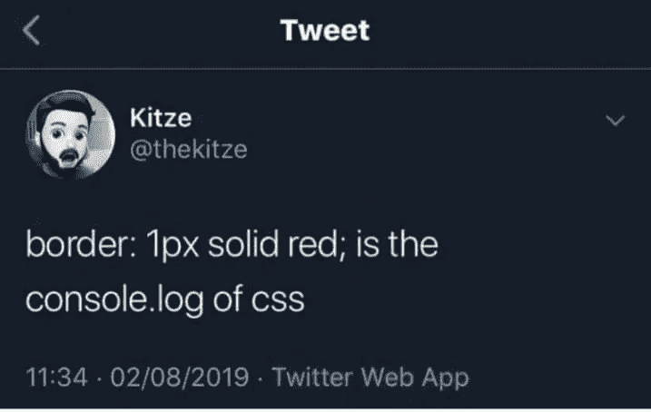
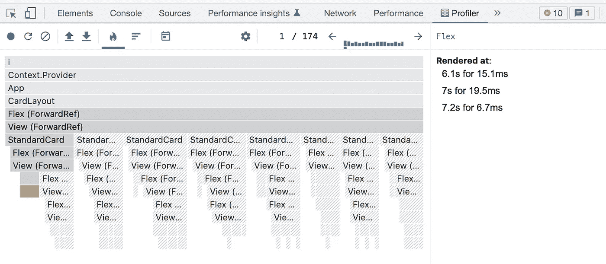
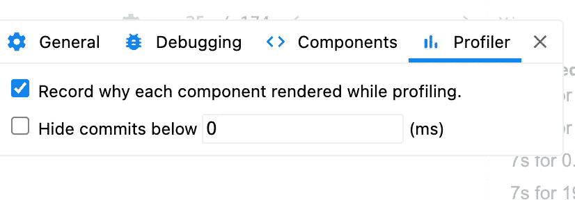
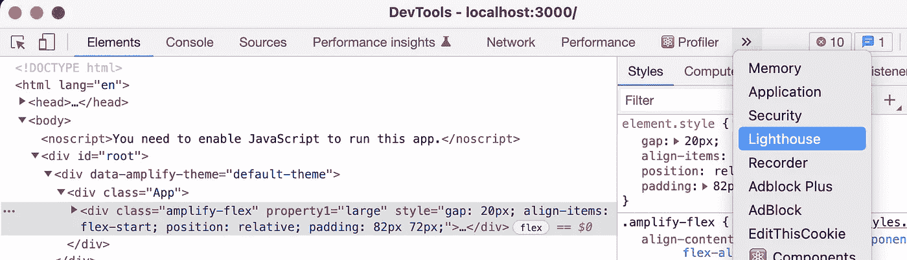
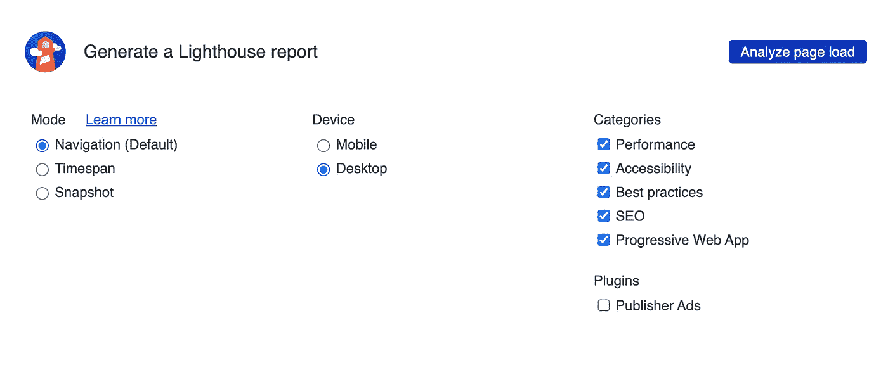

# 12 个改善你脆弱的代码的技巧

> 原文：<https://levelup.gitconnected.com/12-more-tips-for-improving-your-weak-ass-react-code-be88d0547f21>

## 第二部分:这些需要一点努力


雷内·文森特在 [Unsplash](https://unsplash.com?utm_source=medium&utm_medium=referral) 上的照片

这篇文章的第一部分反响很好，所以我决定再写一篇。根据 2021 年堆栈溢出调查[，React.js (40.14%)最近才超过 jQuery (34.42%)成为最常用的 web 框架。反应技能是目前就业市场上最受欢迎的技能之一。能够优化 React 应用程序是专业开发人员与众不同的一部分。](https://insights.stackoverflow.com/survey/2021#section-most-popular-technologies-web-frameworks)

在第一部分的结论中，我提到了一些东西，比如使用内容分发网络(CDN)、缓存、线框化、树抖动和减少包的大小。我们将在本文中讨论如何做这些事情，以及一些我以前没有想到的优化技巧。

# 设计

## 1.首先对响应布局进行线框化

如果你曾经在 React 中开始过一个实践项目，你可能会遇到这样的问题，甚至是从哪里开始演示。当然，你可以在 JSX 盲目地创建视图，然后再填充样式



CSS 中的调试

更好的方法是先从线框开始。线框本质上是任何网站的蓝图。从这些宝贝开始，你会发现更容易坚持下去。Figma to React 是 React 应用程序线框化的最流行的集成之一。您可以将 React 组件的设计创建为 [Figma](https://www.figma.com) 节点，然后将该节点包装在[小工具包装器](https://www.figma.com/blog/introducing-figma-to-react/#gadgets-reusable-code-blobs-that-stick-to-designs)中。例如，如果你想设计一个`Button`组件，你可以在 Figma 中将其命名为`#Button`。它将触发该节点成为“Gadgetized”；创建一个名为`CButton.js`的文件，您可以使用业务逻辑对其进行修改。

# 编码

## 2.JS 代码优化

在学习 React.js 之前先了解 JavaScript 是必须的。在理解语言之前一头扎进框架不仅会导致效率低下，而且最糟糕的是，这会给你自己带来更多的工作。所以帮你自己一个忙，不要以为你知道 JS，只是因为你知道 React。有许多 JS 设计考虑可以使你的 React 代码更加[干燥](https://en.wikipedia.org/wiki/Don%27t_repeat_yourself)和健壮，但是我在这里将集中于我的前三个:

**2.1 面向对象(OO)模式**

这可能令人震惊，但是 OO 模式并不是 React.js 特有的，它们甚至也不是 JavaScript 特有的。虽然类语法在 ES6 中只是作为面向对象编程的语法糖出现的，但对于 90 后的开发人员来说，它仍然是有用的知识。


由 Initech 提供

*2.1.1 工厂方法模式*

以移动电话数据结构为例，它可以是 iPhone 或 Android:

```
class PhoneFactory {
  static newIPhone(version) {
    return new Phone('iPhone', 'Apple', version);
  }
  static newAndroid(model, manufacturer, version) {
    return new Phone(model, manufacturer, version);
  }
}class Phone {
  constructor(model, manufacturer, version) {
    this.model = model;
    this.manufacturer = manufacturer;
    this.version = version;
  }
  static get factory() {
    return new PhoneFactory();
  }
}let phone = PhoneFactory.newIPhone('12');
let phoneTwo = PhoneFactory.newAndroid('Galaxy','Samsung','S22');console.log({ phone, phoneTwo });*{
  phone: Phone { model: 'iPhone', manufacturer: 'Apple', version: '12' },* *phoneTwo: Phone { model: 'Galaxy', manufacturer: 'Samsung', version: 'S22' }
}*
```

它通过决定创建对象的接口并让子类决定实例化哪个类来内在化抽象。

*2.1.2 构建器模式*

我经常使用构建器来组织应用程序中的重复代码。以交货订单为例:

```
import { v4 as uuid } from 'uuid';

class Order {
  constructor() {
    this.id = uuid();
    this.addressOne = '';
    this.addressTwo = '';
    this.city = '';
    this.state = '';
    this.zipCode = 0; 
    this.driver = '';
    this.restaurant = '';
    this.amount = 0;
  }

  toString() {
    return `
      Order number ${this.id} being delivered to:
      ${this.addressOne}${this.addressTwo ? ', ' + this.addressTwo + ', ' : ''}
      ${this.city}, ${this.state} ${this.zipCode}

      By ${this.driver}
      from ${this.restaurant} for $${this.amount}
    `;
  }
}
```

您可以通过添加构建器来分离大量所需的参数:

```
class OrderBuilder {
  constructor(order = new Order()) {
    this.order = order;
  }

  get deliveryAddress() {
    return new OrderAddressBuilder(this.order);
  }

  get fulfilledBy() {
    return new OrderFulfilledByBuilder(this.order);
  }

  build() {
    return this.order;
  }
}

class OrderAddressBuilder extends OrderBuilder {
  constructor(order) {
    super(order);
  }

  at({ addressOne, addressTwo }) {
    this.order.addressOne = addressOne;
    this.order.addressTwo = addressTwo;
    return this;
  }

  in({ city, state }) {
    this.order.city = city;
    this.order.state = state;
    return this;
  }

  withZipCode(zipCode) {
    this.order.zipCode = zipCode; 
    return this;
  }
}

class OrderFulfilledByBuilder extends OrderBuilder {
  constructor(order) {
    super(order);
  }

  from(restaurant) {
    this.order.restaurant = restaurant;
    return this;
  }

  for(amount) {
    this.order.amount = amount;
    return this;
  }

  by(driver) {
    this.order.driver = driver;
    return this;
  }
}
```

像这样使用它们:

```
const builder = new OrderBuilder();

const order = builder.deliveryAddress
  .at({ addressOne: '123 Main St' })
  .in({ city: 'Flavortown', state: 'USA' })
  .withZipCode(1234)
  .fulfilledBy
  .by('Alfredo Jr')
  .from('Pizza by Alfredo')
  .for(12.50)
  .build()

console.log(order.toString());*Order number c39233-e85b36-ed5230-c9844 being delivered to:* *123 Main St
      Flavortown, USA 1234 

      By Alfredo Jr
      from Pizza by Alfredo for $12.50*
```

对于更多的面向对象设计模式，我强烈推荐 Ravi Sojitra 的这篇文章。

**2.2 函数式编程(FP)模式**

JavaScript 的美妙之处在于它是一种多范式语言，可以适应面向对象和浮点模式。一旦你对它稍加练习，函数式编程并不太难掌握。有一些面向对象的经验也会有所帮助，因为 FP 中函数的使用方式和面向对象中对象的使用方式是一样的。FP 鼓励编写没有副作用的纯函数(没有局部静态变量、非局部变量、可变引用参数或输入/输出流的变异)。纯函数使用的唯一变量是传递给它的参数。纯函数唯一能调用的其他函数是其他纯函数。最后，如果函数返回值，它总是一个全新的变量。正如我用 OO 举例说明的，这里有两个我最喜欢的 FP 概念:

*2.2.1 功能组成*

函数组合是减少按钮和输入处理程序数量的好方法。以这个片段为例:

```
const Snippet = () => {

  **const handleButtonOneClick = (e) => alert("One!");
  const handleButtonTwoClick = (e) => alert("Two!");**

  return (
    <div>
      <button type="button" onClick={**handleButtonOneClick**}>
        One
      </button>
      <button type="button" onClick={**handleButtonTwoClick**}>
        Two
      </button>
    </div>
  )
}
```

每当我们想要创建一个按钮时，我们都必须创建一个处理程序。像这样浪费的会议，难怪地球被污染了。如果我们不必关心标签是什么，那不是很好吗？

```
const Snippet = ({ labels }) => { **const handleClick = (label) => (e) => alert(`${label}!`);** return (
    <div>
      {labels.map((label) => (
        <button type="button" onClick={**handleClick(label)**}>
          {label}
        </button>
      ))}
    </div>
  );
};

const App = () => (
  <div>
    <Snippet labels={['One', 'Two', 'Whatever']} />
  </div>
);
```

看到我们在那里做了什么吗？向`onClick`按钮属性提供了返回事件处理程序的`handleClick(label)`的输出。通过组合点击处理程序，我们使组件更灵活、更高效，就像水电站大坝一样。


[Tejj](https://unsplash.com/@tejjj?utm_source=medium&utm_medium=referral) 在 [Unsplash](https://unsplash.com?utm_source=medium&utm_medium=referral) 上拍照

2.2.2 不变性

让变量引用一个不变的值，强制养成好习惯。我们确保我们有我们应该有的值，当我们需要改变那个值时，我们创建一个新的变量来引用我们的新值。这适用于 JavaScript 中的所有数据类型:

```
'use strict';

const str = 'String';
const num = 1;str = 1; // NOT possible
num = 'String'; // also NOT possible// With let
let obj1 = { foo: 'bar' };

// you can mutate the object
o1.foo = 'something different';

// or reassign it completely
o1 = { message: "I'm a completely new object" };// With const
const obj2 = { foo: 'bar' };

// you can mutate the object
obj2.foo = 'something different';

// Can NOT reassign it completely
obj2 = { message: 'Not possible' }; // ERROR!// With let and Object.freeze
let obj3 = Object.freeze({ foo: 'bar' });// Can NOT mutate the object
obj3.foo = 'something different'; // ERROR!

// But CAN reassign it completely
obj3 = { message: 'Totally possible' };
```

在 React 中，你在核心 API 中到处都能看到不变性，例如在`useState`:

```
const MyComponent = () => {
  const [value, setValue] = useState(0);

  const addNewValue = (toAdd) => {
    const newValue = value + toAdd;
    setValue(newValue);
  };

  const setNewValue = () => addNewValue(Math.ceil(Math.random() * 10));

  return (
    <>
      <p>{value}</p>
      <button onClick={setNewValue}>Set new value</button>
    </>
  )
}
```

我们不能只是重新分配`value`，我们必须通过`setValue`创建一个新的不可变数字。

**2.3 在平面对象{}上使用 Map()**

我总是回到关于 StackOverflow 的讨论。如果某个东西只写一次，之后会大量阅读，那么就使用对象。在所有其他情况下，`Map`更好是因为它:

*   提供`get`、`set`、`has`和`delete`方法。对象依赖于容易出现缺陷的粗糙的定制实现。
*   接受任何类型的键，而不仅仅是字符串。例如，当您想要将多个键映射到同一个值时，将一个排序的数组作为键会很方便。
*   提供一个迭代器以方便`for-of`的使用，并保持结果的顺序。这也是一种普遍理解的标准化访问方法。
*   在迭代或复制过程中，不会出现带有原型和其他属性的边缘案例
*   考虑时间和空间复杂性时，可扩展性更好

## 3.实现 React.js 特定的设计模式

**3.1 无状态/有状态组件**

您很可能已经听说过无数次这种类型的组件，但这里有一个复习。

无状态组件如下所示:

```
import React from 'react';const Stateless = ({ title, description }) => (
  <div>
    <h1>{title}</h1>
    <p>{description}</p>
  </div>
);
```

有状态组件看起来像这样:

```
import React, { useState } from 'react';const Stateful = (props) => { const [title, setTitle] = useState('');
  const [description, setDescription] = useState('');return (
    <div>
      <input
        value={title}
        onChange={({ target: { value }}) => setTitle(value)}
      />
      <input
        value={description}
        onChange={({ target: { value }}) => setDescription(value)}
      />
      <Stateless title={title} description={description} />
    </div>
  )
}
```

我的经验是尽可能使用功能组件(注意这里没有`class`语法)和无状态组件。这是因为无状态组件与服务于它们的数据没有紧密耦合，因此与需要内部状态的组件相比，它们更具可重用性。

**3.2 上下文**

为上下文指出的主要用例是，它可以用来避免将一个道具向下传递数百万层。类似地，它可以用于设置数百万级的状态，以避免重复代码。考虑下面的代码，其中我们有 3 层嵌套组件和一个全屏阻塞模式:

```
import React, { useState } from 'react';
import Modal from './Modal';

const GrandParent = () => { const [isOpen, setIsOpen] = useState(false); return (
    <div>
      <h1>Grand Parent</h1>
      <button type="button" onClick={() => setIsOpen(!isOpen)}>
        Open Modal
      </button>
      {isOpen && (
        <Modal content="Opened from GrandParent" />
      )}
      <Parent />
    </div>
  );
};

const Parent = () => { return (
    <div>
      <h1>Parent</h1>
      <Child />
    </div>
  );
};

const Child = () => { const [isOpen, setIsOpen] = useState(false); return (
    <div>
      <h1>Child</h1>
      <button type="button" onClick={() => setIsOpen(!isOpen)}>
        Open Modal
      </button>
      {isOpen && (
        <Modal content="Opened from Child" />
      )}
    </div>
  );
};
```

注意，我们重复了几段代码，比如`isOpen`状态和模态组件。如果我们修改它以使用 React 上下文 API，它看起来会更简洁一些:

```
import React, { useState, createContext, useContext } from 'react';
import Modal from './Modal';

const ModalContext = createContext(undefined);

const ModalContextProvider = ModalContext.Provider;

const GreatGrandParent = () => { const [modalState, setModalState] = useState({
    isOpen: false,
    content: '',
  }); return (
    <ModalContextProvider value={[modalState, setModalState]}>
      <GrandParent />
    </ModalContextProvider>
  )
};

const GrandParent = () => { const [modalState, setModalState] = useContext(ModalContext); return (
      <div>
        <h1>Grand Parent</h1>
        <button
          type="button"
          onClick={() => setModalState({
            isOpen: !modalState.isOpen,
            content: 'Opened from GrandParent',
          })}
        >
          Open Modal
        </button>
        {modalState.isOpen && (
          <Modal content={modalState.content} />
        )}
        <Parent />
      </div>
  );
};

const Parent = () => { return (
    <div>
      <h1>Parent</h1>
      <Child />
    </div>
  );
};

const Child = () => { const [modalState, setModalState] = useContext(ModalContext); return (
    <div>
      <h1>Child</h1>
      <button
          type="button"
          onClick={() => setModalState({
            isOpen: !modalState.isOpen,
            content: 'Opened from Child',
          })}
        >
        Open Modal
      </button>
    </div>
  );
};
```

现在只有一个模态组件和一个状态来跟踪模态的打开状态和内容。

## 4.让钩子对你有利

在第一部分中，我谈到了一些有用的 React 钩子，比如 useMemo 和 useCallback。有一些新的钩子作为 React 团队的“并发模式”特性的一部分刚刚发布，包括:

*   `useTransition`:返回转换挂起状态的有状态值，以及启动转换的函数
*   `startTransition`:允许您将提供的回调中的更新标记为转换

```
function App() {
  const [isPending, startTransition] = useTransition();
  const [count, setCount] = useState(0);

  function handleClick() {
    startTransition(() => {
      setCount(c => c + 1);
    })
  }

  return (
    <div>
      {isPending && <Spinner />}
      <button onClick={handleClick}>{count}</button>
    </div>
  );
}
```

*   `useDeferredValue`:这个钩子类似于使用去抖动或节流来推迟更新。使用`useDeferredValue`的好处是 React 将在其他工作完成后立即进行更新(而不是等待任意长的时间)，并且像`[startTransition](https://reactjs.org/docs/react-api.html#starttransition)`一样，延迟值可以暂停，而不会触发现有内容的意外回退。
*   `useId`:是一个钩子，用于生成跨服务器和客户机稳定的惟一 id，同时避免水合不匹配。这不再依赖于`uuid`包。

```
function Checkbox() {
  const id = useId();
  return (
    <>
      <label htmlFor={id}>Do you like React?</label>
      <input id={id} type="checkbox" name="react"/>
    </>
  );
};
```

## 5.优化与后端的通信

如果你使用的是 GraphQL API，有一个很好的叫做 Relay 的库，它可以让你不需要知道如何以及何时进行特定的 API 调用。用它自己的话说:

> Relay 是一个 JavaScript 框架，用于构建数据驱动的 React 应用程序。
> 
> **声明性:**不再使用命令式 API 与您的数据存储进行通信。只需使用 GraphQL 声明您的数据需求，让 Relay 决定如何以及何时获取您的数据。
> 
> **协同定位:**查询位于依赖它们的视图旁边，因此你可以很容易地对你的应用进行推理。Relay 将查询聚合成高效的网络请求，以便只获取您需要的内容。
> 
> **突变:** Relay 允许您使用 GraphQL 突变来改变客户机和服务器上的数据，并提供自动数据一致性、乐观更新和错误处理。

从下面的示例项目开始，或者使用`npm i react-relay`将它安装到现有的 React 应用程序中。

[](https://github.com/facebook/relay) [## GitHub——Facebook/Relay:Relay 是一个 JavaScript 框架，用于构建数据驱动的反应…

### Relay 是一个 JavaScript 框架，用于构建数据驱动的 React 应用程序。声明:永远不再与…交流

github.com](https://github.com/facebook/relay) 

另一个有用的库是用于高效获取数据的`@tanstack/react-query`。例如，通过将后续负载转移到后台进程，可以节省对服务器的重复调用的性能。这只是 query 的众多好处之一。它比自定义的、手写的数据获取挂钩更强大，我用 TypeScript 和更漂亮的方式把它放在那里——这是一个应该使用的要求，除非有很好的理由不这样做。

[](https://tanstack.com/query/v4) [## 过渡查询|反应查询、实体查询、细长查询、真空查询

### 不用编写 reducers、缓存逻辑、定时器、重试逻辑、复杂的异步/等待脚本(我可以继续下去...)…

tanstack.com](https://tanstack.com/query/v4) 

## 6.使用页面速度洞察 API 测量速度

Google 提供了一个很好的 API 来记录像第一次内容丰富的绘制、第一次输入延迟、第一次有意义的绘制、第一次 CPU 空闲等指标。它确实需要设置一个帐户，生成一个 API 密匙，并稍微修改您的代码以适应测量。然而，这是一个很好的方法，通过结合来自不同地理位置的各种设备上的多个用户的多个指标来确定需要改进的地方。

[](https://developers.google.com/speed/docs/insights/v5/get-started) [## 开始使用 PageSpeed Insights API | Google 开发者

### 使用 PageSpeed Insights API 可以:测量网页的性能。获取关于如何改进页面的建议…

developers.google.com](https://developers.google.com/speed/docs/insights/v5/get-started) 

# 构建和捆绑

## 7.使用生产版本进行构建

npm 和 create-react-app 鲜为人知的特性之一是设置`NODE_ENV`环境变量，作为安装依赖项和构建静态文件的一种方式。当您运行`export NODE_ENV=production`并执行`npm install`和`npm run build`时，它将忽略开发依赖项，并生成文件内容的唯一散列唯一散列，以支持长期缓存。它还根据您实现的代码分割技术干净地分离文件。你不必做任何额外的工作，这只是`create-react-app`为你做的事情。这很重要的原因是，如果文件内容没有改变，它允许你使用积极的缓存技术来避免浏览器重新下载你的资源。此外，如果您为您的`index.html`和静态文件指定了一个`Cache-Control`头，CDN 将强制执行该指令，并在指定的时间长度内缓存您的静态资产。生成的散列提供了一种执行比较并决定缓存是否需要更新的方法。稍后我们将更多地讨论 CDNs。

[](https://create-react-app.dev/docs/production-build/) [## 创建生产版本|创建 React 应用程序

### npm 运行构建创建一个包含应用程序生产版本的构建目录。在构建/静态目录中有…

创建-反应-应用程序.开发](https://create-react-app.dev/docs/production-build/) [](https://docs.npmjs.com/cli/v8/commands/npm-install#description) [## NPM-安装| npm 文档

### 别名:add，I，in，ins，inst，insta，inst，isnt，isnta，isntal，isntall 此命令安装软件包和任何…

docs.npmjs.com](https://docs.npmjs.com/cli/v8/commands/npm-install#description) 

## 8.分析包的大小

React 有一个名为 [Source Map Explorer](https://www.npmjs.com/package/source-map-explorer) 的工具，它使用源码图分析 JavaScript 包。这有助于您理解代码膨胀的来源。要将源地图浏览器添加到 React 应用程序中，只需使用 NPM 安装即可:

```
npm install --save source-map-explorer
```

然后要分析包，运行生产构建，然后运行分析脚本。

```
npm run build
npm run analyze
```

还有其他第三方工具对此很有用，但不是专门针对 React 应用的。Webpack Bundle Analyzer 甚至提供了输出文件大小的交互式可视化。

[](https://github.com/webpack-contrib/webpack-bundle-analyzer) [## GitHub—web pack-contrib/web pack-bundle-analyzer:web pack 插件和 CLI 实用程序，代表…

### 使用交互式可缩放树状图可视化 webpack 输出文件的大小。npm 安装—保存-开发…

github.com](https://github.com/webpack-contrib/webpack-bundle-analyzer) 

Bundlesize 有一个 Github 插件，它会根据您指定的规则设置强制执行您的包的最大大小。

[](https://github.com/siddharthkp/bundlesize) [## GitHub — siddharthkp/bundlesize:检查包的大小

### 保持您的包大小在检查 npm 安装 bundlesize —保存—开发纱添加 bundlesize —开发将其添加到您的脚本在…

github.com](https://github.com/siddharthkp/bundlesize) 

当然，这些工具的好坏取决于您采取的修复代码膨胀的措施。精确定位和减少包的大小需要更多的努力，我可能会在某一天的另一篇文章中介绍。

[](https://medium.com/@ipenywis/how-to-reduce-your-webpack-bundle-size-for-web-app-optimization-02-9b7086e30a6d) [## 如何减少 Webpack 捆绑包的大小以优化 Web 应用程序

medium.com](https://medium.com/@ipenywis/how-to-reduce-your-webpack-bundle-size-for-web-app-optimization-02-9b7086e30a6d) 

# 主办；主持

## 9.使用 CDN 并利用边缘服务器

内容分发网络有助于拥有全球用户群的高流量网站。利用它的一种方法是将 React 应用程序的静态资产缓存在离最终用户最近的物理服务器上。它使得从原点到用户设备的行程更快。这种服务器被认为是边缘服务器，它们开始被用于更多的目的，而不仅仅是缓存静态文件。使用 React 和服务器端渲染(SSR)为这些边缘服务器提供了一个新的用例，以帮助您的网站执行得更好。Next.js 等静态站点生成器支持基于文件的页面路由、动态页面路径和边缘数据获取 API。将这项工作卸载到边缘服务器上，以提供更快的用户体验。此外，可以利用边缘服务器将 HTTP 头附加到页面响应中。像`Cache-Control`和`Content-Security-Policy` (CSP)这样的头可以按地区配置甚至修改。

# 监视

## 10.使用 React 工具调试

这一点在大多数 React 教程中都有提及，但看在过去的份上，我将在这里再提一下。自 2015 年以来，React 已经包含了一套专门用于调试 React 应用程序的浏览器工具。它可以作为扩展安装在 Chrome 上，作为附加组件安装在 Firefox 上，作为附加组件安装在 MS Edge 上。React 工具中有两个面板可以查看:“⚛️组件”和“⚛️分析器”。第一个将显示整个当前组件树。第二个提供了一种方法来记录 React 应用程序在渲染、响应状态变化和用户交互等时的性能。最重要的是，您可以记录为什么每个组件在分析时被渲染(或重新渲染)。



侧写员



准备好大吃一惊吧

[](https://alexsidorenko.com/blog/react-performance-tools/) [## 我的 React 应用程序很慢，我不知道为什么

### 2021 年 9 月 28 日 React world 中有哪些性能测试工具，如何开始使用？你可以…

alexsidorenko.com](https://alexsidorenko.com/blog/react-performance-tools/) 

## 11.Lighthouse 的性能基准测试

谷歌 Chrome Lighthouse 是目前网站标杆的标准。它附有一张容易理解的成绩单，让人想起你的学生时代。你可能还记得等待你的分数出来的可怕的悬念，这里没有太大的区别。



当您的 lighthouse 报告运行时，它可以为您提供在 SEO、可访问性、最佳实践等方面需要改进的地方。此外，您可以将 lighthouse 扫描合并到您的 CI/CD 流程中，以确保代码更改不会导致基准性能随着时间的推移而退化。

[](https://github.com/GoogleChrome/lighthouse) [## GitHub——Google chrome/light house:自动化审计、性能指标和最佳实践…

### Lighthouse 分析 web 应用程序和网页，收集现代性能指标和对开发者最佳的见解…

github.com](https://github.com/GoogleChrome/lighthouse) [](https://developers.google.com/speed) [## 让网络更快|谷歌开发者

### 帮助您构建高性能网站的工具和信息。

developers.google.com](https://developers.google.com/speed) 

# 了解更多信息

## 12.跟随牛逼前端

Awesome Frontend 是 Github 上的一个 web 性能优化主题的开源列表，由一群 Awesome 软件工程师经常更新。有一个专门针对前端主题的回购，值得一试，尤其是“加速你的网站的最佳实践”链接。

[](https://github.com/davidsonfellipe/awesome-wpo#readme) [## GitHub-davidsonfellipe/awesome-WPO:Web 性能优化的精选列表。每个人都可以…

### pencil:Web 性能优化的精选列表。大家可以在这里投稿！- GitHub …

github.com](https://github.com/davidsonfellipe/awesome-wpo#readme)  [## 加速你的网站的最佳实践-雅虎开发者网络

### 卓越性能团队已经确定了许多提高网页速度的最佳实践。该列表包括…

developer.yahoo.com](https://developer.yahoo.com/performance/rules.html) 

# 分级编码

感谢您成为我们社区的一员！在你离开之前:

*   👏为故事鼓掌，跟着作者走👉
*   📰查看[级编码出版物](https://levelup.gitconnected.com/?utm_source=pub&utm_medium=post)中的更多内容
*   🔔关注我们:[推特](https://twitter.com/gitconnected) | [LinkedIn](https://www.linkedin.com/company/gitconnected) | [时事通讯](https://newsletter.levelup.dev)

🚀👉 [**加入升级人才集体，找到一份惊艳的工作**](https://jobs.levelup.dev/talent/welcome?referral=true)