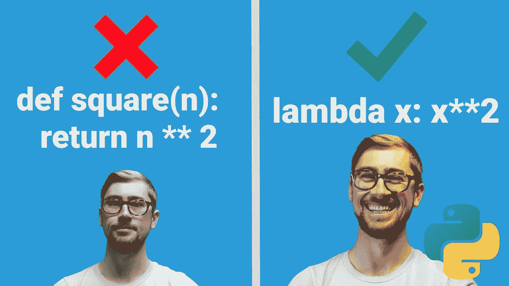

# 让你的生活更轻松的 12 个 Python 技巧

> 原文：<https://levelup.gitconnected.com/12-python-tricks-to-make-your-life-easier-b4a88e4c6767>

## 节省您宝贵时间的 Python 技巧和诀窍



@Kite [小贴士](https://www.youtube.com/watch?v=qEr9iRX4K0o)

在今天的文章中，我将讨论 12 个 Python 技巧和窍门，让您的生活更轻松。知道这些窍门一定会为你节省一些宝贵的时间。

# 1.获取方法

如果键不存在，这个技巧将使你避免字典中的键错误。使用`get`方法代替括号方法`[]`，括号方法返回`None`而不是`KeyError`。

```
mydict = {1: "Python", 2: "JavaScript", 3: "Dart"}#Default Methodmydict[4] # KeyError#Get Methodmydict.get(4) # None
```

# 2.Zip 功能

Zip()函数是 Python 中的另一个救命函数。在相同的级别上迭代多个列表是很有用的。看看下面的例子。

```
firstname = ["John", "Diana", "Christopher"]
lastname = ["David", "Logan", "Nolan"]#zip function
for f, l in zip(firstname, lastname):
    print(f, l)#output:
John David
Diana Logan
Christopher Nolan
```

zip 函数在将两个列表转换成字典格式时也非常有用。

```
firstname = ["John", "Diana", "Christopher"]
lastname = ["David", "Logan", "Nolan"]mydict = dict(zip(firstname, lastname))
print(mydict) #{'John': 'David', 'Diana': 'Logan', 'Christopher': 'Nolan'}
```

# 3.列表切片

这个技巧将向你展示如何用括号方法进行列表切片。将使用三个参数，`[Start: Stop: Step]`。查看下面的代码示例。

```
mylist = [1, 2, 3, 4, 5, 6, 7, 8, 9]#example 1
print(mylist[1: 9: 2]) # [2, 4, 6, 8]#example 2
print(mylist[3: 9: 3]) # [4, 7]
```

# 4.合并词典

这是将两本词典合二为一的又一救命妙招。通过使用字典更新方法，我们可以将第二个字典合并成一个。

```
def merge_dict(dict1, dict2):
    return(dict1.update(dict2))mydict1= {1: "Python", 2: "JavaScript"}
mydict2= {3: "C++", 4: "Dart"}merge_dict(mydict1, mydict2)
print(mydict1)#output: 
{1: 'Python', 2: 'JavaScript', 3: 'C++', 4: 'Dart'}
```

# 5.λ函数

Lambda 是另一个救命的 python 方法。通过使用它，你可以在一行代码中实现多种功能。查看下面的代码示例。

```
#example 1 -- multiple of 2 
num = 4
data = lambda x : x * 2
print(data(2)) # 4#example 2 -- Check even
data = lambda x : x % 2 == 0
print(data(4)) #True
```

# 6.作为密码输入

这个技巧将最终帮助您将用户输入作为密码格式。Python 有一个名为`getpass`的内置库。通过使用它，你可以以无敌的形式接受输入。

```
import getpassuserinput = getpass.getpass("Enter the Password: ")print(userinput)
```

# 7.快速反转列表

这个技巧将帮助你用更少的代码和没有任何功能快速反转一个列表。你还记得列表中的括号方法吗？我们将使用它来反转列表。

```
mylist = [1, 2, 3, 4, 5, 6, 7, 8, 9]#reversing listprint(mylist[::-1]) # [9, 8, 7, 6, 5, 4, 3, 2, 1]
```

# 8.没有温度的交换变量

交换变量是每个程序员都使用的东西，这个技巧将通过向你展示如何在没有临时变量或任何第三个变量的情况下交换变量来挽救你的生命。

```
#Default method
a = 1
b = 2
temp = a
a = b
b = temp
print(a, b) #2 1#Good method
a,b = b,a
print(a, b) #2 1
```

# 9.快速回文检查

这个技巧将展示如何快速检查回文。通常我们使用循环来检查回文。查看下面的代码示例，了解如何在没有循环的情况下做到这一点。

```
def isPalindrome(string):
    return string == string[::-1]print(isPalindrome("maham")) # True
print(isPalindrome("echo")) # False
```

# 10.过滤数据

过滤内置方法对于从变量或任何数据结构中过滤出数据非常有用。

```
mylist = [1, 2, 3, 4, 5, 6]newlist = list(filter(lambda x: (x % 2 == 0), mylist))
print(newlist) # [2, 4, 6]
```

# 11.返回多个结果

许多编程语言，如 C++、Java 等，只允许函数返回一个结果。但是 Python 允许我们返回多个结果。

```
def fun():
    return 1, 2, 3print(fun()) # (1, 2, 3)
```

# 12.简单字符串连接

停止使用循环来连接字符串。这个技巧将向你展示如何以一种简单的方式连接一个字符串列表。

```
mylist = ["Learn", "Python", "Programming Language"]#concatenate the list into one stringprint(" ".join(mylist)) # Learn Python Programming Language
```

# 最后的想法

我希望这些提示和技巧对你有所帮助，并且学习起来很有趣。您应该不断探索更多的技巧，通过编写大量代码来缩短您的编码工作并节省您的时间，这些代码可以在很短的代码时间内完成。

如果你觉得这篇文章有帮助，请点击下面的❤️按钮，与你的朋友分享这篇文章。

# 了解更多信息

如果你喜欢这篇文章。那么你也会喜欢我的其他编程相关的文章。

[](/20-essential-snippets-to-code-like-a-pro-in-javascript-c7a6ef4dbddc) [## 20 个必要的代码片段，让你在 JavaScript 中像专家一样工作

### 你可以在 30 秒或更短时间内学会 20 个 JavaScript 代码片段

levelup.gitconnected.com](/20-essential-snippets-to-code-like-a-pro-in-javascript-c7a6ef4dbddc) [](/20-ways-to-make-money-online-while-learning-to-code-9aec753b742d) [## 学习编码的同时在线赚钱的 20 种方法

### 如果你是一名程序员，却没有在网上赚到钱，那你就错过了一个大好机会

levelup.gitconnected.com](/20-ways-to-make-money-online-while-learning-to-code-9aec753b742d) [](/15-python-hidden-features-youve-probably-never-used-bb59bb3138b6) [## 你可能从未用过的 15 个 Python 特性

### 大多数人不知道 Python 的这些不可思议的特性。

levelup.gitconnected.com](/15-python-hidden-features-youve-probably-never-used-bb59bb3138b6) [](/25-useful-python-snippets-for-everyday-problems-4e1a74d1abae) [## 针对日常问题的 25 个有用的 Python 片段

### 以下是我为您的日常 Python 问题提供的 25 个有用且省时的片段

levelup.gitconnected.com](/25-useful-python-snippets-for-everyday-problems-4e1a74d1abae) [](/12-javascript-features-youve-probably-never-used-db932c413cdd) [## 您可能从未使用过的 12 个 JavaScript 特性

### 大多数人不知道 JavaScript 令人难以置信的特性

levelup.gitconnected.com](/12-javascript-features-youve-probably-never-used-db932c413cdd) [](/17-clever-javascript-tricks-that-every-developer-should-use-e7f299e49896) [## 每个开发人员都应该使用的 17 个聪明的 JavaScript 技巧

### 每个开发人员都应该知道的 JavaScript 技巧

levelup.gitconnected.com](/17-clever-javascript-tricks-that-every-developer-should-use-e7f299e49896) [](/python-pandas-tutorial-a-complete-introduction-for-beginners-add7013095c2) [## Python 熊猫教程:初学者完全入门

### 在本分步教程中，您将了解如何开始使用 Pandas 和 Python 探索数据集。

levelup.gitconnected.com](/python-pandas-tutorial-a-complete-introduction-for-beginners-add7013095c2) [](/master-object-oriented-programming-oop-in-python-3-c69a1e8a6d3d) [## 掌握 Python 的面向对象编程(OOP)

### 通过掌握面向对象编程(OOP ),学习用 Python 编写更简洁、更模块化的代码。

levelup.gitconnected.com](/master-object-oriented-programming-oop-in-python-3-c69a1e8a6d3d) [](/pyqt5-tutorial-learn-gui-programming-with-python-and-pyqt5-df4225d2e3b8) [## PyQt5 教程:用 Python 和 PyQt5 学习 GUI 编程

### Pyqt5 是图形用户界面小部件工具包。它是最强大和最流行的 python 接口之一…

levelup.gitconnected.com](/pyqt5-tutorial-learn-gui-programming-with-python-and-pyqt5-df4225d2e3b8) [](/how-to-make-your-python-code-run-10x-times-faster-5690f5d4d7aa) [## 如何让你的 python 代码运行速度提高 10 倍

### 让您的 python 代码运行速度提高 10 倍的简单提示和指南

levelup.gitconnected.com](/how-to-make-your-python-code-run-10x-times-faster-5690f5d4d7aa) [](/a-beginners-guide-to-tesseract-ocr-using-pytesseract-23036f5b2211) [## 使用 Pytesseract 的 Tesseract OCR 初学者指南

### 光学字符识别或光学字符阅读器(OCR)是电子或机械转换的图像…

levelup.gitconnected.com](/a-beginners-guide-to-tesseract-ocr-using-pytesseract-23036f5b2211)