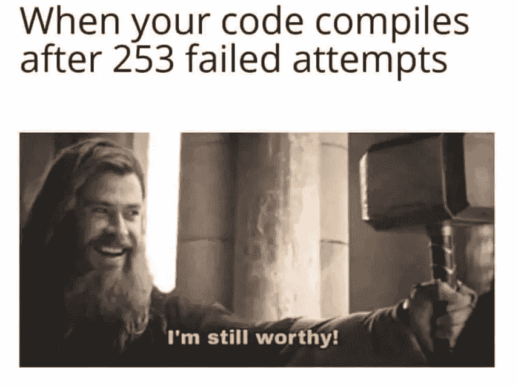

# 让你开心的 12 个终极编程笑话

> 原文：<https://levelup.gitconnected.com/12-ultimate-programming-memes-for-programmers-e230ac1586f1>

## 一些策划的在这里

图片由 [JL G](https://pixabay.com/users/ractapopulous-24766/?utm_source=link-attribution&utm_medium=referral&utm_campaign=image&utm_content=2099807) 来自 [Pixabay](https://pixabay.com/?utm_source=link-attribution&utm_medium=referral&utm_campaign=image&utm_content=2099807)

# 0.当你复制了整个编程逻辑，但它仍然不能在你的机器上工作

图片鸣谢: [nasser_junior](http://www.nasserjunior.com/)

# 1.当你试图理解别人的代码时

图片来源:[测试字节](https://www.testbytes.net/wp-content/uploads/2019/06/Untitled-54.png)

# 2.地狱是啊

图片来源:[测试字节](https://www.testbytes.net/wp-content/uploads/2019/06/Untitled-54.png)

# 3.这是谁写的？肯定不是我！

图片来源:[测试字节](https://www.testbytes.net/wp-content/uploads/2019/06/Untitled-54.png)

# 4.现在，我们正在谈话

图片来源:[测试字节](https://www.testbytes.net/wp-content/uploads/2019/06/Untitled-54.png)

# 5.那种感觉虽然:)

图片来源:[测试字节](https://www.testbytes.net/wp-content/uploads/2019/06/Untitled-54.png)

# 6.尊重我，你这个人类

图片来源:[测试字节](https://www.testbytes.net/wp-content/uploads/2019/06/Untitled-54.png)

# 7.好好享受吧，伙计！

图片来源:[测试字节](https://www.testbytes.net/wp-content/uploads/2019/06/Untitled-54.png)

# 8.真正的 MVP

图片鸣谢: [testbytes](https://www.testbytes.net/wp-content/uploads/2019/06/Untitled-54.png)

# 9.不过不会持续太久

图片来源:[测试字节](https://www.testbytes.net/wp-content/uploads/2019/06/Untitled-54.png)

# 10.醒醒，兄弟

图片鸣谢:[the codepedia](https://www.thecoderpedia.com/blog/programming-memes/)

# 11.当你过度扼杀了 Hello World 节目

图片鸣谢:[the codepedia](https://www.thecoderpedia.com/blog/programming-memes/)

# 12.放松的时刻

来源:[图片](/10-ultimate-programming-jokes-96660ff1f92c)

谢谢你的阅读。我希望你喜欢这些精选的收藏品。