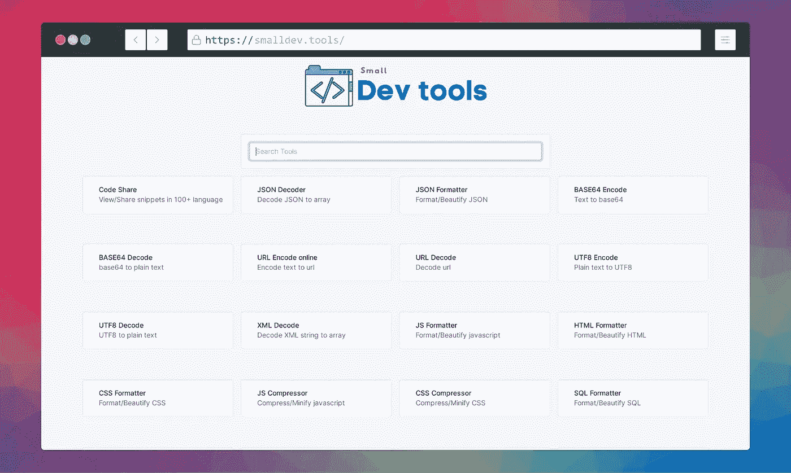
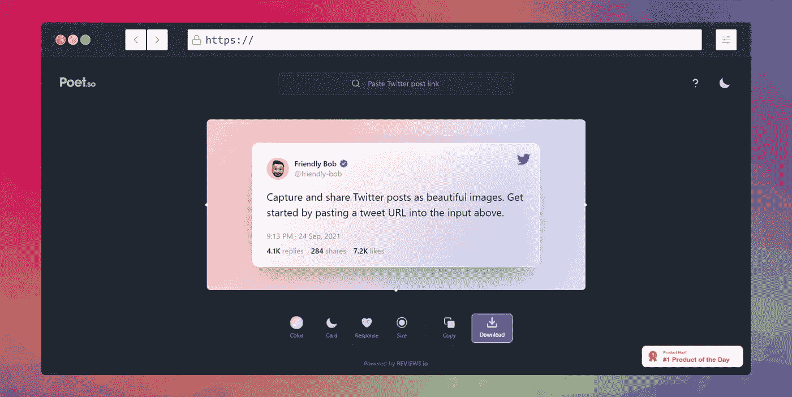
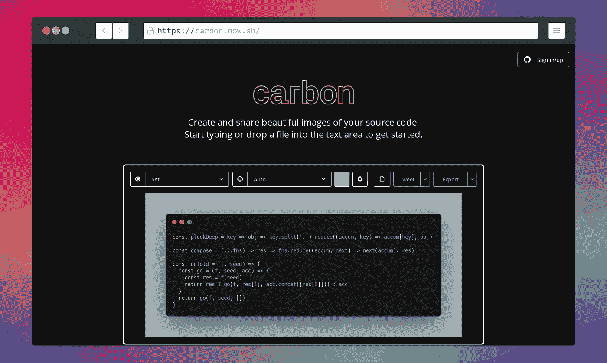
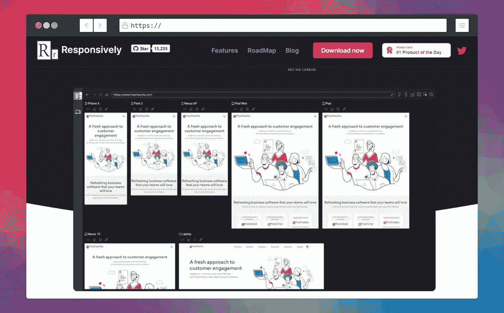
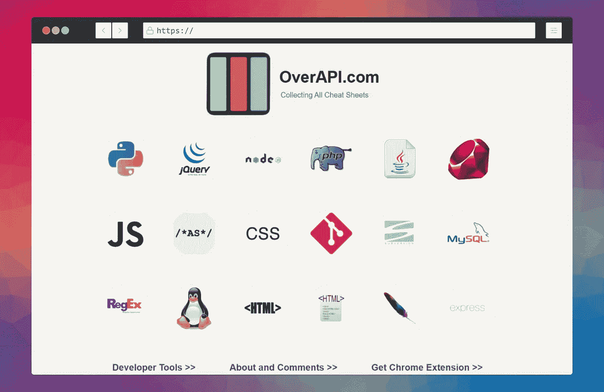
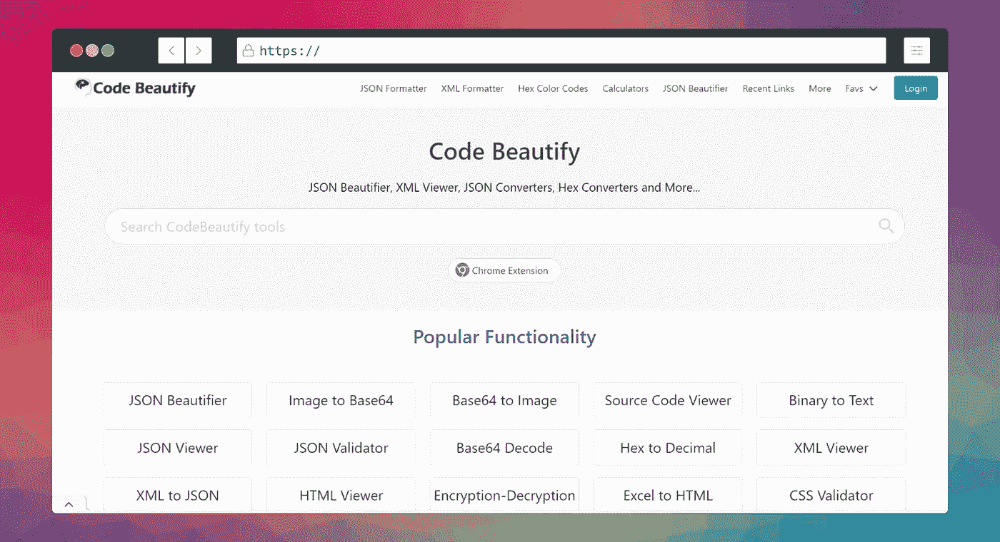
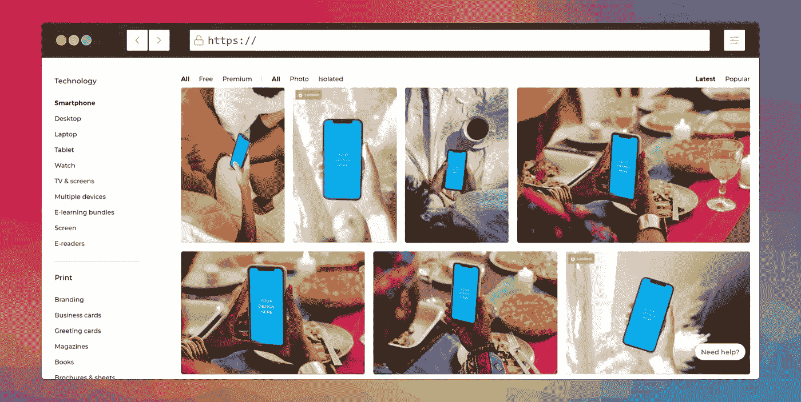
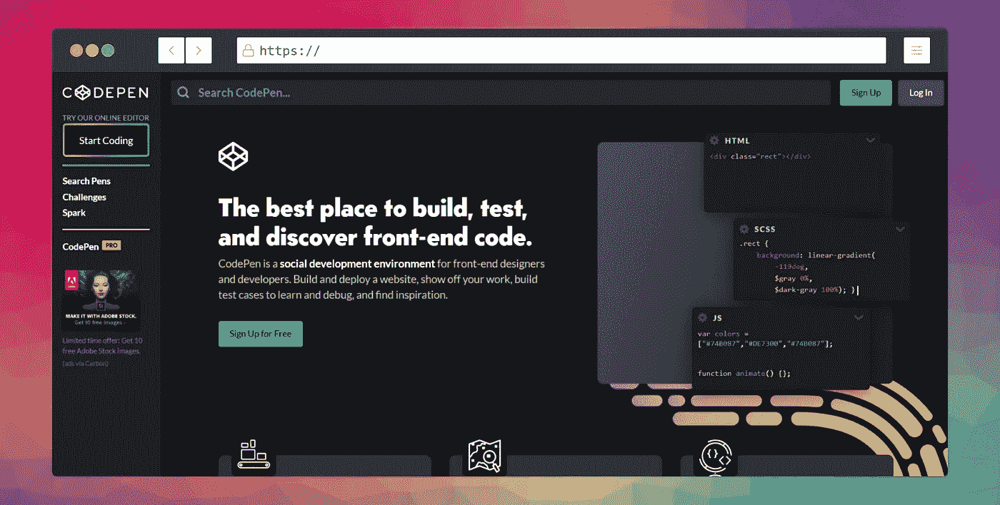

# 网站开发者的 12 个有用的杀手网站

> 原文：<https://levelup.gitconnected.com/12-useful-killer-websites-for-web-developers-c71f9a97d842>

## 99%的开发者不知道这些网站

**由** [设计**由**设计](https://www.freepik.com/)

互联网上有许多网站使我们的日常工作变得更容易。在本文中，我们将看到一些对 web 开发人员有用的网站。

# 1.小型开发工具

这个网站免费提供方便的开发工具，如编码器/解码器，HTML/CSS/Javascript 格式器，minifies，伪造或测试数据生成器，以及更多帮助开发人员完成不同任务的工具。

在这里你可以访问网站: [**链接**](https://smalldev.tools/)

**作者截图**

# 2.免费个人资料图片制作工具

这个网站使你的专业和令人敬畏的个人资料，为您的网络开发商的任何照片组合。你只需要上传你的任何照片，它就会进行编辑，让它变得很棒。现在试试吧。

在这里你可以访问网站: [**链接**](https://pfpmaker.com/)

**作者截图**

# 3.诗人。因此

这个网站非常适合那些想在社交媒体上分享他们的推文图片的开发者。网站将你的推文转换成吸引人的、漂亮的可编辑外观。

在这里你可以访问网站: [**链接**](https://poet.so/)

**作者截图**

# 4.元标记

Metatags.io 是一个为任何网站生成标签的工具，你还可以编辑和试验你的内容，然后预览你的网页在谷歌、脸书、Twitter 和其他社交媒体平台上的外观。

这里可以访问网站: [**链接**](https://metatags.io/)

**作者截图**

# 5.碳

我大部分时间使用这个网站来创建我的源代码的美丽图片，并在 Twitter 上分享它们，也在我的文章中使用它们。它还允许您编辑这些图像。你现在绝对应该试一试。

这里可以访问网站: [**链接**](https://carbon.now.sh/)

**作者截图**

# 6.故事

Storetale 是一个收集了插图的网站，可以用于个人和商业用途。这是少数几个为网页设计师设计的网站。

这里可以访问网站: [**链接**](https://storytale.io/)

**作者截图**

# 7.彩色狩猎

Colorhunt 是一个选择漂亮颜色托盘的网站。网页设计者会发现选择美丽和有吸引力的颜色非常有用，甚至可以从不同的艺术家和艺术项目中获得颜色建议。

在这里可以访问网站: [**链接**](https://colorhunt.co/)

**作者截图**

# 8.响应地

这个简单的网站将开发一个响应速度快 5 倍的网络应用程序！

在这里你可以访问网站: [**链接**](https://responsively.app/)

**作者截图**

# 9.OverAPI

Overlap 对所有开发者来说都是最漂亮最有用的网站之一。这个网站收集了大多数编程语言的备忘单。现在就去看看。

在这里你可以访问网站: [**链接**](https://overapi.com/)

**作者截图**

# 10.代码美化

让你的源代码看起来更好用代码美化它 AI tech 会让你的源代码看起来更漂亮，更易读。

在这里你可以访问网站: [**链接**](https://codebeautify.org/)

**作者截图**

# 11.智能模型

智能模型是一个免费的高质量模型的集合，你可以在你的项目中使用，现在查看网站。

这里可以访问网站: [**链接**](https://smartmockups.com/.)

**作者截图**

# 12.CodePen.io

CodePen.io 是一个在线代码编辑器和前端开发工具。这是一个为网络开发者提供的一体化工具，它给你完全的控制和网络预览。

这里可以访问网站: [**链接**](https://codepen.io/)

**作者截图**

感谢您抽出时间阅读本文。我希望你喜欢它，并随时分享你的回应，也与你的网站开发者的朋友分享这篇文章。快乐的编码！

如果你不是灵媒，那就成为灵媒，支持你最喜欢的作者，谢谢！👇

 [## 通过我的推荐链接加入 Medium—hai der Imtiaz

### 作为一个媒体会员，你的会员费的一部分会给你阅读的作家，你可以完全接触到每一个故事…

codedev101.medium.com](https://codedev101.medium.com/membership) 

***永远不要停止学习，下面是我的编程文章，希望你也喜欢。***

 [## 13 个你可能从未听说过的 JavaScript 隐藏黑客

### 你可能从未听说过的可怕的 JavaScript 黑客

levelup.gitconnected.com](/13-javascript-hidden-hacks-you-probably-never-heard-of-2ad257adf47e)  [## 你可以在 15 秒钟内理解 15 个有用的 JavaScript 代码片段

### 您可以立即理解的有用 JavaScript 代码片段列表

levelup.gitconnected.com](/15-useful-javascript-snippets-you-can-understand-in-15-seconds-3aa244d9c326)  [## 提升技能的 11 个 JavaScript 技巧

### 大多数开发人员不知道这些专业 JavaScript 技巧

levelup.gitconnected.com](/11-javascript-tricks-to-boost-your-skills-93c2fe1cd057)  [## 您可能从未使用过的 12 个 JavaScript 特性

### 大多数人不知道 JavaScript 令人难以置信的特性

levelup.gitconnected.com](/12-javascript-features-youve-probably-never-used-db932c413cdd)  [## 让你的生活更轻松的 12 个 Python 技巧

### 节省您宝贵时间的 Python 技巧和诀窍

levelup.gitconnected.com](/12-python-tricks-to-make-your-life-easier-b4a88e4c6767)  [## 学习编码的同时在线赚钱的 20 种方法

### 如果你是一名程序员，却没有在网上赚到钱，那你就错过了一个大好机会

levelup.gitconnected.com](/20-ways-to-make-money-online-while-learning-to-code-9aec753b742d)  [## 针对日常问题的 25 个有用的 Python 片段

### 以下是我为您的日常 Python 问题提供的 25 个有用且省时的片段

levelup.gitconnected.com](/25-useful-python-snippets-for-everyday-problems-4e1a74d1abae)  [## 每个开发人员都应该使用的 17 个聪明的 JavaScript 技巧

### 每个开发人员都应该知道的 JavaScript 技巧

levelup.gitconnected.com](/17-clever-javascript-tricks-that-every-developer-should-use-e7f299e49896)  [## 作为开发人员的 12 种聪明的赚钱方法

### 除非你能在床上赚钱，否则不要呆在床上

levelup.gitconnected.com](/12-smart-ways-to-earn-as-a-developer-4131def3b0a5)  [## 给每个 Web 开发者的 15 个神奇的 JavaScript 技巧

### 15 个神奇的 JavaScript 技巧和窍门，节省您作为 Web 开发人员的宝贵时间

levelup.gitconnected.com](/15-magical-javascript-tips-for-every-web-developer-3301feb0b70c)  [## 20 个必要的代码片段，让你在 JavaScript 中像专家一样工作

### 你可以在 30 秒或更短时间内学会 20 个 JavaScript 代码片段

levelup.gitconnected.com](/20-essential-snippets-to-code-like-a-pro-in-javascript-c7a6ef4dbddc)  [## 掌握 Python 的面向对象编程(OOP)

### 通过掌握面向对象编程(OOP ),学习用 Python 编写更简洁、更模块化的代码。

levelup.gitconnected.com](/master-object-oriented-programming-oop-in-python-3-c69a1e8a6d3d)  [## 使用 NLTK 的 Python 自然语言处理初学者指南

### 自然语言处理是人工智能的一个分支，它帮助计算机理解自然语言

levelup.gitconnected.com](/a-beginners-guide-to-natural-language-processing-in-python-using-nltk-6e4692b825d4)  [## 如何让你的 python 代码运行速度提高 10 倍

### 让您的 python 代码运行速度提高 10 倍的简单提示和指南

levelup.gitconnected.com](/how-to-make-your-python-code-run-10x-times-faster-5690f5d4d7aa)  [## 使用 Pytesseract 的 Tesseract OCR 初学者指南

### 光学字符识别或光学字符阅读器(OCR)是电子或机械转换的图像…

levelup.gitconnected.com](/a-beginners-guide-to-tesseract-ocr-using-pytesseract-23036f5b2211)  [## PyQt5 教程:用 Python 和 PyQt5 学习 GUI 编程

### Pyqt5 是图形用户界面小部件工具包。它是最强大和最流行的 python 接口之一…

levelup.gitconnected.com](/pyqt5-tutorial-learn-gui-programming-with-python-and-pyqt5-df4225d2e3b8)