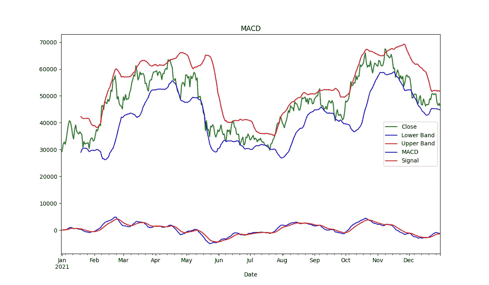

# 金融时间序列的 12 个有用的熊猫脚本

> 原文：<https://levelup.gitconnected.com/12-useful-pandas-scripts-for-financial-time-series-2bcaff3646f9>

使用 Pandas 库发现强大的脚本来帮助您分析和处理金融时间序列数据。


在 [Unsplash](https://unsplash.com/?utm_source=unsplash&utm_medium=referral&utm_content=creditCopyText) 上[翻滚 926](https://unsplash.com/@billow926?utm_source=unsplash&utm_medium=referral&utm_content=creditCopyText) 拍照

你似乎很喜欢有有用代码的文章！你当然知道。一开始，对我来说，Medium 是 StackOverflow 的更好版本，现在是时候放弃一些东西了。今天，我将分享我在时间序列数据分析中使用的脚本列表。欢迎在评论区补充一些缺失。

*   [关联](#2e5e)
*   [滞后相关](#4dd4)
*   [填充缺失值](#5f83)
*   [获取 RSI](#af9f)
*   [获取布林线](#0759)
*   [得到 MACD](http://1586)
*   [获取指数移动平均线](#0476)
*   [获取一段时间内的回报百分比](#796a)
*   [获得对数回报](#dc62)
*   [计算波动率](#4de3)
*   [得到夏普比率](#30b7)
*   奖励:让我们策划一些

# 相互关系

最直接的指标。记住“相关性并不意味着因果关系”。

# 滞后相关

同上，但是可以将一个值向前或向后移动几个时间段。这可能是捕捉滞后指标的好方法(就预测能力而言，这是纯金):当一个系列的值暗示另一个系列的值在未来会发生某种变化时。

# 填充缺失值

用线性回归填充缺失值是一种有价值的技术，可以帮助您更有效地处理时序数据。

# 获取 RSI

相对强弱指数是一种用于分析金融市场的技术指标。它是基于这样一种观察，即价格波动往往局限在上下极限之间。该指数显示这些价格变动是强还是弱。我不能谈论它的有用性，但它仍然是一种表现价格偏离的极好方法。

# 获取布林线

布林线是一种技术分析指标，可用于识别证券何时超买或超卖。例如，当价格接近上限时，它偏离了标准值，因此接近超买。但是，向下的方向正好相反。

# 去找 MACD

移动平均线收敛背离(MACD)是一种技术分析指标，用于衡量一种证券的 26 期和 12 期移动平均线之间的差异。MACD 的计算方法是从 12 期移动平均线中减去 26 期移动平均线。

如果 MACD 为正，表明 12 期均线在 26 期均线之上，反之亦然。

# 获得指数移动平均线

指数移动平均线(EMA)是一种移动平均线，给予最近的价格更多的权重。许多交易者用这个指标来帮助他们做交易决定。

# **获取一段时间内的回报百分比**

该方法通常用作各种指标的构建模块，并给出资产盈利能力的合理估计。

# 获得对数回报

对数回报是财务规划的一个重要方面。它们代表了投资增长和时间之间的关系。正如您所看到的，这种方法也是其他指标的常见“构建模块”。

# 计算波动性

波动性是用来描述证券价格波动的术语。它有助于估计价格的稳定性，从而估计与资产投资相关的风险。

# 获取夏普比率

夏普比率是一个指标，通过衡量指定期间的回报和波动风险之间的关系，代表不同期间的风险分布。

# 额外收获:让我们画一些

要执行该文件，您应该运行:

```
python -m plot_indicators.py
```

生成的图像将向您展示一个有点典型的指标和价格交换结构:



BTC 收盘价的布林线和 MACD 指标

我计划在下面的文章中添加一个类似的关于时间序列可视化的帖子。

*这篇文章的全部代码以及更多内容被推送到 GitHub 仓库:*

[](https://github.com/destilabs/timetwist) [## GitHub - destilabs/timetwist:技术分析工具包

### 此时您不能执行该操作。您已使用另一个标签页或窗口登录。您已在另一个选项卡中注销，或者…

github.com](https://github.com/destilabs/timetwist) 

如果你已经看完了这篇文章，我建议你继续关注这个博客。您可以通过 Medium 直接关注博客，或者通过下面的订阅小工具发送电子邮件:

[](https://destiq.medium.com/subscribe) [## 每周获取我的编程和 ML 教程

### 获得我的编程和 ML 教程每周短和实用的实际用例实现通过注册，你…

destiq.medium.com](https://destiq.medium.com/subscribe)