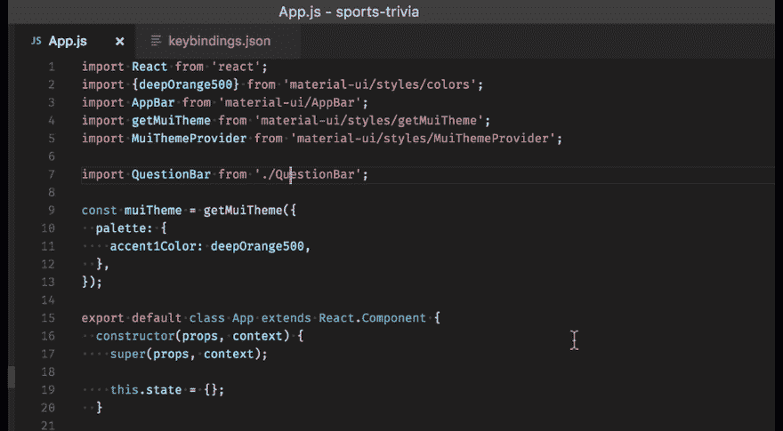

# 每个开发人员都必须知道的 12 个 Visual Studio 代码快捷方式

> 原文：<https://levelup.gitconnected.com/12-visual-studio-code-shortcuts-that-every-developer-must-know-8d6ce5fc3631>

## 这些快捷方式让开发人员的生活变得更加轻松。

穆罕默德·拉赫马尼在 [Unsplash](https://unsplash.com/s/photos/visual-studio-code?utm_source=unsplash&utm_medium=referral&utm_content=creditCopyText) 上的照片

自从微软在 2015 年末推出 Visual Studio Code 以来，它已经真正成为世界上最受欢迎的源代码编辑器之一。事实上，它是开源的，可以在 Windows、Linux 和 macOS 上运行，这使得它更加引人注目。

VS 代码是用 emmet 预构建的，这是其他文本编辑器所没有的，它还允许你定制它的代码，所以你甚至可以修改它的环境变量来满足你的需求。它有大量的扩展，可以根据需要使用。

我广泛使用 VS Code 进行编码，尤其是 web 开发。有许多捷径可以让开发人员的生活更轻松。

这里是一些快捷方式，每个开发人员都会发现它们对快速编码很有用。

# 更改 VS 代码主题

颜色主题允许您在 Visual Studio Code 的用户界面中修改颜色，以适应您的偏好和工作环境。您还可以选择从 VS 代码扩展市场安装更多的主题。

windows:**Ctrl+K Ctrl+T** MAC OS:**Cmd+K Cmd+T**

# 命令选项板

命令选项板提供了对许多命令的访问。您可以使用同一个交互式窗口执行编辑器命令、打开文件、搜索符号以及查看文件的快速概要。

windows:**Ctrl+Shift+P
MAC OS:**Cmd+Shift+P****

# 查找错误和警告

快捷方式跳转到项目中的错误和警告。

windows:**Ctrl+Shift+M
MAC OS:**Cmd+K**Cmd+I**

# 查找单词和短语

从当前文件:
Windows:**Ctrl+F
MAC OS:**Cmd+F****

从整个项目:
Windows:**Ctrl+Shift+F**MAC OS:**Cmd+Shift+F**

# 改变编程语言

Visual Studio 代码根据它们的文档支持数百种编程语言[。编辑器根据文件扩展名默认文件的语言支持。但是，您也可以选择修改文件类型的新语言。](https://code.visualstudio.com/docs/languages/overview)

windows:**Ctrl+K M
MAC OS:**Cmd+K M****

# 代码格式

可以使用快捷方式轻松格式化代码，以提高代码可读性。

从当前文件:
Windows:**Ctrl+K Ctrl+F
MAC OS:**Cmd+K Cmd+F****

从整个项目:
Windows:**Shift+Alt+F**MAC OS:**Shift+Option+F**

# 智能感知

VS 代码智能感知特性由语言服务提供支持。语言服务提供基于语言语义和源代码分析的智能代码完成。如果语言服务知道可能的完成方式，IntelliSense 建议将在您键入时弹出。

windows:**Ctrl+空格键
MAC OS:**Ctrl+空格键****

# 拆分编辑器

你可以打开任意多的编辑器，纵横并排。

如果已经打开了一个编辑器，有多种方法可以在现有编辑器的旁边打开另一个编辑器:

*   **Alt** 在浏览器中点击一个文件。
*   **Ctrl+\** 将活动编辑器一分为二。
*   打开到侧面( **Ctrl+Enter** )从资源管理器的上下文菜单上打开一个文件。
*   点按编辑器右上角的“拆分编辑器”按钮。
*   将文件拖放到编辑器区域的任意一侧。
*   在快速打开( **Ctrl+P** )文件列表中 **Ctrl+Enter** (或**Cmd+Enter**in**MAC OS)。**

# **向上或向下复制代码行**

****

**Windows: **Shift+Alt+Up** 或**Shift+Alt+Down** MAC OS:**Shift+Option+Up**或 **Shift+Option+Down****

# **上下移动代码行**

****

**Windows: **Alt+Up** 或 **Alt+Down
或** macOS: **Alt+Up** 或 **Alt+Down****

# **代码折叠**

****

**自从推出以来，代码折叠一直是一个非常有用的特性。当文件中的代码行数增加时，代码折叠有助于折叠代码行。**

**在光标处折叠最里面的未折叠区域:
Windows:**Ctrl+Shift+[** MAC OS:**Cmd+Option+[****

**展开光标处的折叠区域:
Windows:**Ctrl+Shift+]**
MAC OS:**Cmd+Option+]****

# **快速打开任何文件**

****

**windows:**Ctrl+P**MAC OS:**Cmd+P****

# **结论**

**多年来，Visual Studio 代码已经发展成为首选的代码编辑器。事实上，根据 [Stack Overflow 2021 开发调查](https://insights.stackoverflow.com/survey/2021) , *Visual Studio 代码是最受欢迎的开发者环境工具*，82000 名受访者中有 70%的人在使用它。**

**我已经列出了我和我的同事们使用的快捷方式。然而，有大量的快捷方式可以帮助您更快地编码。**

**你可以在各自的链接中获得完整的列表:对于 [*Windows*](https://code.visualstudio.com/shortcuts/keyboard-shortcuts-windows.pdf) 和对于 [*macOS*](https://code.visualstudio.com/shortcuts/keyboard-shortcuts-macos.pdf) 。**

**如果你喜欢读这篇文章，你可能也会发现下面的文章值得你花时间去读。**

** [## 如何一次取消订阅所有 YouTube 频道

### 逐步摆脱你订阅的所有 YouTube 频道的指南。

levelup.gitconnected.com](/how-to-unsubscribe-from-all-youtube-channels-at-once-d516b3669325)  [## 如果你是开发者，你必须订阅的 9 个 YouTube 频道

### 强烈推荐给软件开发人员的 YouTube 频道，帮助他们在软件开发职业生涯中脱颖而出。

levelup.gitconnected.com](/9-youtube-channels-that-you-must-subscribe-to-if-you-are-a-developer-d7ac881c9798) 

*如果你喜欢阅读有助于你更好地学习、生活和工作的故事，可以考虑* [*成为订阅者*](https://viveknaskar.medium.com/subscribe) *。成为会员后，你可以无限制地阅读 10000 篇故事、文章和作家。每月只要 5 美元。* [*如果你用我的链接*](https://viveknaskar.medium.com/membership) *注册，我会赚一点佣金，帮助我写更多的文章。***