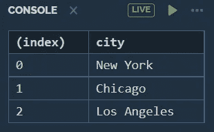

# 13 个你可能从未听说过的 JavaScript 隐藏黑客

> 原文：<https://levelup.gitconnected.com/13-javascript-hidden-hacks-you-probably-never-heard-of-2ad257adf47e>

## 你可能从未听说过的可怕的 JavaScript 黑客


由 www.freepik.com[设计](http://www.freepik.com)

你知道 JavaScript 有一些隐藏的代码片段可以让你的工作更容易吗？在这篇博客中，我们将讨论这 13 个 JavaScript 隐藏的漏洞。因此，不要再浪费时间了，让我们开始吧。

# 1.缩短 console.log

开发者总是喜欢节省他们的时间，但是一次又一次地写`console.log`，有时是一件痛苦的事情。但是下面这个黑客将向你展示如何缩短你的 console.log。

```
// Shortening Console Log//example 1
var c = console.log.bind(document)
c(2*4)
c("Hello to JavaScript")
c(true)//example 2
var cl = console.log.bind(document)
cl("JavaScript Developer")
cl(6*3*2) 
cl(false)
```

# 2.智能功能

箭头函数是 ES6 JavaScript 中引入的特性之一，主要用于简短的函数实现，与常规函数相比，使代码更加简洁易读。下面是如何使用箭头函数的代码示例。

```
// Smart Function (Arrow fun)function fun(str){
  console.log(str)
}// Arrow Functionslet fun2 = (str) => { console.log(str) }fun("JavaScript") // JavaScript
fun2("Programming") // Programming
```

[](/12-javascript-features-youve-probably-never-used-db932c413cdd) [## 您可能从未使用过的 12 个 JavaScript 特性

### 大多数人不知道 JavaScript 令人难以置信的特性

levelup.gitconnected.com](/12-javascript-features-youve-probably-never-used-db932c413cdd) [](/20-ways-to-make-money-online-while-learning-to-code-9aec753b742d) [## 学习编码的同时在线赚钱的 20 种方法

### 如果你是一名程序员，却没有在网上赚到钱，那你就错过了一个大好机会

levelup.gitconnected.com](/20-ways-to-make-money-online-while-learning-to-code-9aec753b742d) 

# 3.短期条件

不用写多行基于条件的代码，你可以用一行写出来。这个黑客将告诉你如何做到这一点。当您同时处理多个 if 条件时，这很方便。

```
// Short Conditionsvar condtion = trueif(condtion)
{
  console.log("Login Successful")
}// Short condtion
condtion && console.log("Login Successful")
```

# 4.平面多维阵列

这个黑客将帮助你以一种简单的方式来扁平数组，查看下面的代码片段。

```
//deep flattenvar array = [100, [200, [300, 400, 500], 600], [700, 800,[900,[1000]]]]console.log(array.flat(Infinity)) // [100, 200, 300, 400, 500, 600, 700, 800, 900, 1000]
```

# 5.console.table()

这个了不起的工具将帮助您使用 console.table()方法将 CSV 格式或字典格式的数据转换成表格形式。

```
// Console.tablevar data=[{"city":"New York"}, {"city":"Chicago"}, {"city":"Los Angeles"}]console.table(data)
//make table format like below.
```



Authur 输出

# 6.快速电源

计算幂时，我们首先想到的是使用`Math.pow()`函数。但是这个黑客会让你的生活变得更容易，用常规的数学计算技巧来计算功率。

```
// Quick Power// Math Method
console.log(Math.pow(2,3)) //8
console.log(Math.pow(5,9)) //1953125
console.log(Math.pow(2,9)) // 512// Smart Way
console.log(2**3) //8
console.log(5**9) //1953125
console.log(2**9) //512
```

# 7.智能调整数组大小

这种方法可以让你避免使用循环来调整数组的大小。您可以对数组使用`length`方法，将任何数组调整到您喜欢的任何大小。

```
// Smart Resize Arraylet array = ["Js", "Py", "C++", "Java", "Csharp", "Dart"]
array.length = 2console.log(array) //["Js", "Py"]
```

[](/20-essential-snippets-to-code-like-a-pro-in-javascript-c7a6ef4dbddc) [## 20 个必要的代码片段，让你在 JavaScript 中像专家一样工作

### 你可以在 30 秒或更短时间内学会 20 个 JavaScript 代码片段

levelup.gitconnected.com](/20-essential-snippets-to-code-like-a-pro-in-javascript-c7a6ef4dbddc) [](/17-clever-javascript-tricks-that-every-developer-should-use-e7f299e49896) [## 每个开发人员都应该使用的 17 个聪明的 JavaScript 技巧

### 每个开发人员都应该知道的 JavaScript 技巧

levelup.gitconnected.com](/17-clever-javascript-tricks-that-every-developer-should-use-e7f299e49896) 

# 8.多次替换

我们知道可以使用`replace()`方法替换一个字符串中的单词，但是在同一个字符串中替换多个单词怎么办？这个黑客将通过在最后添加一个关键字`/g`来帮助你用`replace()`方法做到这一点。看看下面的代码就明白了。

```
// Multiple Replacevar data = "JavaScript is JavaScript"//Single
console.log(data.replace(/JavaScript/, "TypeScript")) // TypeScript is JavaScript//Multiple 
console.log(data.replace(/JavaScript/g, "TypeScript")) // TypeScript is TypeScript
```

# 9.数字和字符串转换

转换是每种编程语言的一部分，在 JavaScript 中，将数字转换成字符串以及将字符串转换成数字可以很容易地完成。查看下面的代码，了解如何做到这一点。

```
// Number to String
var data1 = 200 
data1 = data1 + ""console.log(data1) // 200
console.log(typeof(data1)) //String// String to number
var data2 = "200"
data2 =+ data2console.log(typeof(data2)) //number
```

# 10.函数中的无限参数

假设您在函数中传递了 100 个参数，现在您在函数实现中定义 100 个参数时遇到了问题。这个问题将被这个黑客解决，它将向你展示如何使用 **rest 参数**来覆盖函数中定义的无限参数。

```
// Infinite function parameterfunction fun(...data)
{
  for(let i of data)
  {
    console.log(i) // 1 3 4 5 6
  }
}fun(1 ,3, 4, 5, 6)
```

# 11.运算符类型 of()

这个简单的程序将向您展示如何使用 **typeof()** 操作符来检查 JavaScript 中任何数据的类型。您只需要在 **typeof()** 中将数据或变量作为参数传递。

```
// Operator TypeOflet v1 = "JavaScript"
let v2 = true
let v3 = 234
let v4 = nullconsole.log(typeof(v1)) // string
console.log(typeof(v2)) // boolean
console.log(typeof(v3)) // number
console.log(typeof(v4)) // object
```

# 12.获取数组中的最后一项

这种方法将使您不必迭代整个数组来获取最后一个元素。在下面的示例代码中，我们使用了一个带有负数-1 的数组切片方法。

```
// Get last element of Arraylet array = [100, 200, 300, 400, 500]console.log(array.slice(-1)) // [500]console.log(array.slice(-2)) // [400, 500]
```

# 13.打乱数组

通过遵循示例代码，可以以一种简单的方式进行数组洗牌。当你在用 JavaScript 开发游戏项目，并且你需要改变你的数组的时候，这是非常方便的。

```
// Shuffle An Arrayvar array = [100, 200, 300];console.log(array.sort(function() 
{
    return Math.random() - 0.5 
}));// [100, 300, 200]
```

# 接下来呢？

这些是我们讨论的 13 个 JavaScript 隐藏的漏洞。我希望你喜欢并学到一些东西。请随意留下您的回复，并与您的 JavaScript 开发人员分享❤️的这篇文章。

如果你不是一个媒体成员，那就成为一个，支持你最喜欢的作者，谢谢！👇

[](https://codedev101.medium.com/membership) [## 通过我的推荐链接加入 Medium—hai der Imtiaz

### 作为一个媒体会员，你的会员费的一部分会给你阅读的作家，你可以完全接触到每一个故事…

codedev101.medium.com](https://codedev101.medium.com/membership) 

***想要更多的 JavaScript 编程，请查看下面我的精彩编程文章。***

[](/15-useful-javascript-snippets-you-can-understand-in-15-seconds-3aa244d9c326) [## 你可以在 15 秒钟内理解 15 个有用的 JavaScript 代码片段

### 您可以立即理解的有用 JavaScript 代码片段列表

levelup.gitconnected.com](/15-useful-javascript-snippets-you-can-understand-in-15-seconds-3aa244d9c326) [](/11-javascript-tricks-to-boost-your-skills-93c2fe1cd057) [## 提升技能的 11 个 JavaScript 技巧

### 大多数开发人员不知道这些专业 JavaScript 技巧

levelup.gitconnected.com](/11-javascript-tricks-to-boost-your-skills-93c2fe1cd057) [](/12-python-tricks-to-make-your-life-easier-b4a88e4c6767) [## 让你的生活更轻松的 12 个 Python 技巧

### 节省您宝贵时间的 Python 技巧和窍门

levelup.gitconnected.com](/12-python-tricks-to-make-your-life-easier-b4a88e4c6767) [](/25-useful-python-snippets-for-everyday-problems-4e1a74d1abae) [## 针对日常问题的 25 个有用的 Python 片段

### 以下是我为您的日常 Python 问题提供的 25 个有用且省时的片段

levelup.gitconnected.com](/25-useful-python-snippets-for-everyday-problems-4e1a74d1abae) [](/12-smart-ways-to-earn-as-a-developer-4131def3b0a5) [## 作为开发人员的 12 种聪明的赚钱方法

### 除非你能在床上赚钱，否则不要呆在床上

levelup.gitconnected.com](/12-smart-ways-to-earn-as-a-developer-4131def3b0a5) [](/15-magical-javascript-tips-for-every-web-developer-3301feb0b70c) [## 给每个 Web 开发者的 15 个神奇的 JavaScript 技巧

### 15 个神奇的 JavaScript 技巧和窍门，节省您作为 Web 开发人员的宝贵时间

levelup.gitconnected.com](/15-magical-javascript-tips-for-every-web-developer-3301feb0b70c) [](/master-object-oriented-programming-oop-in-python-3-c69a1e8a6d3d) [## 掌握 Python 的面向对象编程(OOP)

### 通过掌握面向对象编程(OOP ),学习用 Python 编写更简洁、更模块化的代码。

levelup.gitconnected.com](/master-object-oriented-programming-oop-in-python-3-c69a1e8a6d3d) [](/a-beginners-guide-to-natural-language-processing-in-python-using-nltk-6e4692b825d4) [## 使用 NLTK 的 Python 自然语言处理初学者指南

### 自然语言处理是人工智能的一个分支，它帮助计算机理解自然语言

levelup.gitconnected.com](/a-beginners-guide-to-natural-language-processing-in-python-using-nltk-6e4692b825d4) [](/how-to-make-your-python-code-run-10x-times-faster-5690f5d4d7aa) [## 如何让你的 python 代码运行速度提高 10 倍

### 让您的 python 代码运行速度提高 10 倍的简单提示和指南

levelup.gitconnected.com](/how-to-make-your-python-code-run-10x-times-faster-5690f5d4d7aa) [](/a-beginners-guide-to-tesseract-ocr-using-pytesseract-23036f5b2211) [## 使用 Pytesseract 的 Tesseract OCR 初学者指南

### 光学字符识别或光学字符阅读器(OCR)是电子或机械转换的图像…

levelup.gitconnected.com](/a-beginners-guide-to-tesseract-ocr-using-pytesseract-23036f5b2211) [](/pyqt5-tutorial-learn-gui-programming-with-python-and-pyqt5-df4225d2e3b8) [## PyQt5 教程:用 Python 和 PyQt5 学习 GUI 编程

### Pyqt5 是图形用户界面小部件工具包。它是最强大和最流行的 python 接口之一…

levelup.gitconnected.com](/pyqt5-tutorial-learn-gui-programming-with-python-and-pyqt5-df4225d2e3b8) [](/how-to-work-with-a-pdf-in-python-a1e0c1d127a4) [## 使用 Python 阅读和编辑 PDF 文档

### 在本文中，我们将了解如何使用 python pdf 模块来读写 pdf 文件。PyPDF2 是一个…

levelup.gitconnected.com](/how-to-work-with-a-pdf-in-python-a1e0c1d127a4)