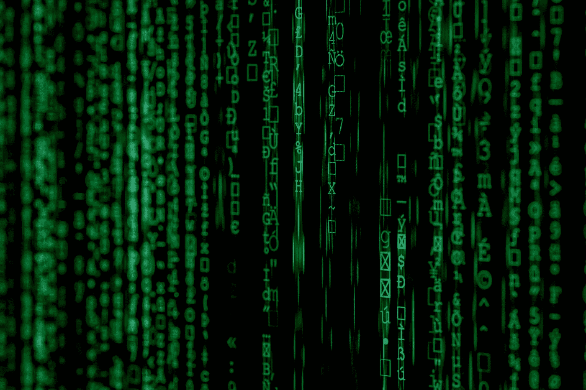

# 13 除了为编码者编码之外的其他“C”

> 原文：<https://levelup.gitconnected.com/13-other-c-besides-coding-for-coder-98877764f0fc>

## 程序员的生活

## 学习成为一个更全面的程序员，并在编码职业中出类拔萃

Nikhil Mitra 在 [Unsplash](https://unsplash.com?utm_source=medium&utm_medium=referral) 上拍摄的照片

W 程序员是做什么的？当然是编码！我们学习编程语言，我们继续生产代码。这是我们的工作定义。对！？

 [## 编码是未来。你准备好了吗？

### 不要因为每个人都说它好就去做

medium.com](https://medium.com/illumination/what-it-takes-to-be-a-software-developer-b6a677adfd33) 

不完全是。编码只是手段。它的作用不止于此。知道一个程序员还需要做什么，将会更好地促进他的职业发展。

做其他的事情，而不是编码，来建立你的程序员生涯。

> 知道一个程序员还需要做什么，将会更好地促进他的职业发展。

# 1.组成

Johannes Plenio 在 [Unsplash](https://unsplash.com?utm_source=medium&utm_medium=referral) 上拍摄的照片

就像演奏一件乐器一样，创作自己的曲子和演奏别人的曲子是非常不同的。

编码不仅是一样的，事实上，它更严格。与音乐不同，你不应该复制别人的全部代码，然后构建完全相同的产品。

所以你不只是编码。为了编码，你需要计划，适当地构建设计，确保你的代码是可持续的，并且是经过未来检验的。需要大量的思考和计划。

干净的建筑？固体？MVVM？MVP？等等，这些只是模板，你必须使它们适应你的特定产品场景，以使它工作得最好。

这就是为什么有人说，编程是一门艺术😊

# 2.收集

由 [Markus Spiske](https://unsplash.com/@markusspiske?utm_source=medium&utm_medium=referral) 在 [Unsplash](https://unsplash.com?utm_source=medium&utm_medium=referral) 上拍摄的照片

你什么意思？当然，我们编码和编译！

抱歉，我知道这听起来很明显。我真正的意思不仅仅是编译。

我的意思是，编码人员不只是编码和编译，编码人员还负责产品的部署。

在 web 环境中，如何从开发环境推进到测试环境、生产环境等。在移动应用程序环境中，是如何推进到 AppStore 或 PlayStore，并监控发布的稳定性。

对于一个程序员来说，这是一个非常重要的知识，对整个产品发布周期有一个更广阔的视野。所以这不仅仅是编码。

# 3.创造

格伦·卡丽在 [Unsplash](https://unsplash.com?utm_source=medium&utm_medium=referral) 拍摄的照片

程序员编写代码、编译和构建软件。这听起来很简单。

但是在一个人编码甚至是建筑师如何编码之前，他需要知道什么是可能创造的。

产品经理会去找开发人员，询问他们的意见，并听取他们对这个想法可行性的意见。开发人员可能不会最终决定要创建什么，但是他们的输入在提供可行的选项和什么是最好的方面绝对举足轻重。

因此，在一个产品被有形地创造出来之前，在一个单独的代码被写出来之前，它就已经在程序员的头脑中被创造出来了。

# 4.检查

照片由[信托“Tru”kat sande](https://unsplash.com/@iamtru?utm_source=medium&utm_medium=referral)在 [Unsplash](https://unsplash.com?utm_source=medium&utm_medium=referral) 拍摄

测试。是的，测试非常重要…但是

这不仅仅是说创建手动测试或创建单元测试，而且在编码时，人们必须考虑所有可能涉及的极限情况，以确保事情被健壮地覆盖。

另一个检查，哪个程序员不仅仅是写代码。那就是调试！！

预见问题、调试和识别问题根本原因的技能是区分一个程序员与另一个程序员的生产力的关键。

# 5.改正

[freestocks](https://unsplash.com/@freestocks?utm_source=medium&utm_medium=referral) 在 [Unsplash](https://unsplash.com?utm_source=medium&utm_medium=referral) 上拍照

当然是修复 bug 啦！

但不仅仅是这样。我们从来不希望我们需要达到修复 bug 的阶段。这是任何一个程序员最不希望做的事情，尽管在现实中，每个程序员都必须这么做。

在纠正时，我也指代码审查，即识别代码违规(不一定只是 bug，还可以寻找最佳实践的缺失等)，并纠正它。当我们改变需求时，不时地重构代码，等等。

此外，还要寻求流程改进，以确保可以避免陷阱和提高周转时间等。

# 6.控制

马克·利什曼在 [Unsplash](https://unsplash.com?utm_source=medium&utm_medium=referral) 上的照片

一个软件的可维护性，不仅仅是代码写得有多好，还有围绕它的过程。

我们需要一个管理代码应该如何编写和维护的过程，管理问题和任务的适当工具，适当的自动化来确保我们可以一致地检查软件的基本要素，而我们对它进行更改，等等。

虽然其中一些将涉及脚本(如编码)，但大部分需要在识别可持续过程中的操作成熟度。太多会拖慢一切；太少会冒一切风险。平衡法案。

# 7.连接

照片由 [Ricardo Gomez Angel](https://unsplash.com/@ripato?utm_source=medium&utm_medium=referral) 在 [Unsplash](https://unsplash.com?utm_source=medium&utm_medium=referral) 拍摄

在当今世界，软件不再是孤立存在的。

没有一个软件是完全独立构建的，而是与其他系统相连的。像一个移动应用程序，需要一个后端服务器来提供数据。它还可以连接到其他服务，如分析、崩溃跟踪等。

因此，开发者不仅需要学习如何为自己的系统编码，还需要了解软件所使用的生态系统。其他系统可能不是用他们熟悉的语言构建的，但仍然需要学习。

不仅仅是编码，使用周围系统和工具的能力使一个编码者更加熟练。

# 8.比较

Elena Mozhvilo 在 [Unsplash](https://unsplash.com?utm_source=medium&utm_medium=referral) 上拍摄的照片

你的软件性能如何？有多少人访问它？

或者更抽象一点，用户有多喜欢你的软件？

测量，测量，测量。没有测量，就没有改进。你想展示你的代码有多好，没有度量，什么都量化不了。绝对不是代码行数。

比如，什么是无崩溃率，你的应用程序的用户评级，一个人使用你的软件的时间，等等，将被用来量化软件有多成功。

量化和显示进展的能力对于代码显示他们的工作结果是很重要的。

# 9.压缩

照片由 [JJ 英](https://unsplash.com/@jjying?utm_source=medium&utm_medium=referral)在 [Unsplash](https://unsplash.com?utm_source=medium&utm_medium=referral)

换句话说，这就是通话改善。压榨到最后一滴可能的改善。

它可以是软件加载时间、编译时间、软件大小、内存使用，甚至是不太受编码器直接控制的东西，例如用户参与度、用户评级、降低的崩溃率等。

我们能做些什么来进一步提高(或降低)这些数字？不仅仅是编码可以帮助所有这些。有些需要更多的创造性思维。例如，要获得用户评级，我们需要提示用户评级。提示错误的用户评级，激怒他们会适得其反。

# 10.合作

照片由[汉娜·布斯](https://unsplash.com/@hannahbusing?utm_source=medium&utm_medium=referral)在 [Unsplash](https://unsplash.com?utm_source=medium&utm_medium=referral) 拍摄

最好的软件不再是由一个人或一种语言在一个系统中编写的。

软件是建立在软件之上的。几个伟大的头脑聚在一起，把代码放在一起，并建立一些伟大的东西。一个电脑迷可以成为一名黑客，但他不可能独自开发一个价值数百万的软件。

因此，编码人员与其他人一起工作的能力，利用他人工作的能力，坚持标准惯例(尽管并不同意所有的事情)以确保符合性的能力，对于确保一个合适的软件能够被交付是至关重要的。

所以请不要争论使用空格还是制表符，好吗？

 [## 程序员的三场战争以及它们将如何结束

### 几十年来对琐事的争论，会结束吗？

levelup.gitconnected.com](/the-3-wars-of-programmers-and-how-will-they-end-37fabaa0e37b) 

# 11.大学教育

照片由 [Avel Chuklanov](https://unsplash.com/@chuklanov?utm_source=medium&utm_medium=referral) 在 [Unsplash](https://unsplash.com?utm_source=medium&utm_medium=referral) 上拍摄

好吧，没有这个词， **Colleging** 。我只想说明**持续学习。**

编码是当今世界上变化最快的职业之一。五年前的知识可以被认为是过时的。当时流行的编程语言现在已经不能满足今天的期望了。

软件是为了改变。因此，变化是软件将继续发生的事情。作为一名程序员，在学会了一门语言之后，就要追求掌握这门语言。在一个人掌握了一种语言之后，再去学习另一种语言。需要熟悉的工具和服务也是如此。

改变或被改变。

# 12.手工制作

茱莉亚·贝尔泰利在 [Unsplash](https://unsplash.com?utm_source=medium&utm_medium=referral) 上的照片

编码是艺术。编码很有趣。

寻找如何优化它的代码是有趣的。探索如何改进一个算法就像解决一个难题。

激情是另一个词，是程序员从事这个职业所必需的。没有那种激情，编码职业会害死一个人。一个人需要好奇。一个人需要热爱他正在做的事情。

实际上编码也是一门艺术。没有一种理想的方式来完成事情，总有不同的方法，很多事情既没有对错，只是一种偏好。

# 13.欺骗的

照片由[jusdoveyage](https://unsplash.com/@jusdevoyage?utm_source=medium&utm_medium=referral)在 [Unsplash](https://unsplash.com?utm_source=medium&utm_medium=referral) 上拍摄

13 不是一个好数字。所以让我们做点不那么好的事情。亦即**作弊**🤪

我实际上指的是变通办法，借一些技术债。

有时，由于商业机会，我们必须在追求完美和生产时间之间取得平衡。这个世界不是一个理想的世界。有时，我们需要更快的速度，也许只是短时间的一点点，然后我们可以在以后偿还技术债务。

即使选择一种不正当的方式，也需要明智地选择一种将来可以偿还的方式。权衡以后的支付成本和现在的收益。这不仅仅是编码技能。

 [## 实用技术债务优先级

### 并非所有的科技债务都可以等待。并非所有的科技债务都必须解决

medium.com](https://medium.com/better-programming/practical-tech-debts-prioritization-443aa7c43e21) 

C 不仅仅是为编码者编码。除了学习编码，程序员还需要发展许多技能。这些技能和才能不仅会使一个人在其他领域出类拔萃，还会提高一个人的编码能力。让我们去找他们…

> 如果你找到了其他 C 语言的程序员，请随意分享…