# 为什么是时候开始学习编程的 13 个理由

> 原文：<https://levelup.gitconnected.com/13-reasons-why-its-high-time-to-start-learning-to-program-ea21ecff1458>

约翰·施诺布里奇在 [Unsplash](https://unsplash.com/?utm_source=unsplash&utm_medium=referral&utm_content=creditCopyText) 上的照片

随着技术的发展，软件开发正以闪电般的速度流行起来。与大多数其他主流职业相比，对正规开发人员的需求很高。但是，学习编码的其他原因是什么呢？

鉴于我作为一名软件工程师和 Java 导师的经验，我想出了许多理由，在这篇博客文章中，我将与你分享它们。希望他们会引导你做出明智的决定。

# 1.丰厚的薪水

薪水是编程环境中经常讨论的话题。与许多其他行业相比，软件工程专业人员的平均工资要高得多。

为了避免罗嗦并证明你是未来的高需求专家，我将根据来自 [Glassdoor](https://www.glassdoor.com/index.htm) 工作和招聘网站的数据给你真实的数字。工资率是服务年限和所有地理数据之间的平均值。还要看你掌握的编码语言。

*   Java 开发人员——79，137 美元/年
*   Python 开发人员——76，526 美元/年
*   JavaScript 开发人员——79，137 美元/年
*   Go 开发者—75，715 美元/年
*   Ruby 开发者——75，715 美元/年
*   C Net 开发人员—75，715 美元/年
*   Swift 开发人员—75，715 美元/年
*   C++开发人员——76，526 美元/年

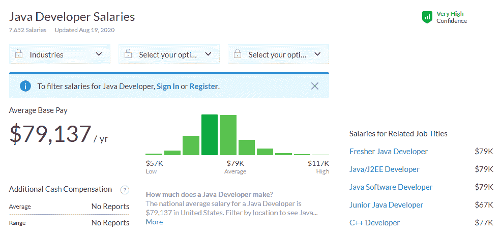

# 2.行业稳定性

软件开发是就业相对稳定的行业之一。与许多其他职业不同，即使在疫情时期，计算机专业活动也面临着低得多的失业率。见下表。

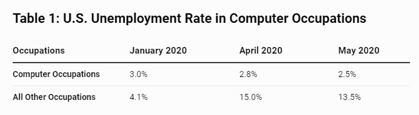

尽管该行业足够稳定，但技术发展很快，这意味着专家们在 2-5-10 年内很难使用他们现在拥有的所有技能。好消息是，许多 IT 公司都致力于软件工程师的职业发展，因为使用现代工具最终会导致他们的商业成功。所以，如果你不断更新技能，就不用担心失业。

# 3.职业机会

当然，当你擅长编码时，你可以选择。你可以决定你是想加入大公司还是小公司做程序员。你可以自己创业，也可以选择做自由职业者，不拘泥于一个地方。你很有可能得到一份工作，然后搬到另一个国家重新定居。一切取决于你的目标。

# 4.添加到简历中的额外技能

知道如何编程不仅能改善你的思维方式，还能让你的简历脱颖而出，即使你从事的是间接活动，比如软件测试、数字设计、系统管理、商业或数据分析师。提及你擅长编程会让招聘经理更好地了解你批判性思考和快速掌握高级话题的能力。

# 5.成为数字游牧者

在家工作或远程工作在软件行业是一种常见的做法，比其他任何行业都要普遍。然而，和其他地方一样，软件开发人员分成了两个阵营:梦想远程工作的人和远离远程工作的人。对第二类人来说，好消息是全世界对熟练开发人员的需求很高。除此之外，寻找 IT 专家的公司通常会确保协助搬迁。

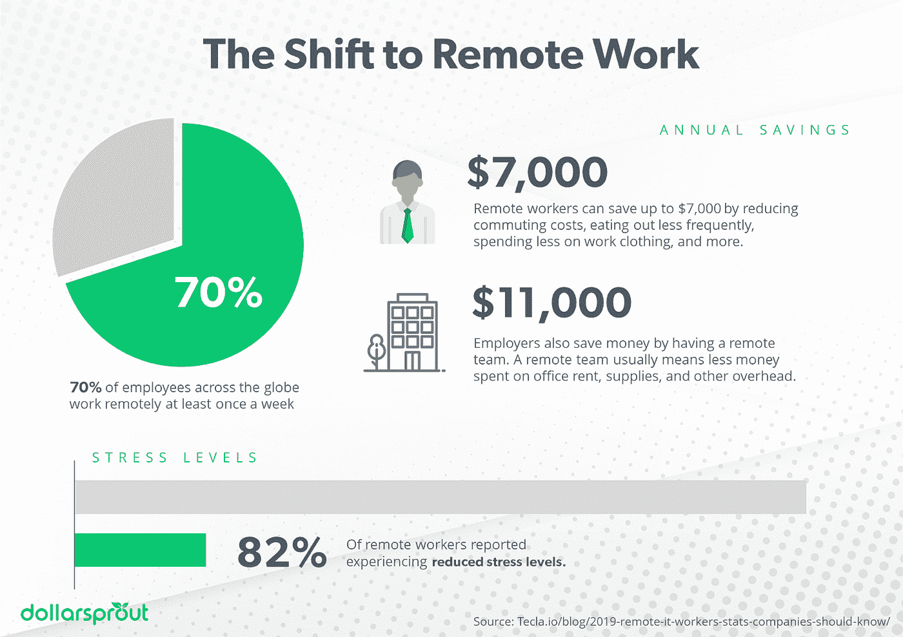

# 6.能够制定自己的时间表

许多致力于优化工作流程的公司都允许员工每周远程工作几天。软件开发公司也不例外。负责照顾团队成员的高级经理通常会批准弹性工作时间，关注的是你取得的成果，而不是你在电脑前花费的时间。当开发者要求休假时，他们甚至不会变得歇斯底里。

# 7.积极的工作场所文化

与许多其他行业相比，软件工程可以拥有友好的工作氛围。当然，没有 100%的保证你不会遇到讨厌的人，但是你仍然可以通过监控不同公司的反馈来避免任何糟糕的工作环境。此外，现代软件公司努力创造环境，让专家们做高质量的工作并感到快乐。例如，为此，他们实施反馈和一对一会议来与您保持联系。

# 8.大量的手工资源

当你手里有足够的教育资源时，学习编程并不那么具有挑战性。

论坛、在线课程、游戏化教程和其他学习门户网站，如下面列出的，允许开发者分享知识并与其他专家合作。

*   Stack Overflow 是一个开放的社区，为你最棘手的代码相关问题提供答案，分享知识，并获得一份理想的工作。

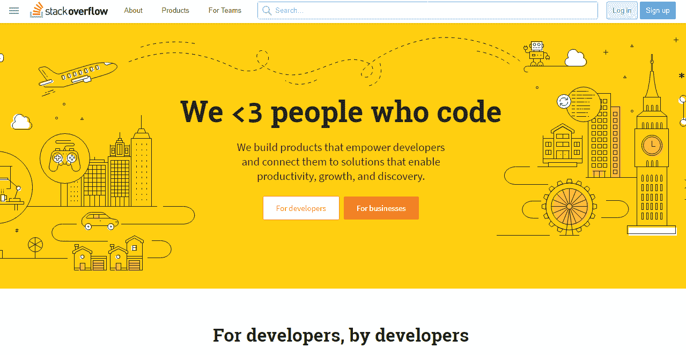

[Reddit](http://www.reddit.com/) 是一个所谓的新闻网站，其用户在这里分享与不同主题相关的内容。它被分成子编辑，所以你可以很容易地过滤掉所有你不需要的东西。

*   [r/Programmers](https://www.reddit.com/r/Programmers/) 是一个社区，软件工程师可以在这里讨论不同的话题，不管他们用什么语言编程。
*   [r/Programming](https://www.reddit.com/r/programming/) 是一个包含大量编程相关主题的子编辑。
*   [r/AskProgrammers](https://www.reddit.com/r/AskProgrammers/) 是一个社区，在这里你可以问一切与编程有关的问题。
*   [r/LearnProgramming](https://www.reddit.com/r/learnprogramming/) 是初学者和中级程序员询问如何开始学习用不同语言编程的理想资源。
*   r/Software 是一个发布软件新闻、评论和讨论的地方。
*   [r/Hardware](https://www.reddit.com/r/hardware/) 是硬件新闻、评论和讨论的地方。
*   如果你想开始一个关于 web 开发的话题，r/WebDev 被认为是核心子编辑。
*   [r/Frontend](https://www.reddit.com/r/Frontend/) subreddit 包含了与前端开发相关的一切。
*   subreddit 结合了讨论主题、常见问题和 it 世界的最新消息，对于尚未决定自己想学什么的初学者来说非常重要。

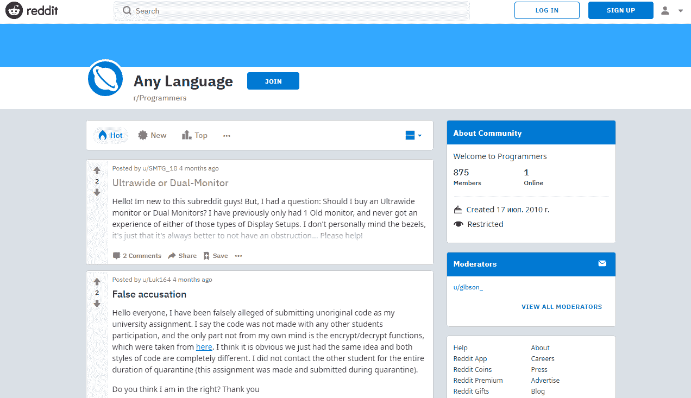

*   [SitePoint](https://www.sitepoint.com/community/) 指的是另一个社区，旨在支持程序员和设计师，帮助初学者理解他们选择的语言，以及商业、营销和其他相关领域的其他用户。

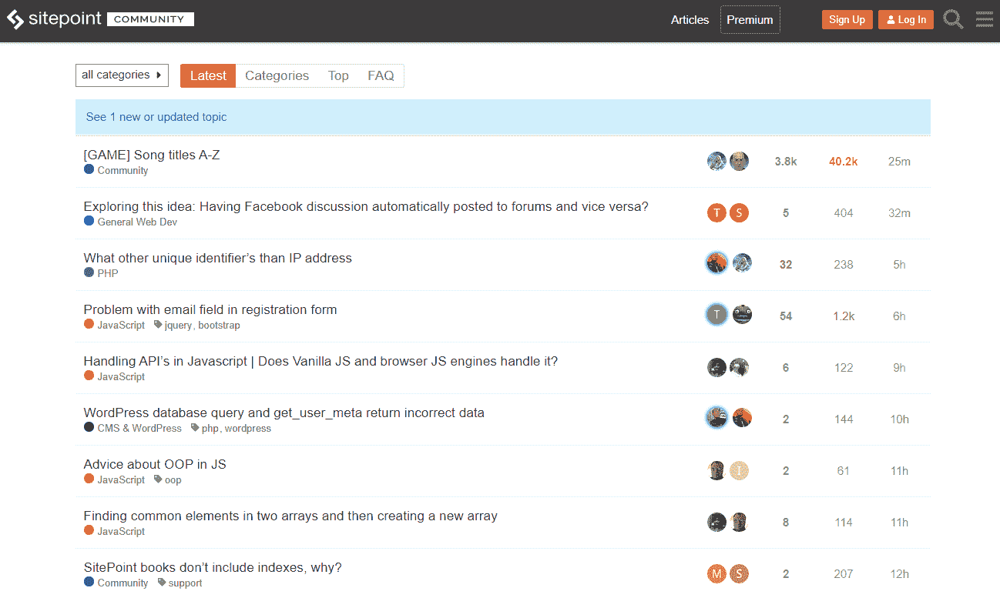

*   CodeProject 社区汇集了大量关于 web 和软件开发、编程语言等的文章和教程。

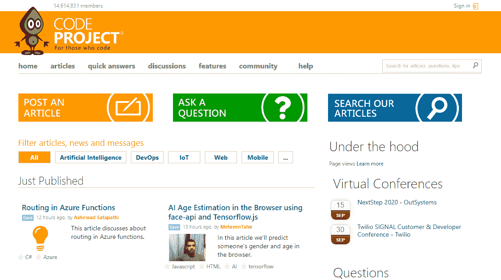

*   黑客新闻资源收集关于黑客世界的最新消息。

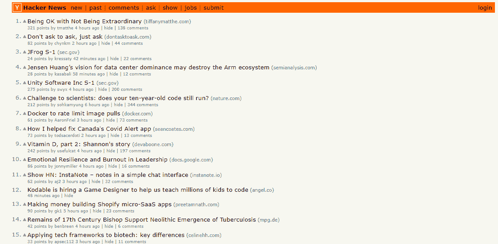

教程或在线课程提供了教育材料，让您按照自己的进度获取编码知识。我建议考虑以下几个。

*   [Gitconnected](https://gitconnected.com) 是开发者为开发者打造的一个分享知识、交流、学习的平台。

*   CareerFoundry 是一个提供全面指导的课程和项目的网站，旨在帮助你获得科技行业的知识和技能，并找到一份高薪工作。

*   [Coursera](https://www.coursera.org) 是一个在线教育平台，人们可以免费注册许多课程，也可以选择付费课程。该网站列出了许多编程课程，例如:
*   [计算机科学与编程导论](https://www.coursera.org/specializations/introduction-computer-science-programming?ranMID=40328&ranEAID=3PhbAxfdARQ&ranSiteID=3PhbAxfdARQ-ewJMxxE6mcbnNGsM.Plqow&siteID=3PhbAxfdARQ-ewJMxxE6mcbnNGsM.Plqow&utm_content=10&utm_medium=partners&utm_source=linkshare&utm_campaign=3PhbAxfdARQ)
*   [R 编程](https://www.coursera.org/learn/r-programming?ranMID=40328&ranEAID=3PhbAxfdARQ&ranSiteID=3PhbAxfdARQ-kJdzY5A9R3FavIxABMW3YA&siteID=3PhbAxfdARQ-kJdzY5A9R3FavIxABMW3YA&utm_content=10&utm_medium=partners&utm_source=linkshare&utm_campaign=3PhbAxfdARQ)
*   [Java 编程与软件工程基础](https://learntocodewith.me/coursera-java-software-engineering)等。

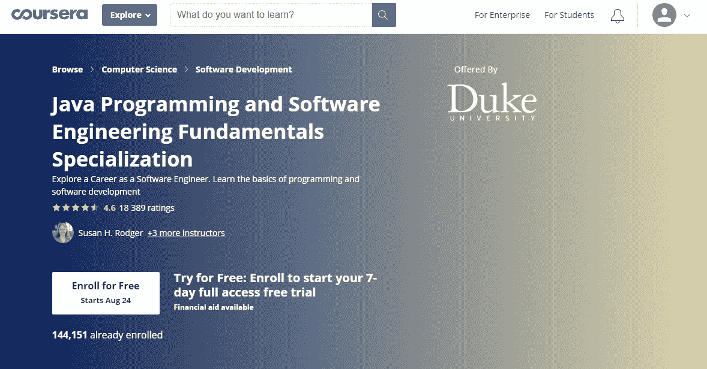

*   Web 文档是一个必备的工具，它让开发人员在寻找问题的解决方案时变得更加容易。作为程序员，你可以使用 MDN Web Docs、W3Schools 或 devdocs.io。

*   LearnCode.academy 是 YouTube 的一个频道，涵盖了大量与软件开发相关的主题。它还为初学者提供教程，为有经验的程序员提供高级 web 开发工具。

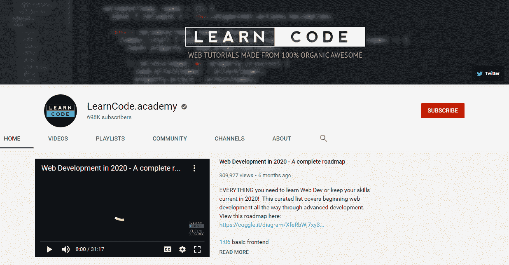

发展解决问题的技能是所有工程师必须具备的。为此，我总是向我的学生推荐几个网站。它们包括:

*   CodeGym 是一个在线学习课程，它会让你编写大量的代码。不管你愿不愿意，但实践是帮助你巩固所学知识和磨练技能的。有了用最新技术构建的 CodeGym 课程，学习 Java 语言就不会感到无聊。

*   Codecademy 提供了大量与不同编程语言相关的免费培训材料。他们既适合新手也适合有经验的开发人员，他们希望将他们的知识应用到交付不同的项目中。

*   [Java 重温](https://medium.com/javarevisited)资源提供了一种学习 Java 语言的混合方法，提供了大量的实践课程以及全面的理论材料，将指导您完成使用 Java 编写代码的每一步。

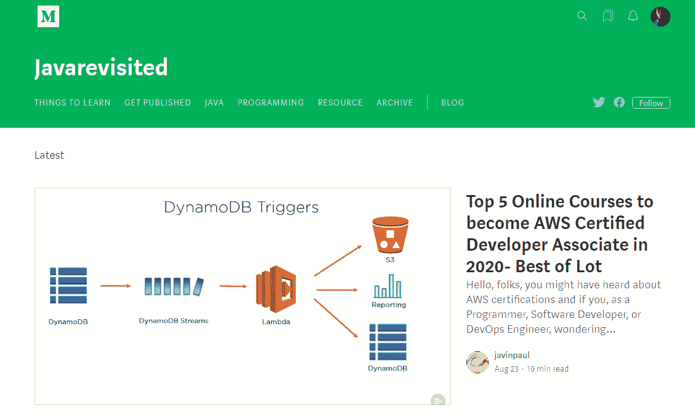

*   [Codewars](https://www.codewars.com) 网站更适合至少有基本编程经验的学生，以及希望通过完成动手的复杂任务来磨练技能的学生。

*   [Codepip](https://codepip.com) 是另一个独特的平台，它将游戏技术应用到学习过程中，使后者更加有效。

*   FreeCodeCamp 平台提供了大量免费教程，让初学者从培训的最开始就开始编写代码。完成实践级别后，您甚至可以报名参加为类似的非营利组织创建项目。

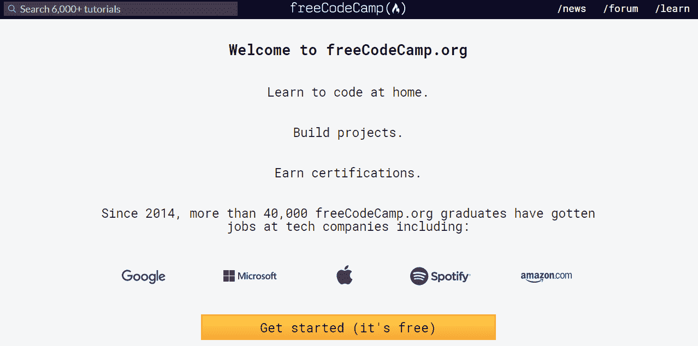

# 9.提高沟通技巧的方法

IT 世界可以极大地提高你的沟通和协作技能。构建社交媒体平台、移动应用或任何其他数字项目需要团队努力来加快进程，并避免单个程序员可能碰巧错过的错误。通常，像 Scrum 和看板这样的方法可以帮助你做到这一点，让合作变得更容易。

所以，如果你想在软件行业找到一份工作，你必须准备好和人们一起工作，并更多地了解他们。

# 10.建设酷项目的绿灯

自从我做程序员以来，我见过许多不同的项目，有趣的和奇怪的。除了为您的客户建立项目，您还可以创建您喜欢的产品并成功推出它们。

例如，有一次我创建了一个“猫的关怀”的工作原型，它包括一个带有自动喂食系统的猫的声音识别系统。因为该系统是自动化的，它可以识别宠物是否想喝水或吃东西，如果家里没有人，它会给一部分食物。除此之外，该应用程序可以通过语音识别猫是否生病，但它仍在开发中。

我做的另一个项目和音乐有关。我有一个堂兄是钢琴家，我们和他一起建立了一个听觉训练项目。

所以，你看，你可以做任何事情——所有的赌注都取消了。

# 11.永久工作机会

与不同行业的其他专家相比，工程师是非常忙碌的专家。由于工作量大，他们往往不得不拒绝招聘人员。你知道很多行业，猎头都在字面上为你而战吗？顺便说一下，招聘人员一直都是猎头开发人员——在我的 LinkedIn 个人资料上，我总能收到来自不同公司的新邀请。尽管如此，经验丰富的专家需求量很大，待遇也不错。

# 12.支持性社区

IT 社区是软件环境中另一个讨论最多的话题。它是积极的和支持性的，这意味着你永远不会独自面对一个已经发生的问题。幸运的是，有多个论坛、问答网站和我最近提到的其他讨论平台，你可以在那里寻求帮助。栈溢出、媒体、子编辑、YouTube 频道和脸书群组只是你可以找到软件解决方案的几个地方。要在现实生活中认识其他开发人员，我建议访问有很多活动的 Meetup。

# 13.不用花一大笔钱就能创办自己的公司

如果你想启动一个新公司，例如网络或移动应用程序，你需要在预算中为开发人员或整个团队增加额外支出。预算的 5000-6000 美元可能很容易以花费在软件开发上的 20000 美元结束。这就是编码技能发挥作用的地方。知道如何编程可以为您节省一美元，并让您设计、构建、测试运行和更改您的项目，而无需依赖他人。编码知识给你很大的自由度。

# 结尾词

在准备这篇博文时，我真诚地希望它能鼓励你开始学习编码，或者在你绝望和想要放弃的时候支持你。如果这篇文章对你有所帮助，并且你知道有人也能从这篇文章中受益，一定要把它分享给你的同龄人。