# 14 个顺风 CSS 自定义窗体

> 原文：<https://levelup.gitconnected.com/14-tailwind-css-custom-forms-e17d72f6621>

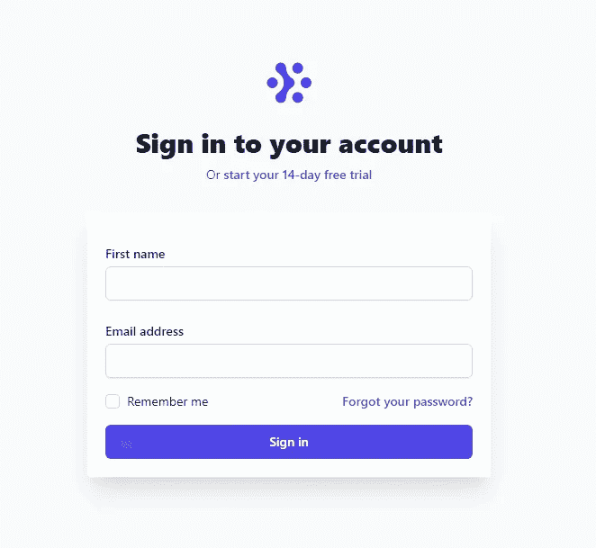

Tailwind CSS 文档提供了免费的示例组件。

其中一些是表单布局和输入。

我将展示这些基本的顺风表单组件，还将包括一些 CodePen 项目，以获得一些如何定制自己的顺风 CSS 表单的额外示例。

# **如何将顺风 CSS 添加到项目中**

**通过 CDN 添加顺风 CSS**

*带有顺风 CSS CDN 的 HTML 模板*

```
<!doctype html>
<html lang="en">
  <head>
    <!-- Required meta tags -->
    <meta charset="utf-8">
    <meta name="viewport" content="width=device-width, initial-scale=1">

    <!-- Tailwind CSS -->
    <link href="https://unpkg.com/tailwindcss@^2/dist/tailwind.min.css" rel="stylesheet">

    <title>Tailwind CSS CDN - Get Started</title>
  </head>
  <body>

  </body>
</html>
```

截至本文发表时，Tailwind 目前的版本是 2.0.3。将一个样式表 CDN 嵌套在`<head>`元素中，以使用基本的类属性值。

但是，您只能使用默认的顺风主题。

**顺风 CSS 下载整合**

如果你正在使用 Django，看看如何[将 Tailwind CSS 集成到 Django 项目](../../../blog/article/django-tailwind)。

如果你正在使用 React，请遵循[如何使用 React 应用程序使用 Tailwind CSS](../../../blog/article/reactjs-tailwindcss)。

访问官方[顺风文档](https://tailwindcss.com/docs/installation)获取更多集成指南。

# **自由顺风 CSS 表单组件**

首先，让我们来看看 Tailwind CSS 文档中提供的表单组件。

**顺风 CSS 剖面图**

*浏览器中的顺风 CSS 剖面图*

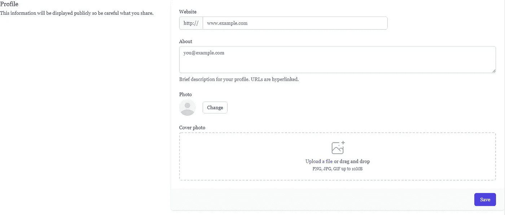

*顺风 CSS 档案表单 HTML*

```
<div>
  <div class="md:grid md:grid-cols-3 md:gap-6">
    <div class="md:col-span-1">
      <div class="px-4 sm:px-0">
        <h3 class="text-lg font-medium leading-6 text-gray-900">Profile</h3>
        <p class="mt-1 text-sm text-gray-600">
          This information will be displayed publicly so be careful what you share.
        </p>
      </div>
    </div>
    <div class="mt-5 md:mt-0 md:col-span-2">
      <form action="#" method="POST">
        <div class="shadow sm:rounded-md sm:overflow-hidden">
          <div class="px-4 py-5 bg-white space-y-6 sm:p-6">
            <div class="grid grid-cols-3 gap-6">
              <div class="col-span-3 sm:col-span-2">
                <label for="company_website" class="block text-sm font-medium text-gray-700">
                  Website
                </label>
                <div class="mt-1 flex rounded-md shadow-sm">
                  <span class="inline-flex items-center px-3 rounded-l-md border border-r-0 border-gray-300 bg-gray-50 text-gray-500 text-sm">
                    http://
                  </span>
                  <input type="text" name="company_website" id="company_website" class="focus:ring-indigo-500 focus:border-indigo-500 flex-1 block w-full rounded-none rounded-r-md sm:text-sm border-gray-300" placeholder="www.example.com">
                </div>
              </div>
            </div>

            <div>
              <label for="about" class="block text-sm font-medium text-gray-700">
                About
              </label>
              <div class="mt-1">
                <textarea id="about" name="about" rows="3" class="shadow-sm focus:ring-indigo-500 focus:border-indigo-500 mt-1 block w-full sm:text-sm border-gray-300 rounded-md" placeholder="you@example.com"></textarea>
              </div>
              <p class="mt-2 text-sm text-gray-500">
                Brief description for your profile. URLs are hyperlinked.
              </p>
            </div>

            <div>
              <label class="block text-sm font-medium text-gray-700">
                Photo
              </label>
              <div class="mt-1 flex items-center">
                <span class="inline-block h-12 w-12 rounded-full overflow-hidden bg-gray-100">
                  <svg class="h-full w-full text-gray-300" fill="currentColor" viewBox="0 0 24 24">
                    <path d="M24 20.993V24H0v-2.996A14.977 14.977 0 0112.004 15c4.904 0 9.26 2.354 11.996 5.993zM16.002 8.999a4 4 0 11-8 0 4 4 0 018 0z" />
                  </svg>
                </span>
                <button type="button" class="ml-5 bg-white py-2 px-3 border border-gray-300 rounded-md shadow-sm text-sm leading-4 font-medium text-gray-700 hover:bg-gray-50 focus:outline-none focus:ring-2 focus:ring-offset-2 focus:ring-indigo-500">
                  Change
                </button>
              </div>
            </div>

            <div>
              <label class="block text-sm font-medium text-gray-700">
                Cover photo
              </label>
              <div class="mt-1 flex justify-center px-6 pt-5 pb-6 border-2 border-gray-300 border-dashed rounded-md">
                <div class="space-y-1 text-center">
                  <svg class="mx-auto h-12 w-12 text-gray-400" stroke="currentColor" fill="none" viewBox="0 0 48 48" aria-hidden="true">
                    <path d="M28 8H12a4 4 0 00-4 4v20m32-12v8m0 0v8a4 4 0 01-4 4H12a4 4 0 01-4-4v-4m32-4l-3.172-3.172a4 4 0 00-5.656 0L28 28M8 32l9.172-9.172a4 4 0 015.656 0L28 28m0 0l4 4m4-24h8m-4-4v8m-12 4h.02" stroke-width="2" stroke-linecap="round" stroke-linejoin="round" />
                  </svg>
                  <div class="flex text-sm text-gray-600">
                    <label for="file-upload" class="relative cursor-pointer bg-white rounded-md font-medium text-indigo-600 hover:text-indigo-500 focus-within:outline-none focus-within:ring-2 focus-within:ring-offset-2 focus-within:ring-indigo-500">
                      <span>Upload a file</span>
                      <input id="file-upload" name="file-upload" type="file" class="sr-only">
                    </label>
                    <p class="pl-1">or drag and drop</p>
                  </div>
                  <p class="text-xs text-gray-500">
                    PNG, JPG, GIF up to 10MB
                  </p>
                </div>
              </div>
            </div>
          </div>
          <div class="px-4 py-3 bg-gray-50 text-right sm:px-6">
            <button type="submit" class="inline-flex justify-center py-2 px-4 border border-transparent shadow-sm text-sm font-medium rounded-md text-white bg-indigo-600 hover:bg-indigo-700 focus:outline-none focus:ring-2 focus:ring-offset-2 focus:ring-indigo-500">
              Save
            </button>
          </div>
        </div>
      </form>
    </div>
  </div>
</div>
```

第一个文档示例是概要信息表单。

该表单包含网站的文本输入、about 部分的文本区域和个人资料图像的文件上传输入。

**顺风社个人信息表**

*浏览器中的顺风 CSS 个人信息表单*

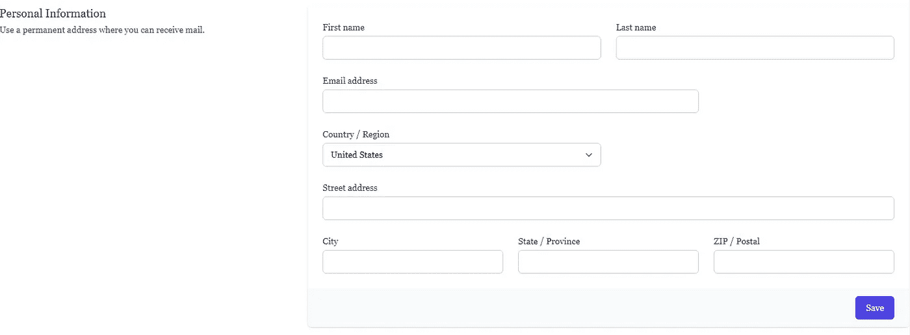

*顺风 CSS 个人信息表单 HTML*

```
<div class="mt-10 sm:mt-0">
  <div class="md:grid md:grid-cols-3 md:gap-6">
    <div class="md:col-span-1">
      <div class="px-4 sm:px-0">
        <h3 class="text-lg font-medium leading-6 text-gray-900">Personal Information</h3>
        <p class="mt-1 text-sm text-gray-600">
          Use a permanent address where you can receive mail.
        </p>
      </div>
    </div>
    <div class="mt-5 md:mt-0 md:col-span-2">
      <form action="#" method="POST">
        <div class="shadow overflow-hidden sm:rounded-md">
          <div class="px-4 py-5 bg-white sm:p-6">
            <div class="grid grid-cols-6 gap-6">
              <div class="col-span-6 sm:col-span-3">
                <label for="first_name" class="block text-sm font-medium text-gray-700">First name</label>
                <input type="text" name="first_name" id="first_name" autocomplete="given-name" class="mt-1 focus:ring-indigo-500 focus:border-indigo-500 block w-full shadow-sm sm:text-sm border-gray-300 rounded-md">
              </div>

              <div class="col-span-6 sm:col-span-3">
                <label for="last_name" class="block text-sm font-medium text-gray-700">Last name</label>
                <input type="text" name="last_name" id="last_name" autocomplete="family-name" class="mt-1 focus:ring-indigo-500 focus:border-indigo-500 block w-full shadow-sm sm:text-sm border-gray-300 rounded-md">
              </div>

              <div class="col-span-6 sm:col-span-4">
                <label for="email_address" class="block text-sm font-medium text-gray-700">Email address</label>
                <input type="text" name="email_address" id="email_address" autocomplete="email" class="mt-1 focus:ring-indigo-500 focus:border-indigo-500 block w-full shadow-sm sm:text-sm border-gray-300 rounded-md">
              </div>

              <div class="col-span-6 sm:col-span-3">
                <label for="country" class="block text-sm font-medium text-gray-700">Country / Region</label>
                <select id="country" name="country" autocomplete="country" class="mt-1 block w-full py-2 px-3 border border-gray-300 bg-white rounded-md shadow-sm focus:outline-none focus:ring-indigo-500 focus:border-indigo-500 sm:text-sm">
                  <option>United States</option>
                  <option>Canada</option>
                  <option>Mexico</option>
                </select>
              </div>

              <div class="col-span-6">
                <label for="street_address" class="block text-sm font-medium text-gray-700">Street address</label>
                <input type="text" name="street_address" id="street_address" autocomplete="street-address" class="mt-1 focus:ring-indigo-500 focus:border-indigo-500 block w-full shadow-sm sm:text-sm border-gray-300 rounded-md">
              </div>

              <div class="col-span-6 sm:col-span-6 lg:col-span-2">
                <label for="city" class="block text-sm font-medium text-gray-700">City</label>
                <input type="text" name="city" id="city" class="mt-1 focus:ring-indigo-500 focus:border-indigo-500 block w-full shadow-sm sm:text-sm border-gray-300 rounded-md">
              </div>

              <div class="col-span-6 sm:col-span-3 lg:col-span-2">
                <label for="state" class="block text-sm font-medium text-gray-700">State / Province</label>
                <input type="text" name="state" id="state" class="mt-1 focus:ring-indigo-500 focus:border-indigo-500 block w-full shadow-sm sm:text-sm border-gray-300 rounded-md">
              </div>

              <div class="col-span-6 sm:col-span-3 lg:col-span-2">
                <label for="postal_code" class="block text-sm font-medium text-gray-700">ZIP / Postal</label>
                <input type="text" name="postal_code" id="postal_code" autocomplete="postal-code" class="mt-1 focus:ring-indigo-500 focus:border-indigo-500 block w-full shadow-sm sm:text-sm border-gray-300 rounded-md">
              </div>
            </div>
          </div>
          <div class="px-4 py-3 bg-gray-50 text-right sm:px-6">
            <button type="submit" class="inline-flex justify-center py-2 px-4 border border-transparent shadow-sm text-sm font-medium rounded-md text-white bg-indigo-600 hover:bg-indigo-700 focus:outline-none focus:ring-2 focus:ring-offset-2 focus:ring-indigo-500">
              Save
            </button>
          </div>
        </div>
      </form>
    </div>
  </div>
</div>
```

接下来是个人信息表。它包含名、姓和电子邮件地址三个文本输入。

有一个带有三个预设选项的下拉选择，后面是三个城市、州和邮政编码的文本输入。

**顺风 CSS 通知表**

*浏览器中的顺风 CSS 通知表单*

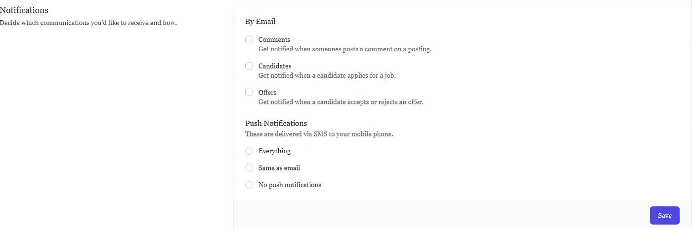

*顺风 CSS 通知表单 HTML*

```
<div class="mt-10 sm:mt-0">
  <div class="md:grid md:grid-cols-3 md:gap-6">
    <div class="md:col-span-1">
      <div class="px-4 sm:px-0">
        <h3 class="text-lg font-medium leading-6 text-gray-900">Notifications</h3>
        <p class="mt-1 text-sm text-gray-600">
          Decide which communications you'd like to receive and how.
        </p>
      </div>
    </div>
    <div class="mt-5 md:mt-0 md:col-span-2">
      <form action="#" method="POST">
        <div class="shadow overflow-hidden sm:rounded-md">
          <div class="px-4 py-5 bg-white space-y-6 sm:p-6">
            <fieldset>
              <legend class="text-base font-medium text-gray-900">By Email</legend>
              <div class="mt-4 space-y-4">
                <div class="flex items-start">
                  <div class="flex items-center h-5">
                    <input id="comments" name="comments" type="checkbox" class="focus:ring-indigo-500 h-4 w-4 text-indigo-600 border-gray-300 rounded">
                  </div>
                  <div class="ml-3 text-sm">
                    <label for="comments" class="font-medium text-gray-700">Comments</label>
                    <p class="text-gray-500">Get notified when someones posts a comment on a posting.</p>
                  </div>
                </div>
                <div class="flex items-start">
                  <div class="flex items-center h-5">
                    <input id="candidates" name="candidates" type="checkbox" class="focus:ring-indigo-500 h-4 w-4 text-indigo-600 border-gray-300 rounded">
                  </div>
                  <div class="ml-3 text-sm">
                    <label for="candidates" class="font-medium text-gray-700">Candidates</label>
                    <p class="text-gray-500">Get notified when a candidate applies for a job.</p>
                  </div>
                </div>
                <div class="flex items-start">
                  <div class="flex items-center h-5">
                    <input id="offers" name="offers" type="checkbox" class="focus:ring-indigo-500 h-4 w-4 text-indigo-600 border-gray-300 rounded">
                  </div>
                  <div class="ml-3 text-sm">
                    <label for="offers" class="font-medium text-gray-700">Offers</label>
                    <p class="text-gray-500">Get notified when a candidate accepts or rejects an offer.</p>
                  </div>
                </div>
              </div>
            </fieldset>
            <fieldset>
              <div>
                <legend class="text-base font-medium text-gray-900">Push Notifications</legend>
                <p class="text-sm text-gray-500">These are delivered via SMS to your mobile phone.</p>
              </div>
              <div class="mt-4 space-y-4">
                <div class="flex items-center">
                  <input id="push_everything" name="push_notifications" type="radio" class="focus:ring-indigo-500 h-4 w-4 text-indigo-600 border-gray-300">
                  <label for="push_everything" class="ml-3 block text-sm font-medium text-gray-700">
                    Everything
                  </label>
                </div>
                <div class="flex items-center">
                  <input id="push_email" name="push_notifications" type="radio" class="focus:ring-indigo-500 h-4 w-4 text-indigo-600 border-gray-300">
                  <label for="push_email" class="ml-3 block text-sm font-medium text-gray-700">
                    Same as email
                  </label>
                </div>
                <div class="flex items-center">
                  <input id="push_nothing" name="push_notifications" type="radio" class="focus:ring-indigo-500 h-4 w-4 text-indigo-600 border-gray-300">
                  <label for="push_nothing" class="ml-3 block text-sm font-medium text-gray-700">
                    No push notifications
                  </label>
                </div>
              </div>
            </fieldset>
          </div>
          <div class="px-4 py-3 bg-gray-50 text-right sm:px-6">
            <button type="submit" class="inline-flex justify-center py-2 px-4 border border-transparent shadow-sm text-sm font-medium rounded-md text-white bg-indigo-600 hover:bg-indigo-700 focus:outline-none focus:ring-2 focus:ring-offset-2 focus:ring-indigo-500">
              Save
            </button>
          </div>
        </div>
      </form>
    </div>
  </div>
</div>
```

最后一个表单提供了三个独立的复选框输入，分别用于注释、候选人和录用电子邮件通知。

然后有三个无线电选择短信输入选项。

**顺风 CSS 签到表**

*浏览器中的顺风 CSS 签到表*

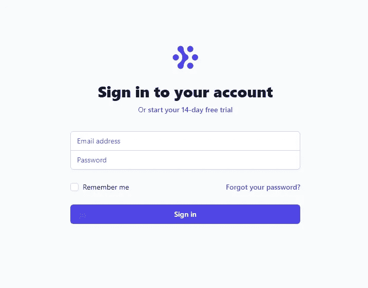

*顺风 CSS 签到表单 HTML*

```
<div class="min-h-screen flex items-center justify-center bg-gray-50 py-12 px-4 sm:px-6 lg:px-8">
		<div class="max-w-md w-full space-y-8">
			<div>
				
				<h2 class="mt-6 text-center text-3xl font-extrabold text-gray-900">
					Sign in to your account
				</h2>
				<p class="mt-2 text-center text-sm text-gray-600">
					Or
					<a href="#" class="font-medium text-indigo-600 hover:text-indigo-500">
						start your 14-day free trial
					</a>
				</p>
			</div>
			<form class="mt-8 space-y-6" action="#" method="POST">
				<input type="hidden" name="remember" value="true">
				<div class="rounded-md shadow-sm -space-y-px">
					<div>
						<label for="email-address" class="sr-only">Email address</label>
						<input id="email-address" name="email" type="email" autocomplete="email" required class="appearance-none rounded-none relative block w-full px-3 py-2 border border-gray-300 placeholder-gray-500 text-gray-900 rounded-t-md focus:outline-none focus:ring-indigo-500 focus:border-indigo-500 focus:z-10 sm:text-sm" placeholder="Email address">
					</div>
					<div>
						<label for="password" class="sr-only">Password</label>
						<input id="password" name="password" type="password" autocomplete="current-password" required class="appearance-none rounded-none relative block w-full px-3 py-2 border border-gray-300 placeholder-gray-500 text-gray-900 rounded-b-md focus:outline-none focus:ring-indigo-500 focus:border-indigo-500 focus:z-10 sm:text-sm" placeholder="Password">
					</div>
				</div>

				<div class="flex items-center justify-between">
					<div class="flex items-center">
						<input id="remember_me" name="remember_me" type="checkbox" class="h-4 w-4 text-indigo-600 focus:ring-indigo-500 border-gray-300 rounded">
						<label for="remember_me" class="ml-2 block text-sm text-gray-900">
							Remember me
						</label>
					</div>

					<div class="text-sm">
						<a href="#" class="font-medium text-indigo-600 hover:text-indigo-500">
							Forgot your password?
						</a>
					</div>
				</div>

				<div>
					<button type="submit" class="group relative w-full flex justify-center py-2 px-4 border border-transparent text-sm font-medium rounded-md text-white bg-indigo-600 hover:bg-indigo-700 focus:outline-none focus:ring-2 focus:ring-offset-2 focus:ring-indigo-500">
						<span class="absolute left-0 inset-y-0 flex items-center pl-3">
							<!-- Heroicon name: solid/lock-closed -->
							<svg class="h-5 w-5 text-indigo-500 group-hover:text-indigo-400"  viewBox="0 0 20 20" fill="currentColor" aria-hidden="true">
								<path fill-rule="evenodd" d="M5 9V7a5 5 0 0110 0v2a2 2 0 012 2v5a2 2 0 01-2 2H5a2 2 0 01-2-2v-5a2 2 0 012-2zm8-2v2H7V7a3 3 0 016 0z" clip-rule="evenodd" />
							</svg>
						</span>
						Sign in
					</button>
				</div>
			</form>
		</div>
	</div>
```

这是一个简单的签名表单，带有一个电子邮件地址和带有复选框输入字段的密码输入。

表单垂直和水平居中。

# **自定义顺风 CSS 表单组件**

**顺风 CSS 签到卡表单**

*浏览器中的顺风 CSS 签到卡表单*


*顺风 CSS 签到卡表单 HTML*

```
<div class="min-h-screen flex items-center justify-center bg-gray-50 py-12 px-4 sm:px-6 lg:px-8">
		<div class="max-w-md w-full space-y-8">
			<div>
				
				<h2 class="mt-6 text-center text-3xl font-extrabold text-gray-900">
					Sign in to your account
				</h2>
				<p class="mt-2 text-center text-sm text-gray-600">
					Or
					<a href="#" class="font-medium text-indigo-600 hover:text-indigo-500">
						start your 14-day free trial
					</a>
				</p>
			</div>

			<div class="rounded bg-white max-w-md rounded overflow-hidden shadow-xl p-5">

				<form class="space-y-4" action="#" method="POST">
					<input type="hidden" name="remember" value="true">
					<div class="rounded-md shadow-sm -space-y-px">
						<div class="grid gap-6">
							<div class="col-span-12">
								<label for="first_name" class="block text-sm font-medium text-gray-700">First name</label>
								<input type="text" name="first_name" id="first_name" autocomplete="given-name" class="mt-1 focus:ring-indigo-500 focus:border-indigo-500 block w-full shadow-sm sm:text-sm border-gray-300 rounded-md">
							</div>

							<div class="col-span-12">
								<label for="email_address" class="block text-sm font-medium text-gray-700">Email address</label>
								<input type="text" name="email_address" id="email_address" autocomplete="email" class="mt-1 focus:ring-indigo-500 focus:border-indigo-500 block w-full shadow-sm sm:text-sm border-gray-300 rounded-md">
							</div>
						</div>
					</div>

					<div class="flex items-center justify-between">
						<div class="flex items-center">
							<input id="remember_me" name="remember_me" type="checkbox" class="h-4 w-4 text-indigo-600 focus:ring-indigo-500 border-gray-300 rounded">
							<label for="remember_me" class="ml-2 block text-sm text-gray-900">
								Remember me
							</label>
						</div>

						<div class="text-sm">
							<a href="#" class="font-medium text-indigo-600 hover:text-indigo-500">
								Forgot your password?
							</a>
						</div>
					</div>

					<div>
						<button type="submit" class="group relative w-full flex justify-center py-2 px-4 border border-transparent text-sm font-medium rounded-md text-white bg-indigo-600 hover:bg-indigo-700 focus:outline-none focus:ring-2 focus:ring-offset-2 focus:ring-indigo-500">
							<span class="absolute left-0 inset-y-0 flex items-center pl-3">
								<!-- Heroicon name: solid/lock-closed -->
								<svg class="h-5 w-5 text-indigo-500 group-hover:text-indigo-400"  viewBox="0 0 20 20" fill="currentColor" aria-hidden="true">
									<path fill-rule="evenodd" d="M5 9V7a5 5 0 0110 0v2a2 2 0 012 2v5a2 2 0 01-2 2H5a2 2 0 01-2-2v-5a2 2 0 012-2zm8-2v2H7V7a3 3 0 016 0z" clip-rule="evenodd" />
								</svg>
							</span>
							Sign in
						</button>
					</div>
				</form>
		</div>
	</div>
```

这里是另一个版本的登录表单，只是这次是在一个卡组件中。

**顺风形式 2 —由 Tikva**

*浏览器中的顺风表单*

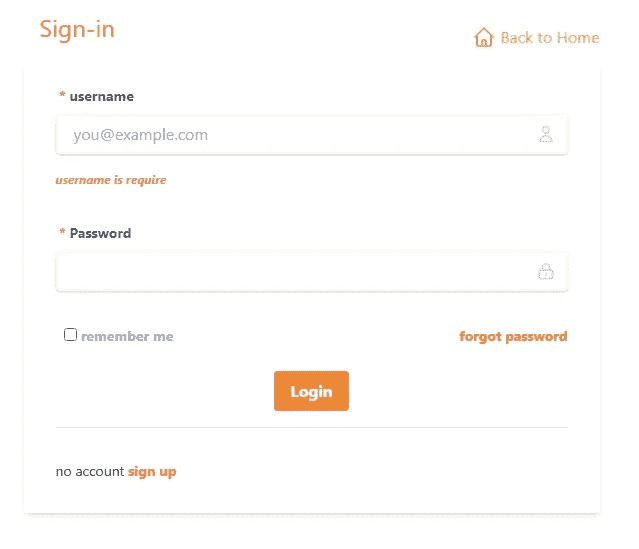

*顺风表单 HTML*

这是一个橙色的 CSS 签到卡表单。

**顺风表格 2——作者布兰登·m·斯克鲁西**

*浏览器中的顺风表单卡*

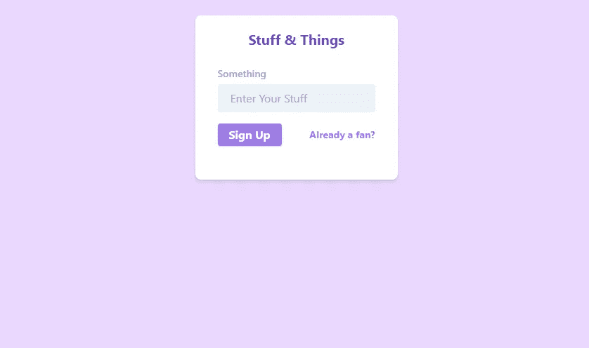

*顺风表单卡片表单 HTML*

接下来是一个紫色的 Tailwind CSS 卡片表单，只有一个像电子邮件一样的输入。

**顺风形式——苏格兰人最爱**

*浏览器中的顺风表单*

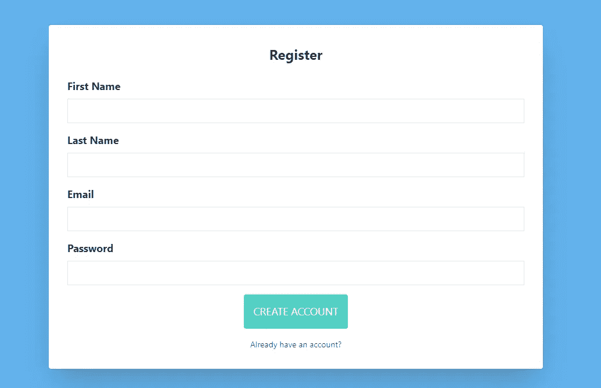

*顺风表单 HTML*

CodePen 用户 Scot 创建了一个简单的注册表单，输入名字、姓氏、电子邮件和密码。

**顺风形式 2 —由 Vallo V**

*浏览器中的顺风表 2*

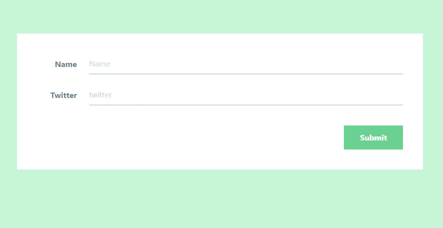

*顺风格式 2 HTML*

就我个人而言，我没有见过多少表单的标签在输入字段的左侧。这是一种干净的顺风形式。

**顺风型踏步机——作者丁昆·VU**

*浏览器中的顺风表单步进器*

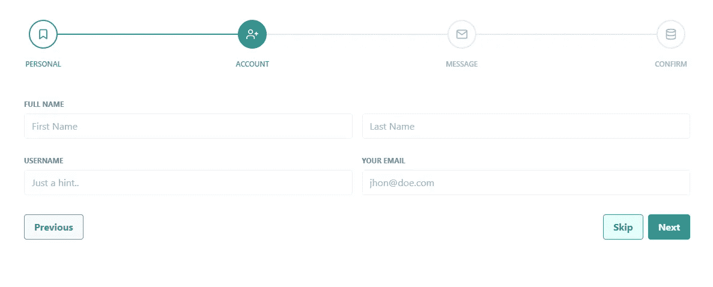

*顺风表单步进器 HTML*

接下来是多步表单的模板。

如果需要收集大量用户输入，我建议使用这种样式的表单。

**顺风形式—通过 Paras594**

*浏览器中的顺风表单*

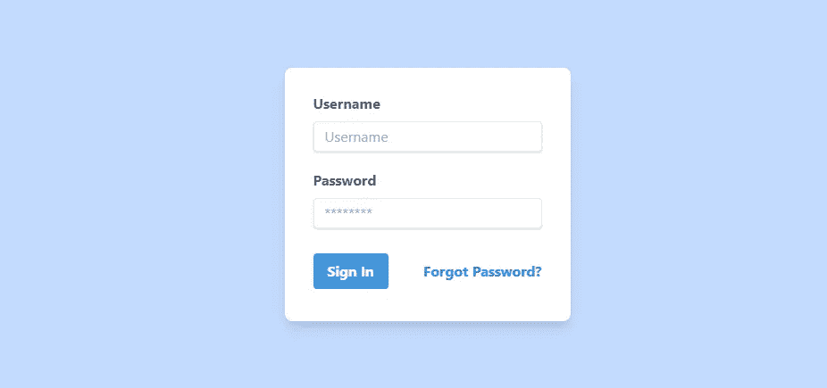

*顺风表单 HTML*

有时候简单才是王道。顺风卡片表单的最大宽度被设置为非常小，只有两个输入字段。

**顺风形式——作者伯特伦·西蒙**

*浏览器中的顺风表格*

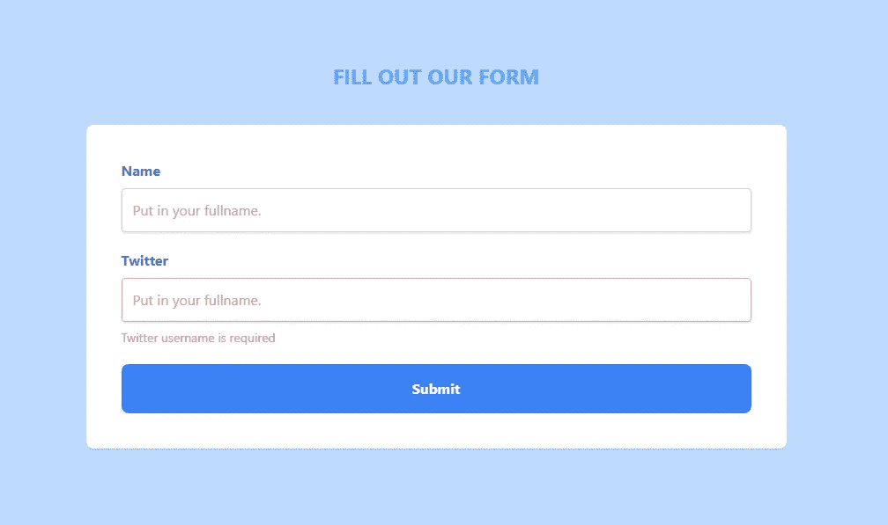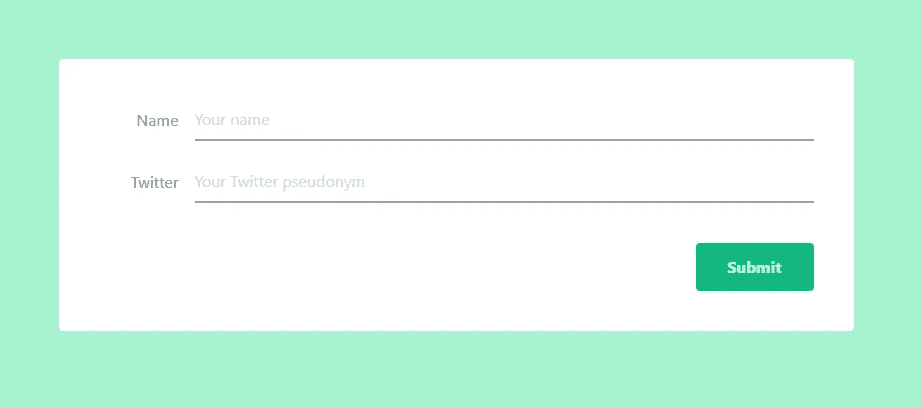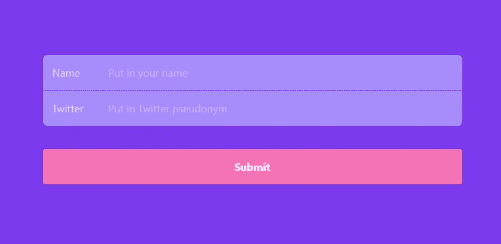

*顺风表单 HTML*

最后这个例子实际上是三个例子合二为一。Bertram 提供了三种不同的表单输入样式、标签和按钮来帮助您入门。

*原载于*[*https://www.ordinarycoders.com*](https://www.ordinarycoders.com/blog/article/tailwindcss-custom-forms)*。*