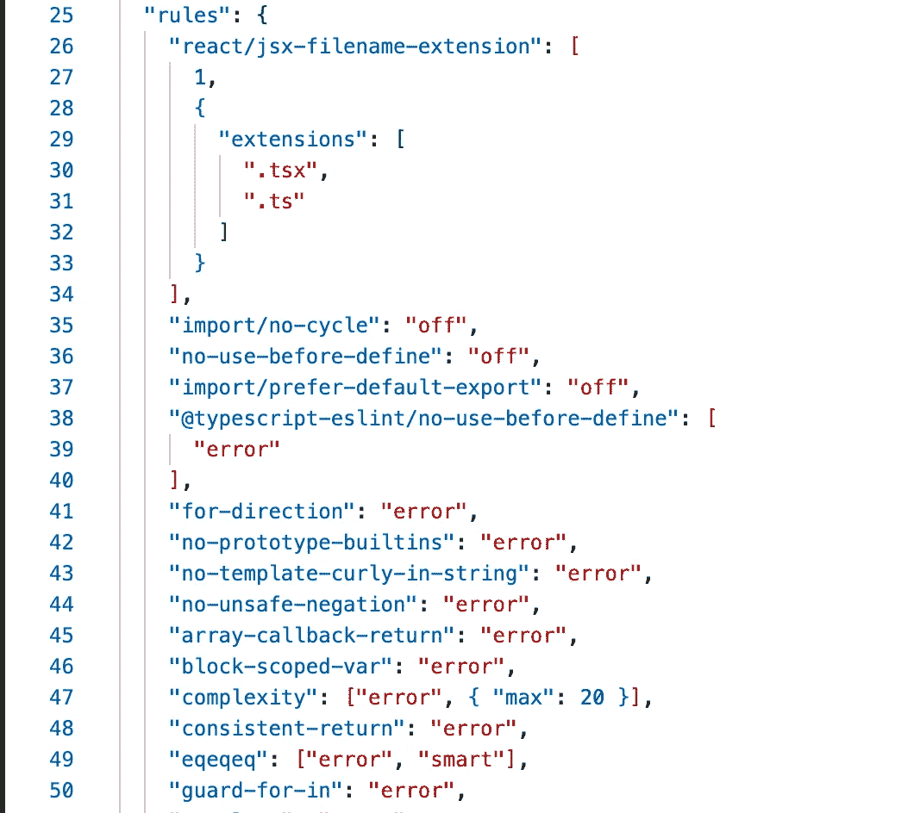
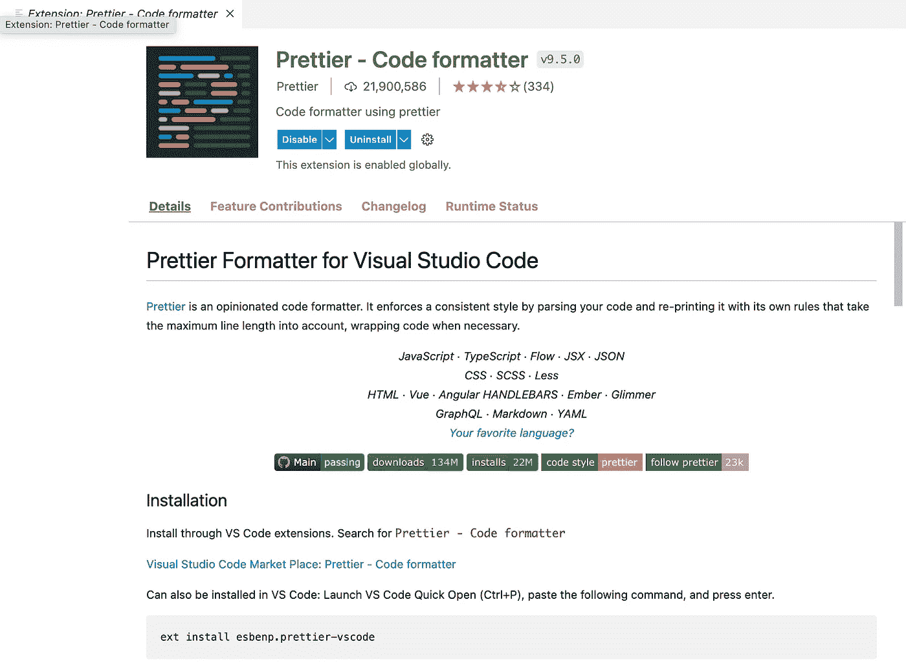
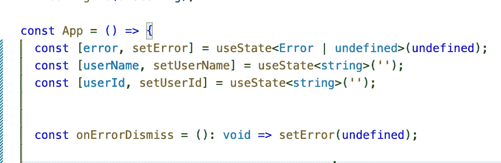
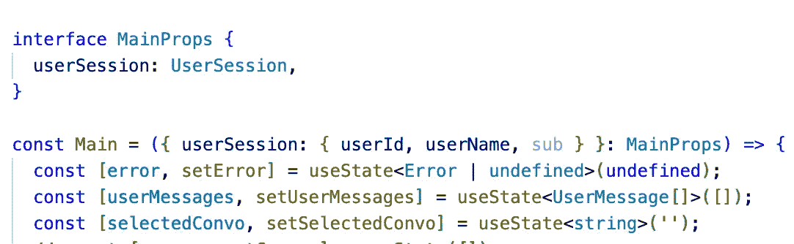
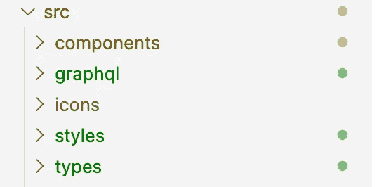
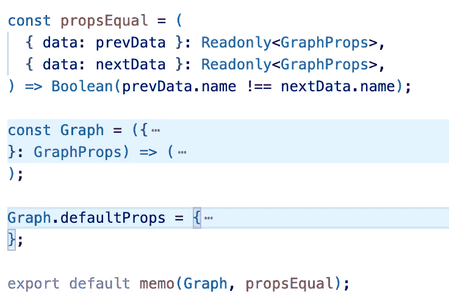

# 14 个小贴士，可以毫不费力地改善你脆弱的代码

> 原文：<https://levelup.gitconnected.com/14-tips-for-effortlessly-improving-your-weak-ass-react-code-4aea5500559c>


乔纳森·丹尼尔斯在 [Unsplash](https://unsplash.com?utm_source=medium&utm_medium=referral) 上拍摄的照片

2014 年开始学 JS，大概一年后被介绍去 React。起初它看起来令人困惑，但是多年的使用它得到了回报。无论您是在专业环境中使用它，用于家庭作业，作为面试编码练习的一部分，甚至是一个辅助项目，都有一些简单的快捷方式可以让您的生活变得更轻松。以下是我想到的 14 个节省时间的建议。

# 质量和编码风格

## 1.用棉绒！

这是有原因的，它被包括在 CRA 的设置中，这是成年人应该做的事情。去[这里](https://eslint.org/docs/user-guide/getting-started)看看为什么我把这个作为我的第一条建议。我使用 ESLint 是因为它把我杂乱无章、语无伦次、满是 bug 的东西变得一致，有战斗价值。通常，当我建立一个全新的回购协议时，我会参考阿龙·瓦拉吉的这篇文章。

[](https://medium.com/dailyjs/adding-eslint-to-your-project-7bd4feca35a8) [## 将 ESlint 添加到项目中

### 在这篇文章中，我将通过几个简单的步骤，使用……

medium.com](https://medium.com/dailyjs/adding-eslint-to-your-project-7bd4feca35a8) 

## 2.导入基本规则

一旦你有你的棉绒设置，扔在那个坏男孩一些规则！ [Airbnb 的。自我记事以来，eslintrc config](https://github.com/airbnb/javascript/tree/master/packages/eslint-config-airbnb) 一直是备受瞩目的行业标准。 [Sonarjs](https://github.com/SonarSource/eslint-plugin-sonarjs) 是离合器；jsx-a11y 也是另一个很棒的。我们稍后会详细讨论最后一个问题。



ESLint 规则

## 3.使用更漂亮的

顾名思义，这会让你的代码看起来更漂亮。它带来的最大改进是，如果你真的懒于修改你的 ESLint 规则，它会为你重写代码。



较美丽

## 4.考虑使用 Typescript

Typescript 与 React 配合得很好，它保护您免于自己的鲁莽。如果你正在传递一个本该是数字的变量，而你试图给一个字符串赋值，它会让你崩溃🤯。有时候类型强制对你有利，但是这种捷径可能会导致以后的错误。



以打字打的文件



又打字了

## 5.清理你的目录结构

这个技巧需要更多的训练。你会发现定义辅助函数、样式组件、类型等工作变得更简单。当你着急的时候，就在你的组件代码旁边。我认为应该有单独的`components`、`types`、`styles`和`utilities`目录:



目录结构

# 表演

## 6.避免不必要的重新渲染

疏忽的教育在反应中泛滥，所以给孩子一些爱...组件。React 有一个名为`memo`的内在高阶组件。当类组件还很酷的时候，你可以用几乎完全相同的方式调用`[shouldComponentUpdate](https://reactjs.org/docs/react-component.html#shouldcomponentupdate)`。(*补充说明:功能组件现在在大多数地方比类组件更受欢迎，因为它们是无状态的，并且不使用生命周期方法，最终留给您的是一个纯粹的功能*)。



反应备忘录

此外，有两个有用的 React 钩子叫做`useMemo`和`useCallback`，帮助我们避免不必要的重新渲染。`useMemo`缓存昂贵计算的结果，而`useCallback`缓存函数本身，每次返回相同的值。当你有一个点击处理程序，无论你点击什么，它都会做同样的事情时，这是很有用的。

## 7.尽可能使用虚拟 DOM

如果您来自普通的 JS 背景，React 有一种更简单的方法来操作 DOM。如果你想在面试中表现得酷一点，这就叫做虚拟世界或虚拟世界。这是你在屏幕上看到的轻量级副本。它也只更新那些需要改变的元素。此外，React 使用批处理机制来操作实际的 DOM，而不是在每次状态改变时都发送更新。

以下面的代码为例:

```
const videos = ["https://example.com/video1.mp4", "https://example.com/video2.mp4", ..., "https://example.com/video100.mp4"];const App = () => { const [selectedVideo, setSelectedVideo] = useState(''); const handleClickPlay = () => {
    const videoElement = document.getElementById(selectedVideo);
    const currentlyPlayings = document.getElementsByClassName('playing');
    Array.from(currentlyPlayings).forEach((cp) => {
      cp.classList.remove('selected');
      cp.classList.remove('playing');
      cp.classList.add('paused');
      cp.pause();
    });
    videoElement.classList.remove('paused');
    videoElement.classList.add('selected');
    videoElement.classList.add('playing');
    videoElement.play();
  };

  const handleClickPause = () => {
    const videoElement = document.getElementById(selectedVideo);
    videoElement.classList.add('selected');
    videoElement.classList.remove('playing');
    videoElement.classList.add('paused');
    videoElement.pause();
  }; return (
    <div>
      {videos.map((video, index) => (
        <video
          id={`${index}`}
          key={`${index}`}
          onClick={() => setSelectedVideo(`${index}`)}
          src={video}
        />
      ))}
    <button onClick={handleClickPlay}>
      Play
    </button>
    <button onClick={handleClickPause}>
      Pause
    </button>
    </div>
  );
};
```

理解这里发生的事情很痛苦，但是我们只希望选择一个视频，并在任何给定的时间播放。这意味着当我们选择一个新的视频时，我们必须在整个树中搜索当前正在播放的视频并暂停它们。即使只有 100 个视频，这也不是一个非常可扩展的模式。现在，看看我们如何用 ref 完成同样的事情:

```
const videos = ["https://example.com/video1.mp4", "https://example.com/video2.mp4", ..., "https://example.com/video100.mp4"];const App = () => {
  const selected = useRef();const handleSelectVideo = ({ currentTarget }) => {
    if (selected.current) {
      selected.current.classList.remove('playing');
    }
    selected.current = currentTarget;
  };const handleClickPlay = (e) => {
    selected.current.play();
    selected.current.classList.remove('paused');
    selected.current.classList.add('playing');
  };const handleClickPause = (e) => {
    selected.current.pause();
    selected.current.classList.remove('playing');
    selected.current.classList.add('paused');
  };

  return (
    <div>
      {videos.map((video, index) => (
        <video
          id={`${index}`}
          key={`${index}`}
          onClick={handleSelectVideo}
          src={video}
        />
      ))}
    <button onClick={handleClickPlay}>
      Play
    </button>
    <button onClick={handleClickPause}>
      Pause
    </button>
    </div>
  );
};
```

当简单地通过`getElementById`获取一个元素并改变它时，并没有快多少。当处理复杂子树的更新时，竞争优势就来了。这显然是一个简单的例子，但是当涉及到重型前端优化时，refs 每次都会胜过直接的 DOM 操作。

## 8.合并和减少 API 调用

这个提示不是 React 特有的，主要信息是*“不要像 REST 一样使用 GraphQL】。以下面的代码为例:*

```
import React, { useEffect, useState } from 'react';const App = () => {
  const [name, setName] = useState('');
  const [numFollowers, setNumFollowers] = useState(0);
  const [error, setError] = useState(undefined);
  useEffect(() => {
    /**
    * query GetUser {
    *   getUser {
    *     id
    *     name
    *     email
    *   }
    * }
    */
    getUser().then(({ name }) => setName).catch(setError);
    /**
    * query GetNumFollowers($userid: ID!) {
    *   getNumFollowers(userId: $userid)
    * }
    */
    getNumFollowers().then(setNumFollowers).catch(setError);
  });
  return (
    <>
      <p>Hi my name is {name}</p>
      <p>I have {numFollowers} followers</p>
    </>
  );
};
```

网络请求越多，速度越慢，那么为什么不利用 GraphQL 的竞争优势呢？

```
import React, { useEffect, useState } from "react";const App = () => {
  const [name, setName] = useState("");
  const [numFollowers, setNumFollowers] = useState(0);
  const [error, setError] = useState(undefined);
  useEffect(() => {
    /**
    * query GetUser {
    *   getUser {
    *     name
    *     followers
    *   }
    * }
    */
    getUser()
      .then(({ name, followers }) => {
        setName(name);
        setNumFollowers(followers.length);
      })
      .catch(setError);
  });
  return error ? <Alert /> : (
    <>
      <p>Hi my name is {name}</p>
      <p>I have {numFollowers} followers</p>
    </>
  );
};
```

您还可以通过在父组件级别保存从状态 API 获取的数据，并通过 props 或 [React 上下文 API](https://reactjs.org/docs/context.html) 共享它，来减少网络调用的数量。

[](https://reactjs.org/docs/context.html) [## 上下文反应

### 上下文提供了一种通过组件树传递数据的方法，而不必每次都手动传递属性

reactjs.org](https://reactjs.org/docs/context.html) 

## 9.利用浏览器存储

浏览器存储不再是你在可耻的行为后必须记得删除的东西。其实在很多方面可以让你的生活更轻松，用户体验更好！React 通常使用的许多第三方库在浏览器存储周围有包装器，或者在幕后使用它。然而，现在是你更好地了解它的时候了。`localStorage`可用于缓存关闭和重新打开浏览器时保存的内容。`localStorage`数据的一个例子是用户的搜索历史或页面书签。`sessionStorage`可用于短暂的数据。`sessionStorage`数据的一个例子是用于 API 调用的 OAuth 令牌。`indexedDB`可用于后台 web 工作人员数据。`indexedDB`数据的一个例子是离线时在应用程序中进行的待定更改，一旦网络连接恢复，就可以执行这些更改。此外，使用 web workers 执行 CPU 密集型任务将提高 React 应用程序的性能，因为它们将在单独的线程上运行，不会降低主线程上运行的进程的速度。

## 10.虚拟化大型阵列

如果你装载一个非常大的数组到内存中，你可能会想要在屏幕上显示条目(也就是说，这样你的用户可以像僵尸一样无意识地滚动)。一次把所有东西都渲染到 DOM 中 1)会花很长时间，2)一旦加载完毕会很慢。看一看[反应窗口](https://github.com/bvaughn/react-window)和[反应虚拟化](https://github.com/bvaughn/react-virtualized)，它们提供了用于虚拟化大型阵列的组件。

## 11.代码分割

没有劈叉那么难！动态和惰性加载是这个游戏的名字，官方的 React 文档告诉你如何相当容易地做到这一点。

[](https://reactjs.org/docs/code-splitting.html) [## 代码分解-反应

### 大多数 React 应用程序会使用 Webpack、Rollup 或 Browserify 等工具“捆绑”文件。捆绑是一个过程…

reactjs.org](https://reactjs.org/docs/code-splitting.html) 

# 用户体验

## 12.添加误差边界

这将捕捉你的应用程序可能抛出的任何错误。这样，当你的应用程序不可避免地崩溃时，你的终端用户就不会看到红色屏幕。对于普通的 JS，直接从[的 React 文档](https://reactjs.org/docs/error-boundaries.html#introducing-error-boundaries)中复制。对于打字稿，在谷歌上快速搜索会找到一个要点，你也可以复制。一定要给你的顾客开 5 美元的谷歌搜索费发票。

## 13.标准化并重用您的通用组件

网页都使用标准组件，所以要确保它们看起来都一样。通常怀疑的是按钮、输入和链接。但是对于标准化[模态](https://github.com/reactjs/react-modal)、[警告](https://mui.com/material-ui/react-alert/)和[微调器](https://github.com/davidhu2000/react-spinners)来说，还是有一些东西要说的。如果你有时间[拿出一个组件库](https://medium.com/gumgum-tech/writing-a-shared-react-component-library-with-storybook-78e723438338)是一个值得的努力。

 [## 用 storybook 编写共享的 React 组件库

### 在 GumGum，我的团队构建并开发了许多 React JS web 应用程序。随着应用数量的增长，我们发现自己…

medium.com](https://medium.com/gumgum-tech/writing-a-shared-react-component-library-with-storybook-78e723438338) 

## 14.国际化(i18n)和无障碍化(a11y)

不要成为史诗翻译失败的牺牲品。赢得像 BTS 这样的全球观众也可能发生在你的 React side 项目上！ [react-i18next](https://github.com/i18next/react-i18next) 是一个非常酷的项目，它实际上使用一个名为 [locize](https://locize.com/?lng=en) 的后端服务器动态地提供翻译。有了这个库，你可以节省大量的时间和金钱。

[](https://medium.com/@jamuhl/get-your-react-js-application-translated-with-style-4ad090aefc2c) [## 让您的 react.js 应用程序翻译得有风格…

### 生活变得更简单…

medium.com](https://medium.com/@jamuhl/get-your-react-js-application-translated-with-style-4ad090aefc2c) 

正如我之前提到的， [eslint-plugin-jsx-a11y](https://github.com/jsx-eslint/eslint-plugin-jsx-a11y#readme) 可以帮助你在编写 jsx 时保持克制。根据 github 自述文件:

> 该插件对 JSX 进行静态评估，以发现 React 应用程序中的可访问性问题。因为它只捕捉静态代码中的错误，所以结合 [@axe-core/react](https://github.com/dequelabs/axe-core-npm/tree/develop/packages/react) 使用它来测试呈现的 DOM 的可访问性。把这些工具看作是更大的 a11y 测试过程的一个步骤，并且总是用辅助技术测试你的应用。

这里他们提到了 axe-core，它是由 Deque 为包括 JS 在内的各种语言开发的。

[](https://github.com/dequelabs/axe-core-npm/tree/develop/packages/react) [## axe-core-NPM/packages/react at developer dequelabs/axe-core-NPM

### 使用 axe-core 可访问性测试库测试您的 React 应用程序。结果将显示在 Chrome 开发工具中…

github.com](https://github.com/dequelabs/axe-core-npm/tree/develop/packages/react) 

此外，无论是否使用 React，您都应该养成编写正确语义 HTML 的习惯。React 官方文档提供了更多关于如何提高网站可访问性的技巧:

[](https://reactjs.org/docs/accessibility.html) [## 可访问性-反应

### 用于构建用户界面的 JavaScript 库

reactjs.org](https://reactjs.org/docs/accessibility.html) 

TL；你可以为此使用图书馆

# 结论

除了这里提到的技巧之外，您还可以实施非 React 专用的最佳实践，例如使用 CDN、在 API 和 DB 级别缓存、导入 UX 设计器线框、树抖动、减少总捆绑包大小等。这份清单可以一直列下去，但是你明白了。

如果你喜欢我老套的写作风格，请跟我来。我每月发表约 1 次文章，我喜欢社交。谢谢