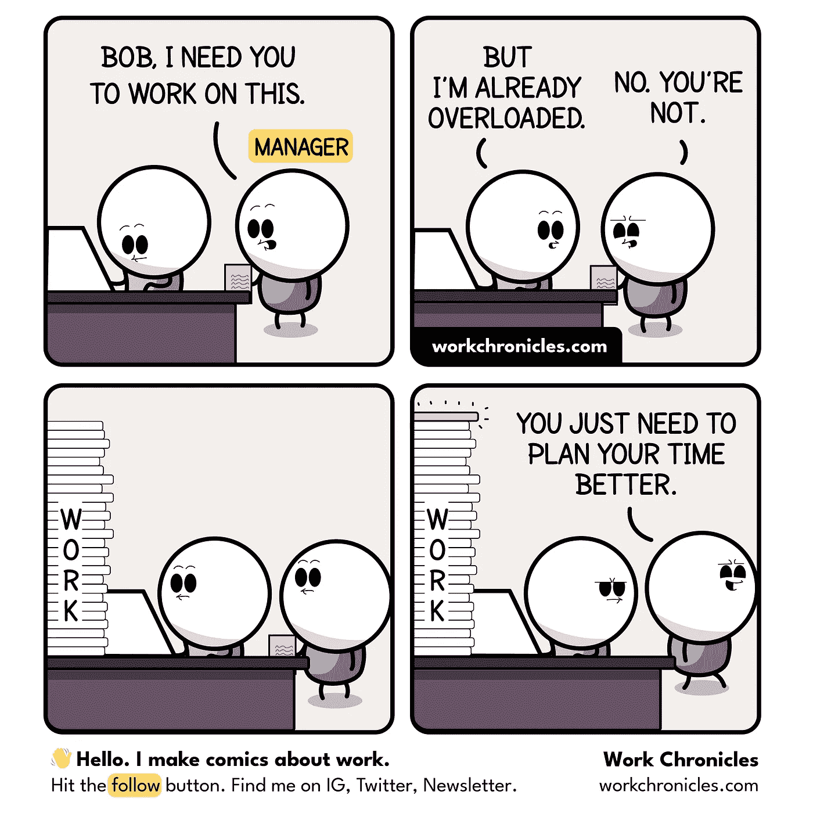
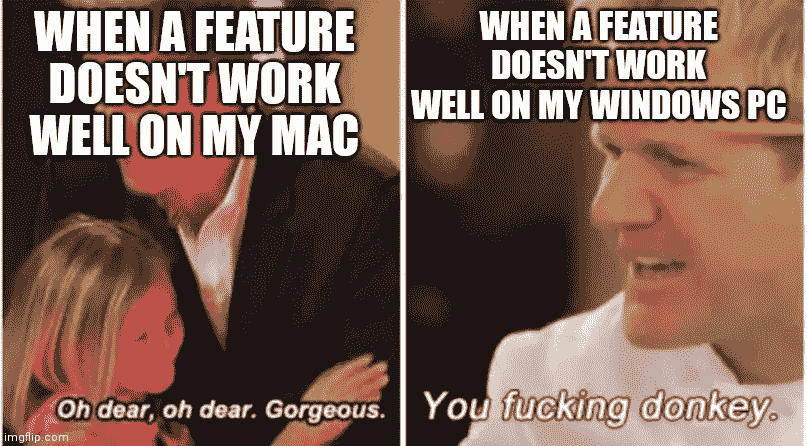
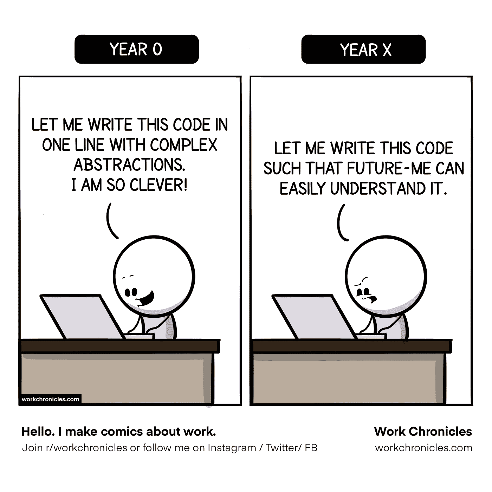
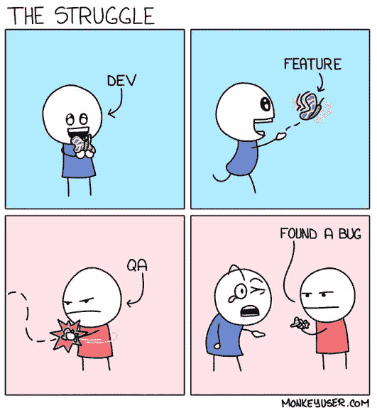
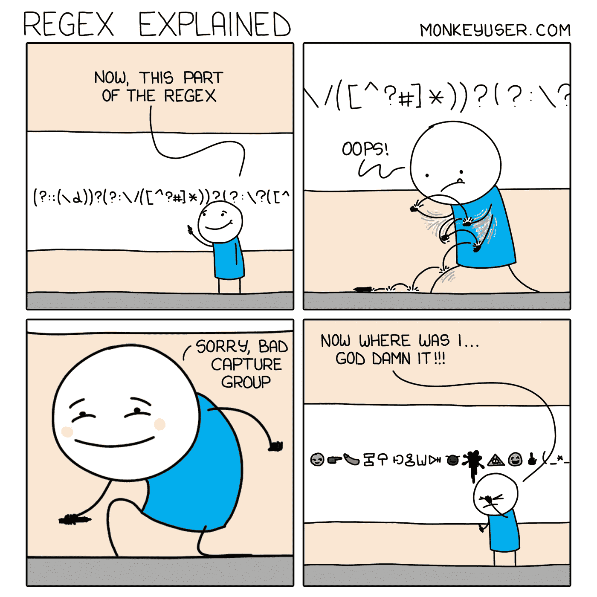
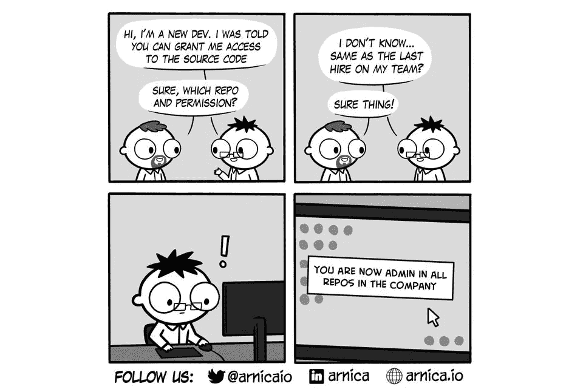
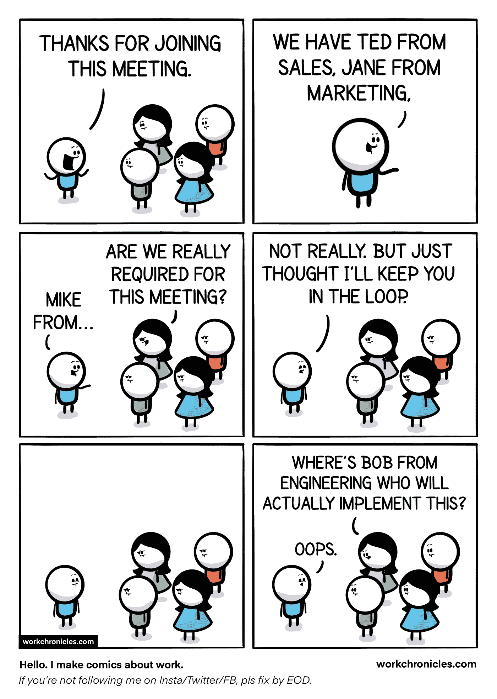
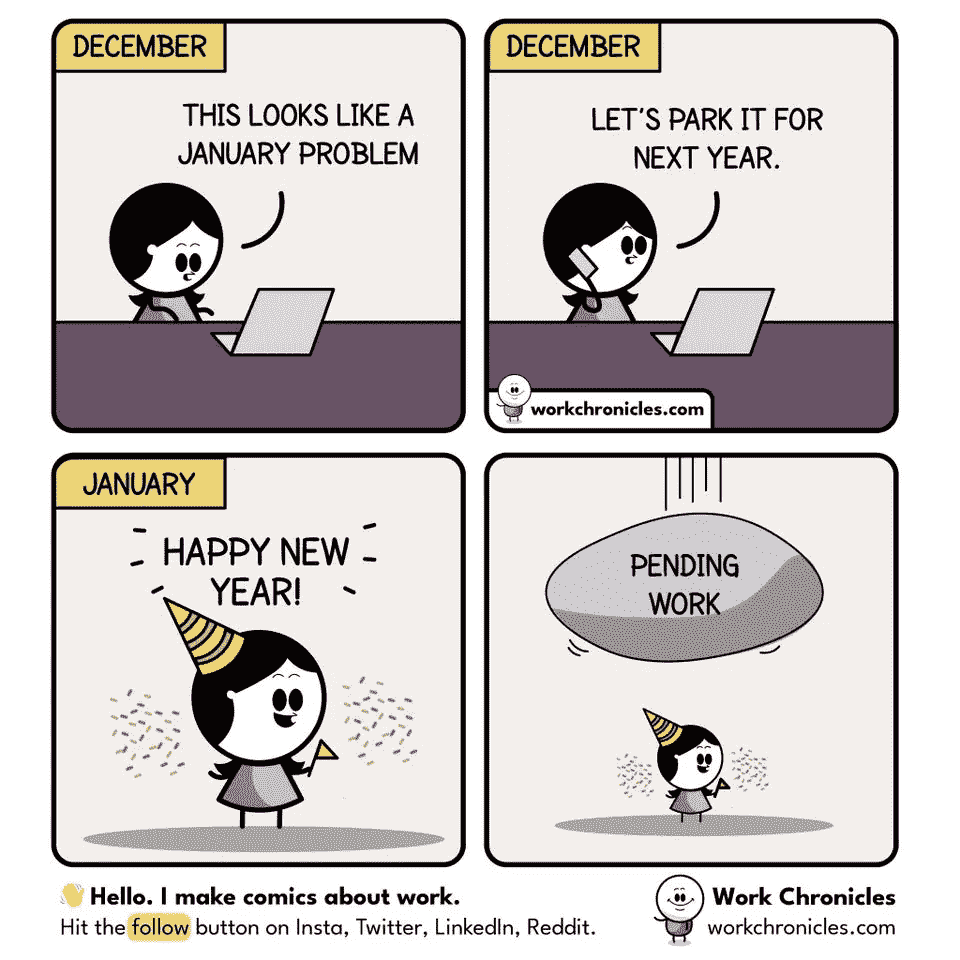
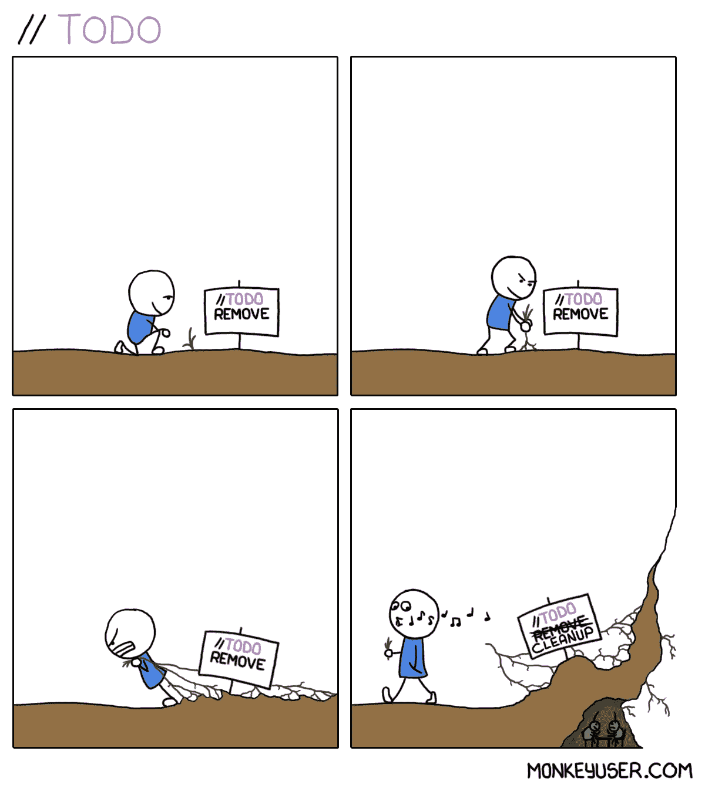

# 14 个终极编程笑话

> 原文：<https://levelup.gitconnected.com/14-ultimate-programming-jokes-fcef1cf568e3>

## 编一些你能理解的笑话

安妮·斯普拉特在 [Unsplash](https://unsplash.com?utm_source=medium&utm_medium=referral) 上的照片

程序员的日常生活充满了兴奋和享受。我们整天编码，整夜调试，处理成千上万行代码，循环往复。

但是，编程并不是程序员唯一擅长的事情。他们也很有幽默感。我们都喜欢笑话，尤其是当我们把它们和我们的日常生活联系起来的时候。

在这篇文章中，我想出了一些与你的工作相关的笑话。我希望这篇文章能让你振作起来，让你在笑声中开始新的一天😃

# 0.阅读他人的代码

哎呀…是我的代码，不要紧哈哈！

# 1.仍然没有超载

# 2.在 Mac 上工作与在 Windows 上工作

当一个特性在 Linux 上不工作时…我就是那头驴😃

# 3.进行视频通话时

当你在视频电话会议上解释一个话题时，有人提醒你静音了。

该死的。

# 4.随着时间的流逝

# 5.开发人员 vs QA

看来 QA 做的不错…哈哈！

# 6.使用正则表达式

7.

# 8.请求源代码许可

# 9.让你了解情况

# 10.哦不！

很好地描述了我上周的工作..哈哈:D

# 11.待办事项

# 12.调试代码

# 13.进入法昂后

我来说说我的面试经历…(无意冒犯哈哈)

# 额外的笑话！

# 堆栈溢出

**感谢阅读！我希望你喜欢这篇文章，它让你开怀大笑😃**

您可能还想阅读:

 [## 9 个终极编程笑话

### 程序员生活中的笑话，你可以与之相关

levelup.gitconnected.com](/9-ultimate-programming-jokes-aa4970492af4)  [## 让你捧腹大笑的终极编程笑话

### 你能理解的日常生活笑话

levelup.gitconnected.com](/ultimate-programming-jokes-that-will-make-you-lol-ef791b59d207) 

> *走之前……*

如果你喜欢这篇文章，并希望**关注**更多**精彩**文章，请考虑使用我的推荐链接[https://pralabhsaxena.medium.com/membership](https://pralabhsaxena.medium.com/membership)成为一名中级会员。

另外，你可以在这里免费订阅我的时事通讯: [Pralabh 的时事通讯](https://pralabhsaxena.medium.com/subscribe)。