# 年度 15 个最搞笑的编程笑话

> 原文：<https://levelup.gitconnected.com/15-funniest-programming-jokes-of-the-year-e048d972b0ef>

## 准备好大笑吧，看看这个精心策划的编程笑话列表

信用: [Pixabay](https://pixabay.com/illustrations/developer-programmer-technology-3461405/)

我们将完成另一个疯狂的一年。今年给了我们战胜疫情挑战和恢复正常的希望。我们还没有完全从中恢复过来，但这比去年这个时候好得多。

关于这一点，这里有一个最好笑的编程笑话的精选列表。您可能以前遇到过一些这样的笑话，但是它们在软件工程世界中是永恒的。我敢肯定，每当你读这些书的时候，它们都会让你发笑。

> **注意:**如果你正在喝热饮，请在继续阅读前安全放下。

# 0.每个软件最终都会成为“遗产”

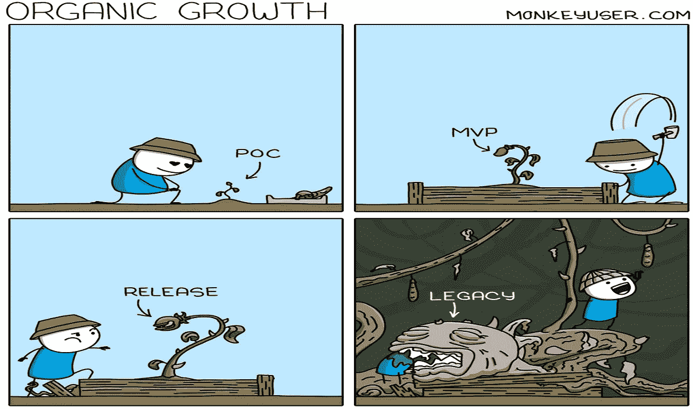

信用:[猴子用户](https://www.monkeyuser.com/2021/organic-growth/)

任何花了几年时间从事软件开发的人都非常清楚这个事实。无论你如何小心翼翼地从头开发一个全新的应用程序，它最终都会成为“遗产”。

# 1.应用程序的云计算之旅

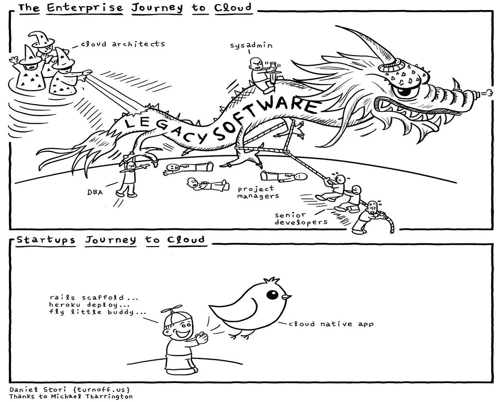

信用:[关断](https://turnoff.us/geek/enterprise-vs-startup-journey-to-cloud/)

2021 年，云热更上一层楼。初创公司通过他们的绿地应用程序让云之旅看起来如此轻松。

随之而来的是，企业中开发者的斗争成倍增加。好像我们维护遗留应用程序的问题还不够多，我们现在又不得不将它们迁移到云中。

# 2.观察和学习

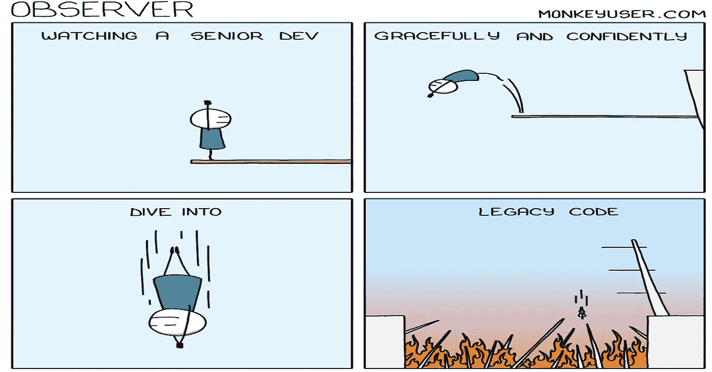

信用: [Monkeyuser](https://www.monkeyuser.com/2021/observer/)

如果你是开发新手，想学习如何处理遗留应用程序，看看你团队中无畏的高级开发人员就知道了。他们处理这些问题的优雅表现了惊人的耐心和成熟。

# 3.乐于助人的高级开发人员

信用:[猴子用户](https://www.monkeyuser.com/2021/career-path/)

既然我们谈到了高级开发人员的话题，就不要忘记他们在指导初级开发人员方面的坚定支持。但是，如果有几个小三没有成功，要记住，不是每个人都是神童。

# 4.产生想法的最佳场所

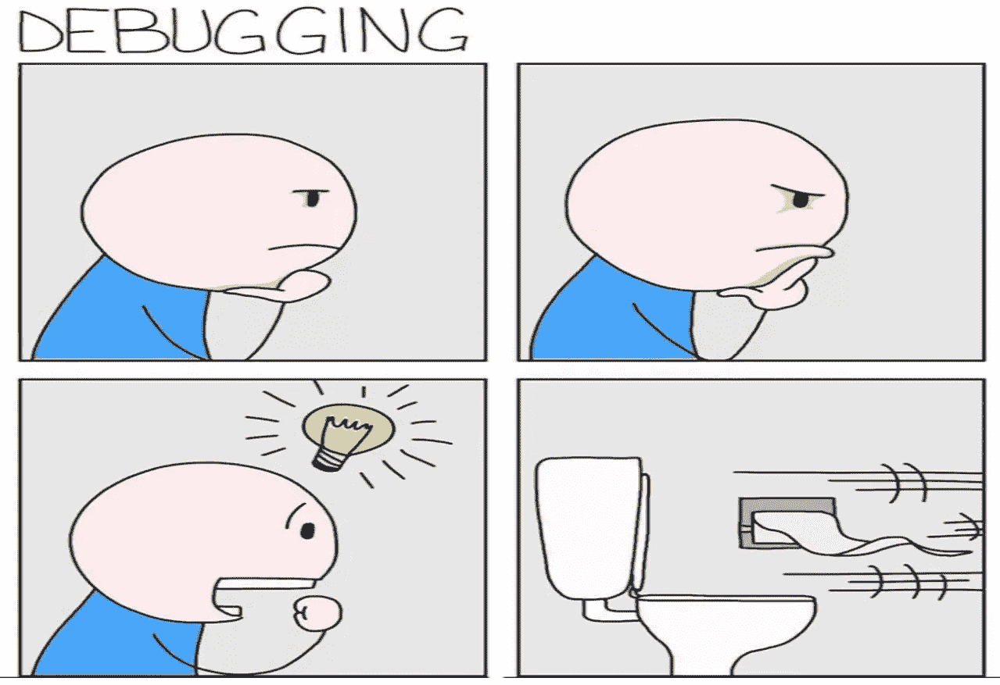

信用:[猴子用户](https://www.monkeyuser.com/2018/debugging/)

程序员的头脑总是被新的想法或应对挑战的尝试所占据。即使在去洗手间的时候，他们也一直在思考。而且，当想法最终出现时，他们迫不及待地去尝试。

# 5.哲学讨论

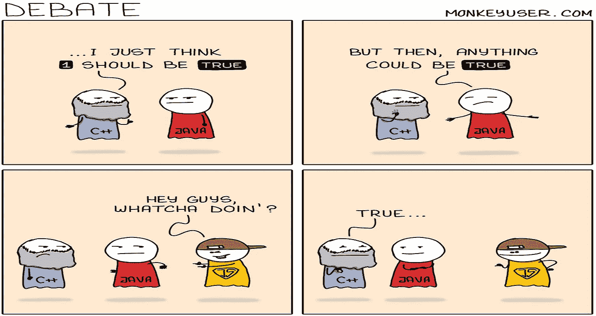

信用:[猴子用户](https://www.monkeyuser.com/2021/debate/)

这是个人观点的问题。所以，选择你的毒药。😄

# 6.云自动缩放的幕后

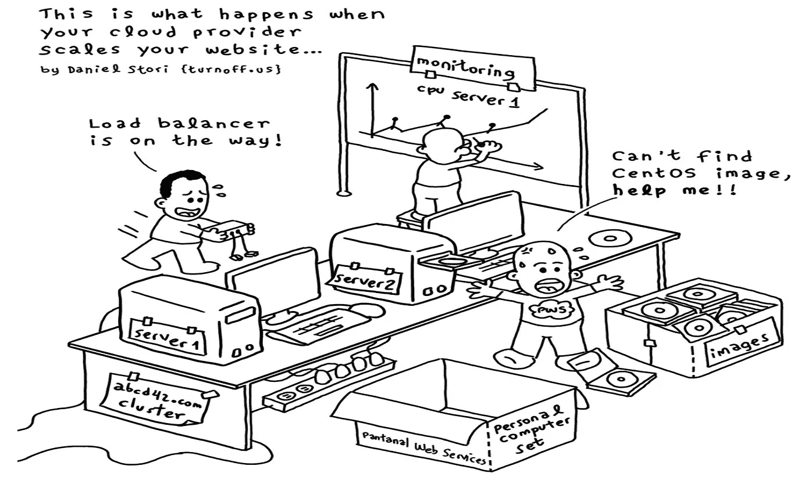

信用:[岔道](https://turnoff.us/geek/cloud-autoscaling/)

这就是云上的神奇之处。痛苦只是从您的团队转移到云提供商。其余都保持不变，只是换了一组不同的开发人员。

# 7.直接参与制作的恐惧

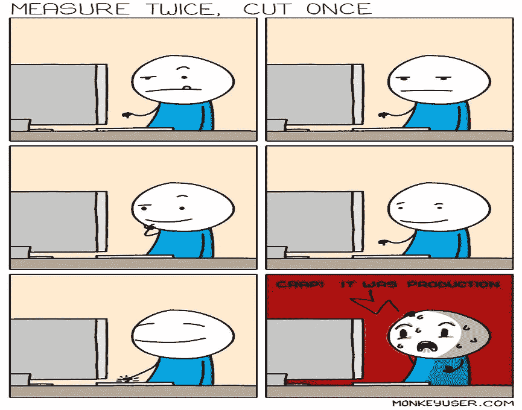

信用:[猴子用户](https://www.monkeyuser.com/2021/measure-twice-cut-once/)

当涉及到做出改变时，只有勇敢和清白的人才能玩弄生产。对于普通开发人员来说，non-prod 是我们其他人闲逛的理想场所。

# 8.对于一个 bug 来说，没有什么是微不足道的

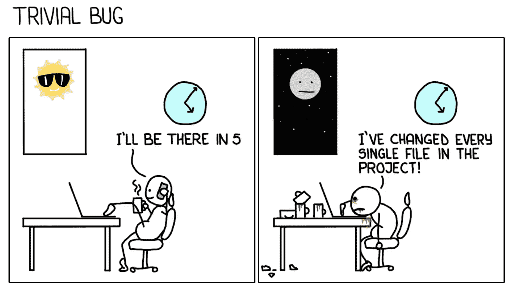

信用:[猴子用户](https://www.monkeyuser.com/2017/trivial-bug/)

我们都犯过多次这样的错误。无论你是多么有经验的开发人员，永远不要低估一个 bug。不要放松警惕，直到一个缺陷被修复并签字认可。

# 9.管理永远不会错

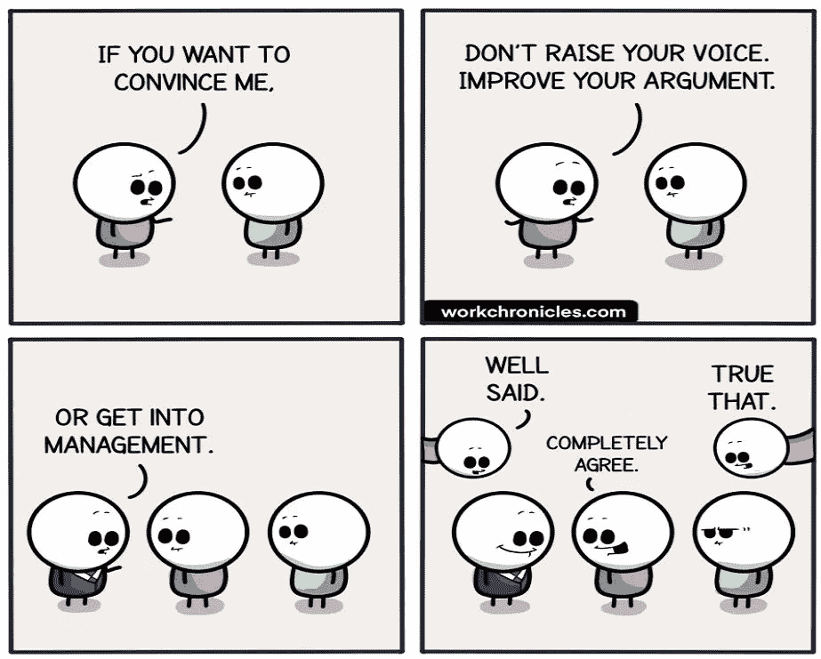

信用:[工作时间](https://workchronicles.com/dont-raise-your-voice-either-improve-your-argument-or/)

管理永远是对的。句号。😉

# 10.小心下一次晋升

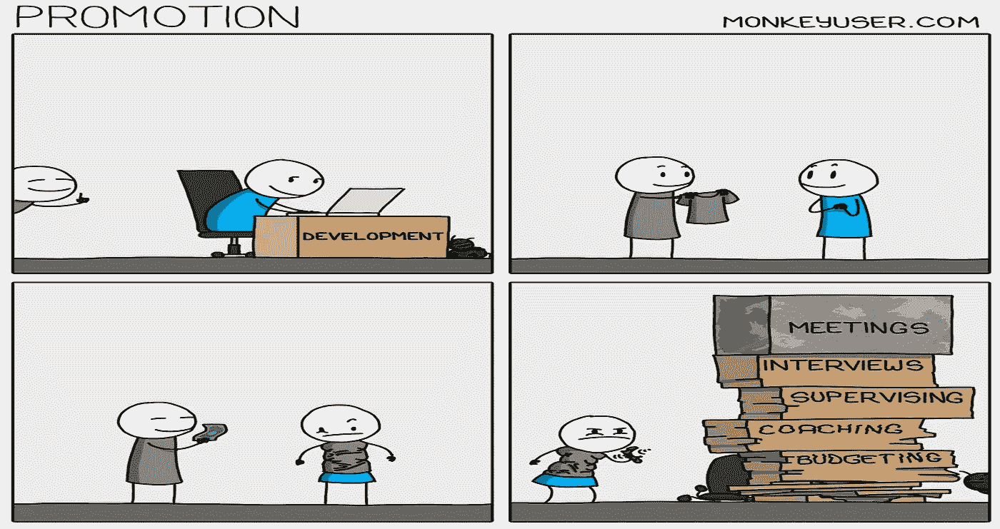

信用:[猴子用户](https://www.monkeyuser.com/2021/promotion/)

好吧，如果你因为之前的漫画而对进入管理层过于兴奋，这里有一个让你回到现实。你在公司的阶梯上爬得越多，你的工作量就越大。

> 最好遵循规则——一次开发，永远是开发。

# 11.减少工作量的创新理念

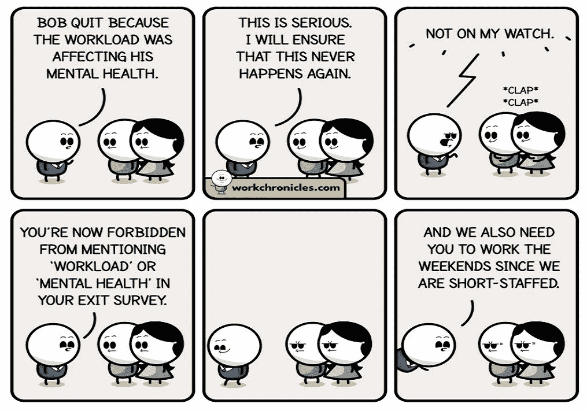

信用:[工作时间](https://workchronicles.com/workload-and-mental-health/)

这正是今天大辞职发生的原因。尽管公司试图把它描绘成开发者急于赚更多的钱，但实际上这是为了抛弃有毒的工作文化，创造一种更好的文化。如果我们有好的远足，我们不能拒绝他们。对！

# 12.做过就能理解

信用:[猴子用户](https://www.monkeyuser.com/2021/mixed-feelings/)

哦！不经测试就投入生产的冲动。

嗯，产品是衡量代码实际效果的最佳环境。所以，为什么要在其他地方浪费时间。

# 13.诚实的开发者

信用:[工作时间](https://workchronicles.com/me-explaining-what-i-do-for-a-living/)

如果我可以补充的话，还有参加会议。之后剩下的时间都花在编码上了(顺便说一句，这并不多)。

# 14.不要分享你的秘密做法

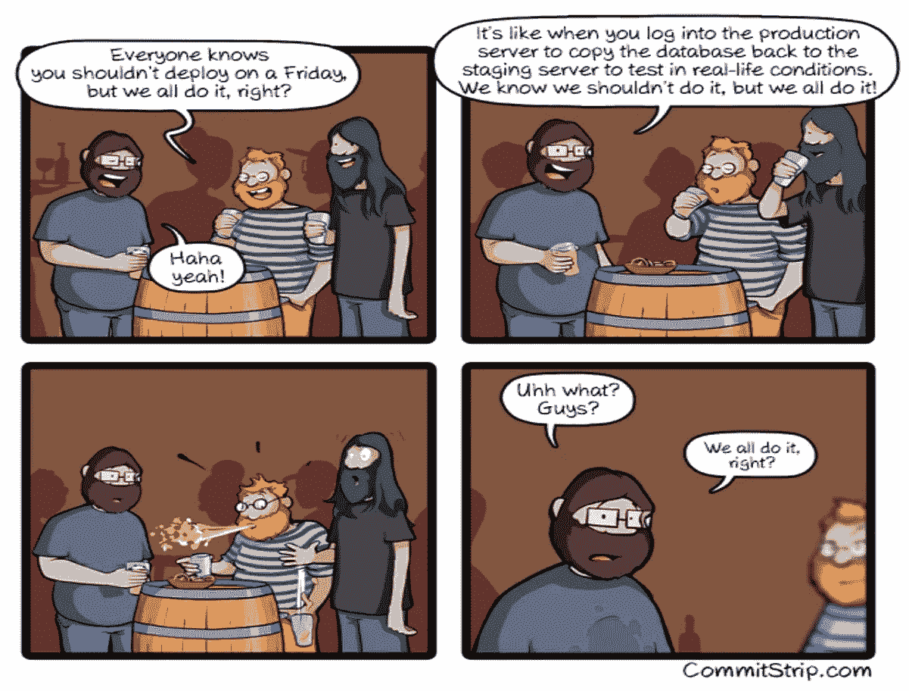

信用: [CommitStrip](https://www.commitstrip.com/en/2021/12/07/we-all-do-it-right/?)

我们都有自己古怪的开发实践。不管别人分享了多少，永远不要告诉别人你的。把你的秘密带进坟墓也比在一时的友情中暴露出来要好。

# 奖金:我知道我们都喜欢一点点奖金

当文档最终变得过时和无用时，为什么还要花时间去写文档呢！

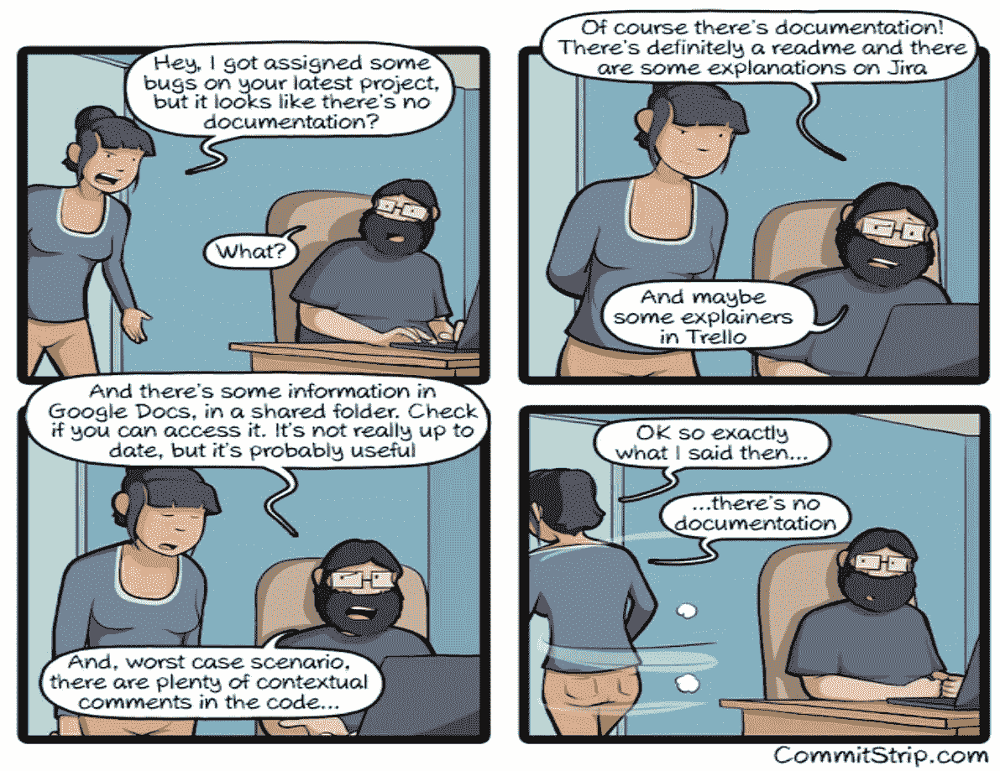

信用: [CommitStrip](https://www.commitstrip.com/en/2021/11/10/no-documentation/?)

谢谢你边看边笑。如果你喜欢看我的文章， [**你可以通过访问这个链接**](https://lokajit-tikayatray.medium.com/membership) 成为一个中等会员来支持我的写作。

**您可能也想阅读:**

 [## 我希望在我的软件生涯开始时就知道的 10 条宝贵经验

### 从职业生涯的早期开始，学习这些课程，成长为一名优秀的软件开发人员

levelup.gitconnected.com](/10-valuable-lessons-i-wish-i-knew-at-the-beginning-of-my-software-career-1e56e848cbf4)  [## 自称高级开发人员的 9 个必备技能

### 看看你是否已经掌握了这些技能。如果没有，学习这些技能，成为一名真正的高级开发人员。

levelup.gitconnected.com](/9-must-have-skills-to-call-yourself-a-senior-developer-aa0932a629cd)  [## 如何协商:有效协作的解决方案架构师指南

### 展示每个利益相关者关系中的成功

levelup.gitconnected.com](/how-to-negotiate-a-solution-architects-guide-to-effective-collaboration-f77780b070ed)