# 你应该知道的 15 个谷歌搜索技巧

> 原文：<https://levelup.gitconnected.com/15-google-search-tips-that-you-should-know-62277a56e9fb>

## 为了更准确和更好的搜索结果

作者创造的形象

我们每天都在使用谷歌，通过了解一些搜索技巧，我们可以更好地利用它，这些技巧将改善你进行常规谷歌搜索的方式，以获得准确和更好的搜索结果。

在这里，我们将看看 15 个谷歌搜索技巧，它们将对你日常的个人和专业工作有所帮助。

# **1。精确匹配的报价**

要在搜索项中搜索您提供的精确单词和序列，您可以用双引号将关键字括起来。

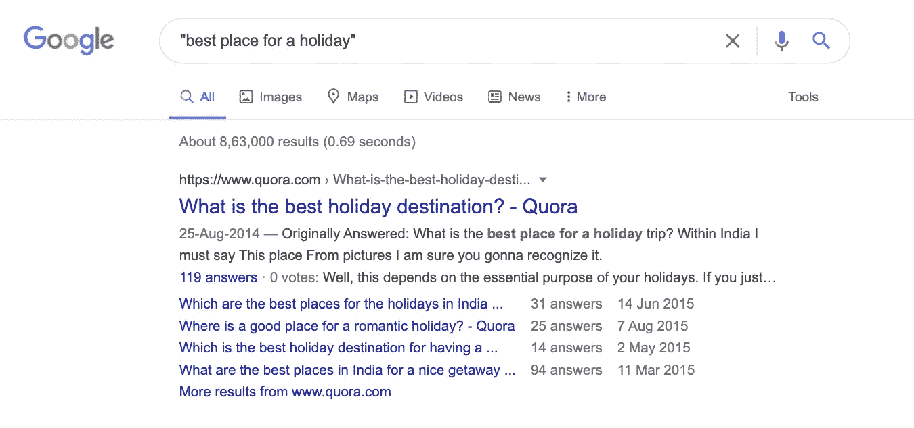

作者截图

# **2。用于排除结果的连字符**

在搜索词中包含一个连字符，以排除一些结果。您需要在要从搜索结果中排除的单词前提供一个连字符。

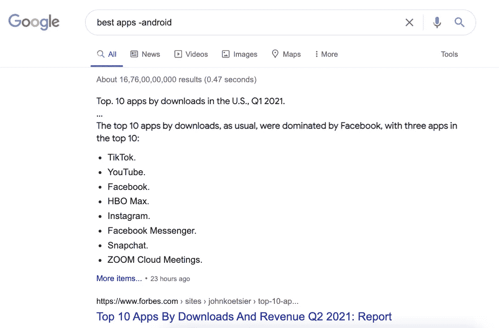

作者截图

# **3。从特定网站搜索结果**

在搜索查询中使用 **site:** 关键字搜索特定网站的结果，如下所示。

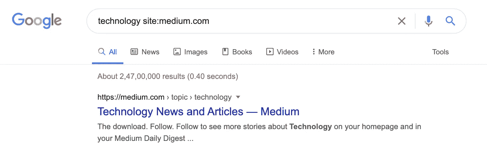

作者截图

# **4。搜索相关网站**

要获取与您已经知道的网站相关的网站，您可以使用 **related:** 关键字来获取这些网站。

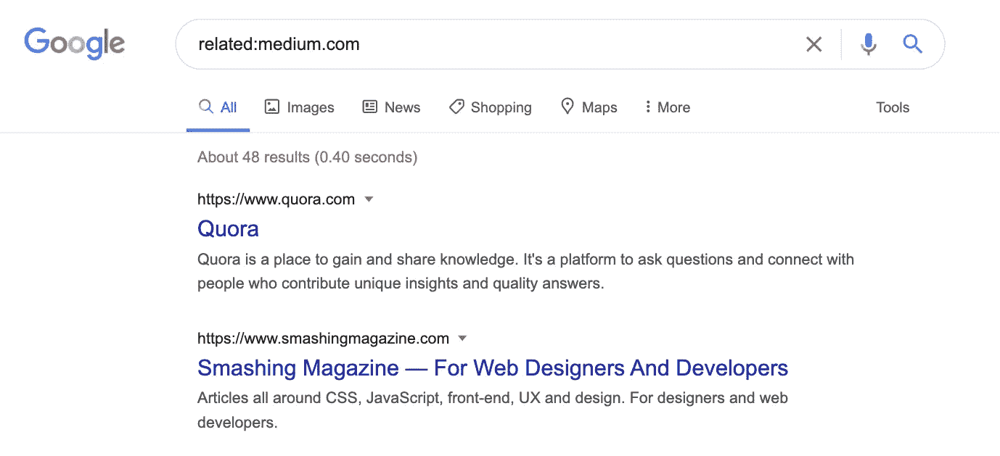

作者截图

# **5。搜索包含给定两个搜索词之一的结果**

如果您想在一个实例中包含多个搜索词的结果，您可以使用**或**关键字分隔每个搜索词。

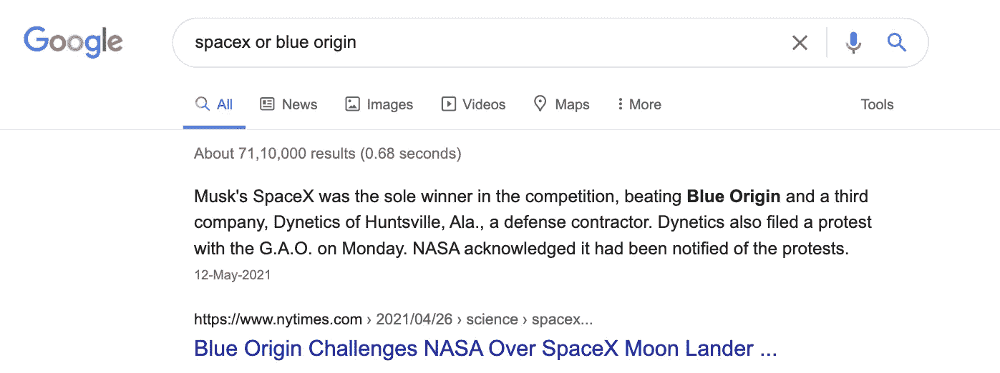

作者截图

# **6。搜索具有特定文件类型的结果**

要在搜索结果中只获得特定的文件类型，您可以将 **filetype:** 关键字与搜索词一起使用。

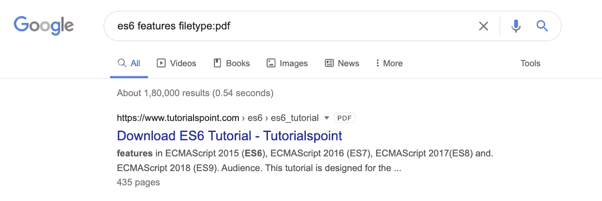

作者截图

# 7。使用星号进行通配符搜索

如果你想搜索一个你只知道几个单词而不记得剩下的单词的短语，你可以在你不记得的单词的地方用*号。

例如，这在搜索歌曲时非常有用。你可以输入搜索词**Michelle * the white ***这将为你找到给定歌词的歌曲 **Uptown funk** 。

# 8。在给定范围内搜索

要在可能是价格或其他值的范围内进行搜索，可以使用如下所示的三个点。

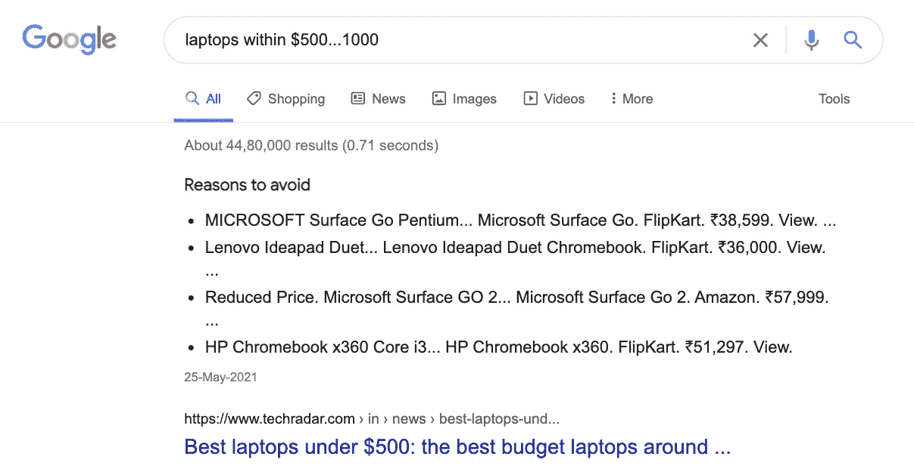

作者截图

# 9。在网站标题中搜索术语

要搜索与任何网站的主标题匹配的术语，您可以使用 **intitle:** 或**all title:**关键字。

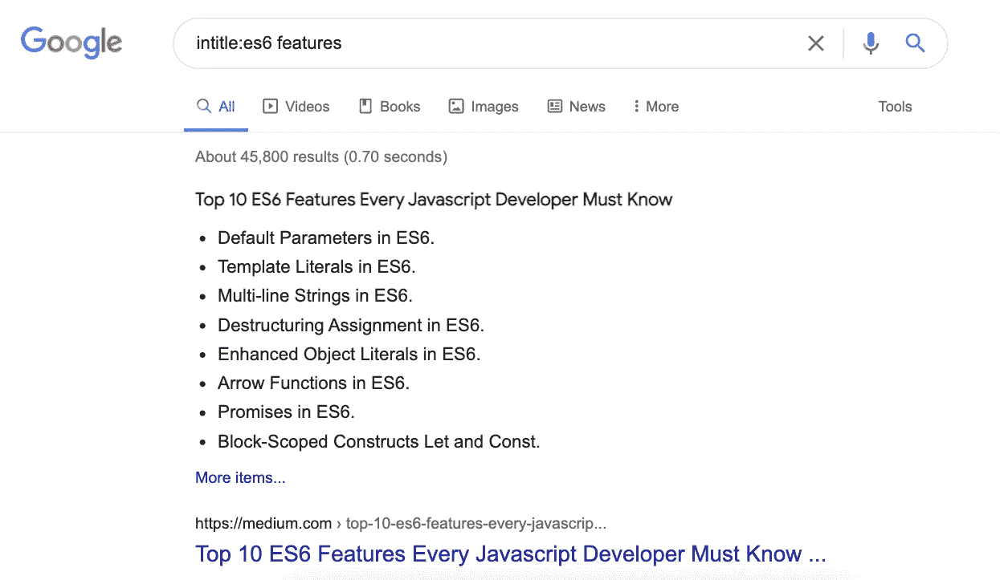

作者截图

# 10.搜索网站正文中的术语

要在网站的正文或其他文本中搜索某个术语，您可以使用 **intext:** 或**Alli text:**关键字。

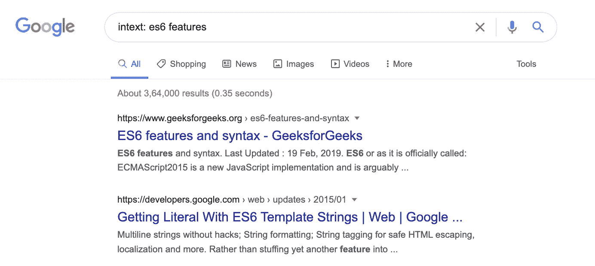

作者截图

# 11.得到一个词的定义

要得到一个单词的定义，你可以使用**定义:**关键字。

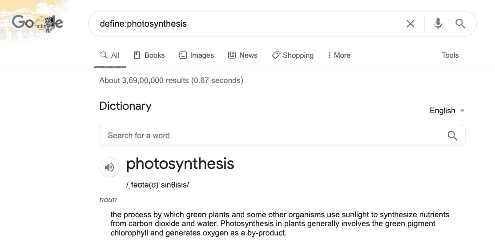

作者截图

# 12.在网站的 URL 中搜索术语

要搜索属于网站 URL 一部分的术语，您可以使用 **inurl:** 关键字。

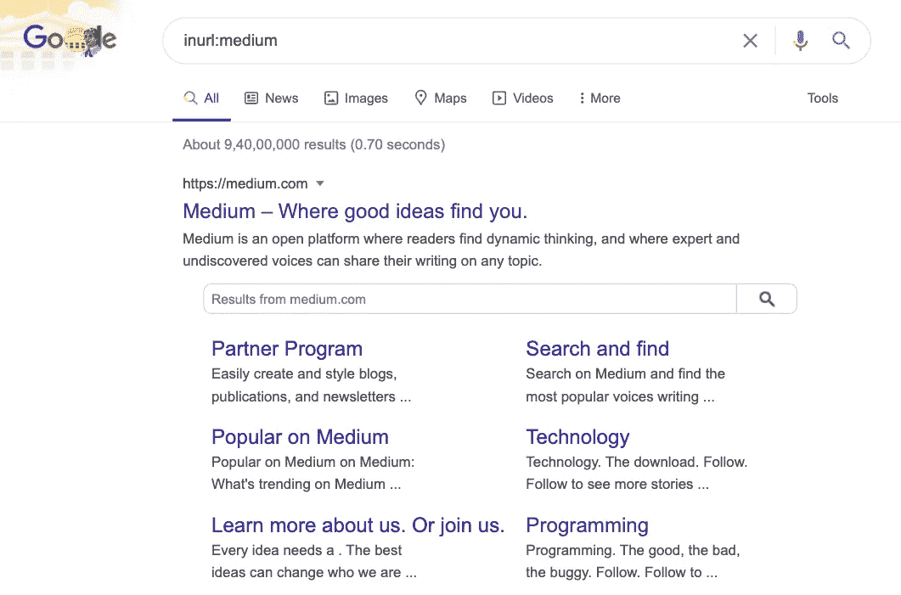

作者截图

# 13.数学计算

只需提供表达式作为搜索词，就可以完成数学计算。

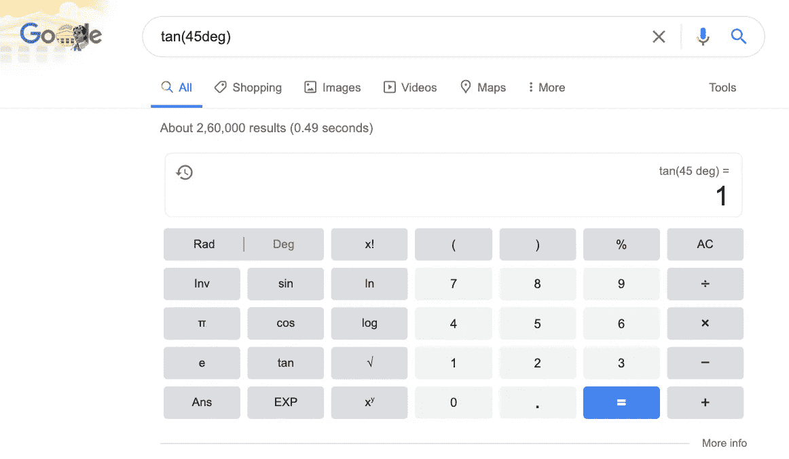

作者截图

# 14.货币和单位转换

您还可以通过提供不同的货币和单位作为搜索词来转换它们。

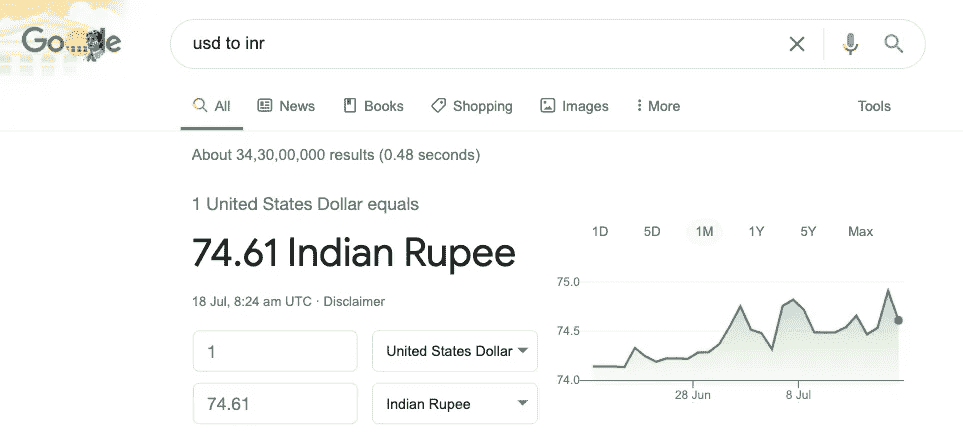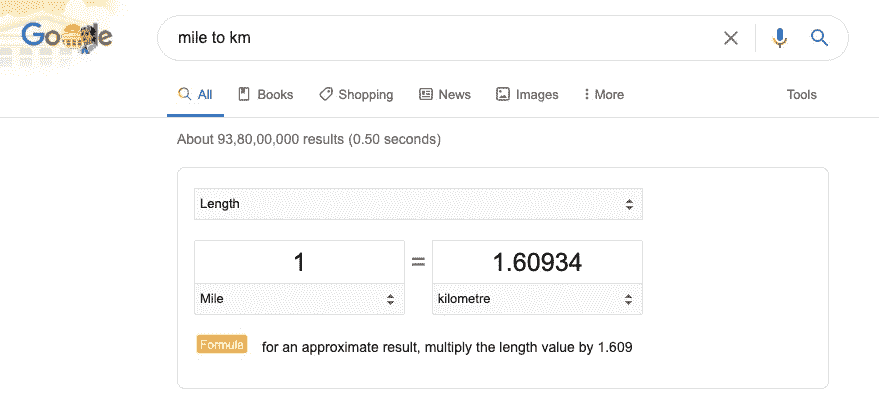

作者截图

# 15.世界各地的时间

您可以通过提供带有**时间**的地点名称作为搜索词来了解世界各地的时间。

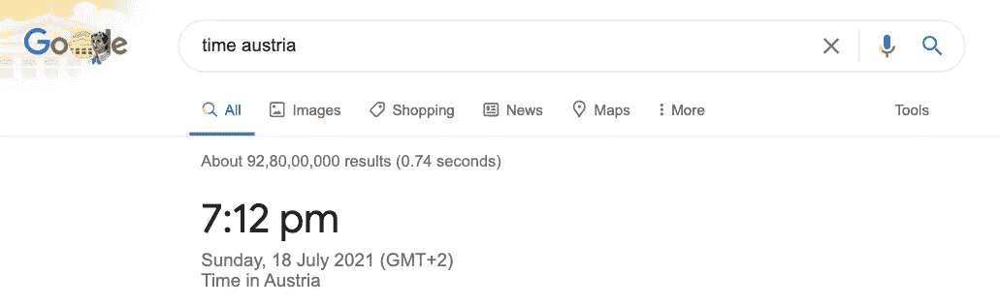

作者截图

这是 15 个谷歌搜索技巧的列表，我希望你发现这些搜索技巧是有用的。

感谢阅读，祝学习愉快！