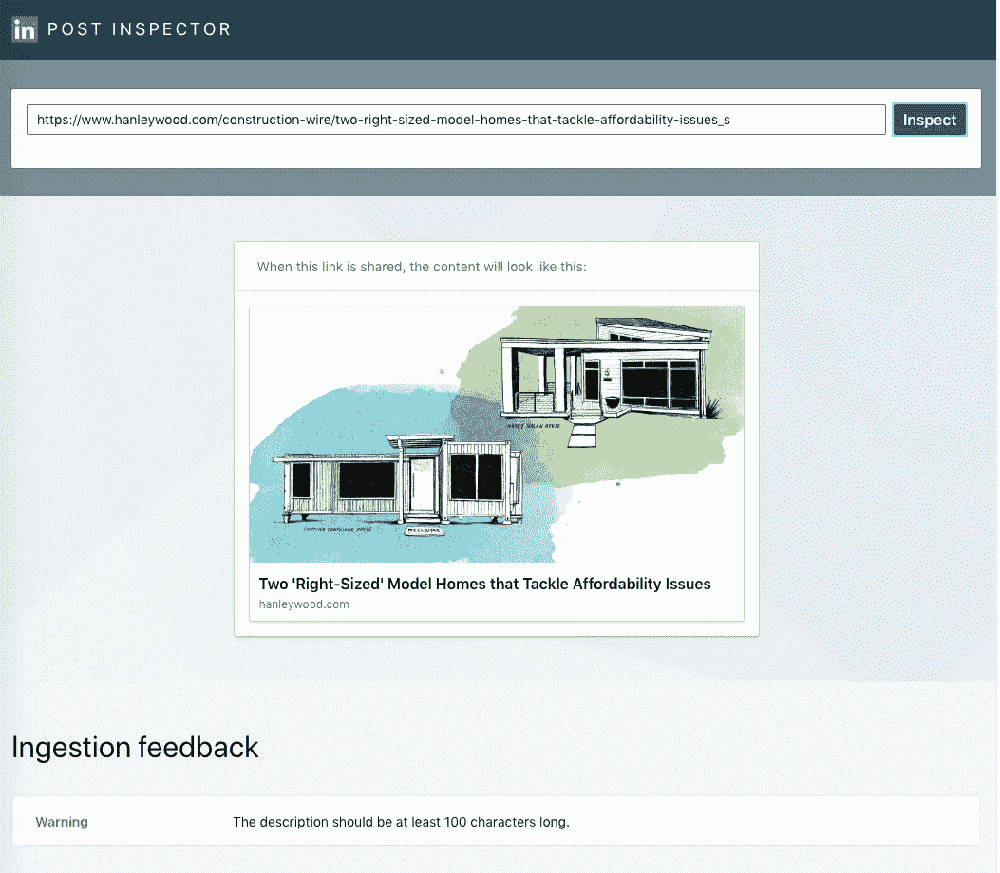

# 15 个方便的书签帮助你进行前端网站开发

> 原文：<https://levelup.gitconnected.com/15-handy-bookmarks-to-help-you-with-front-end-web-development-bb0ec5245747>

## 通过将这些网页添加到您的浏览器书签中来提高您的工作效率。

照片由 [Balázs Kétyi](https://unsplash.com/@balazsketyi?utm_source=medium&utm_medium=referral) 在 [Unsplash](https://unsplash.com?utm_source=medium&utm_medium=referral) 上拍摄

多年来，我获得了许多浏览器书签，它们帮助我完成了作为一名 web 开发人员的日常任务。我向你展示了我武库中的 15 个最好的网络工具，希望能帮助我的开发者和网页设计师们。

# CSS 工具

## CSS 选择器参考

我把这个方便的备忘单放在书签里，只是因为我没有记住所有的 CSS 选择器。有时候记不清是需要用`:first-child`还是`:first-of-type`。这对于学习你可能从未使用过的 CSS 选择器非常有用。

**网站**:[https://www.w3schools.com/cssref/css_selectors.asp](https://www.w3schools.com/cssref/css_selectors.asp)

## Flexbox 完全指南

我还没有记住 flexbox 布局的所有细节。我发现这个指南在我需要复习时最有帮助。

> “我们的 CSS flexbox 布局综合指南。这份完整的指南解释了 flexbox 的一切，重点是父元素(flex 容器)和子元素(flex 项目)所有不同的可能属性。它还包括历史、演示、模式和浏览器支持图表。”—CSS-Tricks.com

**网站**:[https://css-tricks.com/snippets/css/a-guide-to-flexbox/](https://css-tricks.com/snippets/css/a-guide-to-flexbox/)

## 较少测试者

这个工具非常有用，因为我学得很少，现在我对 CSS 预处理程序有了更多的经验，它仍然很有用。考虑这样的情况，你的代码看起来非常好，但是由于某种原因，你的风格没有像预期的那样呈现。将您的代码复制并粘贴到 LESS Tester 中，看看呈现的 CSS 是否如您所愿。

LESS Tester 是一个沙盒环境，允许你以 CSS 的形式查看你的 LESS 代码。

**网站**:[https://lesstester.com/](https://lesstester.com/)

## 萨斯·梅斯特

我自己没有使用过 SASS Meister，但是我决定把它作为上面的 LESS Tester 的一个替代，提供给那些使用 SASS 的人。

SASS Meister 是另一个类似 LESS Tester 的沙盒环境。

**网站**:【https://www.sassmeister.com/】T4

## 克利皮

为了给你的网站增加一些创造性，使用这个工具使用`clip-path` CSS 属性创建复杂的形状。查看 [Smashing Magazine](https://www.smashingmagazine.com) 上的[Creating Responsive Shapes With Clip-Path And breakout Of The Box](https://www.smashingmagazine.com/2015/05/creating-responsive-shapes-with-clip-path/)，获取如何使用`clip-path`和图像为您的网站增添趣味的灵感。

**网站**:[https://bennettfeely.com/clippy/](https://bennettfeely.com/clippy/)

# 虚拟文本生成器

## Lipsum

将这个站点加入书签，以便随时生成随机文本，例如任意数量的段落、单词、字符或列表。

使用[lipsum.com](https://www.lipsum.com/)文本生成器随机生成两个段落。

**网站**:[https://www.lipsum.com/](https://www.lipsum.com/)

## 纸杯蛋糕 Ipsum

这里有一个有趣的替代简单枯燥的拉丁文本生成器。Cupcake Ipsum 生成与含糖糖果相关的随机虚拟文本。

两个随机生成的段落[cupcakeipsum.com](http://www.cupcakeipsum.com)文本生成器。

**网站**:[http://www.cupcakeipsum.com](http://www.cupcakeipsum.com/#)

## 冒险时间填充文本生成器

我真的需要解释为什么这个这么棒吗？

这不仅是发电机冒险时间的主题，但它也给你选择生成不仅仅是纯文本。您可以生成包含标题、一些段落和列表的虚拟内容。

带有丰富文本元素的随机生成的填充内容。

**网站**:[http://filler-text.blogspot.com/](http://filler-text.blogspot.com/)

# 转换工具

## Base64 编码器和解码器

能够对文件进行 base64 编码非常有用。我们将它用于图标，然后使用 CSS 中的 base64 数据来渲染它。

**网站**:[https://www.mobilefish.com/services/base64/base64.php](https://www.mobilefish.com/services/base64/base64.php)

## px tome

我们大部分的字体大小是用`em`定义的，然而，当我们的设计师在 Photoshop 中工作时，他们使用的字体大小规格是以像素为单位的。使用这个便捷的网络工具将`px`转换为`em`，反之亦然。

**网站**:[http://pxtoem.com/](http://pxtoem.com/)

# 混杂的

## 差异检查器

使用这个方便的工具快速比较文本文件之间的差异。还有一个 Diffchecker 桌面应用程序和命令行界面。

**网站**:[https://www.diffchecker.com/](https://www.diffchecker.com/)

## 图标生成器

需要生成一个 favicon？给这个网站做个书签，这样下次你需要做一个图标生成器的时候就不用到处找了。

**网站**:[https://realfavicongenerator.net/](https://realfavicongenerator.net/)

## 正则表达式 101

Regex 对我来说一直是一种痛苦，但我发现每当我不得不处理它们的时候，这个网站都非常有用。它不仅对测试你的正则表达式很有帮助，而且它还给出了每一组的解释，这样你就知道如何优化它。

测试包含国家代码的 10 位数电话号码的正则表达式。

**网站**:[https://regex101.com/](https://regex101.com/)

## 测试信用卡账号

如果您处理支付系统，您将需要在测试功能时使用测试信用卡号。你可以在这个网页上找到所有主要信用卡公司的测试卡号，如美国运通、维萨和万事达。

**网址**:[https://www . paypal objects . com/en _ AU/vhelp/paypalmanager _ help/credit _ card _ numbers . htm](https://www.paypalobjects.com/en_AU/vhelp/paypalmanager_help/credit_card_numbers.htm)

## 社会化元标签和搜索引擎标记的验证工具

这篇博客文章包含了一个工具列表，你可以用它来对照流行的社交媒体站点来验证你的站点的元标签。我将在这里添加一些，但请查看下面的链接，了解更多的社交媒体验证器以及为什么社交元标签很重要的详细解释。

*   [脸书的开放图形调试器](https://developers.facebook.com/tools/debug)
*   [推特卡验证器](https://dev.twitter.com/docs/cards/validation/validator)
*   [Pinterest 富 pin 验证器](https://developers.pinterest.com/rich_pins/validator/)

博文中没有的是 [LinkedIn 的帖子检查员](https://www.linkedin.com/post-inspector/)。

**网站**:[https://www . eye flow . com/validator-tools-social-meta-tags-search-engine-markup/](https://www.eyeflow.com/validator-tools-social-meta-tags-search-engine-markup/)

# 结论

我希望这个列表对你有用。请在评论中添加您最喜欢的网络工具。