# 程序员给程序员开的 15 个搞笑笑话

> 原文：<https://levelup.gitconnected.com/15-hilarious-jokes-by-the-programmers-for-the-programmers-5be2e480f7fb>

## 幽默

## 不是程序员也不用担心。这些笑话仍然会逗得你捧腹大笑。

作者使用 kapwing.com 的图片

由于 WFH 的情况，我怀念办公室的环境，在那里我们疯狂地笑着谈论我们这些程序员生活中的愚蠢笑话。

这里有一个重现笑声的尝试。这些笑话会让你笑得在地上打滚，因为它们都是源于现实生活中的场景。

**毕竟，软件工程师现实生活中的事件比任何笑话都有趣。**

> **注意:**如果你正在喝热饮，请在继续阅读前安全放下。

# 0.调试定义

调试是每个程序员武器库中最强大的工具。我们 80%的工作时间用于调试，其余 20%用于编码。

使用 kapwing.com 制造

# 1.格式化代码

不幸的是，当你有一天不得不理解自己的代码时。

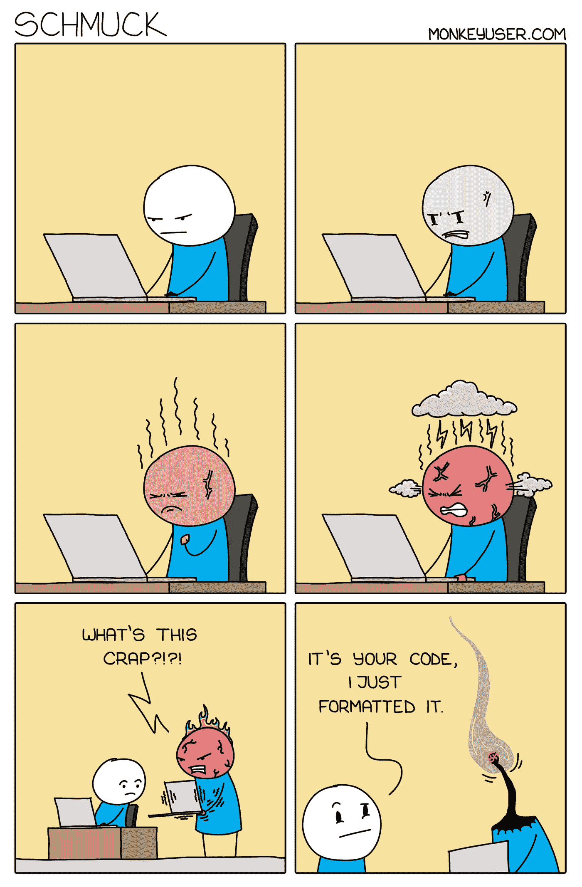

[https://www.monkeyuser.com/](https://www.monkeyuser.com/)

# 2.截止日期— PUB-G 风格

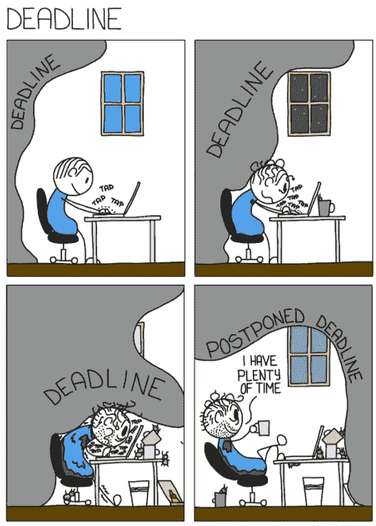

[monkeyuser.com](https://www.monkeyuser.com/)

# 3.使用 Javascript 总是很有趣😷

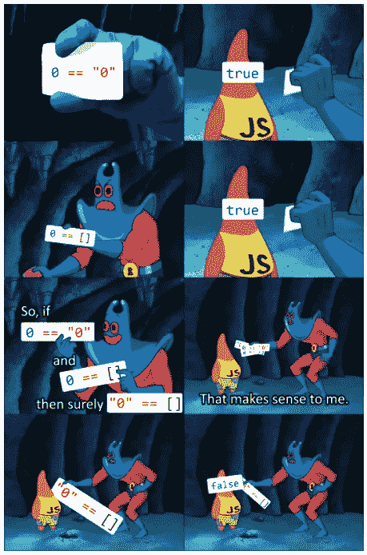

9gag.com

# 4.哦，天啊，没有复制粘贴，我永远也不能得到一个简单的正则表达式

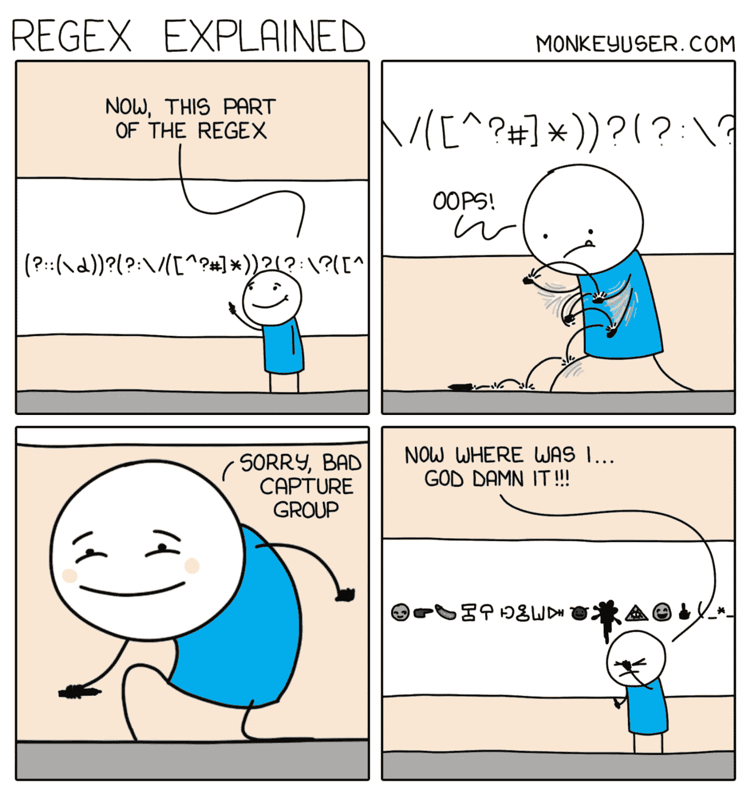

[monkeyuser.com](https://www.monkeyuser.com/2020/regex-explained/)

# 5.我编程生涯的祸根💩

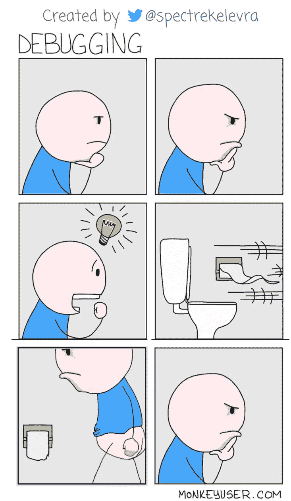

[monkeyuser.com](https://www.monkeyuser.com/2018/debugging/)

# 6.如果代码质量成为程序员上天堂的标准😈

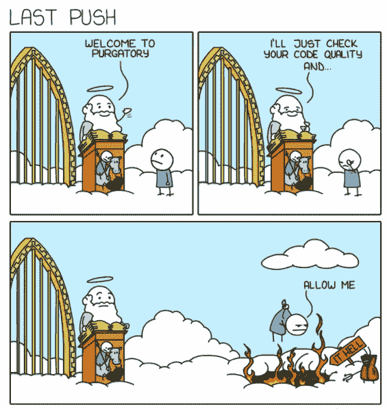

[monkeyuser.com](https://www.monkeyuser.com/)

# 7.关于代码冻结的最大神话

我可以担保这一点😉

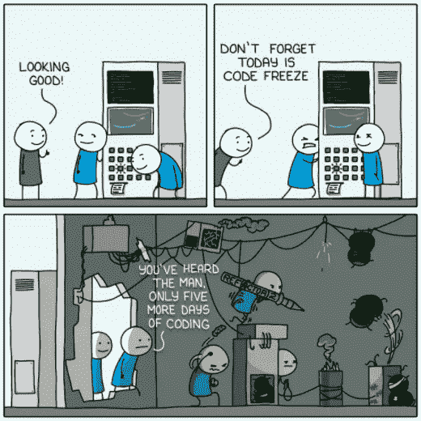

[monkeyuser.com](https://www.monkeyuser.com/)

# 8.科技债务从来都不重要，直到它们变得重要

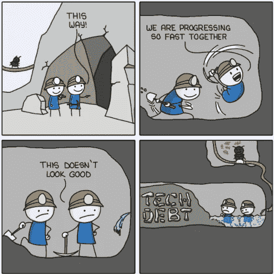

[monkeyuser.com](https://www.monkeyuser.com/)

# 9.边缘案例

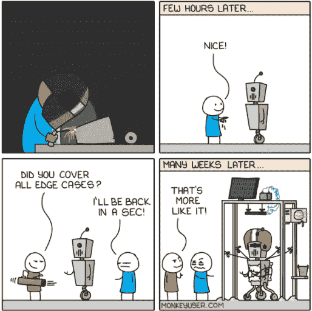

[monkeyuser.com](https://www.monkeyuser.com/)

# 10.你是哪种类型的程序员？

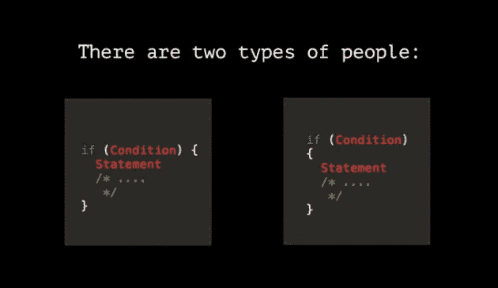

hongkiat.com

# 11.总有最后一个要解决

hongkiat.com

# 12.程序员的美丽大脑👺

thecoderpedia.com

# 13.当你美丽的大脑在你即将入睡时恶作剧，最后😵

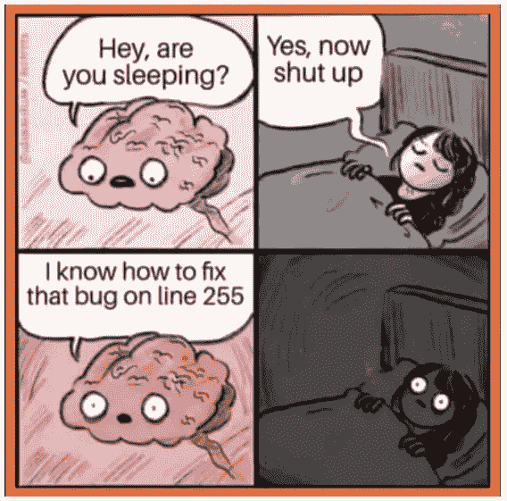

thecoderpedia.com

# 14.我打赌每个程序员都经历过这五个阶段。我确实做了。

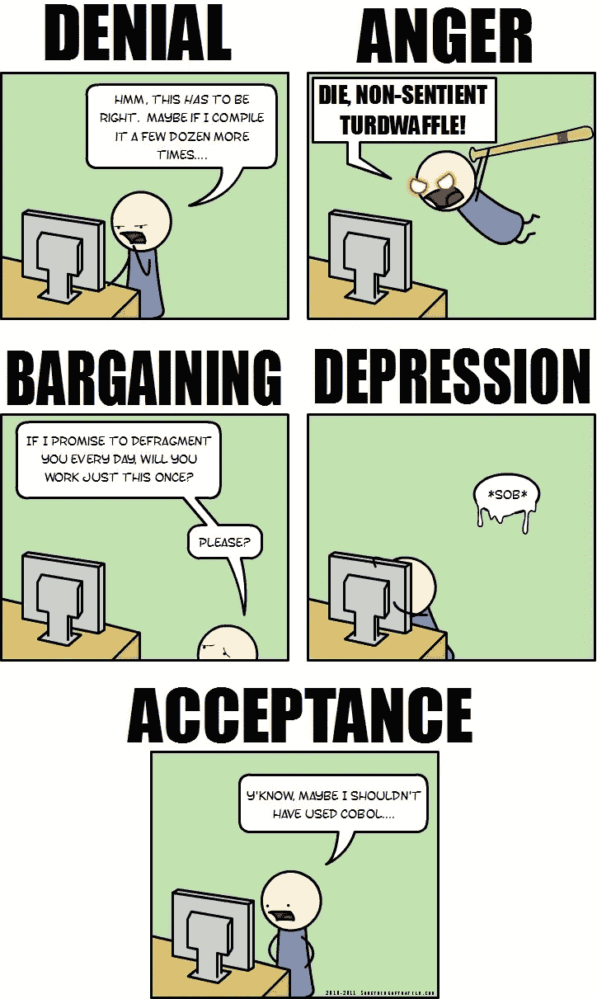

[**somethingofthatilk.com**](http://somethingofthatilk.com/index.php?id=150)

# 奖金:我知道我们都喜欢一点点奖金

啊！用一个评论拒绝一个缺陷的满足感——不是一个缺陷。测试问题。😆

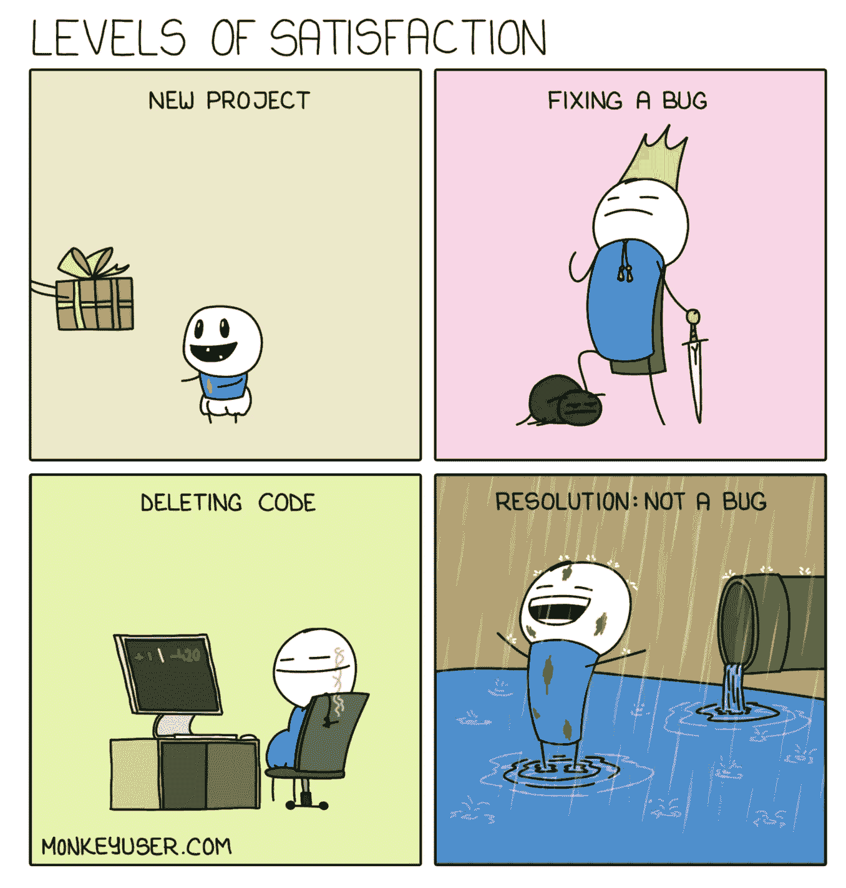

[monkeyuser.com](https://www.monkeyuser.com/2020/levels-of-satisfaction/)

如果您还不是 Medium， [**的付费会员，您可以通过访问此链接**](https://lokajit-tikayatray.medium.com/membership) 进行注册。你可以无限制地阅读媒体上的所有报道。我会收你一部分会员费作为介绍费。

***感谢边看边笑。如果你想转到更有趣的话题，你可能会喜欢读* :**

 [## 世界上最难的 5 种编程语言

### 你以前听说过多少？

levelup.gitconnected.com](/5-most-difficult-programming-languages-in-the-world-549c3cf91b23)  [## 作为程序员，如何实现非凡的职业发展

### #1.你的职业是你的责任。

levelup.gitconnected.com](/software-developers-guide-how-to-achieve-an-extraordinary-career-growth-8b9952f3d163) 

# 分级编码

感谢您成为我们社区的一员！ [**订阅我们的 YouTube 频道**](https://www.youtube.com/channel/UC3v9kBR_ab4UHXXdknz8Fbg?sub_confirmation=1) 或者加入 [**Skilled.dev 编码面试课程**](https://skilled.dev/) 。

 [## 编写面试问题+获得开发工作

### 掌握编码面试的过程

技术开发](https://skilled.dev)