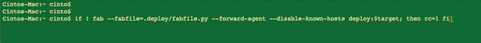

# 高级 Linux Bash 用户经常使用的 15 种键盘快捷键

> 原文：<https://levelup.gitconnected.com/15-keyboard-shortcuts-that-advanced-linux-bash-users-always-use-661b340d5a8e>

## 掌握这些键盘快捷键可以让任何人看起来都像专业人士


[弗洛里安·克拉姆](https://unsplash.com/@floriankrumm?utm_source=medium&utm_medium=referral)在 [Unsplash](https://unsplash.com?utm_source=medium&utm_medium=referral) 上拍摄的照片

Bash 是大多数 Linux 发行版的默认命令行 shell，从 Ubuntu 和 Debian 到 Red Hat 和 Fedora。Bash 也是 macOS 附带的默认 shell。

随着集装箱化和 Kubernetes 等技术的广泛应用，掌握壳牌技术至关重要。掌握 shell 最重要的方法之一就是使用快捷键。

如果您是一名软件工程师或 bash 的狂热爱好者，shell 快捷方式可以让您的生活轻松许多。

想象一下，给你一个从 A 地到 b 地的任务，如果你知道一条可以避开交通并且可以更快到达的捷径，你肯定会使用它…不是吗？Shell 快捷方式非常相似。精通键盘快捷键会让你免去许多手动的枯燥步骤。

所以这里有一些每个 Linux 用户都应该使用的 Bash 快捷方式。

# 控制光标

`Ctrl A`

假设你写了一个很长的命令，并且意识到在第一个单词中有一个问题。你可以一直按住你的左光标，或者按下`Ctrl A`，它会带你到行的开始。完全的生活救星

`Ctrl E`

与上面类似，这将帮助你走到线的尽头。

`Ctrl XX`

这将帮助您在光标的起始位置和当前位置之间来回移动。您可以在两者之间进行编辑。可爱的捷径。



作者创建的 Gif

# 进程管理

`Ctrl Z`

这将挂起当前的前台进程。这将向流程发送`SIGTSTP`信号。要在以后让进程回到前台，您可以使用命令— `fg process_name`

`Ctrl C`

发送`SIGINT`信号中断前台进程。默认情况下，它应该优雅地停止进程。

`Ctrl D`

退出 bash shell。类似于 exit 命令

# 案例转换

有时你需要改变我们刚刚输入的单词的大小写。有多种选择可以做到这一点。

`Esc C`

将光标下的字符转换为大写。

```
dd**f**f0 fdFf
<ESC C>
dd**F**f0 fdFf
```

`Esc U`

将光标到单词末尾的文本转换为大写。

`Esc L`

与上面类似，这将从光标到单词末尾的文本转换为小写。

# 删除或撤消文本

很多时候，我们用大量的 awk 和 sed 编写了一个复杂的长命令，却发现命令中有一个打字错误。不知道这些快捷方式的人现在会点击退格键，直到它变成黑色。

`Ctrl W`

这将删除光标当前位置之前的单词。

`Ctrl Y`

刚刚意识到你用上面的命令删除了错误的单词——`Ctlr W`？别担心。您可以使用命令`Ctrl Y`将其恢复。这将粘贴回文本。

`Ctrl U`

键入错误的整个命令？别担心。点击`Ctrl U`命令删除从当前光标位置到行首的所有内容。

# 利用历史

想浏览你的 bash 搜索历史。这些快捷方式会有所帮助。

`Ctrl P`

这将带回 bash 历史中的前一个命令。多次按下此按钮，继续返回。这与`Up`箭头的作用完全相同

`Ctrl N`

与前一个命令相反，这将带回下一个命令。多次按下此按钮，继续前进。这与`Down`箭头的作用完全相同

`Ctrl+R`

回忆与您提供的字符匹配的最后一个命令。如果您提供一个`echo`命令，这将返回您找到的具有该关键字的最新命令

精通键盘快捷键将使 Bash 用户有别于普通用户。这将帮助你更有效率和生产力。

所以下次有人在看你的时候，用这些很酷的快捷方式让他们大吃一惊吧。