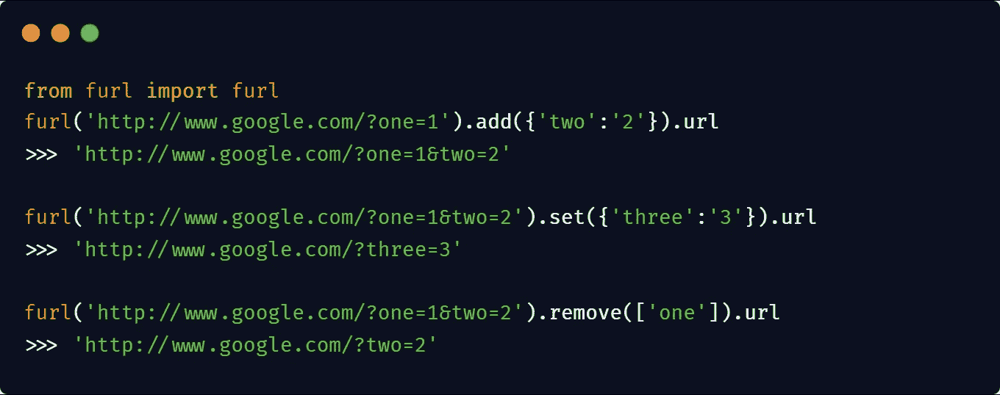

# 值得一试的 15 个 Python 包

> 原文：<https://levelup.gitconnected.com/15-python-packages-worth-checking-out-9a1e9562801f>

## 对于所有的技术爱好者


“作者创建的图像”

Python 已经取代法语成为小学教授的最受欢迎的语言。大受欢迎的原因是其简单的语法、一行程序和大量的软件包。python 中的包是 python 文件的集合。名为`__init__.py`的文件意味着 python 路径中包含文件 __init__ 的每个目录。py 被当作一个 python 包。

python 包索引上有超过 30K 个 python 包，其中有些很有用，有些只是浪费时间。在这篇博客中，我将与你分享 15 个值得一看的 python 包。

# 1.篮板球

`[rebound](https://github.com/shobrook/rebound)`是一个命令行工具，当您遇到任何错误时，它可以立即获取堆栈溢出结果。现在你不必去 StackOverflow 手动搜索解决方案。它支持 Python，Node.js，Ruby，Golang 沿 Java。


[来源](https://github.com/shobrook/rebound)

它是用 python 编写的，利用 BeautifulSoup(Web 抓取)从 StackOverflow 中抓取结果。

**安装** : `pip install rebound-cli`

**Github 统计:(3.7k+ ⭐) (390+分叉)**

**重要链接** : [*Github*](https://github.com/shobrook/rebound)

# 2.WordCloud

[单词云](https://github.com/amueller/word_cloud)是语料库中出现的频繁单词的可视化表示。在单词云中，文本的大小取决于其频率，这意味着最频繁出现的单词将在云中获得最大的大小，最不频繁出现的单词将获得最小的大小。

安装:`pip install wordcloud`

使用包装的优势—

*   可以填满所有可用的空间。
*   能够使用任意的遮罩。
*   有一个简单的算法，可以很容易地修改。
*   使用 Python

查看 Github 的[](https://github.com/amueller/word_cloud)*资源库和[*图库中的*](https://amueller.github.io/word_cloud/auto_examples/index.html#example-gallery) 例子，快速获得洞察力。*

***Github 统计:(8.2k+ ⭐) (2.1k+分叉)***

*让我们在[维基百科](https://en.wikipedia.org/wiki/Machine_learning)上创建一个机器学习页面的词云。*

**

*输出由上述代码生成的 WordCloud 图像*

# *3.Bamboolib*

*根据他们的 [Github 页面](https://github.com/tkrabel/bamboolib#:~:text=upgrade%20to%20pro.-,bamboolib,-is%20a%20GUI),`bamboolib`是一个熊猫数据框架的 GUI，使任何人都能在 Jupyter 笔记本或 JupyterLab 中使用 Python。它使用户无需编写代码就能分析数据。它更快、更容易，并且带有用户友好的 GUI。它通过将最常见的转换和可视化技术预先构建到一个干净的 GUI 中，为开发人员节省了大量时间。*

***功能**—*

*   *高度可定制。*
*   *即使非技术人员也能使用它。*
*   *不提供代码工具。*
*   *支持所有常见的转换和可视化技术。*
*   *与任何 python 库轻松集成。*

***安装** : `pip install bamboolib`*

***Github 统计:(3.7k+ ⭐) (390+分叉)***

***重要链接**:[*Github*](https://github.com/tkrabel/bamboolib)*[*教程*](https://towardsdatascience.com/introducing-bamboolib-a-gui-for-pandas-4f6c091089e3) [*教程*](https://towardsdatascience.com/bamboolib-learn-and-use-pandas-without-coding-23a7d3a94e1b)**

# **4.Autoviz**

**Autoviz 是 python 中可用的数据可视化库。它只用一行代码就能生成强大的交互式图表。您可以输入 pandas 数据框或原始 CSV 文件来快速了解数据。**

**它首先分析数据以识别问题的类型(分类、回归、无监督或时间序列问题)，然后选择最佳图表来最大化您的洞察力。**

****安装** : `pip install autoviz`**

**让我们在 Titanic 数据集上使用这个库来生成关于数据的见解。**

**将数据集粘贴到与您的代码相同的位置，并运行它来快速查看数据——使用[Canva.com](https://carbon.now.sh/?bg=rgba%2528255%252C255%252C255%252C1%2529&t=vscode&wt=bw&l=python&ds=true&dsyoff=0px&dsblur=6px&wc=true&wa=false&pv=0px&ph=0px&ln=true&fl=1&fm=Droid+Sans+Mono&fs=18px&lh=250%2525&si=false&es=2x&wm=false&code=from%252520autoviz.AutoViz_Class%252520import%252520AutoViz_Class%25250AAV%252520%25253D%252520AutoViz_Class%2528%2529%25250Adf%252520%25253D%252520pd.read_csv%2528%252522titanic_data.csv%252522%2529%25250AAV.AutoViz%2528filename%25253D%2527%2527%25252Csep%25253D%2527%25252C%2527%25252CdepVar%25253D%252522Survived%252522%25252Cdfte%25253Ddf%25252Cheader%25253D0%25252Cverbose%25253D1%2529)创建的代码块**

> **查看他们关于[数据科学](https://towardsdatascience.com/autoviz-a-new-tool-for-automated-visualization-ec9c1744a6ad)的详细教程，以更好地了解这个库。**

# **5.细流**

**Streamlit 是一个开源的 Python 库，可以轻松地为机器学习和数据科学项目创建和共享漂亮的自定义 web 应用程序。**

**它提供了许多内置函数来减少代码的大小。例如，如果您要使用 HTML、CSS 和 JavaScript 在网页上创建一个上传按钮，那么您必须用所有这三种语言编写代码，但是在 streamlit 的帮助下，您只需一行代码就可以创建整个按钮。**

****安装** : `pip install streamlit`**

****重要链接** : [文档](https://docs.streamlit.io/en/stable/) [Github](https://github.com/streamlit/streamlit)**

****Github 统计:(15.6k+ ⭐) (1.4k+分叉)****

**查看来自 Shail Deliwala 的这篇详细的教程,它解释了对该库的深入介绍。**

# **5.Plotly**

**[Plotly](https://github.com/plotly/plotly.py) 是一个用 python 编写的交互式开源数据可视化库。它提供了 40 多个独特的图表和图形。Plotly 使创建仪表板和在服务器上部署它们变得非常容易。使用该库构建的图是交互式的，意味着您可以随时检查某一点的值。它支持 Python、R 和 Julia 编程语言。**

**您可以使用 Plotly 创建各种图表:**

1.  **基本图表**
2.  **统计图表**
3.  **转换**
4.  **科学图表**
5.  **支线剧情**
6.  **财务图表**
7.  **地图**
8.  **Jupyter Widgets 交互**

****安装** : `pip install plotly`**

****重要链接**:[Github](https://github.com/plotly/plotly.py)文档**

****Github 统计:(10k+ ⭐) (1.9k+分叉)****

**下面是在官方文档中 Plotly 库的帮助下，使用条形图比较 tips 数据集的两个特征的代码。**

****

**使用 Plotly 的提示数据集数据可视化- [来源](https://plotly.com/python/plotly-express/)**

**让你从 [Neptune.ai](https://neptune.ai/blog/plotly-python-tutorial-for-machine-learning-specialists) 开始的教程。**

# **7.**敲打敲打****

**它是一个 python 库，可以向您的移动设备发送通知。如果你想知道它是如何有用的，那么让我给你一些它的使用案例。**

*   **一旦你的深度学习模型训练完成，你就可以使用这个库来获得通知。**
*   **构建完成后，您会收到通知。**
*   **你甚至可以用它来接收一般的通知，如天气、待办任务等等。**

****安装** : `pip install knockknock`**

****重要链接**:[Github](https://github.com/huggingface/knockknock)教程**

****github**:**(2.2k+⭐)(150+分叉)****

**这个库提供了多种发送通知的方式，如电子邮件、Slack、电报、微软团队、Discord、桌面等等。**

**下面是一个简单的两行代码发送通知到您的电子邮件。**

****

**[**来源**](https://github.com/huggingface/knockknock)**

# **9.算法**

**正如包名本身所解释的，这个包包含了几乎所有你需要的算法的代码和解释。**

****安装** : `pip install algorithms`**

****重要链接** : [Github](https://github.com/keon/algorithms) 网站**

****github**:**(19.6k+⭐)(4k+分叉)****

**一个简单的合并排序的例子，使用了官方文档中的这个包。**

**[来源](https://github.com/keon/algorithms)**

**有趣的是，这个库并不局限于算法。它还包含矩阵不同操作的代码。图表、树等等。**

# **10.骗子**

**有时当使用数据库时，我们需要假数据来测试我们的查询。独自创建假数据可能会很痛苦和无聊。Faker 是一个 python 库，可以为你生成假数据。无论你需要一个名字还是一封电子邮件，它都能为你提供各种目的的虚假数据。**

****安装** : `pip install Faker`**

****重要链接** : [Github](https://github.com/joke2k/faker) [文档](https://faker.readthedocs.io/en/master/)**

****Github 统计** : **(19.6k+ ⭐) (4k+分叉)****

**让我们生成一些假数据扔进这个库。**

```
**from faker import Faker
fake = Faker()
name = fake.name()
print(name)
address = fake.address()
print(address)
---------------------------------OUTPUT---------------------
Karl David
77456 Mark Street
North Kimberlypor, ND 76395**
```

# **11.**卷起****

**" [Python](https://github.com/gruns/furl) 提供了许多标准库来执行常见的 URL 相关函数，如 [urllib](https://docs.python.org/2/library/urllib.html) 和 [urlparse](https://docs.python.org/2/library/urlparse.html) 但是这些函数对于这些类型的常见任务来说感觉很乏味。Furl 使得解析和操作 URL
变得超级简单”,根据他们的 GitHub 知识库[自述](https://github.com/gruns/furl#readme)。**

**Furl 测试良好，支持 python2 和 3。**

****安装** : `pip install furl`**

****重要链接**:[Github](https://github.com/gruns/furl)示例**

****Github 统计** : **(2.1k+ ⭐) (130+分叉)****

****

# **12.空间**

**每个人都知道 NLTK，它是用于自然语言处理相关任务的最著名的库之一。但是没有多少人知道 spacy。它是 NLP 的下一代库。**

**Spacy 是用 Python 和 Cython 编写的高级自然语言处理任务的开源库。它是专门设计用于生产的。它可以用来构建信息提取器、问答机器人、深度学习的文本预处理器、聊天机器人等等。**

****安装** : `pip install spacy`**

****重要链接** : [Github](https://github.com/explosion/spaCy) [文档](https://spacy.io/usage/spacy-101)**

****Github 统计** : **(21.1k+ ⭐) (3.5k+分叉)****

**让我们使用空间来执行标记化**

****

# **13.EasyOCR**

**据 Easy OCR 的创建者 [JaidedAI](https://github.com/JaidedAI/EasyOCR) 称，这个 Python 库用于光学字符识别。它提供了 80 多种支持的语言和所有流行的书写文字，包括拉丁语，汉语，阿拉伯语，梵文，西里尔语等。**

****特点** —**

*   **易于使用。**
*   **快速处理。**
*   **支持 80+语言。**
*   **可以识别手写文本。**
*   **预测准确率高达 80+。**

****安装** : `pip install easyocr`**

****重要链接**:[Github](https://github.com/JaidedAI/EasyOCR)文档 测试这里的项目**

****Github 统计** : **(12.3k+ ⭐) (1.5k+分叉)****

**从图像中识别文本的简单代码。**

****

# **14.格拉迪欧**

**“Gradio 是一个开源的 python 库，它为您的机器学习模型提供了一个 web 界面。它可以为你的 ML 模型或函数生成一个简单易用的演示，只需要几行代码。你可以直接集成到你的 Python 笔记本中，或者与你的跨学科团队共享一个链接”——根据 [Gradio](https://gradio.app/) 的创建者所说。**

****安装** : `pip install gradio`**

****重要链接** : [Github](https://github.com/gradio-app/gradio) [教程](https://towardsdatascience.com/build-an-awesome-ui-for-your-machine-learning-models-7fab52ecdd86)**

****Github 统计** : **(3.3k+ ⭐) (400+分叉)****

# **15.进度条:进度和 tqdm**

**[**进度**](/20-python-packages-that-you-must-try-a81862c913f6#:~:text=3.%20Progress%20bars%3A%20progress%20and%20tqdm) **:** 使用这个库，你可以不费吹灰之力创建一个进度条。它只需要几行代码就可以生成惊人的进度条。您可以使用这些栏来隐藏代码的等待时间，以一种漂亮而专业的方式完成任务。使用开源库是免费的。**

****安装** : `[pip install progress](https://pypi.org/project/progress/)`**

```
**from progress.bar import Bar
bar = Bar('Loading', max=20)
for i in range(20):
    # Any Task
    bar.next()
bar.finish()**
```

**下面的动画显示了不同的酒吧，我们可以使用进展。**

****

**Giorgos Verigakis 的动画来自 [progress](https://pypi.org/project/progress/)**

**tqdm :它也做同样的工作，但看起来更有效率，并且与现代编程保持同步。**

****安装** : `pip install tqdm`**

****

**来源:[https://github.com/tqdm/tqdm](https://github.com/tqdm/tqdm)**

# **参考**

**【1】[https://github.com/josephmisiti/awesome-machine-learning](https://github.com/josephmisiti/awesome-machine-learning)T22【2】[https://github.com/vinta/awesome-python](https://github.com/vinta/awesome-python)**

******感谢阅读*** *，希望你找到有用的东西。可以关注我从**[***这里***](https://abhayparashar31.medium.com/?intent=follow) *。并在 LinkedIn 上与我联系从* [***这里***](https://www.linkedin.com/in/abhay-parashar-328488185/)****

## ***看看作者精心挑选的这些文章***

```
***[***35 Most Valuable GitHub Repositories For Developers***](https://medium.com/pythoneers/35-most-valuable-github-repositories-for-developers-45ab9df1af81)[***10 Underrated Python Packages Every Data Scientist Should Know***](https://medium.com/pythoneers/10-underrated-python-packages-every-data-scientist-should-know-86b4355cc35e)[***Best Practices To Follow While Creating Classes In Python***](https://medium.com/pythoneers/best-practices-to-follow-while-creating-classes-in-python-4497bc8535dc)***
```