# 当你想很好地使用 Spring @Transactional 时，你需要知道的 15 件事情

> 原文：<https://levelup.gitconnected.com/15-things-you-need-to-know-when-you-want-to-use-spring-transactional-really-well-fc6f5ec207ac>

作为一名优秀的 Java 开发人员或架构师。你真的掌握了如何用好@Transactional 吗？

该事务是理解和使用 well 概念所必需的，这将确保我们业务数据的完整性，并避免许多不必要的错误。

在这篇文章中。我就说说如何在数据操作上很好的使用 spring annotation @Transactional。而且 ***读完之后你会发现很多好的例子带走。***


外卖

## 1.在我们开始钻研@Transactional 注释之前，我们首先需要理解什么是事务。

什么是交易？

*   事务通常被定义为不可分割的工作单元。[什么是交易？Java EE 5 教程](https://docs.oracle.com/javaee/5/tutorial/doc/bncii.html)
*   在 java 中，它是一系列必须成功完成的动作。如果一个或多个动作失败，所有其他动作必须退出，应用程序的状态保持不变。[https://www.baeldung.com/java-transactions](https://www.baeldung.com/java-transactions)

让我们用图表上的一个简单例子来解释:

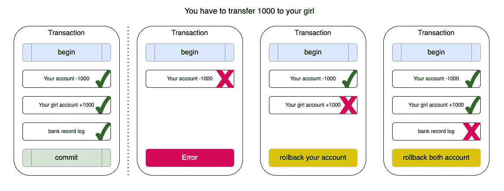

简单交易示例

所以这关系到数据的完整性。我们只能看到所有步骤的成功。事务可以提交。否则将失败或回滚以保持数据完整性。

事实上，在计算机领域，有多种事务类型如数据库事务、消息中间件的消息事务(Kafka、Rockmq)等。而**这篇文章将关注数据库事务。**

## 1.1 交易的使用场景

什么时候用？

总之。当您试图在工作单元的一个或多个步骤中创建/更新/删除表中的数据时。那么你最好使用事务来保持数据的完整性。

## 1.2 Spring 提供的事务机制。

所有的数据访问技术都有自己的事务处理机制，这些技术提供了用于打开事务、提交事务以完成数据操作或在发生错误时回滚数据的 API。

Spring 的事务机制是为不同的数据访问技术处理事务的统一机制，Spring 的事务机制提供了一个**PlatformTransactionManager**接口，不同的数据访问技术从这个接口实现它们不同的方式。

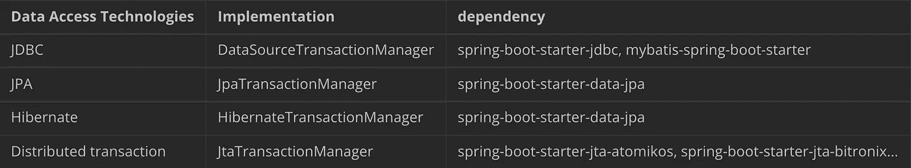

## 1.2.1 Spring 声明式事务

Spring 提供了一个*@ EnableTransactionManagement*注释来启用对配置类的声明式事务支持。在使用了*@ EnableTransactionManagement*之后，Spring 容器会自动扫描标注了 *@Transactional* 的方法和类。*@ EnableTransactionManagement*使用方法如下。

```
@Configuration
@EnableTransactionManagement
public class ApplicationConfig {
    ...
}
```

在方法上使用 *@Transactional* 注释来表示该方法需要事务支持

```
@Transactional
public void dbOperate(Object xxxx) {
    //save or update or delete
}
```

*@Transactional* 不仅可以在方法上注释，也可以在类上注释。当对一个类进行注释时，该类的所有公共方法都是支持事务的。如果同时使用了类级别和方法级别的 *@Transactional* 注释，则在方法级别使用的注释会覆盖类级别的注释。

Spring 团队**建议在特定的类(或类的方法)上使用 *@Transactional* ，而不是在该类打算实现的任何接口上。**

如果它必须在一个接口上使用，**它只有在你建立一个基于接口的代理**时才能工作。这是因为注释是不可继承的，这意味着一旦您在使用基于类的代理时设置了基于接口的代理，基于类的代理将不会识别事务设置，并且事务代理也不会包装对象。

## 1.3 SpringBoot 的交易支持

Spring Boot 的事务配置类是*org . spring framework . boot . auto configure . transaction . transactionautoconfiguration*。

```
@AutoConfiguration(after = { JtaAutoConfiguration.class, HibernateJpaAutoConfiguration.class,
        DataSourceTransactionManagerAutoConfiguration.class, Neo4jDataAutoConfiguration.class })
@ConditionalOnClass(PlatformTransactionManager.class)
@EnableConfigurationProperties(TransactionProperties.class)
public class TransactionAutoConfiguration {
    ...
}
```

只有当类`PlatformTransactionManager`存在于`classpath`上时，它才起作用。并且仅在应用了以下自动配置类之后:

*   `JtaAutoConfiguration`
*   `HibernateJpaAutoConfiguration`
*   `DataSourceTransactionManagerAutoConfiguration`
*   `Neo4jDataAutoConfiguration`

那么 SpringBoot 如何选择使用哪种数据访问技术和对应的事务管理器呢？它实际上是根据你所介绍的依赖关系来选择的。

```
<dependency>
    <groupId>org.springframework.boot</groupId>
    <artifactId>spring-boot-starter-data-jpa</artifactId>
</dependency>
```

当引入 spring-boot-starter-data-jpa 时，SpringBoot 将默认使用 JpaTransactionManager 作为事务管理器。

```
<dependency>
    <groupId>org.springframework.boot</groupId>
    <artifactId>spring-boot-starter-jdbc</artifactId>
</dependency>
```

当您引入 spring-boot-starter-jdbc 时，SpringBoot 将默认使用 DataSourceTransactionManager 作为事务管理器。

## 1.4 Spring Data JPA 的事务支持

Spring Data JPA 对所有默认方法都启用了事务支持，查询事务默认启用了***readOnly = true***属性。

这可以从 **SimpleJpaRepository** 源代码中看出，定义在类级*@ Transactional(readOnly = true)*，但是 save()和 delete()相关操作覆盖了 *@Transactional* 属性，此时 *readOnly* 属性为 false，其余的查询操作 *readOnly* 仍然为 true。

```
@Repository
@Transactional(readOnly = true)
public class SimpleJpaRepository<T, ID> implements JpaRepositoryImplementation<T, ID> {

    ...

    @Transactional
    @Override
    public <S extends T> S save(S entity) {
        ...
    }

    ...

    @Override
    @Transactional
    @SuppressWarnings("unchecked")
    public void delete(T entity) {
        ...
    }
}
```

## 2.如何用好这个注释，我们需要完全理解一些基本的规则。

注意，默认情况下，**回滚在运行时发生，未检查的异常仅在**(图中黄绿色部分)发生。

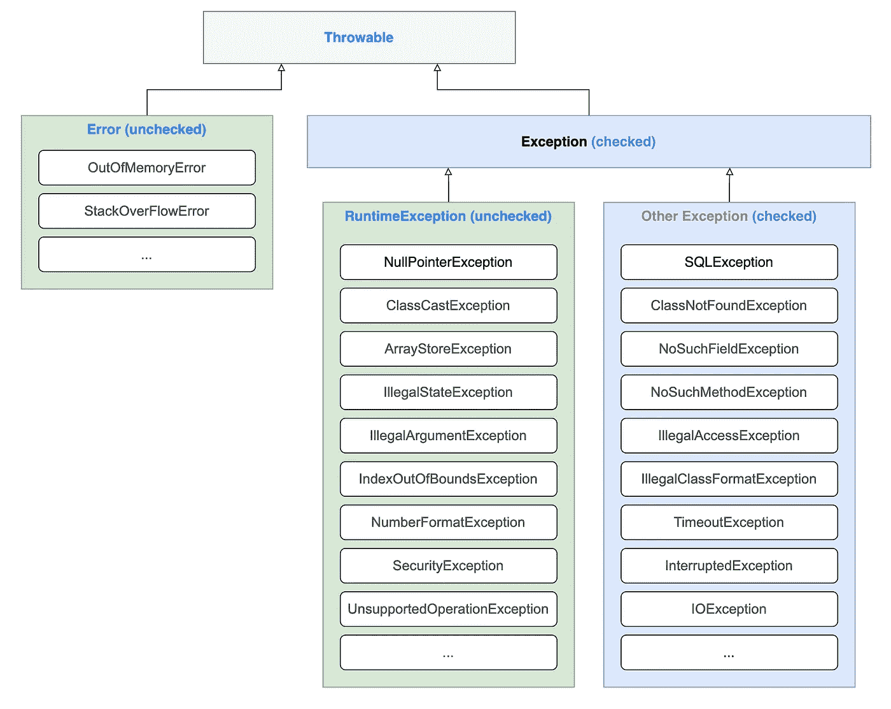

例外

为什么这样设计？Spring 认为，checked exception 属于业务范围，程序员需要给出解决方案而不是直接交给框架或 JVM 去处理。

**被检查的异常不触发事务的回滚**。

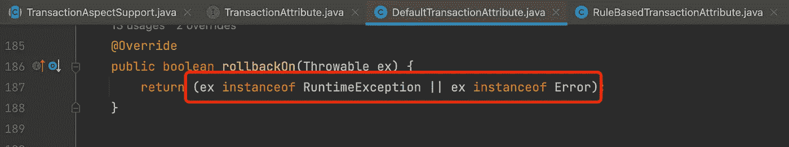

源代码

当然，我们可以用 *rollbackFor* 和 *noRollbackFor* 注释参数来配置这种行为。

*@Transactional* 注释使用属性 *rollbackFor* 或 *rollbackForClassName* 来回滚事务，并使用属性 *noRollbackFor* 或 *noRollbackForClassName* 来避免回滚列出的异常。

# 回滚到

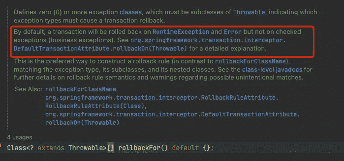

源代码

选中时，异常抛出将执行回滚。

```
 //without 'rollbackFor'
    @Transactional
    public void dbOperate() throws ClassNotFoundException {
        svcA.save();    // svcA.save() will execute normally.
        Class.forName("The Class do not Exist");  //throws
        testBMapper.descNumB();
    }

    //with 'rollbackFor'
    @Transactional(rollbackFor = {ClassNotFoundException.class})
    public void dbOperate() throws ClassNotFoundException {
        svcA.save();    // svcA.save() will rollback
        Class.forName("The Class do not Exist"); //throws
        svcB.update();
    } 
```

当非 RuntimeExceptions 被 try-catch 时， *rollbackFor* 不起作用，事务正常进行

```
@Transactional(rollbackFor = {ClassNotFoundException.class})
public void changeNum()  {
  svcA.save();    // svcA.save() will execute normally.
  try {
    Class.forName("The Class do not Exist"); //throws
  } catch (ClassNotFoundException e) {
    e.printStackTrace();
  }
  svcB.update();  // svcB.update() will execute normally.
}
```

# noRollbackFor

抛出 RuntimeException 时不会执行回滚

```
@Transactional(noRollbackFor = {ArithmeticException.class})
public void doMath(){
  svcA.save();
  int a = 1/0;  //this will throw AruthmeticException. but svcA.save() will no rollback.
  svcB.update();
}
```

当 RuntimeException 被 try-catched 时， *noRollbackFor* 不起作用，交易正常进行

```
@Transactional(noRollbackFor = {ArithmeticException.class})
public void changeNum(){
  svcA.save();    // svcA.save() will execute normally.
  try {
    int a = 1/0;
  }
  catch (Exception e){}
  svcB.update();  // svcB.update() will execute normally.
}
```

# 3.什么会导致交易失败

**3.1 访问修饰符必须是公共的**。所以 final/private/static/private/protected 都不行。

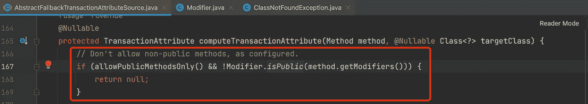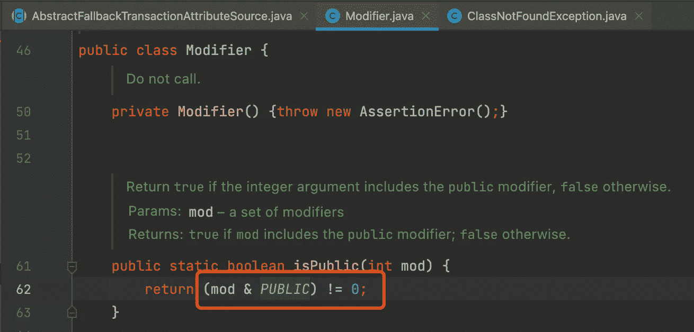

**3.2 标记方法不能与@Transactional 方法在同一个类中。**

我在上一篇文章(3.4 点)中解释了这一点[https://medium . com/git connected/8-things-you-need-to-know-when-you-want-use-spring-async-really-well-e 5a F4 af 259 C5](https://medium.com/gitconnected/8-things-you-need-to-know-when-you-want-to-use-spring-async-really-well-e5af4af259c5)

但是这次试着用一张图来解释得更清楚些。

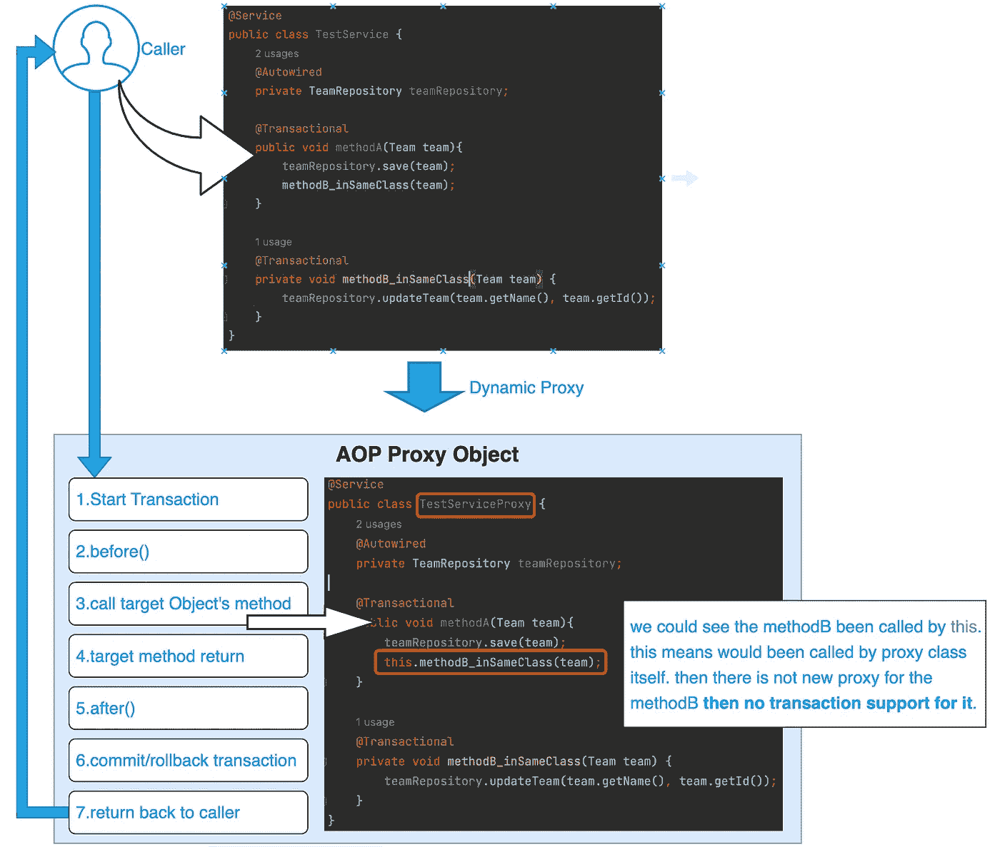

AOP 代理如何工作

**3.3 Bean 不由 spring 管理**

例如:@ Services @ Component @ Controller @ Reposity 未放在 Bean 类上

**3.4 多线程调用**

```
@Service    
public class OutsideService {
    ...

    @Transactional
    public void multipleThreadTest(Team team){
        teamRepository.save(team);
        new Thread(() -> insideService.doSth()).start(); //this would been called by new thread.
    }
}    

@Service    
public class InsideService {

    @Transactional
    public void doSth(){
        log.info("do sth");
    }
}
```

我们可以看到 *insideService.doSth()* 会在另一个新的线程中被调用，这会在不同的线程中 coz 两个方法，从而得到不同的数据库连接，因为事务是在同一个数据库连接中打开和提交/回滚的，那么 2 个不同的数据库连接自然会在两个不同的事务中处理。这导致交易失败。

从源代码中我们还可以看到，spring 的事务都是通过数据库连接实现的，**当前线程会保存一个 map，key 是数据源，value 是数据库连接**。

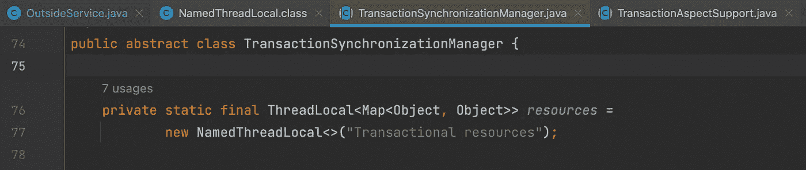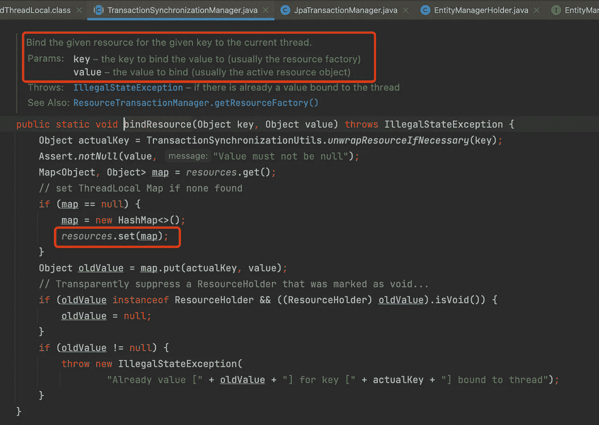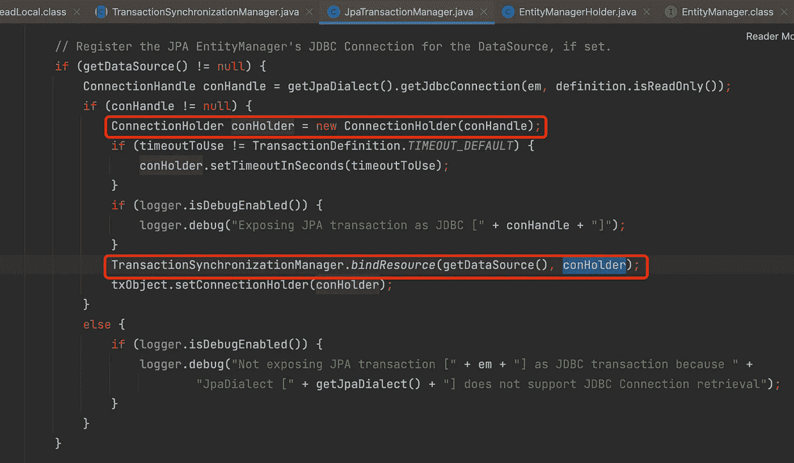

JPATransactionManager 如何调用此绑定资源(数据源，连接)

让我们来看一些代码示例:

3.4.1 父线程抛出异常。发生回滚。parentThread team 将不保存。但是由于子线程不在这个事务中，所以子线程操作不会回滚。那么 childThread 团队将拯救成功。

```
 @Service
    @Slf4j
    public class OutsideService {
        @Transactional
        public void parentThreadThrowException(Team team){
            teamRepository.save(team);
            new Thread(() -> insideService.doSth(new Team("childThread"))).start();
            throw new RuntimeException("Parent Thread throw Exception");
        }
    }

    @Service
    @Slf4j
    public class InsideService {
        @Transactional
        public void doSth(Team team){
            teamRepository.save(team);
            log.info("do sth");
        }
    }

    @Test
    void parentThread_throw_RuntimeException_rollback_but_childThread_save_success() {
        Team team = new Team("parentThread");
        assertThrows(RuntimeException.class, () -> outsideService.parentThreadThrowException(team));
        Optional<Team> parentThreadTeam = teamRepository.findByName("parentThread");
        assertFalse(parentThreadTeam.isPresent());
        Optional<Team> childThreadTeam = teamRepository.findByName("childThread");
        assertTrue(childThreadTeam.isPresent());
    }
```

3.4.2 子线程抛出异常。发生回滚。childThread 团队将不保存。但是由于子线程不在父事务中，所以父线程的操作不会回滚。那么 parentThread 团队就会拯救成功。

```
@Service
@Slf4j
public class OutsideService {
    @Transactional
    public void childThreadThrowException(Team team){
        teamRepository.save(team);
        new Thread(() -> insideService.save_ThrowException(new Team("childThread"))).start();
    }
}

@Service
@Slf4j
public class InsideService {
    @Transactional
    public void save_ThrowException(Team team){
        teamRepository.save(team);
        throw new RuntimeException("Child Thread throw Exception");
    }
}

@Test
void inside_method_throw_RuntimeException_with_REQUIRED_NEW_transaction() {
    Team team = new Team("parentThread");
    assertDoesNotThrow(() -> outsideService.childThreadThrowException(team));
    Optional<Team> newTeam = teamRepository.findByName("parentThread");
    assertTrue(newTeam.isPresent());
    Optional<Team> childThreadTeam = teamRepository.findByName("childThread");
    assertFalse(childThreadTeam.isPresent());
}
```

**3.5 数据库引擎不支持事务**

例如:MySQL-MyISAM 不支持该事务。

**3.6 使用错误的传播方式**

用例:我们只是想捕捉内部事务中发生的一些 RuntimeException，而不是触发外部事务回滚。

错误示例:

这将触发外部事务回滚。

默认的@事务传播是 ***必需的*** 。如果 *RuntimeException* 抛出事务代理，Spring 将当前事务标记为仅回滚。下面的 *insideService.method()* 会抛出*NullPointerException*[*runtime exception】*。Spring 会将当前事务标记为仅回滚，并抛出'*UnexpectedRollbackException【T21 ' '*

```
@Service
@Slf4j
public class OutsideService {
    @Transactional
    public Team dbOperateAndCallTransactionalMethod(Team team){
        teamRepository.save(team);
        try{
            insideService.REQUIRED_TransactionalMethodAndThrowNullPointerException();
        } catch (NullPointerException e){
            log.error("Exception Been catch without throws in current method transaction flow: {}", e.getMessage());
        }
        log.info("New Saved Team Id: {}", team.getId());
        return team;
    }
}

@Service
public class InsideService {
    @Transactional
    public void REQUIRED_TransactionalMethodAndThrowNullPointerException(){
        throw new NullPointerException("sth is null");
    }
}

public class PropagationUT {
    @Test
    void inside_method_throw_RuntimeException_with_default_REQUIRED_transaction() {
        Team team = new Team("NGU");
        assertThrows(UnexpectedRollbackException.class, () -> outsideService.dbOperateAndCallTransactionalMethod(team),
                "Transaction silently rolled back because it has been marked as rollback-only");
        Optional<Team> newTeam = teamRepository.findByName("NGU");
        assertFalse(newTeam.isPresent());
    }
}
```

来完成用例。我们可以通过使用*@ Transactional(Propagation = Propagation)来实现。*对内部交易的要求 _ 新)

```
@Service
@Slf4j
public class OutsideService {
    ...

    @Transactional
    public Team dbOperateAndCallTransactionalMethod_REQUIRES_NEW(Team team){
        teamRepository.save(team);
        try{
            insideService.REQUIRES_NEW_TransactionalMethodAndThrowRuntimeException();
        } catch (NullPointerException e){
            log.error("Exception Been catch without throws in current method transaction flow: {}", e.getMessage());
        }
        log.info("New Saved Team Id: {}", team.getId());
        return team;
    }
}

@Service
@Slf4j
public class InsideService {
    ...

    @Transactional(propagation = Propagation.REQUIRES_NEW)
    public void REQUIRES_NEW_TransactionalMethodAndThrowRuntimeException(){
        throw new NullPointerException("sth is null");
    }
}

public class PropagationUT {
    ...

    @Test
    void inside_method_throw_RuntimeException_with_REQUIRED_NEW_transaction() {
        Team team = new Team("NGU");
        assertDoesNotThrow(() -> outsideService.dbOperateAndCallTransactionalMethod_REQUIRES_NEW(team));
        Optional<Team> newTeam = teamRepository.findByName("NGU");
        assertTrue(newTeam.isPresent());
    }
}
```

**3.7.1 异常已被方法 self 尝试。**

```
@Transactional
    public void tryCatch(Team team){
        try {
            teamRepository.save(team);
            int a = 1/0;
        } catch (Exception e) {
            log.error(e.getMessage());
        }
    }

    @Test
    void tryCatch_no_rollback() {
        Team team = new Team("NGU");
        assertDoesNotThrow(() -> outsideService.tryCatch(team));
        Optional<Team> newTeam = teamRepository.findByName("NGU");
        assertTrue(newTeam.isPresent());
    }
```

**3.7.2 尝试了异常，并在 catch 中抛出相同的异常**

```
@Transactional
  public void tryCatchAndThrow(Team team) throws Exception{
      try {
          teamRepository.save(team);
          int a = 1/0;
      } catch (Exception e) {
          log.error(e.getMessage());
          throw new Exception();
      }
  }

  @Test
  void tryCatchAndThrow_no_rollback() {
      Team team = new Team("NGU");
      assertThrows(Exception.class, () -> outsideService.tryCatchAndThrow(team));
      Optional<Team> newTeam = teamRepository.findByName("NGU");
      assertTrue(newTeam.isPresent());
  }
```

**3.8 手动抛出已检查的异常**

```
@Transactional
    public void tryCatchAndThrowOtherCheckedException(Team team) throws TimeoutException {
        try {
            teamRepository.save(team);
            int a = 1/0;
        } catch (ArithmeticException e) {
            log.error(e.getMessage());
            throw new TimeoutException();
        }
    }

    @Test
    void tryCatchAndThrowOtherCheckedException_no_rollback() {
        Team team = new Team("NGU");
        assertThrows(Exception.class, () -> outsideService.tryCatchAndThrowOtherCheckedException(team));
        Optional<Team> newTeam = teamRepository.findByName("NGU");
        assertTrue(newTeam.isPresent());
    }
```

**3.9 手动抛出自定义检查异常。**

```
public class MyCheckedException extends Exception {

    private static final long serialVersionUID = 1L;
    private String message;

    @Override
    public String getMessage() {
        return message;
    }

    public void setMessage(String message) {
        this.message = message;
    }

    public MyCheckedException(String message) {
        this.message = message;
    }
}

@Transactional
public void tryCatchAndThrowCustomizeCheckedException(Team team) throws MyCheckedException {
  try {
    teamRepository.save(team);
    throw new MyCheckedException("my custom exception");
  } catch (MyCheckedException e) {
    log.error(e.getMessage());
    throw new MyCheckedException("MyException");
  }
}

@Test
void tryCatchAndThrowCustomizeCheckedException_no_rollback() {
  Team team = new Team("NGU");
  assertThrows(Exception.class, () -> outsideService.tryCatchAndThrowCustomizeCheckedException(team));
  Optional<Team> newTeam = teamRepository.findByName("NGU");
  assertTrue(newTeam.isPresent());
}
```

但是如果我们希望它在抛出定制异常时回滚呢？有两种方法。

1.自定义异常从 RuntimeException 扩展而来。(代码省略)

2.setRollbackOnly。

```
@Transactional
    public void tryCatchAndThrowCustomizeCheckedExceptionSetRollbackOnly(Team team) throws MyCheckedException {
        try {
            teamRepository.save(team);
             throw new MyCheckedException("my custom exception");
        } catch (MyCheckedException e) {
            log.error(e.getMessage());
            TransactionAspectSupport.currentTransactionStatus().setRollbackOnly();
            throw new MyCheckedException("MyException");
        }
    }

    @Test
    void tryCatchAndThrowCustomizeCheckedException_setRollbackOnly_will_rollback() {
        Team team = new Team("NGU");
        assertThrows(Exception.class, () -> outsideService.tryCatchAndThrowCustomizeCheckedExceptionSetRollbackOnly(team));
        Optional<Team> newTeam = teamRepository.findByName("NGU");
        assertFalse(newTeam.isPresent());
    }
```

**3.10 捕捉自定义异常但不抛出。插入不会被回滚。**

```
@Transactional
    public void tryCatchCustomizeException(Team team){
        try {
            teamRepository.save(team);
            throw new MyCheckedException("my custom exception");
        } catch (MyCheckedException e) {
            log.error(e.getMessage());
        }
    }

    @Test
    void tryCatch_CustomizeException_without_throw_no_rollback() {
        Team team = new Team("NGU");
        assertDoesNotThrow(() -> outsideService.tryCatchCustomizeException(team));
        Optional<Team> newTeam = teamRepository.findByName("NGU");
        assertTrue(newTeam.isPresent());
    }
```

# 4.最佳实践

4.1 尽可能避免多头/大额交易。

因为长期/大额交易会产生很多问题。

*   回滚发生的时间会很长。
*   当并发操作可能接管所有活动的数据库连接时
*   如果端点有一个长事务，可能会导致响应超时。
*   僵局
*   锁定等待

4.2 将 select/query DB 操作方法放到事务之外。

4.3 避免一个事务处理太多数据。

4.4 避免将远程调用放入事务中。(远程呼叫可能需要一段时间)

4.5 一些需要的功能可能我们不需要使用事务。或者我们可以使用@Async 来处理它。

— — — — — — — — — — — — — — — — — — — — — — — — — — — — — — — — — — — — — —

就是这样。我尽量不把文章写得太长，我会根据你的反馈考虑写第二部分。

第二部分。也许关注 ***潜入事务的传播行为和事务的隔离级别。*** 如果你想看，请在评论中留言。

感谢阅读！如果你喜欢它或觉得它有帮助，请点击鼓掌:)

快乐编码。下次见:)