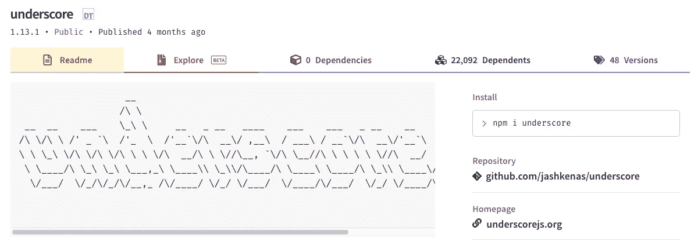

# 你应该知道的 15 个有用的 NPM 软件包

> 原文：<https://levelup.gitconnected.com/15-useful-npm-packages-that-you-should-know-71269a6531a4>

## 有助于开发过程的 npm 包列表

图片由作者创作| Logo 鸣谢: [GitHub](https://github.com/npm/logos)

**节点包管理器(NPM)** 被全球超过 1100 万开发者所依赖。npm 注册表已经成为世界上最大的软件注册表，拥有超过一百万个软件包。

在这里，我们将浏览一系列有用的 npm 包，它们将帮助您改进开发过程和开发环境的视觉美感。

# 1.洛达什

Lodash 是最常用的 JavaScript 包之一，它提供了在 JS 中处理字符串、数字、对象和数组的方法。

作者截图来自[npmjs.com](https://www.npmjs.com/package/lodash)

# 2.异步ˌ非同步(asynchronous)

Async 是一个实用程序库，它有许多函数可以处理异步 JavaScript。它可以在浏览器中与 NodeJS 以及普通的 javascript 代码一起使用。

作者截图来自[npmjs.com](https://www.npmjs.com/package/async)

# 3.RxJS

RxJS 是一个可以轻松编写异步和基于回调的代码的库。这个库使得管理任何异步事件变得更加容易，比如观察器、订阅、调度器等等。

作者截图来自[npmjs.com](https://www.npmjs.com/package/rxjs)

# 4.Dotenv

Dotenv 通过将配置从代码中分离出来，使得使用环境变量变得更加容易。该库在根级别获取`.env`文件中给出的环境变量，并将它们加载到`process.env`中。您可以在代码中直接使用`process.env`来使用任何提供的环境变量。

作者截图来自[npmjs.com](https://www.npmjs.com/package/dotenv)

# 5.白垩

Chalk 库为您注销到控制台的内容提供了样式。要了解更多关于如何在你的代码中使用它，你可以去 chalk 文档[这里](https://github.com/chalk/chalk#readme)。

作者截图来自[npmjs.com](https://www.npmjs.com/package/chalk)

# 6.Axios

Axios 是 NodeJS 的 HTTP 客户端和浏览器，用于从代码中的不同 API 获取数据。它是一个基于 promise 的 HTTP 客户端，使得从代码中调用 API 并做进一步处理变得非常容易。

作者截图来自[npmjs.com](https://www.npmjs.com/package/axios)

# 7.表达

Express 是 NodeJS 的一个极简后端框架，用于构建 web 应用程序和 API。它使得在短时间内创建后端 web 应用程序和 API 变得非常容易。

它是使用 NodeJS 快速创建和部署 web 应用程序最多的后端框架之一。

作者截图来自 npmjs.com

# 8.瞬间

Moment.js 是一个 JavaScript 库，有助于轻松解析、操作、格式化和验证日期。

作者截图来自 npmjs.com

# 9.强调

下划线是一个提供各种帮助函数的实用程序库。提供**映射**、**过滤、查找等功能。**，以及其他多项工作。你可以在这里找到更多关于它的信息。

作者截图来自[npmjs.com](https://www.npmjs.com/package/underscore)

# 10.Socket.io

Socket.io 允许用户进行实时双向通信。它带有 NodeJS 服务器，这与来自浏览器或任何其他客户端的客户端库形成了实时双向通信通道。

作者截图来自[npmjs.com](https://www.npmjs.com/package/socket.io)

# 11.Nodemon

Nodemon 是一个持续的监控工具，它可以帮助您开发基于 NodeJS 的应用程序，只要您在目录中做了任何文件更改，它就会自动重启这些应用程序。

它类似于用来运行应用程序的 node 命令。您不用使用`node`，而是使用`nodemon`，并且您不必担心每次进行任何更改时都要运行命令，因为文件中的更改会被自动检测到。

作者截图来自[npmjs.com](https://www.npmjs.com/package/nodemon)

# 12.节点邮件程序

Nodemailer 是一个帮助从 NodeJS 发送电子邮件的库。关于如何在代码中使用它的更多信息，您可以在这里查看 nodemailer 文档。

作者截图来自[npmjs.com](https://www.npmjs.com/package/nodemailer)

# 13.护照

Passport 是 NodeJS 的认证中间件，与 Express 框架高度兼容。passport 库的唯一目的是对传入的请求进行身份验证，并在请求的身份验证成功或失败时决定如何处理。

作者截图来自[npmjs.com](https://www.npmjs.com/package/passport)

# 14.Bcrypt

Bcrypt 是一个允许你在 NodeJS 中散列密码的包。

作者截图来自 npmjs.com

# 15.PM2

PM2 是用于运行 NodeJS 应用程序的生产级流程管理工具。它无需停机即可运行您的应用程序，并内置了负载平衡器。它还为您提供了各种系统管理任务来监控您的应用程序。

作者截图来自 npmjs.com

这些是我在日常工作中发现有用的 npm 包列表。我希望这些对你也有帮助。

感谢阅读，祝学习愉快！

如果你喜欢阅读这样的故事，并想支持我成为一名作家，可以考虑[注册成为一名媒体会员](https://nehalk.medium.com/membership)。一个月 5 美元，你可以无限制地阅读 Medium 上的所有故事。如果你用我的链接注册，我会赚一点佣金。

 [## 通过我的推荐链接加入 Medium-Nehal Khan

### 作为一个媒体会员，你的会员费的一部分会给你阅读的作家，你可以完全接触到每一个故事…

nehalk.medium.com](https://nehalk.medium.com/membership)