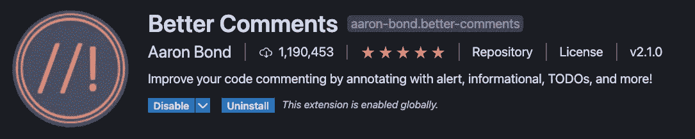
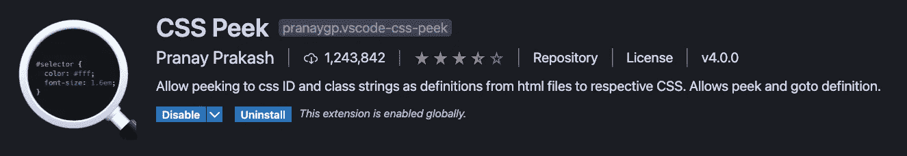

# 15 个有用的 VS 代码扩展，实现更好的工作流

> 原文：<https://levelup.gitconnected.com/15-useful-vs-code-extensions-for-a-better-workflow-fe9fea926c0e>

## 为您的开发工作区增加功能优势和视觉效果的扩展

约书亚·阿拉贡在 [Unsplash](https://unsplash.com?utm_source=medium&utm_medium=referral) 上拍摄的照片

自从引入以来，Visual Studio 代码很快成为使用最广泛的轻量级文本编辑器之一。尽管它是一个轻量级编辑器，但由于其庞大的扩展库，它具有成熟 IDE 的潜力。

这些扩展使得 VS 代码成为社区中最流行和最容易使用的文本编辑器之一。

在这里，您将找到一个有用的 VS 代码扩展列表，既有功能上的优势，也能为您的工作空间增加一些视觉效果。

## **1。素材主题**

作者截图

这个扩展为 VS 代码安装了不同的主题，允许您根据自己的喜好定制整个编辑器的外观。

扩展中的一些主题(作者截图)

你可以点击左下角的设置图标，点击**颜色主题**，开始使用不同的主题。

设置中的颜色主题选项(作者截图)

您可以通过使用上下箭头键来查看每个主题的预览，并且一旦选择应用当前选定的主题，您可以按 enter 键。

## **2。素材图标主题**

作者截图

这个扩展安装了不同的图标，允许你以干净的外观查看目录和各种类型的文件。您可以看到不同类型的文件和目录的图标示例，如下所示。

不同的图标(作者截图)

安装完扩展后，所显示图标的更改将立即生效。

## **3。更漂亮**

作者截图

这个扩展帮助您以一种简洁的方式格式化代码，并且它支持广泛的技术和编程语言。

您可以用以下两种方式之一格式化代码:

1.  手动选中文件的所有内容，然后按 option/ctrl + shift + F 键。如果提示选择默认格式化程序，请从下拉列表中选择更漂亮。
2.  自动地，在保存文件内容时，对于这个选项，您需要做一个小的配置更改，方法是转到左下角，单击齿轮图标，然后单击设置。

现在搜索“保存时格式化”并启用如下所示的功能。

保存时的格式设置(作者截图)

现在，一旦你选择了这个选项，每当你保存任何更改，文件的内容将自动格式化。

## **4。支架对着色机 2**

作者截图

这个扩展将为每组括号分配不同的颜色，以便跟踪一个语句、一个代码块或一个函数的开始和结束。它还用相同颜色的线包围括号内的整个块。每当您将光标放在代码块中时，在代码的左侧都可以看到这一行，如下所示。

不同的括号对有不同的颜色(作者截图)

一旦安装了扩展，您将能够看到更改直接生效。

## **5。直播服务器**

作者截图

这个扩展在 web 开发中非常方便。每当您处理 HTML、CSS 和 JavaScript 文件时，此扩展允许您查看最新保存的更改在网页中生效，而不必每次都刷新浏览器。

当你想开始使用这个扩展时，打开一个 HTML 文件，点击右下角的 Go Live 选项。

上线选项(作者截图)

它将打开一个新的浏览器窗口，并观察对相关文件所做的任何代码更改。

## 6.代码运行程序

作者截图

每当您需要运行一个小程序或用任何流行的编程语言编写的代码片段时，这个扩展都会很有帮助。

当你想运行一个程序时，右击文件上的任意位置来查看选项`***Run code***`。单击它，程序将运行，结果将显示在编辑器底部的 Output 选项卡中。

## 7.更好的评论

作者截图

这个扩展使用户能够以一种人性化的方式写评论。根据扩展，不同类别的评论有:

*   亮点(*)
*   问题/疑问(？)
*   待办事项
*   警告(！)
*   参数(@param)
*   代码语句也可以采用某种方式来明确代码不应该出现在那里(//)

下面是一个分类评论的例子。

不同评论类型的示例输出(作者截图)

用户还可以在设置中添加新的注释样式。

## **8。自动重命名标签**

作者截图

当您处理 HTML/XML 文件时，一旦您重命名了开始标记，此扩展将自动重命名结束标记。

如果您忘记更改结束标记的名称，或者结束标记远低于页面上的开始标记，这个扩展会很有帮助。

一旦安装了扩展，就可以使用该功能。

## 9.Quokka.js

作者截图

这个扩展是 JS 和 TypeScript 的生产力工具。通过使用这个扩展，您将能够在代码旁边动态地看到程序的运行时输出。

您可以通过点击`cmd/ctrl+shift+P`键，然后在命令面板中搜索 Quokka.js 来开始使用这个功能。现在，您将能够在下拉列表中查看所有可用命令的列表。

Quokka.js 的可用选项(作者截图)

一旦您开始在现有文件或新文件上运行 quokka.js，运行时输出值就会显示在编辑器中，如下所示。

显示在每条语句末尾的输出(作者截图)

## **10。CSS Peek**

作者截图

这个扩展允许用户从 HTML 文件本身查看为特定 HTML 元素的 id/class 标识符编写的 CSS 规则。这个扩展帮助您做三件事:

*   **Peek:** 您可以通过按住`cmd/ctr`并将鼠标悬停在标识符上来查看为该标识符编写的 CSS 规则
*   **内联编辑:**你也可以使用`cmd/ctrl+shift+F12`键在 HTML 文件中动态编辑 CSS 规则
*   **转到:**您可以使用`F12`键直接转到 CSS 文件中该标识符的特定 CSS 规则集

## 11.远程 SSH

作者截图

您可以使用这个扩展从 VS 代码连接到远程服务器，并在编辑器中将它作为工作区打开。

这对于开发以及解决服务器上的任何问题都非常有用。您可以在与直接连接到服务器相同的环境和操作系统中进行开发和部署。

您可以通过点击左下角的绿色选项并添加主机地址来开始使用它。

使用远程 SSH 连接的选项

## **12。代码快照**

作者截图

这个扩展允许您快速简单地获取代码的快照。它很容易使用，你也可以自定义代码捕捉的样式，方法是转到“设置”,在它下面搜索“代码捕捉”。

Codesnap 的一些设置(作者截图)

现在，无论何时您想要获取代码的快照，右键单击编辑器中的任何地方，您将能够在底部看到 CodeSnap 选项。一旦你点击了它，你将能够看到一个代码快照预览在一个单独的标签中打开，如下所示。

Codesnap 预览(作者截图)

现在，您可以选择完整的文件内容或其中的一部分作为快照的一部分。选择内容后，单击预览下方的 capture 按钮保存代码快照。

## 13.一次降价

作者截图

这个扩展提供了许多有用的特性，让你可以非常容易地编写一个 markdown。您可以使用下面的键盘快捷键来快速编辑内容。

Markdown All in One 的一些快捷键(图片由作者提供)

该扩展还支持自动完成、Github 风格的降价、数学表达式。

它还允许您预览最终的输出，还允许您将 markdown 打印成 HTML。

有关该扩展支持的所有功能的详细信息，请参见此处的完整文档。

## 14.书签

作者截图

这个扩展允许您为工作区中的不同文件在代码的特定行添加书签。

增加了在左边栏可见的书签(作者截图)

您还可以添加、删除和切换不同的书签。您可以通过右键单击代码中的任意位置并选择以下选项之一来完成此操作。

书签可用选项(作者截图)

单击左侧面板中的书签选项卡，您还可以看到所有书签的列表，您也可以从这里在它们之间切换。

左侧面板中的书签选项卡显示所有书签

## **15。代码拼写检查器**

作者截图

这个扩展检查常见的拼写错误，包括以不同大小写书写的单词(大写，骆驼大小写，烤肉串大小写等。).

拼写错误的单词下面会出现一条弯弯曲曲的小下划线，代码前的左侧会出现一个小灯泡。当你点击它时，你将能看到正确拼写的建议，如图所示。

错别字建议(作者截图)

这些是我发现从视觉和功能角度都有用的不同扩展的列表。我希望您能找到一些对您的常规开发工作流程有帮助的方法。

我希望你喜欢这篇文章，感谢阅读！

如果你喜欢阅读这样的故事，并且想支持我成为一名作家，可以考虑[成为一名媒体会员](https://nehalk.medium.com/membership)。一个月 5 美元，你可以无限制地阅读 Medium 上的所有故事。如果你用我的链接注册，我会赚一点佣金。

 [## 通过我的推荐链接加入 Medium-Nehal Khan

### 作为一个媒体会员，你的会员费的一部分会给你阅读的作家，你可以完全接触到每一个故事…

nehalk.medium.com](https://nehalk.medium.com/membership) 

## 喜欢这篇文章吗？这里还有一些你可能会喜欢的文章

 [## JavaScript 实际上是如何工作的？

### JavaScript 引擎、事件循环、回调队列和 Web APIs 的概述。

javascript.plainenglish.io](https://javascript.plainenglish.io/how-does-javascript-actually-work-under-the-hood-567f9f17b855)  [## 每个优秀的 Web 开发人员都应该知道的 12 个 JavaScript 概念

### 帮助你成为更好的 JS 开发人员的重要 JavaScript 概念

javascript.plainenglish.io](https://javascript.plainenglish.io/12-javascript-concepts-that-every-good-web-developer-should-know-6fac820b507c) 

## 分级编码

感谢您成为我们社区的一员！ [**订阅我们的 YouTube 频道**](https://www.youtube.com/channel/UC3v9kBR_ab4UHXXdknz8Fbg?sub_confirmation=1) 或者加入 [**Skilled.dev 编码面试课程**](https://skilled.dev/) 。

 [## 编写面试问题+获得开发工作

### 掌握编码面试的过程

技术开发](https://skilled.dev)