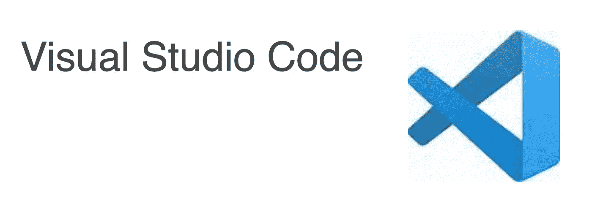
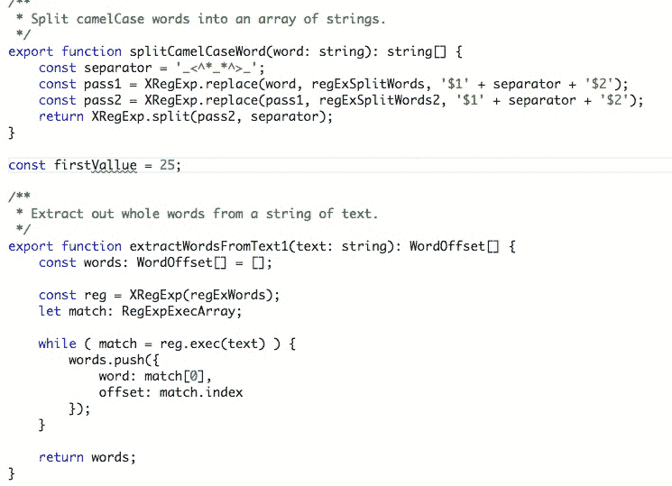
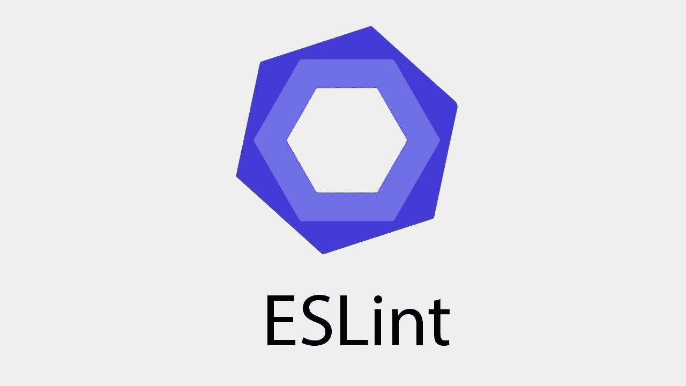
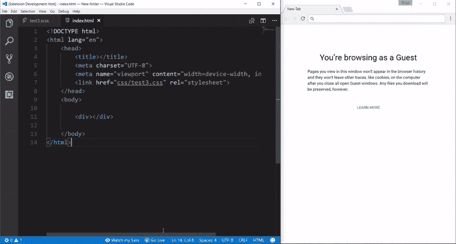
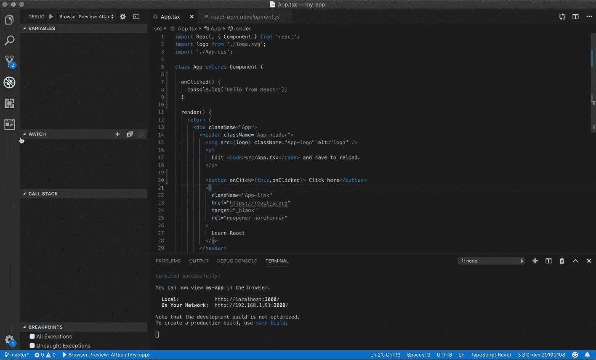
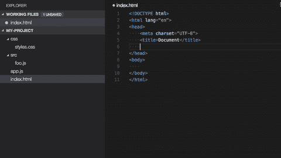
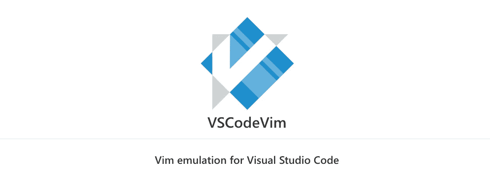
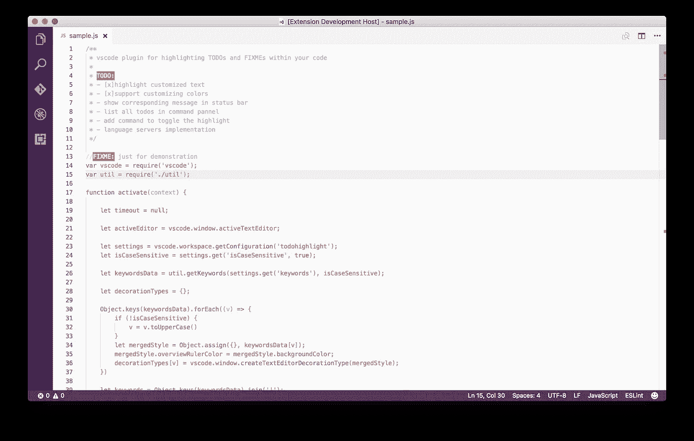

# 15 VS 代码扩展节省您的时间，让您成为更好的开发人员

> 原文：<https://levelup.gitconnected.com/15-vs-code-extension-to-save-your-time-and-make-you-a-better-developer-506f79baec53>

## 对前端开发人员有用的 VS 代码扩展列表

 [## 组合 API -轻松发展您的编码事业| gitconnected

### 消除在每个单独位置手动更新您的详细信息的痛苦。只需在您的中更改一次数据…

gitconnected.com](https://gitconnected.com/portfolio-api) 

VS 代码有一个市场，它包含一组插件，可以安装到文本编辑器中，使其更加强大。我们可以通过选择`Extension option in View menu`或简单地按下`shift + cmd + X`来打开市场。

下面列出的扩展可以安装在 VS 代码中，以多种方式节省你的时间，让你成为更好的开发者。

# 1.实时服务器

这允许我们在您更改 IDE 中的代码时自动重新加载网页。

 [## 实时服务器

### 对不起，但是我现在非常忙。如果你想成为项目的维护者，欢迎随时联系我！你已经…

marketplace.visualstudio.com](https://marketplace.visualstudio.com/items?itemName=ritwickdey.LiveServer) 

[直播服务器](https://marketplace.visualstudio.com/items?itemName=ritwickdey.LiveServer)

一旦安装了实时服务器，你可以右击一个`html`文件，你可以看到一个选项`Open with Live Server[Alt + L + Q]`。

# 2.Quokka.js

Quokka.js 将自动计算您键入的结果，并在 IDE 中打印结果。

 [## Quokka.js

### 现在就去拿。

marketplace.visualstudio.com](https://marketplace.visualstudio.com/items?itemName=WallabyJs.quokka-vscode) 

阔卡

# 3.代码拼写检查器

这个拼写检查器将报告一些常见的拼写错误。这与 camelCase 代码配合得很好。

 [## 代码拼写检查器

### 编辑描述

marketplace.visualstudio.com](https://marketplace.visualstudio.com/items?itemName=streetsidesoftware.code-spell-checker) 

拼写检查器

# 4.吉特朗斯

GitLens 增强了 Visual Studio 代码中内置的 Git 功能。通过 Git 责备注释，它可以帮助您直观地看到代码作者。它无缝地导航和探索 Git 存储库，通过强大的比较命令获得有价值的见解，等等。

 [## GitLens - Git 增压

### GitLens 增强了 Visual Studio 代码中内置的 Git 功能。它可以帮助你在一个…

marketplace.visualstudio.com](https://marketplace.visualstudio.com/items?itemName=eamodio.gitlens) 

Git 镜头

# 5.更漂亮(代码格式化程序)

[漂亮的](https://prettier.io/)是一个固执己见的代码格式化程序。它通过解析您的代码并使用自己的规则重新打印来强制执行一致的风格。这是一个重要的工具，它允许您无需开发人员的任何努力就能获得格式正确的代码。Prettier 提供了合理的默认值，但是您也可以在项目的根目录下提供一个配置文件来设置您自己的标准，比如行长度、制表符/空格的数量等等。[链接安装](https://marketplace.visualstudio.com/items?itemName=esbenp.prettier-vscode)

 [## 漂亮代码格式化程序

### 编辑描述

marketplace.visualstudio.com](https://marketplace.visualstudio.com/items?itemName=esbenp.prettier-vscode) 

较美丽

# 6.埃斯林特

ESLint 是一个静态代码分析工具，用于识别 JavaScript 代码中的问题模式。ESLint 中的规则是可配置的，并且可以定义和加载定制规则。ESLint 涵盖了代码质量和编码风格问题。

 [## 埃斯林特

### 编辑描述

marketplace.visualstudio.com](https://marketplace.visualstudio.com/items?itemName=dbaeumer.vscode-eslint) 

# 7.虚拟代码-图标

这将根据文件扩展名在树状视图中的文件名旁边提供图标。这使得一眼就能识别您的文件变得更加容易。

 [## 虚拟代码-图标

### 将图标添加到您的 Visual Studio 代码中(支持的最低版本:1.26.1)要安装该扩展，只需执行…

marketplace.visualstudio.com](https://marketplace.visualstudio.com/items?itemName=vscode-icons-team.vscode-icons) 

虚拟代码图标

# 8.实时 Saas 编译器

这是一个 VS 代码扩展，可以帮助你用一个实时的浏览器重载来实时编译/传输你的萨斯/SCSS 文件到 CSS 文件。

 [## 实时 Sass 编译器

### 如果你发现了任何漏洞或者有任何建议，请随时报告或建议我。VSCode 扩展有助于…

marketplace.visualstudio.com](https://marketplace.visualstudio.com/items?itemName=ritwickdey.live-sass) 

实时 saas 编译器

# 9.JavaScript (ES6)代码片段

这个扩展包含 VS 代码编辑器的 ES6 语法的 JavaScript 代码片段(支持 JavaScript 和 TypeScript)。

 [## JavaScript (ES6)代码片段

### 编辑描述

marketplace.visualstudio.com](https://marketplace.visualstudio.com/items?itemName=xabikos.JavaScriptSnippets) 

# 10.浏览器预览

VS 代码的浏览器预览使您能够在编辑器中打开一个真正的浏览器预览，您可以使用它进行调试。

 [## 浏览器预览

### 一个真正的浏览器预览在你的编辑器中，你可以调试。VS 代码的浏览器预览使您能够打开一个真正的…

marketplace.visualstudio.com](https://marketplace.visualstudio.com/items?itemName=auchenberg.vscode-browser-preview) 

浏览器预览。

# 11.路径智能感知

这将自动完成代码中的路径和文件名。

 [## 路径智能感知

### 编辑描述

marketplace.visualstudio.com](https://marketplace.visualstudio.com/items?itemName=christian-kohler.path-intellisense) 

路径智能感知

# 12.括号对着色机

这个扩展允许用颜色来标识匹配的括号。用户可以定义匹配哪些字符和使用哪些颜色。

 [## 括号对着色机

### 这种扩展允许用颜色来识别匹配的括号。用户可以定义匹配哪些字符…

marketplace.visualstudio.com](https://marketplace.visualstudio.com/items?itemName=CoenraadS.bracket-pair-colorizer) 

括号颜色

# 13.精力

VSCodeVim 是一个针对 Visual Studio 代码的 Vim 模拟器，为您的文本编辑器带来了 Vim 的强大功能。[链接安装](https://marketplace.visualstudio.com/items?itemName=vscodevim.vim)

 [## 精力

### Vim emulation for Visual Studio Code VSCodeVim 是一个用于 Visual Studio 代码的 Vim 模拟器。🚚如需…的完整列表

marketplace.visualstudio.com](https://marketplace.visualstudio.com/items?itemName=vscodevim.vim) 

# 14.待办事项突出显示

突出显示代码中的`TODO`、`FIXME`和其他注释。

 [## 待办事项突出显示

### 突出显示代码中的 TODO、FIXME 和其他注释。有时你会忘记查看你添加的待办事项…

marketplace.visualstudio.com](https://marketplace.visualstudio.com/items?itemName=wayou.vscode-todo-highlight) 

做荧光笔

# 15.彩色高光

这个扩展设计了你文档中的 css/web 颜色，所以你不用打开页面就可以看到它们是什么颜色。

 [## 彩色高光

### 这个扩展设计了文档中的 css/web 颜色。在 VSC 按 Ctrl+Shift+P(在 Mac 上按 Cmd+Shift+P ),然后输入…

marketplace.visualstudio.com](https://marketplace.visualstudio.com/items?itemName=naumovs.color-highlight) 

跟随 Javascript Jeep🚙💨

 [## 登录|站点点

### 不支持的浏览器虽然我们的跟踪技术支持旧的浏览器，不幸的是我们的网站不支持…

sitepoint.tapfiliate.com](https://sitepoint.tapfiliate.com/p/payout-methods/new/)