# 面向 Web 开发人员的 15+ VS 代码扩展🤯

> 原文：<https://levelup.gitconnected.com/15-vs-code-extensions-for-web-developers-751fc636f829>

15+ VS 代码扩展

对 Visual Studio 代码的一些很棒的扩展感兴趣，这些扩展将使您的 web 开发生活变得更容易？在本文中，我将讨论 VS 代码的 15+扩展。

所以，让我们开始吧！

**1。** [**JavaScript (ES6)代码片段**](https://marketplace.visualstudio.com/items?itemName=xabikos.JavaScriptSnippets)
它提供了 JavaScript、Vue、React 和 HTML 代码片段。它是 web 开发的必备扩展。

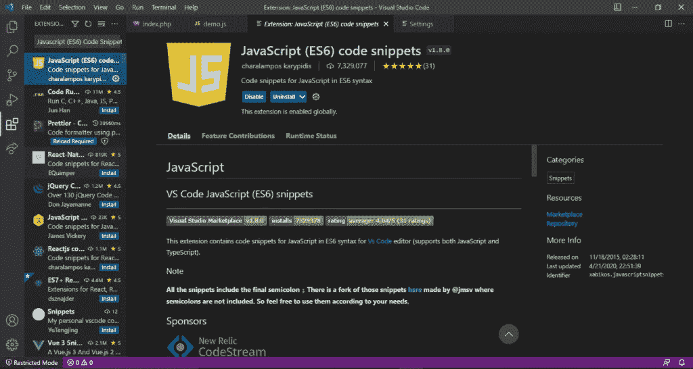

**2。**[**Live Server**](https://marketplace.visualstudio.com/items?itemName=ritwickdey.LiveServer)
Live Server 扩展提供了您的 web 应用程序在编辑器中的实时预览。对于前端开发人员来说，这是一个方便而有用的工具。

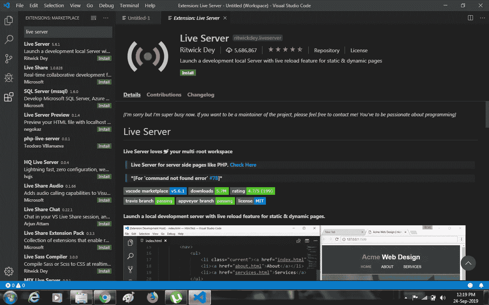

**3。** ****这个扩展执行 javascript、CSS 和 HTML 代码的格式化。****

****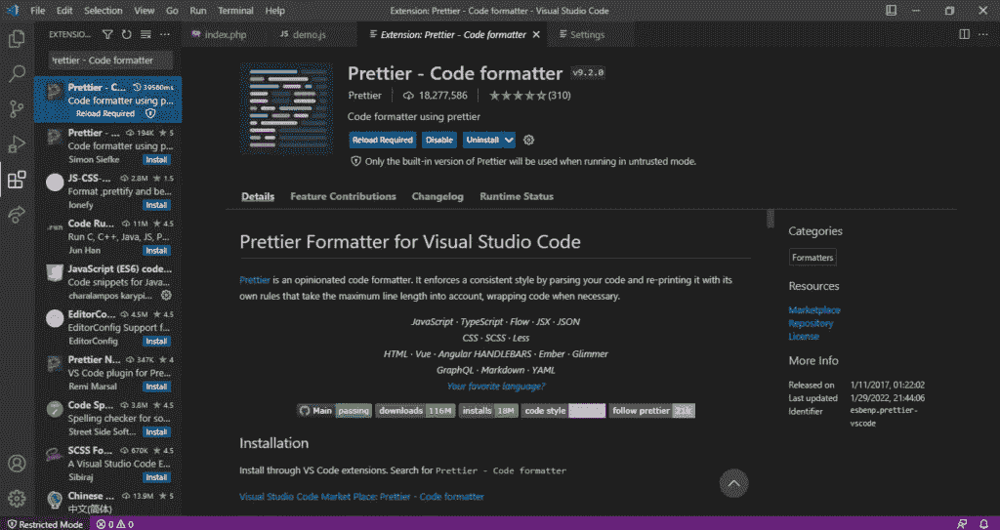****

******4。** [**更好的评论**](https://marketplace.visualstudio.com/items?itemName=aaron-bond.better-comments)
这个扩展帮助你创建更人性化、易读的评论。****

****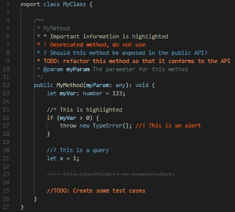****

******5。** [**路径智能感知**](https://marketplace.visualstudio.com/items?itemName=christian-kohler.path-intellisense)
这个扩展通过自动补全文件名使开发时间更快。你在语句中输入文件名，它会搜索并给你建议。****

********

******6。**[**Git lens**](https://marketplace.visualstudio.com/items?itemName=eamodio.gitlens) **我们几乎每天都在使用 Git。Gitlens 是增强 git 功能的 visual studio 代码插件。******

******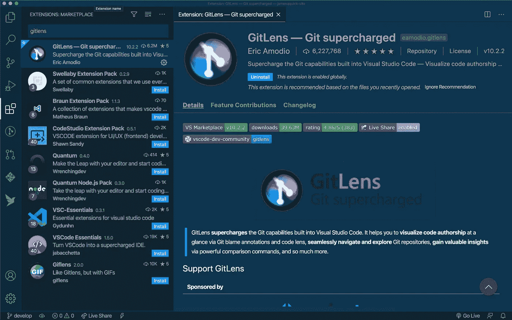******

********7。** [**代码时间**](https://marketplace.visualstudio.com/items?itemName=softwaredotcom.swdc-vscode)
这个扩展跟踪你的开发时间，并为你提供有用的统计数据，比如你今天有多少个小时的代码
跟踪和查看进度非常有用(任何人都可以使用这个扩展)******

****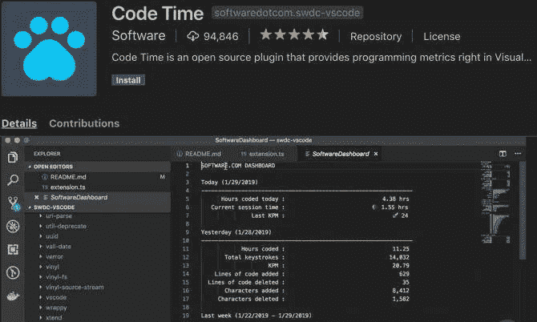****

******8。** [**ESLint**](https://marketplace.visualstudio.com/items?itemName=dbaeumer.vscode-eslint)
它是 JavaScript 的林挺实用程序。它检查你的代码中的常见错误，并让你在编辑器中知道。这就像一个虚拟的对等体在你写代码的时候验证你的代码。****

********

******9。**[**Polacode**](https://marketplace.visualstudio.com/items?itemName=mrrefactoring.polacode-fixed-edition)
像这样的代码片段？我们可以用这个扩展来创建一个漂亮的代码宝丽来并分享它。****

****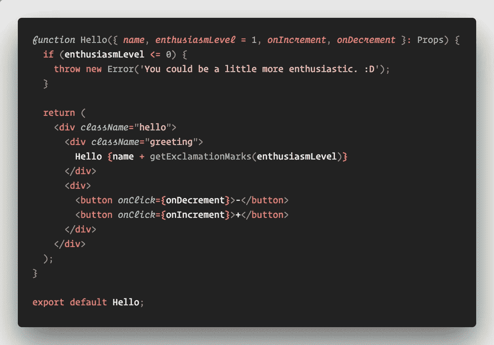********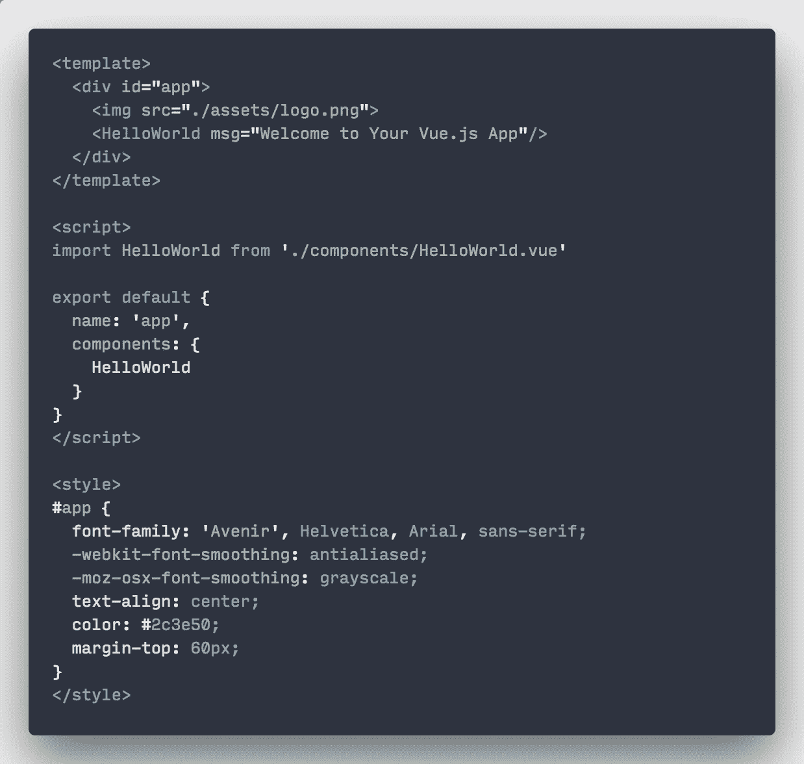****

******10。** [**CSS 窥视**](https://marketplace.visualstudio.com/items?itemName=pranaygp.vscode-css-peek)
这直接从 HTML 文件中窥视 CSS ID 和 class，并转到各自的 CSS 定义。****

****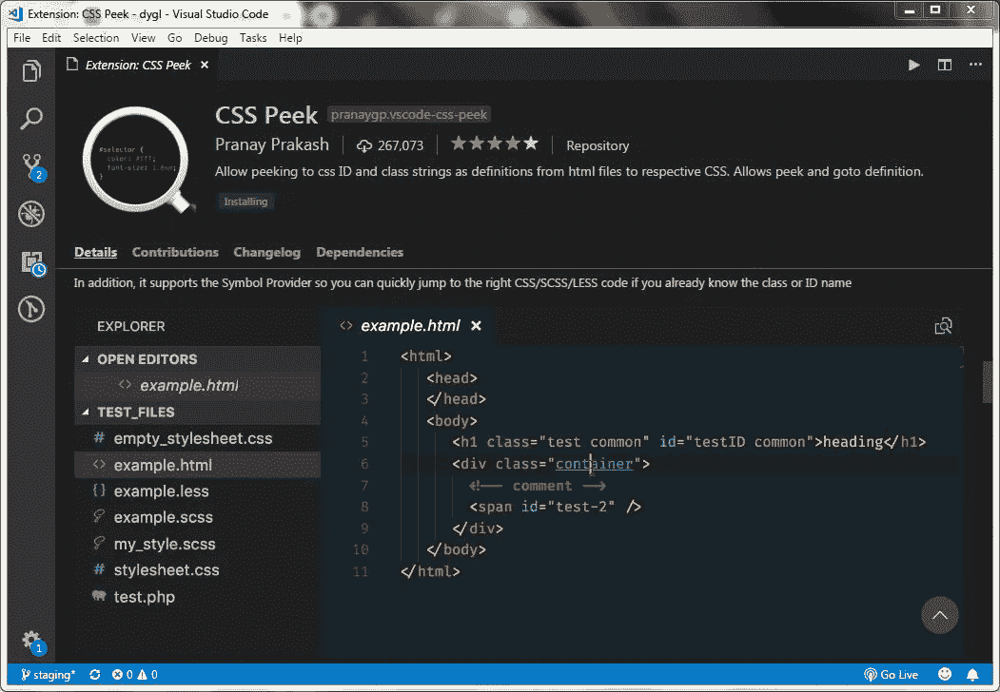****

******11。** [**项目经理**](https://marketplace.visualstudio.com/items?itemName=alefragnani.project-manager)
处理多个项目并在它们之间切换是 Visual Studio 代码中常见的
现象。项目经理使得在 VS 代码中管理多个项目变得轻而易举。****

****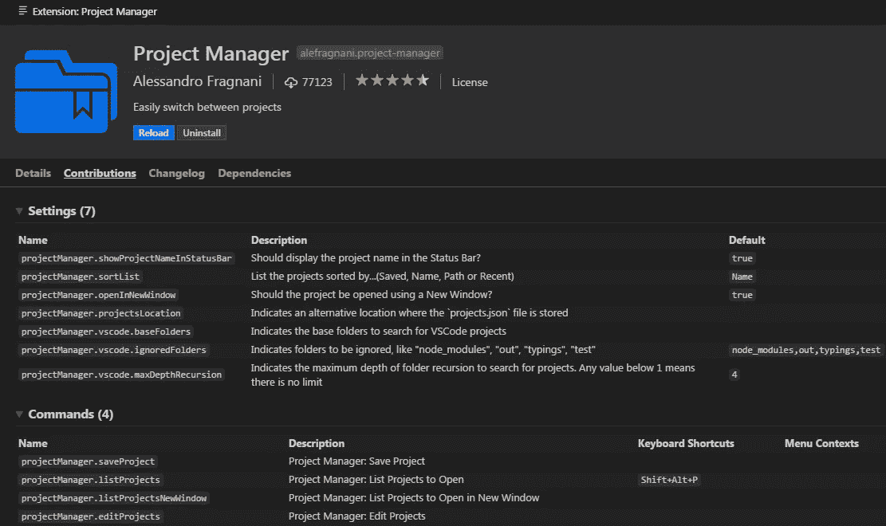****

****12。 [**Rest 客户端**](https://marketplace.visualstudio.com/items?itemName=humao.rest-client)
REST 客户端允许你直接在 Visual Studio 代码中发送 HTTP 请求并查看响应。使用这个扩展，我们可以测试 API 并直接在 VS 代码中查看它们的响应。****

****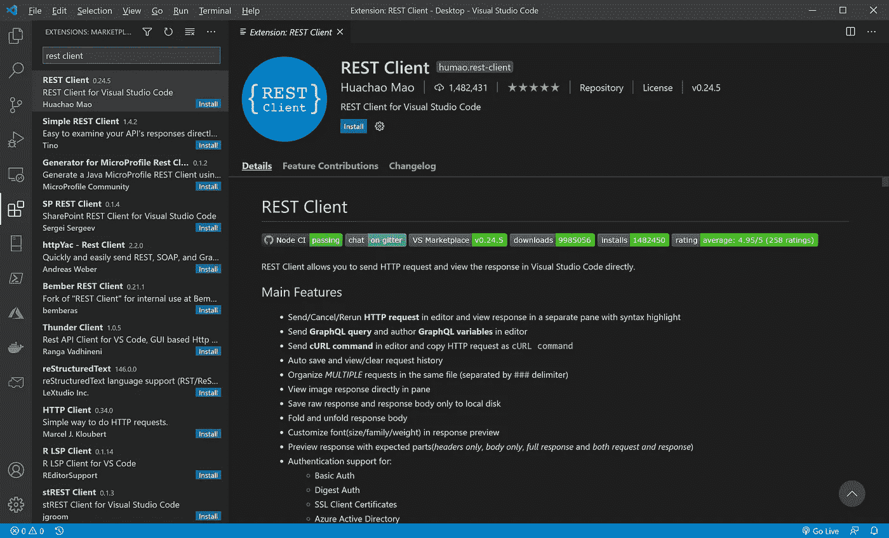****

******13。** [**自动关闭标签**](https://marketplace.visualstudio.com/items?itemName=formulahendry.auto-close-tag)该扩展自动添加 HTML 和 XML 的关闭标签。****

****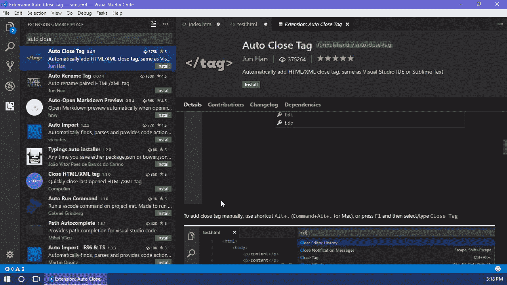****

******14。** [**括号对上色器 2**](https://marketplace.visualstudio.com/items?itemName=CoenraadS.bracket-pair-colorizer-2)
有了这个 VS 代码扩展，你可以对匹配对进行颜色编码，以帮助缓解那个痛点，并致力于使代码本身工作——而不是编辑器。****

****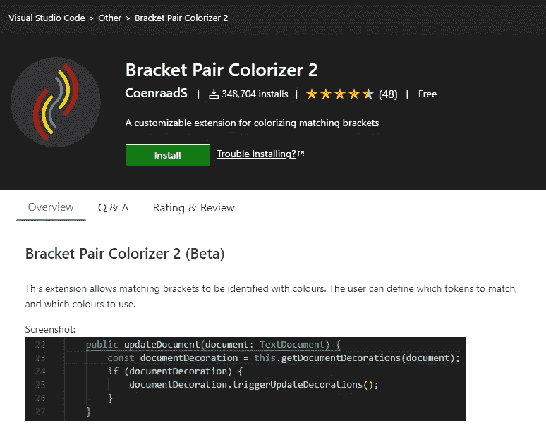****

****15。 [**将 JSON 粘贴为代码**](https://marketplace.visualstudio.com/items?itemName=quicktype.quicktype)
从 JSON、JSON Schema、TypeScript 交互生成类型和(反)序列化代码。将 JSON/JSON Schema/TypeScript 粘贴为代码！****

****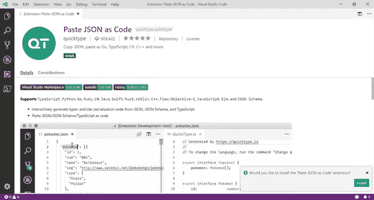****

****16.[**quo kka . js**](https://marketplace.visualstudio.com/items?itemName=WallabyJs.quokka-vscode)
quo kka . js 是一款快速 JavaScript/TypeScript 原型开发的开发人员生产力工具。当您键入时，运行时值会更新并显示在 IDE 中您的代码旁边。****

********

******结论******

****感谢阅读，如果你喜欢这篇文章，请分享🤞💜****

****查看我的[Twitter](https://twitter.com/souptikdn)&[LinkedIn](https://www.linkedin.com/in/souptikdn/)更多精彩内容。****

****立即创建您的 [Fueler](https://fueler.io/register) 个人资料！****

********

# ****分级编码****

****感谢您成为我们社区的一员！更多内容请参见[升级编码出版物](https://levelup.gitconnected.com/)。
跟随:[推特](https://twitter.com/gitconnected)，[领英](https://www.linkedin.com/company/gitconnected)，[通迅](https://newsletter.levelup.dev/)
**升一级正在改造理工大招聘➡️** [**加入我们的人才集体**](https://jobs.levelup.dev/talent/welcome?referral=true)****