# 2021 年每个 Web 开发人员必须拥有的 15 个 VSCode 扩展

> 原文：<https://levelup.gitconnected.com/15-vscode-extensions-every-web-developer-must-have-in-2021-9388a38c70fc>

这里列出了一些不常见的 VSCode 扩展，开发人员应该使用它们来提高工作效率。

阿什·埃德蒙兹在 [Unsplash](https://unsplash.com?utm_source=medium&utm_medium=referral) 上拍摄的照片

# 为什么 VSCode 如此受欢迎

Visual Studio 代码在开发者中迅速普及，在 [Stack Overflow 的 2019 年开发者调查](https://insights.stackoverflow.com/survey/2019)中被评为最受欢迎的开发环境。可定制性是其受欢迎的原因之一。

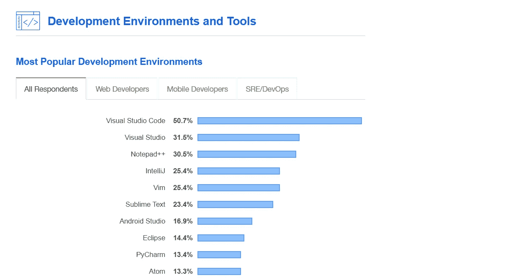

来源:[堆栈溢出](https://insights.stackoverflow.com/survey/2019)

因此，如果您使用 VSCode，这里有一个扩展列表，您必须使用它来提高您的工作效率。

# Git 镜头

当你和你的队友在一个项目上工作时，这个扩展使用了 VSCode 的强大功能，帮助你直观地看到代码作者。它显示了一个特定的代码何时被提交或修改，以及谁修改了它。

有时，您的团队成员可能已经提交了代码，而这些代码可能会破坏项目的其他功能，这在那段时间内会有所帮助。你可以在这里找到[。](https://marketplace.visualstudio.com/items?itemName=eamodio.gitlens)

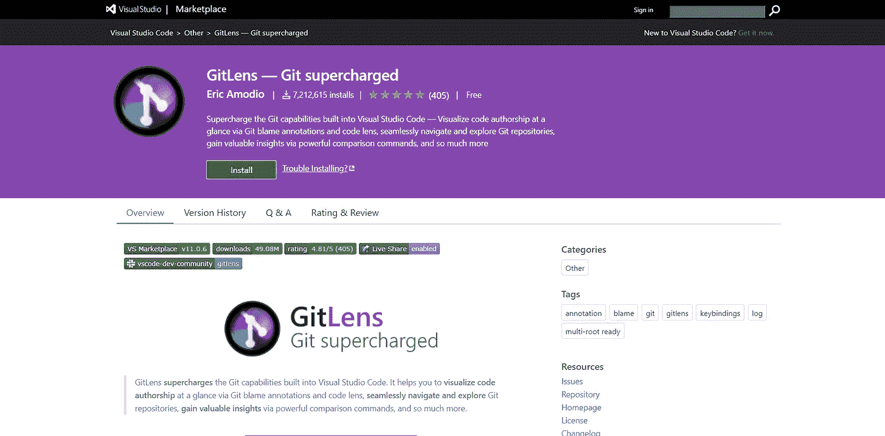

来源: [Visual Studio 市场](https://marketplace.visualstudio.com/)

# Wallaby.js

js 是一个智能的 JavaScript 测试运行器，可以持续运行你的测试。当您更改代码时，它会立即向代码编辑器直接报告代码覆盖率和其他结果(甚至不保存文件)。

这种扩展有助于提高开发过程中的生产率。你可以在这里找到[。](https://marketplace.visualstudio.com/items?itemName=WallabyJs.wallaby-vscode)

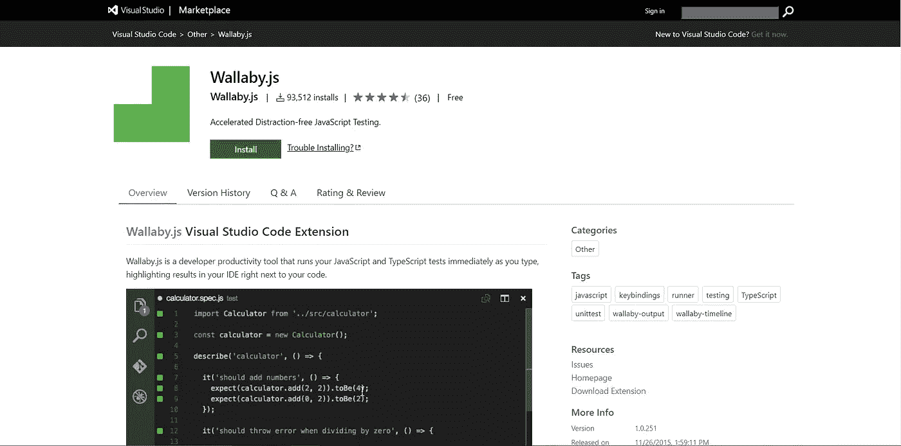

来源: [Visual Studio 市场](https://marketplace.visualstudio.com/)

# 打字英雄

TypeScript 是 JavaScript 的超集，具有可选的类型，可以编译成普通 JavaScript。当我们使用 TypeScript 时，这个扩展就派上了用场。它对你的输入进行分类和组织，并通过一个名为“灯泡”的功能修复编码错误。

这里可以找到[。](https://marketplace.visualstudio.com/items?itemName=rbbit.typescript-hero)

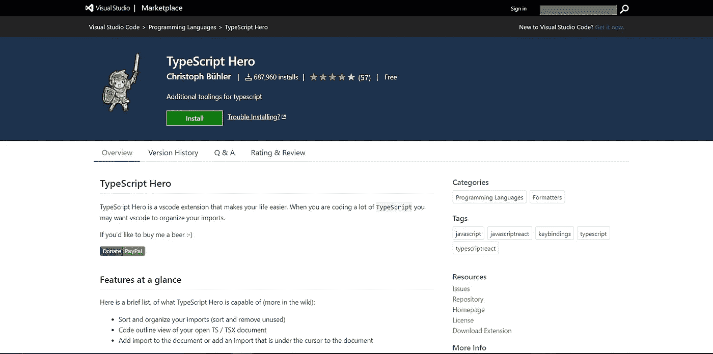

来源: [Visual Studio 市场](https://marketplace.visualstudio.com/)

# **更漂亮的代码格式器**

Prettier 是一个自以为是的代码格式，它使得开发人员在代码格式方面更加容易。您可以将其配置为保存时格式化，这将在保存时格式化代码。

一旦你有了这个扩展，你就再也不用担心格式化代码了，因为它会为你做。你可以在这里找到[。](https://marketplace.visualstudio.com/items?itemName=esbenp.prettier-vscode)

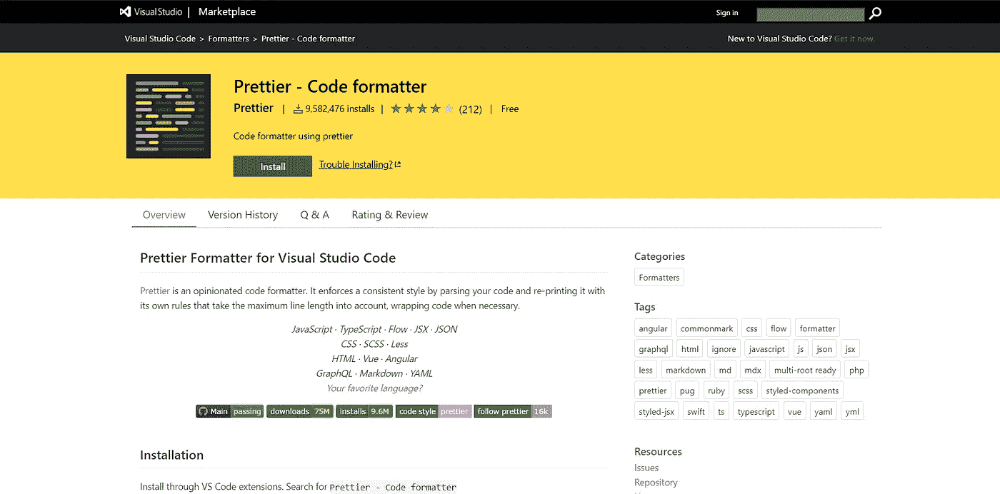

来源: [Visual Studio Marketplace](https://marketplace.visualstudio.com/)

# 路径智能感知

如果您使用像 React 或 Angular 这样的 JavaScript 库，并且您正在处理大型项目，那么您会知道在导入时找到组件的确切路径是多么令人烦恼。这个扩展帮助您自动完成导入的路径。

它还帮助您自动完成 HTML 文件中的文件引用。你可以在这里找到[。](https://marketplace.visualstudio.com/items?itemName=christian-kohler.path-intellisense)

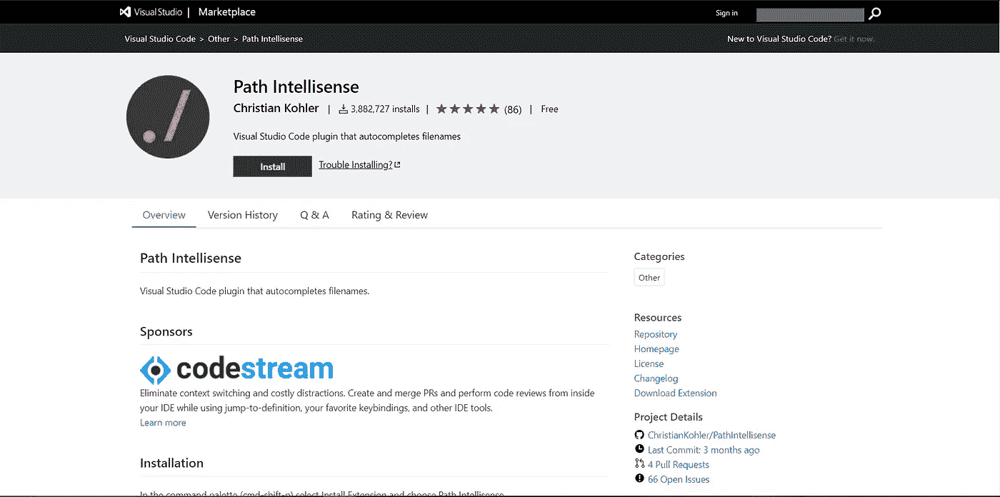

来源: [Visual Studio 市场](https://marketplace.visualstudio.com/)

# Chrome 调试器

我们都知道有时调试有多烦人，所以这个扩展用来帮助您调试 JavaScript 代码。它是由微软开发的。我们可以设置断点，单步调试代码，调试动态添加的脚本，等等。

假设我们有一个函数，我们不确定它是否正在执行，这个扩展可以通过在调试器中暂停来帮助我们。这里可以找到[。](https://marketplace.visualstudio.com/items?itemName=msjsdiag.debugger-for-chrome)

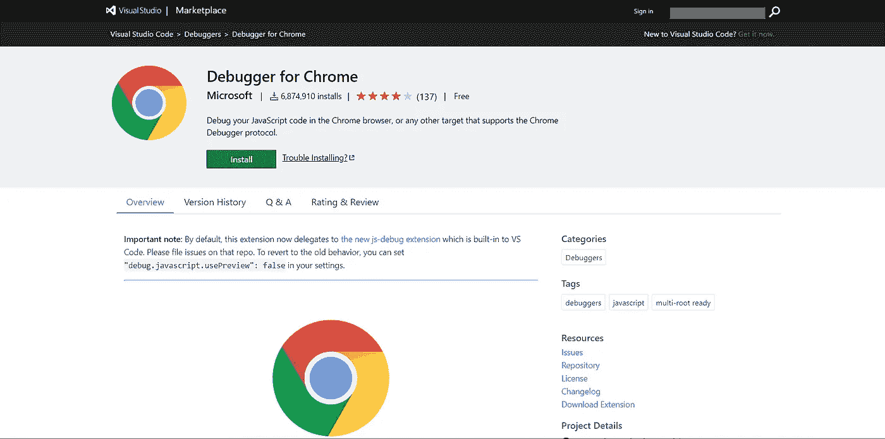

来源: [Visual Studio 市场](https://marketplace.visualstudio.com/)

# 括号对着色机

这个扩展允许通过颜色来识别匹配的括号。当你进入一个调试阶段，并且在一个巨大的代码库上工作时，这个扩展就像救星一样出现了。

用户可以定义匹配哪些字符，以及使用哪些颜色。这里可以找到[。](https://marketplace.visualstudio.com/items?itemName=CoenraadS.bracket-pair-colorizer)

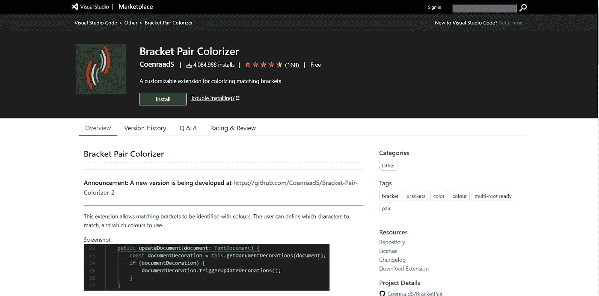

来源: [Visual Studio 市场](https://marketplace.visualstudio.com/)

# JavaScript (ES6)代码片段

如果你是一个 JavaScript 开发者，这可以节省你大量的时间。当您想要快速构建新项目时，这可能会有所帮助。它没有输入完整的代码，而是为最常见的 JavaScript 函数提供了许多预定义的代码片段。

这支持 TypeScript、React、Vue 和 HTML。如果您在 React 上工作，也有一个类似的扩展。(ES7 React/Redux/graph QL/React-Native 片段)。

这是两个扩展的链接: [JS 片段](https://marketplace.visualstudio.com/items?itemName=xabikos.JavaScriptSnippets)， [React 片段](https://marketplace.visualstudio.com/items?itemName=dsznajder.es7-react-js-snippets)。

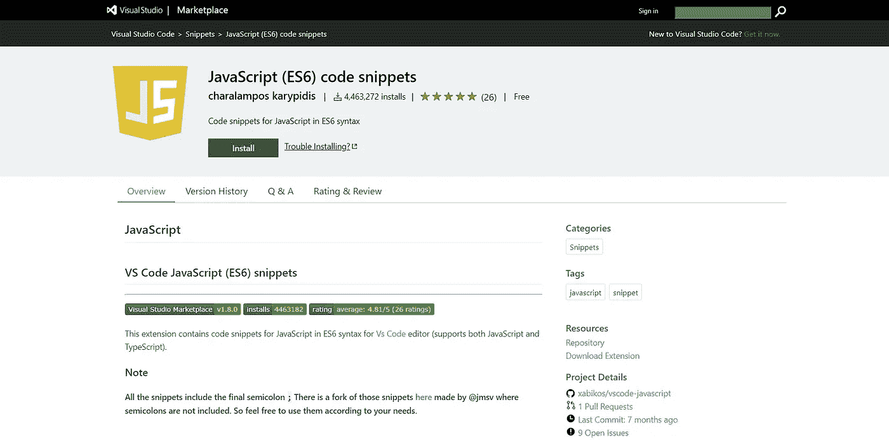

来源: [Visual Studio Marketplace](https://marketplace.visualstudio.com/)

# 实时分享

当你和你的队友一起解决一个问题，并希望在编辑器上共同处理相同的代码时，这有助于你把代码编辑器的控制权交给你的队友，你们可以同时处理它。

您还可以共享终端实例、本地主机 web 应用程序、语音通话等。这个扩展是微软的。你可以在这里找到[。](https://marketplace.visualstudio.com/items?itemName=MS-vsliveshare.vsliveshare)

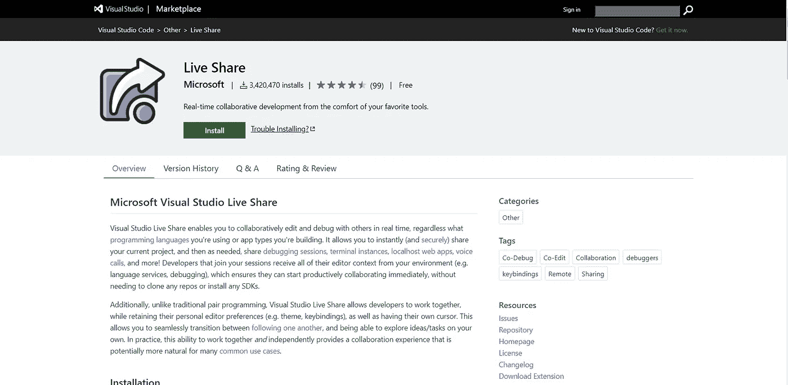

来源: [Visual Studio 市场](https://marketplace.visualstudio.com/)

# 埃斯林特

由于 JavaScript 是一种高度灵活的语言，一些小错误可能会导致大问题。因此，在处理大型代码库时，我们需要一个 linter 和一个格式化程序。这个扩展帮助你做到这一点。这可以自动格式化你的代码，也可以发现你代码中的错误。

实现 ESLint 规则会让你离为你的代码库建立良好的标准更近一步。这里可以找到[。](https://marketplace.visualstudio.com/items?itemName=dbaeumer.vscode-eslint)

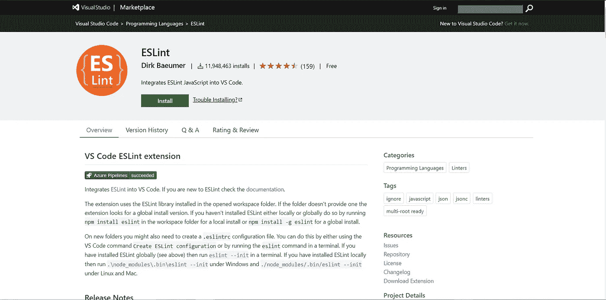

来源: [Visual Studio 市场](https://marketplace.visualstudio.com/)

# 将 JSON 粘贴为代码

作为一名开发人员，您会经常与 API 打交道。众所周知，API 中最常用的数据结构是 JSON。为了避免一些可能破坏应用程序的类型错误，我们使用类或接口。这个扩展可以用 JSON 数据生成一个类。

因此，与其手动编写类，我们可以使用它来节省创建类的时间和负担。这个扩展支持大多数流行的语言。这里可以找到[。](https://marketplace.visualstudio.com/items?itemName=quicktype.quicktype)

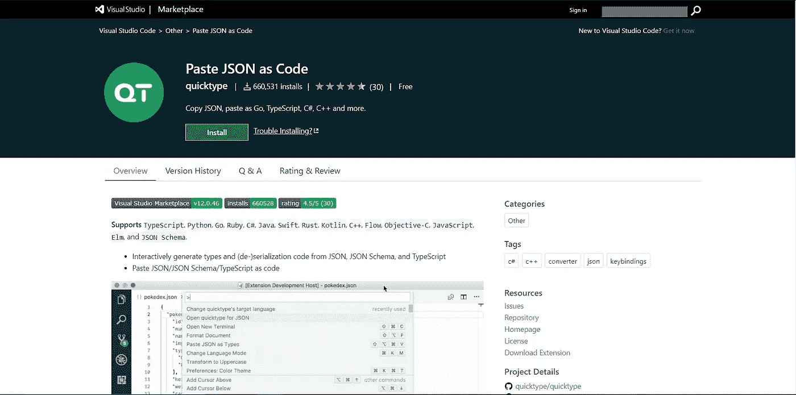

来源: [Visual Studio 市场](https://marketplace.visualstudio.com/)

# 雄孔雀

当你在多个工作空间上工作时，这个扩展可以帮助你确定你已经切换到或者正在哪个工作空间上工作。

这里可以找到[。](http://marketplace.visualstudio.com/items?itemName=johnpapa.vscode-peacock)

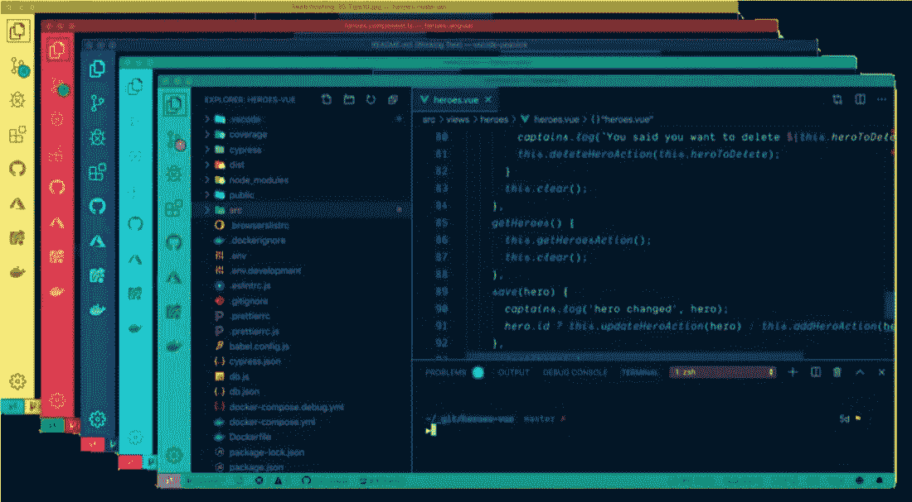

来源: [Visual Studio Marketplace](https://marketplace.visualstudio.com/)

# 更好的评论

这个扩展帮助您在代码中创建更加人性化的注释。它允许你为不同类型的评论使用不同的颜色代码，这些评论可以是待办事项、重点、提醒和其他类型的评论。

这是强烈推荐的写干净的和文档化的代码。你可以在这里找到。

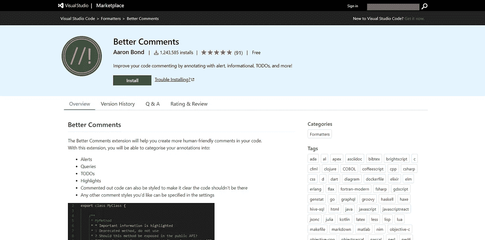

来源: [Visual Studio Marketplace](https://marketplace.visualstudio.com/)

# 搜索节点 _ 模块

当我们构建组件库并在不同的应用程序中使用组件时，我们肯定会对节点模块进行一些修改。这个扩展允许您在项目的 node_modules 目录中快速导航文件。

你可以在这里找到[。](https://marketplace.visualstudio.com/items?itemName=jasonnutter.search-node-modules)

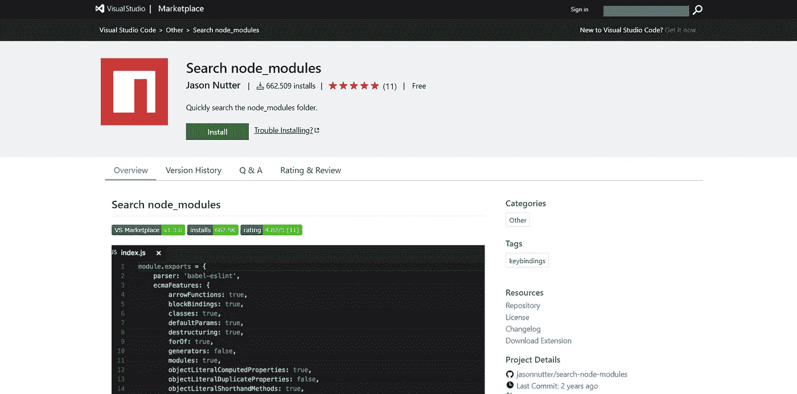

来源: [Visual Studio 市场](https://marketplace.visualstudio.com/)

# Rest 客户端

作为开发人员，我们每天定期使用 Postman 来检查 API 的响应。这个扩展允许你发出一个 HTTP 请求并直接在 VSCode 中查看响应，而不是在两个应用程序之间切换。

你可以在这里找到[。](https://marketplace.visualstudio.com/items?itemName=humao.rest-client)

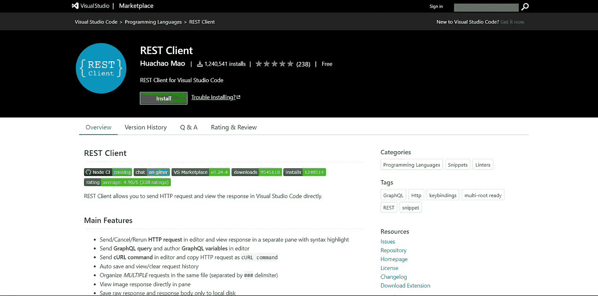

来源: [Visual Studio 市场](https://marketplace.visualstudio.com/)

**您打算安装这些扩展中的哪一个？你使用任何你想要推荐的扩展吗？**。

感谢您的阅读！。

# 下一次阅读:

 [## 在不到 20 分钟的时间内创建一个谷歌地图克隆。

### 使用普通 JS & MapBox API 构建谷歌地图克隆的一步一步教程

medium.com](https://medium.com/javascript-in-plain-english/build-a-google-maps-clone-in-less-than-20-minutes-6f7c68db13e) 

👋嘿，我们做朋友吧！在 [**LinkedIn**](https://www.linkedin.com/in/shashank-mv/) 上联系我。别忘了关注我这里的 [**媒体**](https://medium.com/@shashankmv) 来获取更多类似的内容。

# 分级编码

感谢您成为我们社区的一员！ [**订阅我们的 YouTube 频道**](https://www.youtube.com/channel/UC3v9kBR_ab4UHXXdknz8Fbg?sub_confirmation=1) 或者加入 [**Skilled.dev 编码面试课程**](https://skilled.dev/) 。

 [## 编写面试问题+获得开发工作

### 掌握编码面试的过程

技术开发](https://skilled.dev)