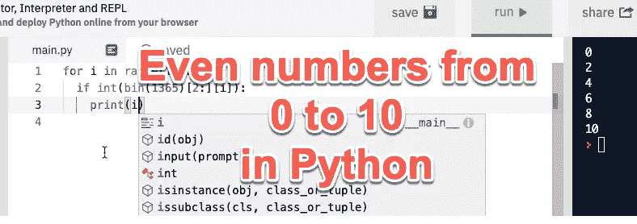

# 用 Python 打印偶数的 15 种方法

> 原文：<https://levelup.gitconnected.com/15-ways-to-print-even-numbers-in-python-60d4916c3d04>

你会如何输出 0，2，4，6，8，10？



我们不关心格式，它可能在一行、一个列表或一列中。

## 1.只有一个指纹

最简单的方法是:

```
print(0,2,4,6,8,10)
```

## 2.For 循环

我想到的第一个方法是:

```
for i in range(0,11,2):
  print(i)
```

## 3.对于和%

```
for i in range(11):
  if i % 2 == 0:
    print(i)
```

## 4.发电机和%

```
print([i for i in range(11) if i%2 == 0])
```

## 5.生成器和二进制

这里我们检查一个数的二进制表示，并检查最后一位是否是 1

```
print([i for i in range(11) if bin(i)[-1] == "0"])
```

## 6.按位 AND

如果最后一位是 0，则按位与 1 进行“与”运算得到 0，否则得到 1

```
print([i for i in range(11) if i&1 == 0])
```

## 7.按位或

这个比较棘手:我们让最后一位总是 1，所以我们总是有一个奇数。后来，我们简单地减去 1 得到偶数，并用`set`函数去掉重复的数字。

```
print(set([(i|1)-1 for i in range(11)]))
```

## 8.增加

```
print([i*2 for i in range(6)])
```

## 9.迭代器(产量)

```
def evens():
  i = 0
  while True:
    yield i
    i += 2iterator = evens()
for i in range(6):
  print(iterator.__next__())
```

## 10.乘法和λ

```
double = lambda x: x * 2
for i in range(6):
  print(double(i))
```

## 11.递归

```
def print_evens(i):
  if i > 10:
    return
  print(i)
  print_evens(i+2)print_evens(0)
```

## 12.随意

```
import random
random.seed(99353)
for i in range(6):
  print(random.randint(0,i*3))
```

## 13.正弦

```
import math
for i in range(6):
  print(int(math.sin(i/5)*12))
```

## 14.另一个是二进制的

```
for i in range(11):
  if int(bin(1365)[2:][i]):
    print(i)
```

## 15.面向对象编程

让我们简单地扩展一下`int`类:

```
class num(int):
  def even(self):
    return self%2 == 0for i in range(11):
  if num(i).even():
    print(i)
```

这是一些最常用的输出偶数的方法。你喜欢哪一个？我个人总是选择随机的，这样我的同事就不会知道那里发生了什么。