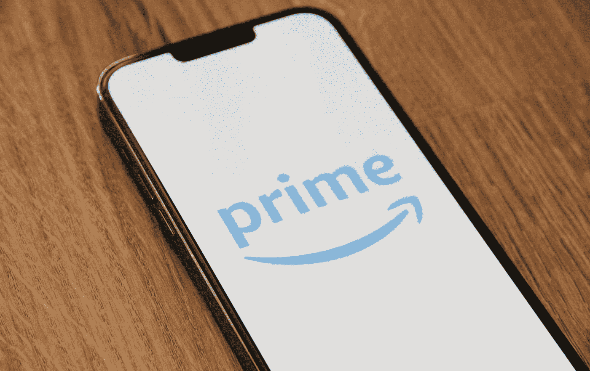
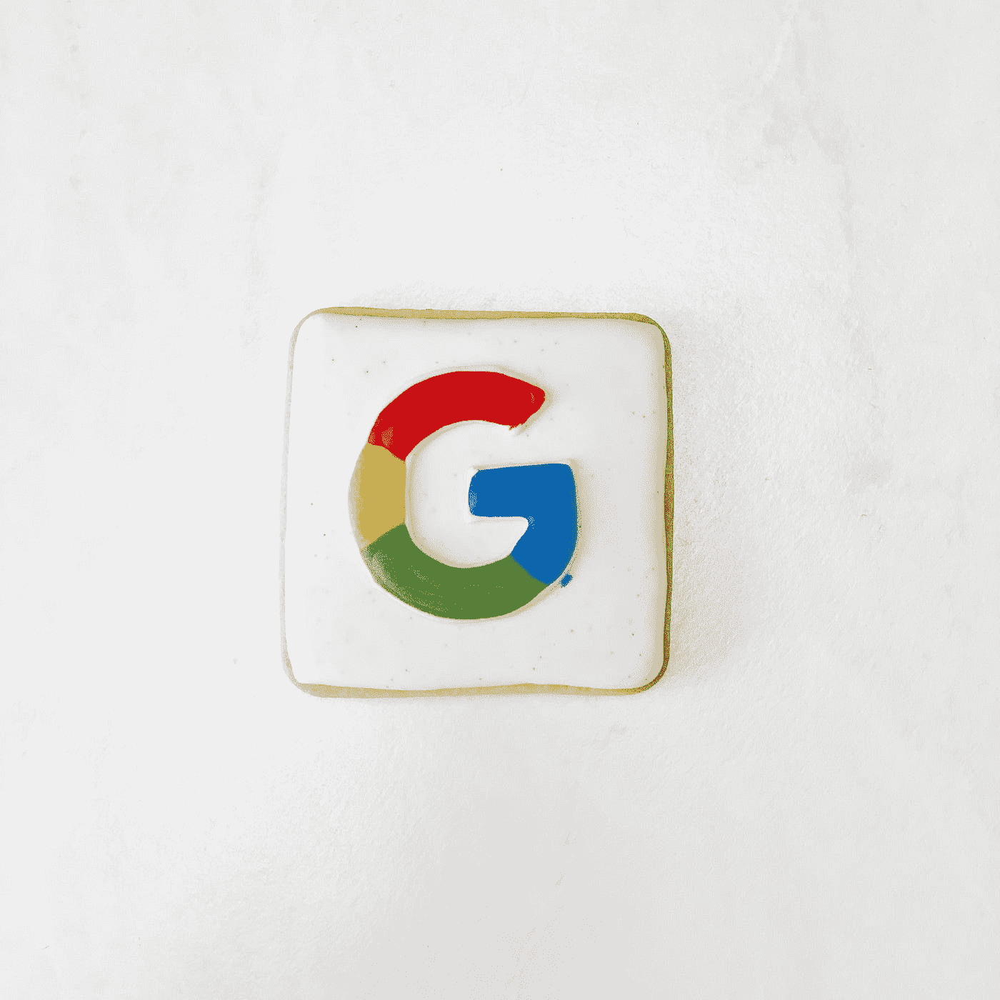

# 15 万美元的亚马逊工程师与 30 万美元的谷歌工程师

> 原文：<https://levelup.gitconnected.com/150-000-amazon-engineer-vs-300-000-google-engineer-b0976793cf56>

区别在于公司文化。

[PhotoMIX 公司](https://www.pexels.com/@wdnet/) @pexels

我于 2020 年在亚马逊开始了我的软件工程生涯，后来于 2022 年加入谷歌。亚马逊和谷歌都是盈利的科技巨头，拥有几款成功的产品:

**亚马逊:**Amazon.com、Kindle、亚马逊网络服务、亚马逊 Prime
谷歌:谷歌 Adsense、谷歌云产品、Youtube

不言而喻，这两家公司都有令人惊叹的工程工作。但是从一个在亚马逊和谷歌工作过的人来说，我们来谈谈区别。

# 亚马孙

由[马克斯·托马斯](https://unsplash.com/@querysprout?utm_source=medium&utm_medium=referral)在 [Unsplash](https://unsplash.com?utm_source=medium&utm_medium=referral) 上拍摄的照片

## 绩效改进文化

Amazon.com 因绩效改进计划(PIP)文化而臭名昭著。在亚马逊，每年大约有 10%的底层员工失业。我自己从未见过或经历过这种情况，所以我从未证实这是真的。

但不管这是不是真的，这是一种弥漫在劳动力中的恐惧。这本身就阻碍了工程师的发展。如果你太担心保住工作，你就做不好工作。

## 领导原则

亚马逊有一份员工应该遵守和实践的工作戒律清单。[现在他们有 16 个人](https://www.amazon.jobs/en/principles)但是我只听到我的经理提到了同样的 3 个人:

*   所有权
*   深潜
*   顾客痴迷

如果有人告诉你要有主导权，深入研究你的问题，你会慢慢明白这只是“自己想办法”的另一种说法。

*   不知道为什么你的 API 不工作？潜得更深。
*   想要帮助实现集成测试吗？拥有你的作品。

浏览这些原则，注意团队合作并不是其中的一部分。虽然你可能看不到团队合作，但你会看到客户的困扰。

## 顾客痴迷

> “顾客永远是对的”

当你总是把客户放在第一位时，你会为了仓促的结果和产出而牺牲工程质量。你会因为一个顾客的小小投诉而放下手头的一切。你是在为客户优化，而不是为建筑商。

如果你正在考虑在亚马逊的职业生涯，记住，这是 ***客户痴迷*** ，而不是 ***工程痴迷。***

# 谷歌

劳伦·埃德瓦尔森在 [Unsplash](https://unsplash.com?utm_source=medium&utm_medium=referral) 上的照片

## 为所有人打造

谷歌没有领导原则(感谢上帝)，但它有一个流行的口号“为每个人而建”。当您为每个人构建时，您是在为构建者优化，并专注于工程生产率。

它是这样做的:

*   文档只有一个团队负责人，只能通过同行评审进行更新。这使得整个公司的文档质量更高，而且只有一个真实的来源。
*   [马桶上的测试](https://testing.googleblog.com/2007/01/introducing-testing-on-toilet.html):你会在浴室的休息时间看到编码技巧和工具。在谷歌学习永不止步。
*   自动化环境设置:通过完全自动化的环境设置，您可以在几个小时内完成第一次代码更改。更少的上升导致更高的生产率
*   可读性评审员:编程语言认证的专业评审员必须签署所有的代码评审。工程的标准更高，因为在代码审查中最容易防止错误。

只要谷歌搜索有多少谷歌职业被列为**工程生产力**就能看出谷歌对其工程文化的重视程度。

## 员工福利

谷歌的额外津贴和福利是极致的，提供免费午餐+晚餐和校园健身房会员。

*   如果你花更少的时间做饭和打扫卫生，你会投入更多的时间有效地工作。
*   如果你锻炼得更频繁，你会感觉压力更小，并保持更好的工作生活平衡。

优化你自己的时间，注意你在工作中进步的速度。

# 总结想法

当你花更多的时间为每个人建设，而不是为客户着迷时，你将会成为一名成功的工程师。在这两家公司工作最简单的区别就是你是优先考虑客户还是工程师。

你看到点击并按住拍手按钮会发生什么了吗？

帮助我进入亚马逊和谷歌的简历模板

如果你喜欢这种体验，考虑成为[会员](https://medium.com/@alexcancode/membership)以获得更多类似的内容！

Twitter 上有 1000 人在关注！

关注我在 LinkedIn
[上的 10 万名粉丝](https://www.linkedin.com/in/alxngu/)

亚马逊是一个 ***压力大*** 的工作场所的另一个原因是:

 [## 为什么在亚马逊工作不值 15 万美元

### 你不会成功的

levelup.gitconnected.com](/why-working-at-amazon-isnt-worth-150-000-e7b225391715)