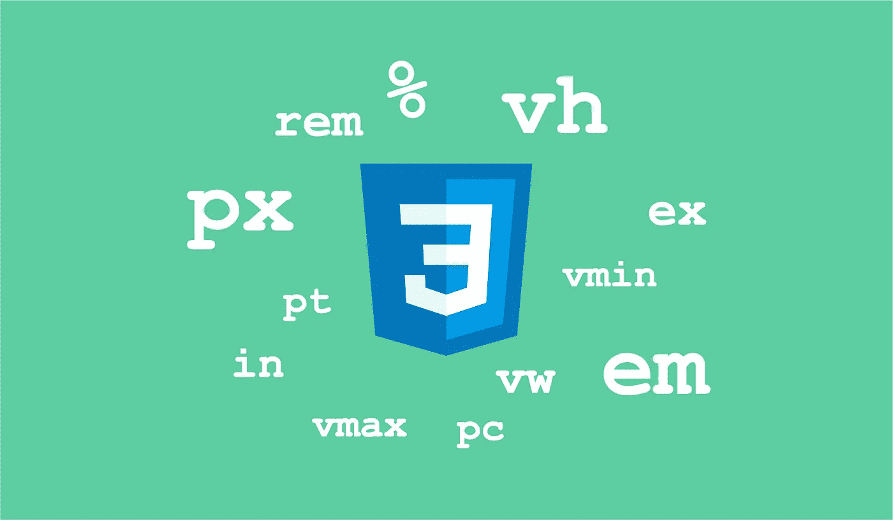
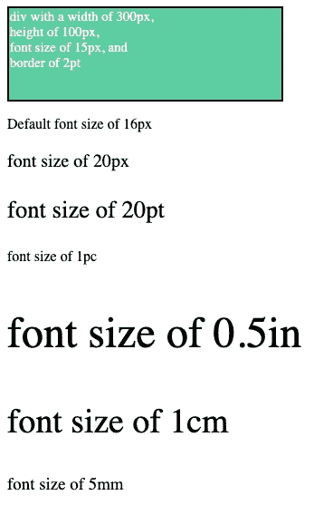
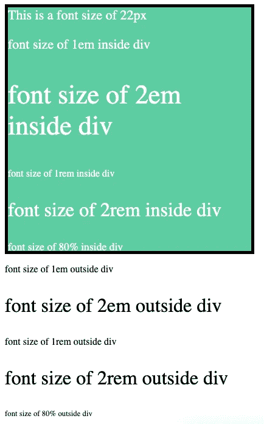
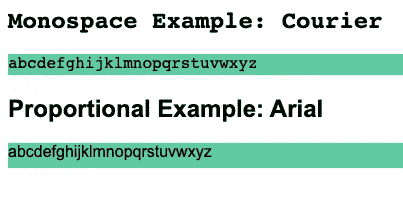
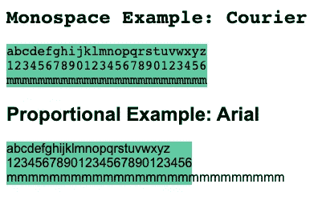
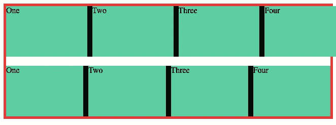
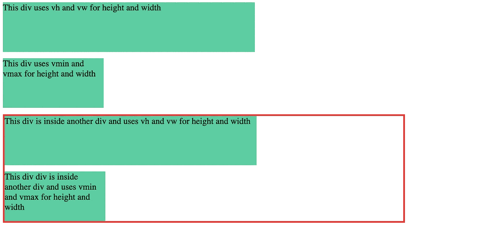

# 每个优秀的 Web 开发人员都应该知道的 16 个 CSS 单元

> 原文：<https://levelup.gitconnected.com/16-css-units-that-every-good-web-developer-should-know-8727a762f538>

## 关于 CSS 中绝对、相对和视口单位的教程

不同的 CSS 单位(图片由作者创建|徽标致谢:[icons8.com](https://icons8.com/icons/set/css-logo))

在 CSS 中，你可以使用各种各样的单位，比如`px`、`pt`、`em`、`rem`、`%`、`vh`、`vw`等等。开始时，何时何地使用这些不同的单元可能会有点混乱。

在本文中，我们将了解不同的绝对、相对和视口单位，以及每一种单位的工作原理。因此，您可以更好地了解使用什么单位以及何时使用。

让我们开始吧。

## 绝对的

**px:** 像素是 CSS 中最常用的度量。很久以前，一个像素代表一个实际的显示像素，但现在显示器变得更加密集。所以，现在一个 px 可以定义为 1/96 英寸。

**磅:**磅是字体的另一种常用度量。一点是一英寸的 1/72。

**pc:** Pica 是 CSS 中的绝对度量单位。十二点活字是六分之一英寸。

**in:** `in`表示公制中的实际英寸，等于 2.54cm。

**厘米:**代表厘米，是一米的百分之一。

毫米:毫米是另一种绝对测量单位，是 1/1000 米或 1/10 厘米。

除非在 CSS 规则中定义，否则字体大小继承自浏览器的默认值，即 16px。

显示 CSS 中不同绝对单位用法的代码片段

不同绝对单位的输出(作者截图)

以上都是绝对测量，它们为所有用户精确地呈现 web 应用程序中给定值的元素、布局、间距和字体。这种行为会给用户体验带来问题，因为显示器可能具有不同的大小和密度，并且用户可能在其浏览器中设置了偏好的字体大小。因此，px 可能不是每个场景的正确选择，您可以使用其他相对单位。

## 亲戚

**em:** An `em`是一个相对单元，根据其直接父元素赋予属性的大小来计算。假设一个 div，您指定了 16px 的字体大小。该 div 中的所有元素及其子元素都将基于该 16px。因此，如果在 div 中使用`1.5em`，它将被计算为 24px。

如果你想为你的单元使用`em`，除了根元素之外，不要显式定义字体大小是一个好习惯。

如果没有显式定义字体大小，该元素将从父元素继承它。继承一直延续到根元素。

**rem:** A `rem`是根据根元素赋予属性的大小计算的相对单位。因此，无论您在哪里使用`rem`，它都会根据根级别的相应值来计算值。

对于字体大小和间距来说，`rem`可能是一个不错的选择，因为它使用单个根值作为参考。因此，如果没有明确指定，它可以根据用户的偏好使用用户浏览器中的默认值，并使用该值计算所有值。

**%:** 百分比值通过从其直接父元素中引用属性值来计算。根级别的元素将根值视为参考。如果它在一个 div 中，为该 div 指定的值将成为引用。

显示 em、rem 和%单位用法的代码片段

em、r em 和%单位的输出(作者截图)

正如您在上面的示例中看到的，div 内部的参考字体大小是 22px，div 外部的默认值是 16px。所以`em`和`%`单元将有两个不同的引用，因为它们有两个不同的父元素。而`rem`将引用根元素的默认字体大小，因此它在整个页面中都是相同的。

**例如:**`ex`是指您正在使用的字体中字符`“x”`的高度。所以当你使用`1ex`的时候，这个值就是你的字体中字符`“x”`的高度。

使用 ex 单元的代码片段

ex 单位示例的输出(作者截图)

**ch:**`ch`指的是你正在使用的字体中字符零`“0”`的宽度。所以当你使用`1ch`时，这个值就是字体中`“0”`的宽度。在等宽字体中，所有字符的宽度都是相同的，但是在等宽字体中，它们会有所不同。

ch 单位用法的代码片段

ch 单元示例的输出(作者截图)

**fr:**`fr`单位是指小数单位，是 CSS 中比较新的单位。假设我们有这样一种情况，我们需要用一个间距将一个给定的空间分成相等的部分来区分它们，这样我们就可以使用`%`单位。但是，这会将空间分成相等的部分，但在计算相等的部分时不会考虑我们提供的间隙，因此布局中存在溢出。

在这些情况下，fr 单元帮助我们处理所有这些计算，并通过考虑间距来划分空间。`fr`单元通常用于网格布局。让我们看一个`fr`的例子。

在网格中使用 fr 单位的代码片段

fr 单位示例的输出(作者截图)

## 视口

**VH:**`vh`指的是视口高度，视口的整个高度被分成 100 个部分。当我们使用`1vh`时，这意味着它将在当前实例中占据`1%`的视口高度。由于`vh`单位指的是视口高度，无论我们在哪里使用它，它的行为都是一样的。

**VW:**`vw`指的是视口宽度，视口的完整宽度被分成 100 个部分。当我们使用`1vw`时，这意味着它将在当前实例中占据`1%`的视口宽度。由于`vw`单位指的是视口宽度，无论我们在哪里使用它，它的行为都是一样的。

**vmin:**`vmin`是指电流`vh`和`vw`之间的最小值。当您使用`1vmin`时，它将是`vh`和`vw`之间的时间中较小的一个值。

**VMAX:**`vmax`是指当前`vh`和`vw`之间的最大值。当您使用`1vmax`时，它将是`vh`和`vw`之间当前较大的值。

显示不同视口单位及其用途的代码片段

不同视口单位的输出(作者截图)

这些是 CSS 中不同的绝对、相对和视口单位。我希望你现在能更好地理解它们的作用以及何时使用它们。并希望您发现它们是有用的。

感谢阅读！

如果你喜欢阅读这样的故事，并想支持我成为一名作家，可以考虑[注册成为一名媒体会员](https://nehalk.medium.com/membership)。一个月 5 美元，你可以无限制地阅读 Medium 上的所有故事。如果你[用我的链接](https://nehalk.medium.com/membership)注册，我会赚一小笔佣金。

 [## 通过我的推荐链接加入 Medium-Nehal Khan

### 作为一个媒体会员，你的会员费的一部分会给你阅读的作家，你可以完全接触到每一个故事…

nehalk.medium.com](https://nehalk.medium.com/membership) 

# 分级编码

感谢您成为我们社区的一员！更多内容请参见[升级编码出版物](https://levelup.gitconnected.com/)。
跟随:[推特](https://twitter.com/gitconnected)，[领英](https://www.linkedin.com/company/gitconnected)，[通迅](https://newsletter.levelup.dev/)
**升一级正在转型的理工大招聘➡️** [**加入我们的人才集体**](https://jobs.levelup.dev/talent/welcome?referral=true)