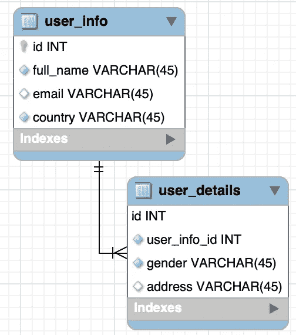

# 处理数据库的 16 个重要 SQL 命令

> 原文：<https://levelup.gitconnected.com/16-important-sql-commands-for-handling-database-8ab293312bd0>

## 每个开发人员都应该知道这些命令。


照片由来自 Pexels 的 Christina Morillo 拍摄

一个数据库可能包含一个或多个表、函数，并且它有一个唯一的名称。每个表也由名称标识(例如，“用户”、“产品”、“订单”)。每个表都包含与数据相关的表记录。

**SQL** 代表结构化查询语言。查询语言是一种设计和开发的编程语言，用于根据查询标准从数据库中检索特定信息，这正是 SQL 所做的事情。简单来说，SQL 就是数据库的语言。

SQL 是特定于数据库的，因此它可以根据数据库驱动程序改变其语法。这意味着不能保证他们必须在 Oracle 数据库上运行 MySQL 的 SQL。

本文将检查一些常用的和强制性的数据库 SQL，每个开发人员都应该知道。

为了覆盖这篇文章，我们将使用下面的表格。



ER 图

这里，

*   `user_info`表中有用户基本信息的相关数据，其 id 是主键
*   `user_details`表中有用户扩展信息相关的数据，其 id 是主键。这里，`user_info_id`字段被添加为该表的外键

在本文中，我们将展示 MySQL 数据库的 SQL。对于 Oracle 或 PostgreSQL 等其他数据库，其语法可能略有不同。

# 1.创建数据库

SQL 语句`CREATE DATABASE`用于创建一个新的数据库。其语法如下所示

```
**CREATE DATABASE** databaseName;
```

通过该命令，最初使用提供的名称创建一个数据库。

在我们的例子中，数据库名称是`user_system`,因此，我们的数据库创建 SQL 将是

```
**CREATE DATABASE** user_system;
```

创建数据库后，您可以通过下面的命令查看数据库。

```
**SHOW DATABASES**;
```

# 2.创建表格

语句`CREATE TABLE`主要用于在数据库中创建新表。

对于我们的例子，`user_info`表创建命令将是

代码致谢—作者

这里，`user_info`表格列是`id`、`full_name`和`email`。这里的`id`也是`auto_increment`和主键。

现在`user_details`表创建 SQL 是

这里，user_details 表，

*   它有`ID`是主键，自动递增。
*   `user_info_id`外键是否引用了`user_info`表

# 3.将数据插入表格

下面给出了`user_info`表的插入 SQL

这里，我们只添加了`full_name`和`email`。`id`字段是自动递增的，所以它会自动创建。

要将数据插入`user_details`表，必须添加`user_info`表`id`作为外键引用。

# 4.挑选

SQL 中最常用和最基本的命令。它的目的是从特定数据库的表中检索数据。

从表中选择所有数据

```
**SELECT** *** **FROM** user_info;
```

从表用户中选择特定数据

```
**SELECT id**, **full_name**, **country FROM** user_system.user_info;
```

输出是


图片来源—作者

# 5.使用 Where 子句筛选数据

通过`where` 关闭，我们可以从表格中过滤数据。

```
**SELECT id**, **full_name**, **country FROM** user_system.user_info
**where country** = **'Bangladesh'**;
```

在这里，它将返回所有`country`是孟加拉国的用户。


图片来源—作者

# 6.使用 order by 子句对数据进行排序

通过`order by`子句，我们可以对检索到的行进行排序。

```
**SELECT id**, **full_name**, **country FROM** user_system.user_info
**where country** = **'Bangladesh' order by id desc**;
```

该查询将显示孟加拉国的所有数据，并通过`descending order`中的`id`显示`sort`。


# 7.使用 group by 子句对数据进行分组

SQL `GROUP BY`是一个 SQL 命令，用于**对那些具有相同值的行进行分组。SELECT 语句中使用了子句 GROUP BY。**

在其他情况下，它通常与 aggregate below 函数
`COUNT()``MAX()``MIN()``SUM()``AVG()`一起使用，按照一个或多个列对结果集进行分组，以从数据库中生成摘要报告。

通过下面的查询，`group by`子句用于按国家统计用户

```
**SELECT country**, *count*(***) **'count' FROM** user_system.user_info
**group by country**;
```


图片来源—作者

# 8.使用表连接检索数据

SQL `JOIN`用于根据两个表中相应的列值组合两个表中的相关记录。一个查询可以包含零个、一个或多个连接操作。

主要有 4 种类型的数据库连接:内部连接、左连接、右连接和完全连接

## 内部连接

它只检索两个表中的公共数据

```
**SELECT** ui.**id**, ui.**full_name**, ui.**country**, ud.**gender**, ud.**address
FROM** user_system.user_info ui
**inner join** user_system.user_details ud **ON** (ui.**id** = ud.**user_info_id**)
```

输出是


## 左连接

将右表记录与左表记录匹配。左表可能有空记录，但右表必须有记录。左连接正好与右连接相反

```
**SELECT** ui.**id**, ui.**full_name**, ui.**country**, ud.**gender**, ud.**address
FROM** user_system.user_info ui
**left join** user_system.user_details ud **ON** (ui.**id** = ud.**user_info_id**);
```

输出是


## 右连接

将右表记录与左表记录匹配。左表可能有空记录，但右表必须有记录。

```
**SELECT** ui.**id**, ui.**full_name**, ui.**country**, ud.**gender**, ud.**address
FROM** user_system.user_info ui
**right join** user_system.user_details ud **ON** (ui.**id** = ud.**user_info_id**);
```

输出是


## 完全(外部)连接

该 SQL 语句选择符合左表或右表记录的所有记录。

Mysql 不支持这一点，但是你仍然可以通过`UNION ALL`子句实现这一点

# 9.聚合函数的使用

聚合函数用于计算一组值并返回单个标量值，以用于报告或决策目的。我们经常在 SELECT 语句的 GROUP BY 和 HAVING 子句中使用聚合函数。

最常用的聚合函数有:
`AVG` —计算一组值的平均值。
`COUNT` —用于统计指定表或视图中所选条件下的行数。
`MIN` —用于从指定表格或视图的行中选择具有选定条件的最小值。
`MAX` —用于在选定的条件下，从指定的表或视图的行中选择最大值。
`SUM` —计算值的总和。

下面的 SQL 根据国家选择用户数量

```
**select** ui.**country**, *count*(ui.**id**) **'user_count'
from** user_info ui
**group by** ui.**country**;
```

输出是


# 10.从表中删除记录

通过`DELETE`命令，它将删除选中的行

```
**DELETE from** user_info **where full_name** = **'Imran Khan'**;
```

通过这个命令，它将删除名字为**伊姆兰·汗**的记录

# 11.改变桌子

SQL 语句`ALTER TABLE`主要用于改变一个表(例如，添加、删除或修改现有表中的列)。
该语句也用于添加或删除现有表上的各种约束。

```
**ALTER TABLE** `user_system`.`user_info`
    **ADD COLUMN `password` VARCHAR**(45) **NOT NULL AFTER `country`**;
```

通过这个命令，我们在用户表中添加了一个地址列

# 12。截断表格

`TRUNCATE TABLE`命令从表中删除所有行。

表中的`TRUNCATE`和`DROP`的主要区别是通过`TRUNCATE`命令，表的结构和它的列、约束、索引等将保持不变。

要删除表定义及其数据，请使用`DROP TABLE`语句。

```
**TRUNCATE TABLE** user_system.user_info;
```

通过该命令，它将从表`user_info`中删除所有记录

# 13.翻桌

`DROP TABLE`命令从数据库中删除该表和数据。

```
**DROP TABLE** user_system.user_info;
```

# 14.创建索引

`CREATE INDEX`语句主要用于在表中创建新的索引。

通过使用索引，基于该列搜索数据将比以前更快。最终用户看不到索引，但是他们在搜索数据时的用户体验会得到改善。

```
**CREATE INDEX** idx_fullName
    **ON** user_info (**full_name**);
```

通过这个索引`idx_fullName`，现在使用`**full_name**` 的搜索将比以前更快。

# 15.下降指数

SQL 语句`DROP INDEX`用于从表中删除一个索引。

```
**DROP INDEX** idx_fullName **ON** user_info;
```

# 16.删除数据库

SQL 语句`DROP DATABASE`用于删除现有的数据库。

```
**DROP DATABASE** user_system;
```

在这样做之前必须思考 10 次:P

# 结论

对于所有类型的开发人员，我们都需要数据库相关查询的基础知识。希望这能帮到你。

对于编写数据库存储过程或数据库函数，你可以查阅[这篇文章](/deep-dive-on-stored-procedure-with-mysql-database-3fa02669e2be?sk=07d2b9db13dc7db612f6c10867c0e1c4)。

## 参考

1.  [https://docs . Microsoft . com/en-us/SQL/t-SQL/functions/aggregate-functions-transact-SQL？view=sql-server-ver15](https://docs.microsoft.com/en-us/sql/t-sql/functions/aggregate-functions-transact-sql?view=sql-server-ver15)
2.  [https://www . zentut . com/SQL-tutorial/SQL-aggregate-functions/](https://www.zentut.com/sql-tutorial/sql-aggregate-functions/)
3.  [https://www.w3schools.com/sql/](https://www.w3schools.com/sql/)