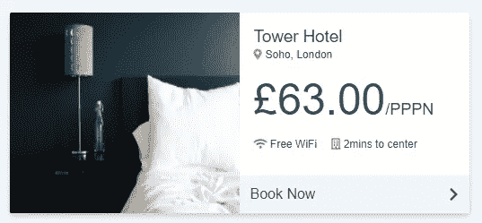

# 17 个顺风 CSS 卡示例

> 原文：<https://levelup.gitconnected.com/17-tailwind-css-card-examples-eca047280954>


# **什么是顺风 CSS？**

Tailwind CSS 是实用至上的 CSS 框架，适用于那些希望快速构建定制设计的人。

与预先设计的组件不同，Tailwind CSS 附带了用于定制的基本实用程序类。

**顺风安装**

文档强烈推荐通过 npm 或 yarn 下载框架，以获得组件定制的全部权限。

如果您使用 Django，请遵循 [Django +Tailwind 集成指南](../../../../../blog/article/django-tailwind)。如果您使用 React，请遵循 [React +顺风指南](../../../../../blog/article/reactjs-tailwindcss)。

否则，请访问[文档](https://tailwindcss.com/docs/installation#install-tailwind-via-npm)获取更多集成指南。

如果您喜欢使用 CDN:

*如何使用顺风 CDN*

```
<!doctype html>
<html lang="en">
  <head>
    <!-- Required meta tags -->
    <meta charset="utf-8">
    <meta name="viewport" content="width=device-width, initial-scale=1">

    <!-- Tailwind CSS -->
    <link href="https://unpkg.com/tailwindcss@^1.0/dist/tailwind.min.css" rel="stylesheet">

    <title>Tailwind CSS CDN</title>
  </head>
  <body>

    <h1>Tailwind CSS Framework</h1>

  </body>
</html>
```

Tailwind 只有一个 CDN 一个添加到`<head>`元素的缩小样式表。

**关于尾翼的更多信息**

本文只讨论了 Tailwind 卡的例子。

如果您有兴趣了解更多关于实用程序类和制作您自己的组件的信息，请访问[前端开发的 3 大 CSS 框架](../../../../../blog/article/top-3-css-frameworks)。

# **文件中的顺风卡示例**

现在来看看 CSS 卡片的尾部。

从技术上讲，没有预先设计的顺风卡组件，但文档中有两个卡示例。

**顺风 CSS 卡示例#1**

*顺风 CSS 卡片#1 HTML 模板*

```
<!doctype html>
<html lang="en">
<head>
  <!-- Required meta tags -->
  <meta charset="utf-8">
  <meta name="viewport" content="width=device-width, initial-scale=1">

  <!-- Tailwind CSS -->
  <link href="https://unpkg.com/tailwindcss@^1.0/dist/tailwind.min.css" rel="stylesheet">

  <title>Tailwind CSS CDN</title>
</head>
<body>

  <div class="p-10">  
    <!--Card 1-->
    <div class="max-w-sm rounded overflow-hidden shadow-lg">
      
      <div class="px-6 py-4">
        <div class="font-bold text-xl mb-2">Mountain</div>
        <p class="text-gray-700 text-base">
          Lorem ipsum dolor sit amet, consectetur adipisicing elit. Voluptatibus quia, nulla! Maiores et perferendis eaque, exercitationem praesentium nihil.
        </p>
      </div>
      <div class="px-6 pt-4 pb-2">
        <span class="inline-block bg-gray-200 rounded-full px-3 py-1 text-sm font-semibold text-gray-700 mr-2 mb-2">#photography</span>
        <span class="inline-block bg-gray-200 rounded-full px-3 py-1 text-sm font-semibold text-gray-700 mr-2 mb-2">#travel</span>
        <span class="inline-block bg-gray-200 rounded-full px-3 py-1 text-sm font-semibold text-gray-700 mr-2 mb-2">#winter</span>
      </div>
    </div>
  </div>

</body>
</html>
```

第一张卡片是垂直堆叠的卡片，图像放在顶部。


**顺风 CSS 卡示例#1 连续**

*顺风 CSS 卡片行#1 HTML 模板*

```
<!doctype html>
<html lang="en">
<head>
  <!-- Required meta tags -->
  <meta charset="utf-8">
  <meta name="viewport" content="width=device-width, initial-scale=1">

  <!-- Tailwind CSS -->
  <link href="https://unpkg.com/tailwindcss@^1.0/dist/tailwind.min.css" rel="stylesheet">

  <title>Tailwind CSS CDN</title>
</head>
<body>

  <div class="p-10 grid grid-cols-1 sm:grid-cols-1 md:grid-cols-3 lg:grid-cols-3 xl:grid-cols-3 gap-5">
    <!--Card 1-->
    <div class="rounded overflow-hidden shadow-lg">
      
      <div class="px-6 py-4">
        <div class="font-bold text-xl mb-2">Mountain</div>
        <p class="text-gray-700 text-base">
          Lorem ipsum dolor sit amet, consectetur adipisicing elit. Voluptatibus quia, nulla! Maiores et perferendis eaque, exercitationem praesentium nihil.
        </p>
      </div>
      <div class="px-6 pt-4 pb-2">
        <span class="inline-block bg-gray-200 rounded-full px-3 py-1 text-sm font-semibold text-gray-700 mr-2 mb-2">#photography</span>
        <span class="inline-block bg-gray-200 rounded-full px-3 py-1 text-sm font-semibold text-gray-700 mr-2 mb-2">#travel</span>
        <span class="inline-block bg-gray-200 rounded-full px-3 py-1 text-sm font-semibold text-gray-700 mr-2 mb-2">#winter</span>
      </div>
    </div>
    <!--Card 2-->
    <div class="rounded overflow-hidden shadow-lg">
      
      <div class="px-6 py-4">
        <div class="font-bold text-xl mb-2">River</div>
        <p class="text-gray-700 text-base">
          Lorem ipsum dolor sit amet, consectetur adipisicing elit. Voluptatibus quia, nulla! Maiores et perferendis eaque, exercitationem praesentium nihil.
        </p>
      </div>
      <div class="px-6 pt-4 pb-2">
        <span class="inline-block bg-gray-200 rounded-full px-3 py-1 text-sm font-semibold text-gray-700 mr-2 mb-2">#photography</span>
        <span class="inline-block bg-gray-200 rounded-full px-3 py-1 text-sm font-semibold text-gray-700 mr-2 mb-2">#travel</span>
        <span class="inline-block bg-gray-200 rounded-full px-3 py-1 text-sm font-semibold text-gray-700 mr-2 mb-2">#summer</span>
      </div>
    </div>

    <!--Card 3-->
    <div class="rounded overflow-hidden shadow-lg">
      
      <div class="px-6 py-4">
        <div class="font-bold text-xl mb-2">Forest</div>
        <p class="text-gray-700 text-base">
          Lorem ipsum dolor sit amet, consectetur adipisicing elit. Voluptatibus quia, nulla! Maiores et perferendis eaque, exercitationem praesentium nihil.
        </p>
      </div>
      <div class="px-6 pt-4 pb-2">
        <span class="inline-block bg-gray-200 rounded-full px-3 py-1 text-sm font-semibold text-gray-700 mr-2 mb-2">#photography</span>
        <span class="inline-block bg-gray-200 rounded-full px-3 py-1 text-sm font-semibold text-gray-700 mr-2 mb-2">#travel</span>
        <span class="inline-block bg-gray-200 rounded-full px-3 py-1 text-sm font-semibold text-gray-700 mr-2 mb-2">#fall</span>
      </div>
    </div>
  </div>
</div>

</body>
</html>
```

要创建一个卡片行，请将所有卡片嵌套在一个网格中，该网格指定了每个视点中的列数。


**顺风 CSS 卡示例#2**

*顺风 CSS 卡片#2 HTML 模板*

```
<!doctype html>
<html lang="en">
<head>
  <!-- Required meta tags -->
  <meta charset="utf-8">
  <meta name="viewport" content="width=device-width, initial-scale=1">

  <!-- Tailwind CSS -->
  <link href="https://unpkg.com/tailwindcss@^1.0/dist/tailwind.min.css" rel="stylesheet">

  <title>Tailwind CSS CDN</title>
</head>
<body>

  <div class="p-10">
    <!--Card 1-->
    <div class=" w-full lg:max-w-full lg:flex">
      <div class="h-48 lg:h-auto lg:w-48 flex-none bg-cover rounded-t lg:rounded-t-none lg:rounded-l text-center overflow-hidden" style="background-image: url('/mountain.jpg')" title="Mountain">
      </div>
      <div class="border-r border-b border-l border-gray-400 lg:border-l-0 lg:border-t lg:border-gray-400 bg-white rounded-b lg:rounded-b-none lg:rounded-r p-4 flex flex-col justify-between leading-normal">
        <div class="mb-8">
          <p class="text-sm text-gray-600 flex items-center">
            <svg class="fill-current text-gray-500 w-3 h-3 mr-2"  viewBox="0 0 20 20">
              <path d="M4 8V6a6 6 0 1 1 12 0v2h1a2 2 0 0 1 2 2v8a2 2 0 0 1-2 2H3a2 2 0 0 1-2-2v-8c0-1.1.9-2 2-2h1zm5 6.73V17h2v-2.27a2 2 0 1 0-2 0zM7 6v2h6V6a3 3 0 0 0-6 0z" />
            </svg>
            Members only
          </p>
          <div class="text-gray-900 font-bold text-xl mb-2">Best Mountain Trails 2020</div>
          <p class="text-gray-700 text-base">Lorem ipsum dolor sit amet, consectetur adipisicing elit. Voluptatibus quia, nulla! Maiores et perferendis eaque, exercitationem praesentium nihil.</p>
        </div>
        <div class="flex items-center">
          
          <div class="text-sm">
            <p class="text-gray-900 leading-none">John Smith</p>
            <p class="text-gray-600">Aug 18</p>
          </div>
        </div>
      </div>
    </div>
  </div>

</body>
</html>
```

第二个卡片示例是一个水平卡片，图像放在左侧。在较小的视点中，卡片垂直堆叠。


**顺风 CSS 卡示例#2 连续**

*顺风 CSS 卡片行#2 HTML 模板*

```
<!doctype html>
<html lang="en">
<head>
  <!-- Required meta tags -->
  <meta charset="utf-8">
  <meta name="viewport" content="width=device-width, initial-scale=1">

  <!-- Tailwind CSS -->
  <link href="https://unpkg.com/tailwindcss@^1.0/dist/tailwind.min.css" rel="stylesheet">

  <title>Tailwind CSS CDN</title>
</head>
<body>

  <div class="p-10 grid grid-cols-1 sm:grid-cols-1 md:grid-cols-1 lg:grid-cols-1 xl:grid-cols-3 gap-5">
    <!--Card 1-->
    <div class=" w-full lg:max-w-full lg:flex">
      <div class="h-48 lg:h-auto lg:w-48 flex-none bg-cover rounded-t lg:rounded-t-none lg:rounded-l text-center overflow-hidden" style="background-image: url('/mountain.jpg')" title="Mountain">
      </div>
      <div class="border-r border-b border-l border-gray-400 lg:border-l-0 lg:border-t lg:border-gray-400 bg-white rounded-b lg:rounded-b-none lg:rounded-r p-4 flex flex-col justify-between leading-normal">
        <div class="mb-8">
          <p class="text-sm text-gray-600 flex items-center">
            <svg class="fill-current text-gray-500 w-3 h-3 mr-2"  viewBox="0 0 20 20">
              <path d="M4 8V6a6 6 0 1 1 12 0v2h1a2 2 0 0 1 2 2v8a2 2 0 0 1-2 2H3a2 2 0 0 1-2-2v-8c0-1.1.9-2 2-2h1zm5 6.73V17h2v-2.27a2 2 0 1 0-2 0zM7 6v2h6V6a3 3 0 0 0-6 0z" />
            </svg>
            Members only
          </p>
          <div class="text-gray-900 font-bold text-xl mb-2">Best Mountain Trails 2020</div>
          <p class="text-gray-700 text-base">Lorem ipsum dolor sit amet, consectetur adipisicing elit. Voluptatibus quia, nulla! Maiores et perferendis eaque, exercitationem praesentium nihil.</p>
        </div>
        <div class="flex items-center">
          
          <div class="text-sm">
            <p class="text-gray-900 leading-none">John Smith</p>
            <p class="text-gray-600">Aug 18</p>
          </div>
        </div>
      </div>
    </div>
    <!--Card 2-->
    <div class="w-full lg:max-w-full lg:flex">
      <div class="h-48 lg:h-auto lg:w-48 flex-none bg-cover rounded-t lg:rounded-t-none lg:rounded-l text-center overflow-hidden" style="background-image: url('/river.jpg')" title="River">
      </div>
      <div class="border-r border-b border-l border-gray-400 lg:border-l-0 lg:border-t lg:border-gray-400 bg-white rounded-b lg:rounded-b-none lg:rounded-r p-4 flex flex-col justify-between leading-normal">
        <div class="mb-8">

          <div class="text-gray-900 font-bold text-xl mb-2">15 Rivers In Norway</div>
          <p class="text-gray-700 text-base">Lorem ipsum dolor sit amet, consectetur adipisicing elit. Voluptatibus quia, nulla! Maiores et perferendis eaque, exercitationem praesentium nihil.</p>
        </div>
        <div class="flex items-center">
          
          <div class="text-sm">
            <p class="text-gray-900 leading-none">Karen Johnson</p>
            <p class="text-gray-600">Aug 10</p>
          </div>
        </div>
      </div>
    </div>
    <!--Card 3-->
    <div class="w-full lg:max-w-full lg:flex">
      <div class="h-48 lg:h-auto lg:w-48 flex-none bg-cover rounded-t lg:rounded-t-none lg:rounded-l text-center overflow-hidden" style="background-image: url('/forest.jpg')" title="Forest">
      </div>
      <div class="border-r border-b border-l border-gray-400 lg:border-l-0 lg:border-t lg:border-gray-400 bg-white rounded-b lg:rounded-b-none lg:rounded-r p-4 flex flex-col justify-between leading-normal">
        <div class="mb-8">
          <p class="text-sm text-gray-600 flex items-center">
            <svg class="fill-current text-gray-500 w-3 h-3 mr-2"  viewBox="0 0 20 20">
              <path d="M4 8V6a6 6 0 1 1 12 0v2h1a2 2 0 0 1 2 2v8a2 2 0 0 1-2 2H3a2 2 0 0 1-2-2v-8c0-1.1.9-2 2-2h1zm5 6.73V17h2v-2.27a2 2 0 1 0-2 0zM7 6v2h6V6a3 3 0 0 0-6 0z" />
            </svg>
            Members only
          </p>
          <div class="text-gray-900 font-bold text-xl mb-2">5 National Forests across the U.S.</div>
          <p class="text-gray-700 text-base">Lorem ipsum dolor sit amet, consectetur adipisicing elit. Voluptatibus quia, nulla! Maiores et perferendis eaque, exercitationem praesentium nihil.</p>
        </div>
        <div class="flex items-center">
          
          <div class="text-sm">
            <p class="text-gray-900 leading-none">Rafael Martin</p>
            <p class="text-gray-600">Aug 9</p>
          </div>
        </div>
      </div>
    </div>
  </div>
</div>

</body>
</html>
```

要创建一个卡片行，请将所有卡片嵌套在一个网格中，该网格指定了每个视点中的列数。


# **15 个顺风卡示例**

有了这两个文档卡示例之后，让我们来看看一些 CodePen TailwindCSS 卡示例以获取灵感。

下面提供了每支笔的链接。

**顺风卡**

*由* [*和*](https://codepen.io/handplant) 组成

在本例中，卡片用于显示假期租赁价格。

描述、价格、距离、联系人和评论都显示在这个层叠的 Tailwind CSS 卡片模板中。

当卡片悬停时，图像放大 1.05 倍，卡片周围会显示略暗的阴影。每张卡上都添加了圆角和柔性包装。

 [## 代码笔嵌入-尾风-卡片

### 编辑描述

codepen.io](https://codepen.io/handplant/embed/preview/MWWaYNw?height=265&theme-id=dark&default-tab=html,result) 

**方解石顺风卡**

*由* [*埃里奇*](https://codepen.io/TheBlueDog)

下一支笔是一张层叠的 CSS 卡片，上面是图像，下面是描述文字。

圆形徽章被添加到底部，一个大的阴影被放置在卡片的四角。

[](https://codepen.io/TheBlueDog/embed/preview/aboEjxO?height=265&theme-id=dark&default-tab=html,result) [## CodePen 嵌入方解石顺风卡片

### 编辑描述

codepen.io](https://codepen.io/TheBlueDog/embed/preview/aboEjxO?height=265&theme-id=dark&default-tab=html,result) 

**顺风卡—左右**

*由* [*雷欧洛*](https://codepen.io/diomed)

水平卡片可以在卡片的左侧或右侧显示图像。这支笔演示了在链接文章时如何使用这两者。

在较小的视点中，卡片堆叠在一列中，而在较大的视点中，它保持两列。在每张卡片周围添加一个`<a>`元素，或者“阅读更多”链接到博客文章或页面。

 [## 代码笔嵌入-顺风卡片-左-右

### 编辑描述

codepen.io](https://codepen.io/diomed/embed/preview/wQzjYL?height=265&theme-id=dark&default-tab=html,result) 

**顺风牌**

*由* [*杰西施耐德*](https://codepen.io/mechawrench)

这个 CodePen 用户演示了如何创建一个没有图像的顺风卡片，以及一个有图像的堆叠和水平卡片。

每个都有反应，并使用顺风的默认颜色。没有自定义的 CSS 和所有的图像来自 Unsplash。

[](https://codepen.io/mechawrench/embed/preview/OJNZgjW?height=265&theme-id=dark&default-tab=html,result) [## 代码笔嵌入-顺风(卡片)

### 编辑描述

codepen.io](https://codepen.io/mechawrench/embed/preview/OJNZgjW?height=265&theme-id=dark&default-tab=html,result) 

**顺风牌**

*由* [*Artexxx*](https://codepen.io/artexxx)

顺风横卡很适合博客，因为它们可以作为文章的链接。这个 CodePen 用户在一列中显示水平卡片作为“最近的文章”。

标题、描述、作者和出版日期都显示在卡片的右侧，而图像则显示在左侧。

然而，在较小的视点中，卡片折叠成堆叠的卡片。

 [## 代码笔嵌入-尾风-卡片

### var card = new Vue({ el: '#card '，数据:{ title:“佩里·威廉姆斯博士加盟 UNR 担任助理教授”，节选:“博士…

codepen.io](https://codepen.io/artexxx/embed/preview/QWyZKzy?height=265&theme-id=dark&default-tab=js,result) 

**顺风卡**

*由* [*用户 123*](https://codepen.io/user_123)

这个 TailwindCSS 卡片模板连续显示三张堆叠的卡片。每张卡都有一个标题、描述，在卡的底部还有一个下载按钮。

这些卡不兼容移动设备，因为在较小的视点中它们不会折叠成一列。

参考上面的文档示例，让它们做出响应。


**顺风卡**

*由* [*杰纽伊*](https://codepen.io/jaynewey)

这个 Tailwind CSS 卡片模板例子带有一个导航条和一个卡片克隆 JS 函数。

悬停时，卡片沿 Y 轴上升，卡片边框被阴影取代。这是一个干净，简单的 CSS 卡悬停效果，使一个很好的视觉冲击。

 [## CodePen 嵌入式顺风卡

### 编辑描述

codepen.io](https://codepen.io/jaynewey/embed/preview/dyGxjBZ?height=265&theme-id=dark&default-tab=html,result) 

**尾翼 CSS 卡**

*由* [*桑杰*桑杰](https://codepen.io/sanjaysanjel)

这支笔是一张放在纸中央的顺风卡片。虽然堆叠在一起，但这张卡片的描述使用负边距与卡片图像重叠。

该模板基于一张度假租赁卡，其中包括房间数量、浴室、每周价格和评级。

图像和描述卡上都有阴影，以提供两者之间的对比。

 [## CodePen Embed - TailwindCSS 卡

### 编辑描述

codepen.io](https://codepen.io/sanjaysanjel/embed/preview/dyMKOZK?height=265&theme-id=dark&default-tab=html,result) 

**顺风卡**

*由* [*到*](https://codepen.io/dzoni404)

与之前的 Tailwind 卡片模板类似，这张卡片有一段描述文字与图片重叠。

图像和文本都在同一个水平卡片中，但是，文本框有一个白色背景覆盖在图像的底部。

这种效果完全是通过 TailwindCSS 实用程序类实现的，卡片堆叠在较小的视点中。

 [## CodePen 嵌入式顺风卡

### 俄罗斯圣瓦西里大教堂(俄语:соборвасилияблаженного，Sobor…

codepen.io](https://codepen.io/dzoni404/embed/preview/PdZrwL?height=265&theme-id=dark&default-tab=html,result) 

**顺风卡设计**

*由* [*变成*](https://codepen.io/matt-tonks)

这个 Tailwind CSS 模板设计为酒店预订，向用户显示一个水平卡片，上面有酒店名称、位置和费用。

一个“现在预订”的链接固定在卡片的底部，而价格是主要的焦点。

[](https://codepen.io/matt-tonks/embed/preview/JwZZZm?height=265&theme-id=dark&default-tab=html,result) [## CodePen 嵌入式顺风卡设计

### 编辑描述

codepen.io](https://codepen.io/matt-tonks/embed/preview/JwZZZm?height=265&theme-id=dark&default-tab=html,result) 

**顺风卡**

*由*[尼拉詹巴斯内特 ](https://codepen.io/nirazanbasnet)

这个顺风卡片是水平的，在卡片的右上角有一个加号按钮。电子商务网站或社交媒体平台是实现这种卡片设计的好地方。

该卡目前不兼容移动设备，但可以很容易地添加一些高度实用案件的形象。

请参见页面顶部的横式卡片示例了解代码。

 [## CodePen 嵌入式顺风卡

### 编辑描述

codepen.io](https://codepen.io/nirazanbasnet/embed/preview/oVvMqb?height=265&theme-id=dark&default-tab=html,result) 

**顺风卡**

*由* [*托米·普拉塔玛*](https://codepen.io/tommypratama)

该卡专为教育网站设计，显示课程完成进度条、当前课程和链接到当前课程页面的按钮。

这是一个基本的卡片，但在向用户显示相关信息方面做得很好，可以很容易地用于显示产品或服务链接。

[](https://codepen.io/tommypratama/embed/preview/GRovORm?height=265&theme-id=dark&default-tab=html,result) [## 代码笔嵌入-尾风-卡片

### 编辑描述

codepen.io](https://codepen.io/tommypratama/embed/preview/GRovORm?height=265&theme-id=dark&default-tab=html,result) 

**顺风卡**

*由* [*阮志勇*](https://codepen.io/tnguyen201)

提供的最后一个 Tailwind 卡示例是一个注释或支持界面。也可能是员工考核卡。

状态、教师姓名、日期和评论都显示在没有图像的顺风卡片中。

卡有响应，但填充可能需要调整。

[](https://codepen.io/tnguyen201/embed/abdbrRp?height=265&theme-id=dark&default-tab=html,result) [## CodePen 嵌入式顺风卡

### 编辑描述

codepen.io](https://codepen.io/tnguyen201/embed/abdbrRp?height=265&theme-id=dark&default-tab=html,result) 

*原载于*[*https://www.ordinarycoders.com*](https://www.ordinarycoders.com/blog/article/17-tailwindcss-cards)*。*