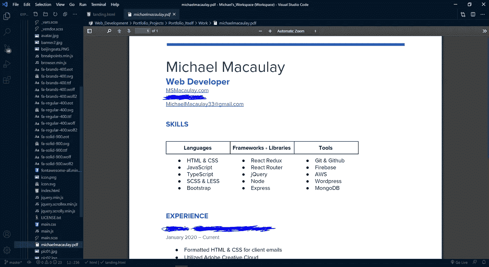

# 17 VS 代码扩展，简化编程

> 原文：<https://levelup.gitconnected.com/17-vs-code-extensions-to-make-programming-easy-e18e22422e46>

有了这些扩展，编程变得轻而易举。

感谢 [Pexels](https://www.pexels.com/photo/female-software-engineer-coding-on-computer-3861972/) ！

编程已经很难了。你需要尽可能地节省时间和精力。这些扩展将帮助你做*就是那个*。

# 代码拼写检查器

你是否曾经在一个网站上工作，当你在浏览器中预览网站时，发现你在正文中拼错了一个单词？然后你回到 VS 代码来修复它。你意识到你不知道如何拼写企业家这个词。然后你得谷歌一下。当你做完的时候，整整 5 分钟已经过去了。

拼写检查已经成为现代生活的一个重要组成部分。如果没有文本编辑器，你可能甚至不会使用它——除非你编码的时候！我们的思想需要集中在代码的逻辑上，而不是拼写上！这就是为什么代码拼写检查应该是编程的主要部分。这让我们变得更加专业。

# 缩进-彩虹

缩进彩虹让*清理*代码变得超级容易。它有助于保持代码缩进的一致性——使以后的所有内容更加易读。

看看这段代码有多漂亮！

缩进超级重要。Indent Rainbow 有助于将缩进变成保持代码可读性的强大工具。

# 颜色选择

前端开发者们，你们新的好朋友来了！欢迎选色。它使得在 CSS 中改变颜色变得超级容易！

看那是怎么回事！

# 虚拟代码-图标

编程是极其可视化的。你需要能够轻易地识别你看到的任何东西。和 VS 代码图标使得项目的文件类型非常容易识别。

# 更漂亮—代码格式化程序

你有没有遇到过一大行代码迫使你滚动屏幕去读它的结尾？可怕的东西。漂亮有助于解决这个问题。

保存文件后，漂亮的自动格式化。

更漂亮有助于保持代码的可读性，而不必在编写时不断地重新格式化。这非常方便，会让你的生活轻松很多。

# 实时服务器

如果你是前端开发人员，这是绝对必须的。每当您保存代码时，这将自动重新加载您的 web 浏览器。

每个前端开发者都需要这个。

如果你忽略了列表中的其他扩展名，请确保下载这个。

# 埃斯林特

ESLint 检测代码中的错误并自动修复它们。它非常强大，并且预建了许多 ide。它是如此强大和有用，以至于大公司(微软、AirBnB 等)都捐款来维持它的持续支持。

它还提供了很多定制。你可以有选择地禁用它的某些部分。

# 自动关闭标签

这是前端开发人员的另一个*必备*工具。不再需要手动输入结束的 *< div >* 标签。你输入开始标签，结束标签就会出现。

当我在《反动 T5》中写下 [JSX 时，我发现这让世界变得不同。尤其是我刚出道的时候。这只是我不必再考虑的一个小麻烦。](https://reactjs.org/docs/introducing-jsx.html)

# 括号对着色机

实话实说吧。跟踪几十行代码并跟踪逻辑是很困难的。斗争的一部分是跟踪哪些括号或圆括号在一起。

括号对着色将连接一条线到相应的括号。它也适用于圆括号。这使得阅读代码变得更加容易。

这个对我来说实际上改变了游戏规则。如果我的电脑明天崩溃，我不得不从头开始，这是我会安装的第一个扩展。

想象一下试图在这个中找到右括号？！

# 反应片段

React 有一个*大的*学习曲线。但是一旦你掌握了它，React 可能是目前最强大的前端框架。不幸的是，掌握 React 没有捷径。只是很多努力。但是你可以让自己轻松一点。

简单的 React 片段将为您做好开始的准备。在我看来，这使得 React 更容易学习。

设置一个 React 功能组件*,好像它什么都不是。*

不再需要输入组件的整个结构。那太花时间了。我打了几个字母，然后按了上面的回车。然后砰。整装待发的功能组件。

还有很多快捷方式，但这是我个人最喜欢的，因为功能性的 React 组件是最好的。(抱歉基于类的组件人群)。

我个人认为使用任何代码片段扩展的最好方法是学习你知道会用到的代码片段。这是那些只需要一点学习就能使用的扩展之一。但是，即使你只学习 3 个触发器，也可以使编程变得容易得多。

# 泰伯宁

这是这个列表中一个更好的扩展。TabNine 使用机器学习来计算出你将要编写的代码。然后它建议写什么。是的，听起来很酷。

一开始会感觉有点奇怪(我确信其中一些扩展会这样)。但是从长远来看，花时间去掌握这些扩展将有助于你的装载。

TabNine 也适用于每一种编程语言，所以无论你是写 HTML 还是 C++，你都可以使用它。

# 美化

这是另一个扩展，使代码更易于查看。通过美化运行您的应用程序将重新格式化一切，使其变得美丽。

没有可比性。这段代码被美化了。

# 自动重命名标签

自动重命名标签正如其名称所暗示的那样。把 h2 变成 h4？没问题！它会自动重命名关闭的 h2，并将其转换为 h4，没有问题。

这是另一个节省时间的小方法，可能会在一生中产生很大的影响。我不建议尽可能多地使用这些类型的扩展。

# 夜猫子主题

拥有一个你认为好看的主题是非常重要的。你会花很多时间在 VS 代码中查看这些文本字符。拥有一个你喜欢的配色方案*是最重要的。*

我认为花一些时间去探索和尝试找到你喜欢的主题是个好主意。但如果你只是没有精神能量去做那件事(我也不怪你)。夜猫子是一个非常可靠的选择。

很暗，但不太暗。色彩丰富但又不太丰富。我尝试了很多主题。这个人因为这样或那样的原因选择了我。试试看。看你喜不喜欢。如果没有，就去网上探索。得到一个你真正喜欢的主题，你会帮你自己一个大忙。

看看这个。

# VSCode-PDF

又一个超级方便的扩展。pdf 非常受欢迎。如果你在整个职业生涯中从未使用过它们，我会感到震惊。为什么不用 VS 代码来做呢？

不要再用 Chrome 打开来浪费内存了！

# NPM 智能感知

导入语句可能很困难。NPM 智能感知通过在你做的时候提供自动完成功能使它们变得更加容易。这将有助于您避免在导入语句中出现拼写错误。

很容易错误地大写或指向错误的目录。诸如此类的事情可能会导致需要几个小时甚至几天才能解决的问题。借助 NPM 智能感知，从一开始就避免使用它们。

# JavaScript ES6 代码片段

这是另一个伟大的 snippets 扩展。你可以很容易地得到你可能需要的东西的结构。它包括导入语句、辅助函数、数组析构以及您可能需要的任何东西。

同样，对于代码片段，使用它们的最好方法是了解你知道你会使用的代码片段*的触发器。这将因人而异。只有你知道你需要什么样的片段。*

# 结论

扩展可以使小任务变得更容易。比如刷新浏览器或者创建一个结束标签。看起来很小，当然。但是，如果足够的话，它们会给你作为程序员的生活带来很大的不同。