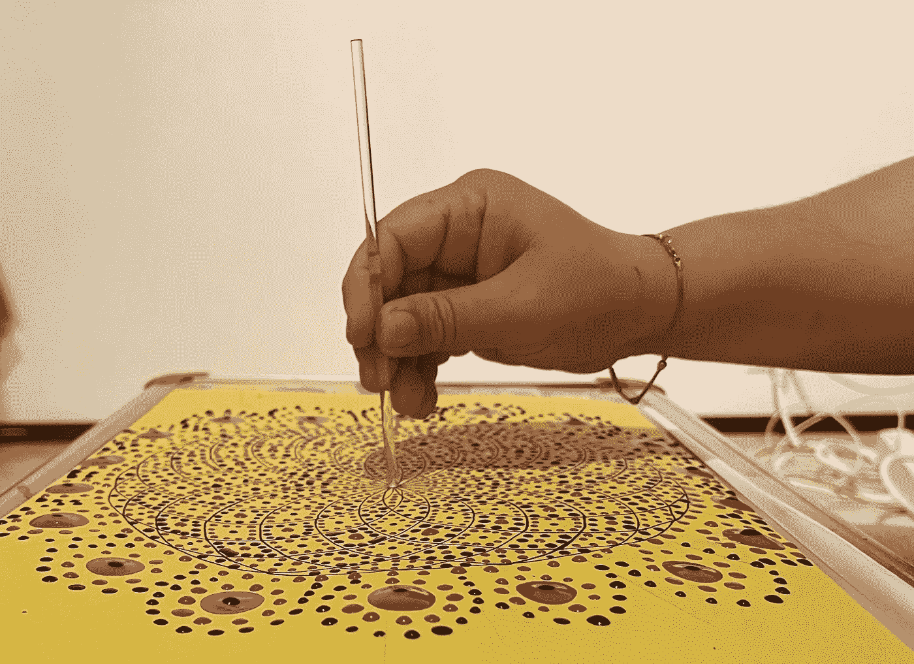
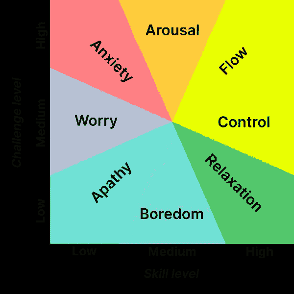

# 17 年的编程生涯，我无法在 7 天内学会 Javascript

> 原文：<https://levelup.gitconnected.com/17-years-in-programming-i-couldnt-learn-javascript-in-7-days-dd58d09568e0>



鸣谢:作者照片

在我的职业生涯中有一段时间，我迫切需要给我的技能坦克加油。

在有了 17 年的编程经验后，由于缺少项目，我被我的服务公司解雇了。

由于我的技能组合(移动/桌面)暂时太窄，雇主也没有考虑可转移的技能承诺(即，如果我知道 C，我可以很容易地使用 Node.js)，我的选择非常有限。

在参加了长达 44 小时的 best machine learning 课程后，在意识到自己没有能力[学习数据科学](https://medium.com/swlh/3-career-choices-for-those-who-hate-data-science-42a4bf2f4056)后，我知道狭窄的急流会立刻杀死我。

在海洋中游泳是唯一的选择，而海洋就是网络开发。由于我[害怕前端开发](https://betterprogramming.pub/why-frontend-development-is-so-hard-c055bce2fd3a)，后端编程是唯一可行的选择。我选择了 Node.js。

> StackOverflow 的背叛总是意味着丧钟。

我在 LinkedIn 上注册了 3 门 JS 课程，在 Udemy 上注册了 1 门。我也开始在空闲时间看 YouTube 上的 JS/TS 内容。我熟记教程，并按照它们的描述制作项目。

(老实说，把其他 28，759 名学生复制粘贴的东西放上去是一种相当无聊的体验。但是我太没用了，抗拒不了任何训练。)

令我完全惊讶的是，我面临的最大挑战不是学习概念，而是建立工具链。例如，有一次一个 **npm build** 命令耗费了我一整天的时间。我最终在我的 Mac mini 里塞满了一千个我不知道的库。StackOverflow 的背叛总是意味着丧钟。

我中途放弃了这些课程。

但我还是决定申请 JS 职位——让我的命运完全取决于市场的规模。

# 失败的面试努力:

我的申请为我赢得了一些低调的网站开发公司的面试机会。

## 面试# 1:

他们问我 JS 经历的长短。我决定实话实说:

> 上个月才学会 JS。凭借我在 C++、Objective C 和 C#方面的丰富语言经验，我相信我可以为我的下一个项目做出更多贡献。毕竟编程是一门艺术，编程语言只是一种工具。

他们对那些话没有表现出热情。第二天，拒绝邮件在我的收件箱里等待着:

> 我们(显然)需要有相当丰富 JS 经验的人，尽管我们承认在工作描述中没有提到。).你比我们想象的更有价值，但这次我们不会继续这个话题。祝你好运！

## 面试# 2:

它包括创建一个小型的 Typescript 项目。这项任务并不难。我必须根据一定的标准对大量对象进行过滤和排序，并返回一个合格的(max something)元素。

对象设计由我决定，我利用这个机会展示了我的 TS 知识:我使用了接口，我设计了模型类，以及客户端类。我还包括了单元测试。我写了一份详细的自述文件来部署我的解决方案。

最糟糕的是，我在两天内完成了任务，而不是指定的 7 天期限。

结果让我震惊:

> 你的一些测试和我们的数据不符。这很好，但原因让我们更担心。您没有使用众所周知的序列化 TS 库，导致您的程序无法读取测试存根。我们希望开发人员能够熟记每样东西的最佳库。抱歉，但是下次。

很清晰。同时，这听起来非常不公平。

> 在编程子编辑中，沮丧的编码者找到了慰藉

我在对象设计和可测试性方面花了 16 个小时的心血，但都化为乌有，这不仅仅是因为一个未满足的边界情况，更是因为不知道一个著名的库。这也是因为我缺乏 TS 方面的经验，我在求职信中已经提到过了。

顺便问一下，成功的候选人是如何得到它的？有没有一个全球性的酒吧，他们可以在那里就最好的配料达成一致？

在一个午夜，我严重地处于被拒绝的精神错乱状态，我去了这样一个酒吧:**编程 subreddits** 。看着同样沮丧或更多沮丧的编码员互相咒骂，我找到了安慰。

那种奇怪的卑微的骄傲，混合着内疚的幽默，帮助我进入了沉睡。

# 我如何通过激活我的自私基因来迎接 Javascript 挑战:

那些拒绝让我失去了动力，但我很快就恢复了理性思考。对网络的需求更大，但候选人的供应显然更大。

由于不熟悉这些工具，我没有机会与高中和大学刚毕业的人群竞争。

我是一名经验丰富的拳击手，但环境迫使我戴上不舒服的手套。我不得不习惯他们。更重要的是，穿着它们赢得尽可能小的战斗。

如果这场比赛是针对一个孩子的，而且没有裁判，那就这样吧。

在 TS 被拒绝的两个小时内，我找到了他:我决定用 Node.js 构建自己的边项目后端(电子书交付服务)。

*   由于潜在的货币化梦想，我会 100%拥有它
*   我会学习有用的 JS 并申请网络开发工作

我很快开始应用从在线课程中学到的原则。但是像往常一样，我在部署中面临着最大的挑战，我不能绕过那个需求，因为一切都围绕着它。在长达 2 个月的后端开发考验结束时，我总结道:

> 应用最好的编程原则是一个奢侈的策略，只有当其他一切都是黑箱的时候——也就是说，由其他人来处理的时候，你才能负担得起。

# 自私的基因和改变一切的大脑状态:

由于我参与这个项目的自私目的，这个挑战开始以一种奇怪的方式改善我:它加强了一定的代码质量。

> 我可以在不喝咖啡的情况下编程更长时间。

每当我写一个 JS 语句，我就开始神奇地更加清醒(正念？)的执行上下文。我开始问自己:

*   这个函数的输入总是非空的吗？如果没有，怎么写空支票？更好的是，一个通用的**可空性验证器**可以一劳永逸吗？(更好的是，让它成为一个私有的 npm 模块，在我将来的所有项目中使用)
*   它们肯定是字符串/字符串数组/什么的吗？谁来写那些**类型的验证器检查**？我需要越来越多的函数，学习基本的函数式编程技术(例如[奉承](https://javascript.info/currying-partials))不会有坏处。
*   这个函数/库/包有必要吗？这样形而上的提问让我彻底改造了自己的类设计。最棒的是，它甚至可以在工作时间之外完成。尽管它推迟了我的副业项目时间表(反正是不存在的，因为我没有投资者要回答)，但我喜欢负责创造一个全新的世界。说到扮演上帝。

我每时每刻都变得越自私(因此越不安全)，我就越意识到我的代码库。尽管重写没有获得新的功能特性，但它在某种程度上导致了一种比编码更放松的心态。我不再担心自己会被拖到计划之外，而是觉得自己对未来的灾难(缓存未命中、无效的输入处理成本、膨胀的数据库、未处理的异常、不受控制的云账单)有了保障。

我感到的不安全感与我对职业前景的不安全感完全相反，我对一个被解雇的程序员的形象感到羞愧。我恢复了自尊。

最神奇的是发明了一个我不知道自己喜欢的活动:**编码**。我见证了我可以在不喝咖啡的情况下编程更长时间。我变得无所畏惧。我可以随心所欲地重构，不管库存有多大，工作得有多好。

我没有意识到我刚刚经历的微小的神经变化。

# 称为心流的神经转化:

在我 17 年的编程生涯中，我第一次体验到了高度的心流状态。换句话说，在编程时，我感觉*在区域*中的时间要长得多。

当我第一次接触媒体时，我对大量有深度的长篇内容感到惊讶。我遇到的最突出的想法之一是**流动状态**。

我一碰到它，就完全明白了它的意思。不是因为我能清楚地定义它，而是因为我能指出它代表了什么:

> 一种能够不断创造或提炼的状态，而一个人几乎意识不到周围的环境。欢乐不仅是活动过程中的副作用，也是状态的归宿。

当我在[维基](https://en.wikipedia.org/wiki/Flow_(psychology))上查找心流状态时，我发现了以下定义:

> 在积极心理学中,“心流状态”,俗称“入定”,是一种精神状态，在这种状态下，一个人在进行某项活动时，会完全沉浸在一种精力充沛、全神贯注和享受活动过程的感觉中。

我在职业生涯早期没有意识到这一点的原因是，我的桌面/移动体验很少涉及单独的产品开发。我开发了一些小功能，但从未创建过完整的产品或模块。我很少能把乐高积木拼在一起。如果我经历过心流，我几乎没有注意到它。

# 为什么每个人都渴望心流状态:

直到最近三四十年，流动状态才被大众所尊崇。神秘知识的崇拜者知道这一点，而且大多保守秘密。

这背后的主要原因是，在大多数工作中，心流状态与金钱回报无关。唯一的例外是基于智商的运动，这种运动需要极度的精神集中，并在较短的时间内持续进步。

在 20 世纪 80 年代和 90 年代，目睹了艺术家们的不懈努力，匈牙利心理学家**米哈里·奇克森塔米哈伊**开始对心流研究感兴趣。

互联网内容经济的崛起改变了一切。最初，任性的创造者统治。但是在达到临界质量以及搜索引擎和博客的兴起之后，内容创作的竞争加剧了一个数量级。

每个渴望品质的人都在寻找青春之泉:心流状态。

# 一个人如何达到心流状态:

任何人都可以在自己最热衷的活动中轻松达到心流状态。

> 当一个挑战把艺术家拖到他的技术水平达到顶点的时候，流动就实现了。

但总的来说,“心流”与你是谁或你做什么关系不大。更多的是关于你渴望达到目标有多长时间，以及你如何努力进步。

心流是在一系列精神状态之后出现的一种精神状态。没有这些步骤，实现心流是不可能的。

这些都不是我的定义。它们来自 Csikszentmihalyi 的研究，该研究将心流置于两种最基本的精神状态之间:**唤醒**和**控制**。



鸣谢:[维基百科](https://en.wikipedia.org/wiki/Flow_(psychology))

在**技能与挑战**的图表上，当挑战将艺术家的技能水平提升到顶点时，流动就实现了。

*   挑战似乎无法克服的**焦虑**阶段已经过去很久了。在焦虑状态下，艺术家的感知技能水平似乎提高了，但不足以应对挑战。
*   焦虑之后是觉醒，在此期间，一个人最原始的生存本能开始爆发。唤醒是调动、追求营养和战斗或逃跑反应的动机。在觉醒过程中，神经递质活动增强。激发符合艺术家追求活动的兴趣。你的感官完全沉浸在活动中，有足够多的生理信号(血压、心率的特异值)证实了这一点。不用说，不经过觉醒，心流状态是无法达到的。
*   如果艺术家能够克服挑战，提高自己的技能水平，流动就会持续。(如果没有，艺术家辞职，他的努力失败了。流动是艺术家希望保持的理想状态。然而，在大多数情况下，他并没有注意到心流的存在。除非艺术家是见证他的精神状态的大师，否则任何关于“心流”的知识都可能扰乱它。
*   任何试图增加技能超过令人垂涎的**流**状态的尝试都会导致**控制**状态。虽然它使人认识到最大限度的认知舒适，但它意味着挑战水平的不可避免的降低。例如，在你解决了一个难题后不久，你就写下线索，以消除下一次的挑战。在控制状态期间，连续体被打破。艺术家没有回到心流状态，而是选择放松来庆祝胜利。

# 编程中的流动状态:

为了达到心流状态，所有程序员都要经历上面技能与挑战图中描述的同样的心理状态。

在我的职业生涯中，从我的工作终止开始，到我的副业项目结束，我经历了这些阶段:

*   担心:我最初的失败让我担心我的电子书交付后端 CRUD 操作
*   **焦虑**:我疯狂地寻找、应用、寻找，形成我需要的问题定义，来解决更大的问题。
*   唤醒:我不断地编写和重写我的 CRUD 函数，同时测试主要的函数。
*   **流程**:我每天都从零开始，不断地进行重构来优化代码，从而解决架构问题，避免未来的灾难。
*   控制:我模块化并 Git-push 了我的库以备后用，这样就避免了下次我需要写 CRUD 时重新发明轮子的需要。
*   **放松**:我凌晨 2 点就睡了，不过欢迎你替换你的版本😊

**我在磨难中的日志总结**:

```
I went through all those states every day, but their proportion was varying. Initially, my entire day was spent worrying. Gradually, anxiety and arousal began to occupy a bigger pie. In the end, flow took over, followed by control and relaxation.
```

我所知道的大多数伟大的程序员都不会遵循任何预先配置好的程序来实现心流。然而，他们每时每刻都渴望着它。

这并不是说他们完全不知道这种经历。

他们通过讲述他们的*不吸引人的*惯例来庆祝这个节日，比如:

```
*- Beyond half an hour, I cannot focus on coding.**- After having my morning coffee, I can code for 2 hours**- I can continually code listening to my favorite track**- Those* dailies *destroy my streak.**- In the heat of the hackathon, I programmed the whole prototype in an hour.*
```

# 新手在达到心流状态时面临的问题是:

大多数被“**吸引的技术追求者发现很难在编程行业生存，因为他们不能经常达到他们的流畅状态。他们不是无能。他们只是更经常地泄气，选择提前退出。**

> 大多数苦苦挣扎的程序员并不是没有能力。他们只是更经常地泄气，选择提前退出。

不像孩子们赢得了他们的"**啊哈**！"每当他们的 Scratch 游戏达到一个目标时，他们就会不断地被兼容性混乱、编译错误、意大利面条式代码和难以阅读的 shell 脚本等问题所拖累。

要成为伟大的程序员，你不需要成为天才。是的，成为一个神童会加速你的焦虑和觉醒。不过，总的来说，你只需要熬过足够长的时间来克服你的觉醒状态，这种状态每天都会给你带来新的、可解决的挑战，直到你学会解决一系列问题的模式。

# 回到一些理论上来，华生医生:

不管这种做法的铁杆支持者怎么说，理论很重要。

当你*重温*“**在 7 天内学会 Javascript**”(或者你开始旅程的任何课程)过去创建你的功能程序(无论它是你想要的大小)，你的长期记忆回忆帮助你比以前更早地达到你的心流状态。

这时你就把自己变成了一台永久的编程机器。

但是，请记住，这里的关键字是*重访*。如果你在理论上纠缠太久，你会把自己变成一个讨厌面试的人，而不是一个死忠的精通编码的人。

# 过去的流程:

**《如何在 X 天内编码》**教程吸引了数十万非技术人士投身编程这个职业。

然而，他们中的大多数人并不能保持编码的意愿，更不用说作为高质量的编码员退休了。他们中的许多人只是简单地转换职业轨道，去承担非编码轨道，例如产品管理、人员管理或 CXO 阶梯。

> 保持向往尘世间的冒险和汗流浃背的状态。否则，英年早逝。

那些在编程中幸存下来的人是那些在最麻烦的道路上跋涉的人——在反复出现的**觉醒**和**焦虑**状态之间摇摆。达到**流**后，他们每天挑战自己，反复享受它。

他们也享受过去小胜利的控制/放松天堂。但是他们积极地避免在这上面停留太久，过早地感到厌倦。

他们一直渴望尘土飞扬、汗流浃背的尘世冒险，让他们的大脑永远保持健康。他们知道，一旦停下来，他们就会英年早逝。因此，他们从未停止。他们在编程生涯的每一天都取得了胜利。

当有人这样说的时候，他/她一定很享受自己在经历了流量控制考验后的放松状态:

> 艰难的日子不会长久。坚强的人会。

**精选供图**:

[无声视觉](https://medium.com/u/72c9965c234d?source=post_page-----dd58d09568e0--------------------------------)在地带——掌握一个完全陌生的技能(画一个曼陀罗)。

[**笔磁**](https://tipsnguts.medium.com/) 是流行的高级开发者访谈电子书的作者:

[**高级开发人员面试综合方法(40+例题)**](https://tipsnguts.gumroad.com/l/crrzat/)

[](https://tipsnguts.medium.com/membership) [## 用我的推荐链接加入媒体-笔磁铁

### 阅读 Pen Magnet 上的每一个故事(以及媒体上成千上万的其他作者)。你的会员费直接支持 Pen…

tipsnguts.medium.com](https://tipsnguts.medium.com/membership) [](https://tipsnguts.medium.com/subscribe) [## 每次 Pen Magnet 发布时收到一封电子邮件。

### 每次 Pen Magnet 发布时收到一封电子邮件。通过注册，您将创建一个中型帐户，如果您还没有…

tipsnguts.medium.com](https://tipsnguts.medium.com/subscribe) 

# 分级编码

感谢您成为我们社区的一员！在你离开之前:

*   👏为故事鼓掌，跟着作者走👉
*   📰查看[升级编码出版物](https://levelup.gitconnected.com/?utm_source=pub&utm_medium=post)中的更多内容
*   🔔关注我们:[Twitter](https://twitter.com/gitconnected)|[LinkedIn](https://www.linkedin.com/company/gitconnected)|[时事通讯](https://newsletter.levelup.dev)

🚀👉 [**加入升级人才集体，找到一份惊艳的工作**](https://jobs.levelup.dev/talent/welcome?referral=true)