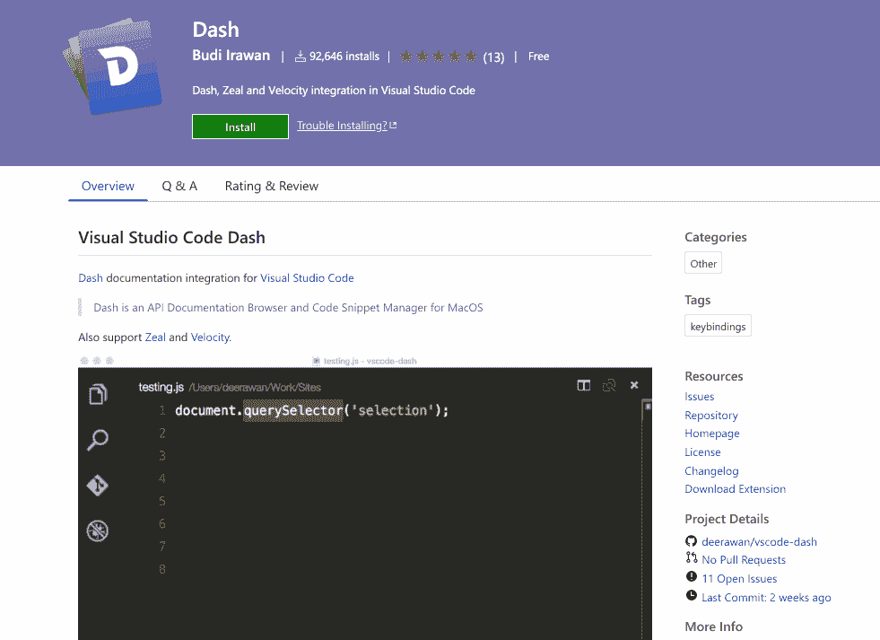
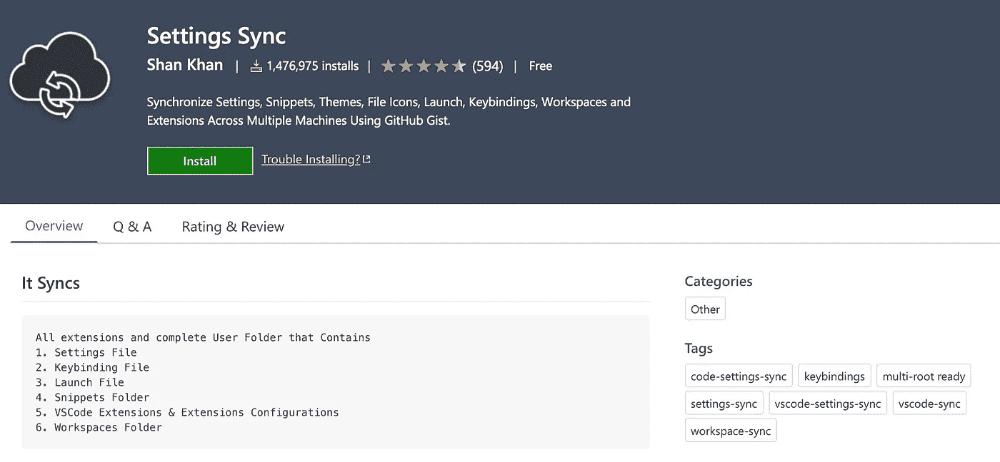

# 用 VS 代码编写 Python 的 18 个插件

> 原文：<https://levelup.gitconnected.com/18-plugins-for-writing-python-in-vs-code-7390afb70a2a>


VS 代码是一个很棒的文本编辑器。但是当你安装它的时候，它的功能是有限的。您可以编辑 JavaScript 和 TypeScript，但对于其他编程语言，它将只是一个文本编辑器。你需要添加一些插件来把它变成一个合适的 IDE。

幸运的是，当你用一种新语言打开一个文件时，VS 代码会建议一个可以帮助你的扩展名。使用 Python 扩展，您已经可以做很多事情了——您可以获得语法高亮显示、代码补全和许多其他将文本编辑器变成代码编辑器的功能。

但是我在使用 Python 时发现了许多其他插件。有些添加了全新的功能，有些只是在某些地方做了小小的改进。我决定把它们写下来。我希望你们中的一些人会发现它们有用！

# [Python](https://marketplace.visualstudio.com/items?itemName=ms-python.python) 和其他特定语言插件


首先也是最重要的——VS 代码的 Python 插件。开箱即用，VS 代码中没有对 Python 的支持，但是当你打开一个 Python 文件，VS 代码会立刻提示这个插件。它增加了所有必要的功能:

*   Python 文件的语法高亮显示
*   智能感知(代码完成建议)
*   启动调试器的能力
*   支持收集和运行测试(使用不同的测试框架，如 pytest 或 unittest)
*   不同的棉绒
*   以及许多其他的小特性，这些特性将 VS 代码变成了一个合适的 Python 编辑器

不同的语言也是如此。每次你打开一个 VS 代码不支持的文件，你都会得到一个该语言插件的建议。这是一个很好的方法！一方面，你不必弄清楚你需要安装哪些扩展，但另一方面，你不会因为你永远不会使用的插件而减慢你的 IDE。

# Django 和其他特定于框架的插件


如果你正在使用框架，通常有一个插件会让你的生活更容易，比如 [Django](https://marketplace.visualstudio.com/items?itemName=batisteo.vscode-django) 或 [flask-snippets](https://marketplace.visualstudio.com/items?itemName=cstrap.flask-snippets) 。它们为给定的框架带来了一些额外的改进，例如:

*   更好地突出显示特定于框架的文件的语法(例如 Django 中的模板文件，它将 HTML 与 Django 标签结合在一起)
*   额外的代码片段——对模板系统特别有用。能够用两个字母的快捷方式插入循环和 if-s 而不用打开和关闭所有这些`{%`标签是一种福气！
*   改进了对不同功能的支持。例如，Django 插件增加了从模板“转到定义”的能力。

# [智能代码](https://marketplace.visualstudio.com/items?itemName=VisualStudioExptTeam.vscodeintellicode)


Intellicode 使自动完成变得更加智能。它试图预测在给定的情况下你最有可能使用哪个术语，并将该术语放在列表的顶部(用☆符号标记)。

效果出奇的好！

# [埃米特](https://docs.emmet.io/)


从技术上讲，Emmet 不是一个扩展，因为默认情况下它已经与 VS 代码集成在一起了(由于它的巨大普及性)。但它仍然值得一提，以防有人从未听说过它。

如果你正在编写大量的 HTML 和 CSS，Emmet 将会是你最好的朋友。它允许你将简单的缩写扩展成完整的 HTML，它添加了 CSS 前缀(和厂商前缀)，以及一大堆其他有用的功能(重命名标签，平衡输入/输出，找到匹配对，等等)。)

当我需要写 HTML 的时候，我绝对喜欢它。我开始用它快速地给一个标签(`div.header`或`a.btn.btn-primary`)添加一个类，然后我学习了新的特性。使用 Emmet，您可以编写:

```
ul>li.list-item*3
```

如果你按下回车键，它会变成:

```
<ul>
  <li class="list-item"></li>
  <li class="list-item"></li>
  <li class="list-item"></li>
</ul>
```

# [Autodocstring](https://marketplace.visualstudio.com/items?itemName=njpwerner.autodocstring)


这个插件通过为您生成一些样板文件来加速编写 Python 文档。

编写一个函数签名，键入`"""`启动 docstring，按 Enter 键，这个插件会完成剩下的工作。它会负责将函数签名中的参数复制到文档中。如果你给你的参数添加类型，它会识别它们并把它们放在文档中正确的位置。

# [书签](https://marketplace.visualstudio.com/items?itemName=alefragnani.Bookmarks)


这个扩展允许你在代码中标记位置，在侧边栏中方便地列出所有的书签，并通过快捷键在它们之间移动。

这是非常有用的，然后我开始挖掘一个新的代码库(这样我就可以跳来跳去，不会迷路)。我还发现，当我试图调试一些复杂的问题时，它很有帮助——VS 代码有一个“转到上一个/下一个位置”的功能，但没有书签，很容易迷路。

# [破折号](https://marketplace.visualstudio.com/items?itemName=deerawan.vscode-dash)



使用 Dash extension，您可以访问几乎任何编程语言或框架的离线文档。

它需要安装一个附加工具来提供文档:

*   [奔向苹果电脑](https://kapeli.com/dash)
*   [对 Linux/Windows 的热情](https://zealdocs.org/)
*   [视窗速度](https://velocity.silverlakesoftware.com/)

下载文档后，您可以脱机访问它。

我不常使用它，但如果你需要在没有互联网的情况下工作，它是一个很好的工具。

# [误差镜头](https://marketplace.visualstudio.com/items?itemName=usernamehw.errorlens)


有时候 VS 代码中的错误标记很难被发现。如果不换行，情况会更糟——错误可能出现在屏幕上看不到的代码部分。

这就是我使用误差镜头的原因。它让我修改错误应该如何显示。它可以在出现错误的行旁边显示错误消息，并在空白处(行号旁边)显示类似 Sublime 的错误图标。

# [文件工具](https://marketplace.visualstudio.com/items?itemName=sleistner.vscode-fileutils)


这个小插件将一些与文件相关的命令添加到命令面板中(通常你可以通过右键点击工具条来执行这些命令):

*   重新命名
*   移动
*   复制
*   复制文件的路径或名称

它还在上下文菜单中添加了“移动/复制文件”选项。

# [GitLens](https://marketplace.visualstudio.com/items?itemName=eamodio.gitlens)


大规模插件——将大量 git 集成添加到 VS 代码中:

*   可以每行、每个文件、在状态栏中或悬停时显示责备注释。
*   为您提供显示更改、显示差异、复制提交 ID 的上下文链接。
*   带来了一个侧边栏，其中可能包含关于 git 存储库、文件和行历史、比较和搜索菜单等所有可能的信息。

它比 VS 代码的默认“源代码控制”面板强大得多。我不认为我在使用它的 20%的功能。

# [缩进-彩虹](https://marketplace.visualstudio.com/items?itemName=oderwat.indent-rainbow)


对于使用 Python 这样的语言非常有用的插件，缩进很重要。每一级缩进都有稍微不同的颜色，所以一眼就能看出给定代码块的结束位置。

# [跳动的](https://marketplace.visualstudio.com/items?itemName=wmaurer.vscode-jumpy)(或 [MetaGo](https://marketplace.visualstudio.com/items?itemName=metaseed.metago) )


jumpy 是一个非常奇特的插件，需要一些时间来适应。基本上，它应该帮助你更快地移动你的代码。

如果你按下键盘快捷键，jumpy 会在屏幕上的每个单词旁边显示一个 2 个字母的代码。如果你输入这两个字母，你的光标会跳到那个位置。类似于您在“正常”模式下使用 vim 所能做的事情(输入更少)。

# [粘贴和缩进](https://marketplace.visualstudio.com/items?itemName=Rubymaniac.vscode-paste-and-indent)


如果你在粘贴代码的时候发现 VS 代码做的不好，可以试试这个扩展。它可以让你分配一个“粘贴和缩进”动作到任何快捷键上。粘贴代码后，该命令将尽最大努力正确缩进代码(以匹配周围的代码)。我用的是“Command+Shift+V”快捷键。

# [项目经理](https://marketplace.visualstudio.com/items?itemName=alefragnani.project-manager)


VS 代码支持工作区的概念——您可以将一些文件和文件夹组合在一起，并在它们之间轻松切换。但是您仍然需要保存工作区配置，有时它可能会丢失——我要么不小心删除了它，要么忘记了保存在哪里。

项目经理消除了这种麻烦。您可以保存项目，然后打开它们，无论它们位于何处(并且您不必担心存储工作区首选项文件)。此外，它还添加了一个侧边栏来浏览您的所有项目。

# [快速简单的文本选择](https://marketplace.visualstudio.com/items?itemName=dbankier.vscode-quick-select)


我喜欢使用快捷方式来选择括号、标签等中的所有文本。默认情况下，VS 代码有“扩展/收缩选择”的命令，这还行，但我发现快速简单的文本选择插件是一个更好的方法。

它添加了一些新的快捷方式来选择文本:

*   单引号/双引号
*   圆括号
*   方括号/尖括号/花括号
*   标签

我试着将它们映射到一些直观的快捷方式上，它们非常管用:

*   Command + ' (⌘ + ') —选择单引号中的文本
*   Command + " (⌘ + ⇧ + ')-选择双引号中的文本
*   Command + ( (⌘ + ⇧ + 9)-选择括号中的文本
*   命令+ < (⌘ + ⇧ + ,)- select text in tag
*   Command + , (⌘ + ,)- select text in angular brackets

# [设置同步](https://marketplace.visualstudio.com/items?itemName=Shan.code-settings-sync)



其实和 Python 没什么关系，但是很重要的一个插件，所以想提一下。

Settings Sync 允许你将 VS 代码设置保存到一个私有的 GitHub gist 中，这样如果你切换到不同的计算机(或者如果你丢失/破坏了你当前的计算机)，你可以很容易地恢复它们。

在 VS 代码的一个即将到来的版本中，设置同步将成为内置的。

# [待办事项高亮显示](https://marketplace.visualstudio.com/items?itemName=wayou.vscode-todo-highlight)


突出显示代码中的所有 TODO/FIXME/NOTE，这样您可以很容易地找到它们。您可以通过添加新单词和更改突出显示样式来轻松定制它。

# [拼写正确](https://marketplace.visualstudio.com/items?itemName=ban.spellright)


很奇怪，VS 代码没有内置拼写检查器。所以你得装一个作为扩展。

*原载于 2020 年 4 月 27 日*[*【https://switowski.com】*](https://switowski.com/blog/18-plugins-for-python-in-vscode)*。*