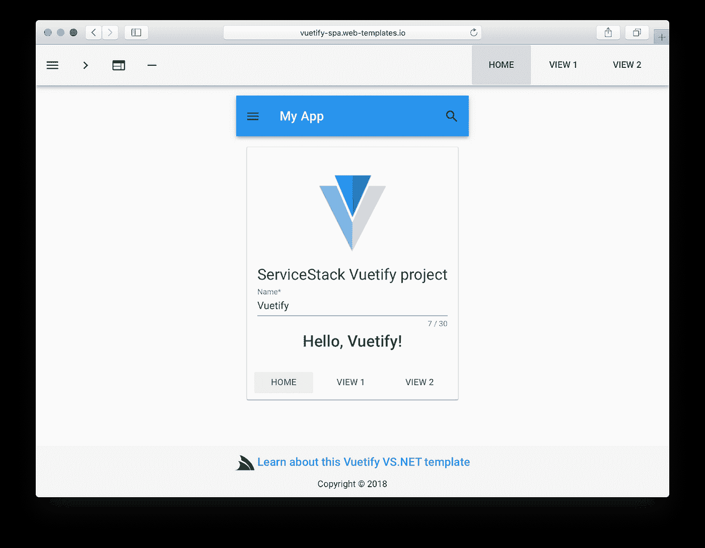
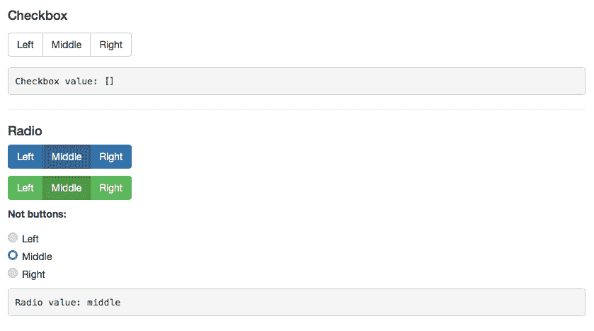
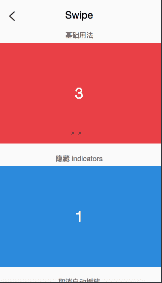
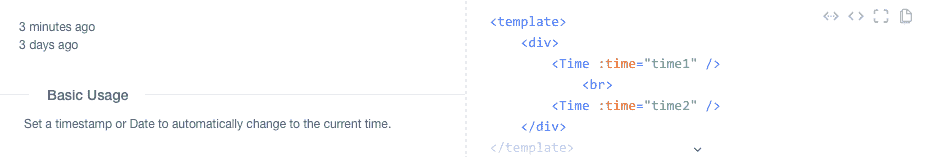
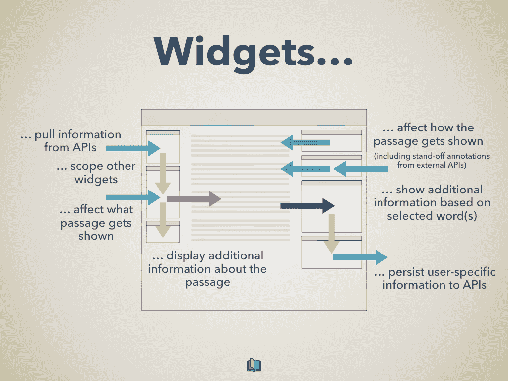
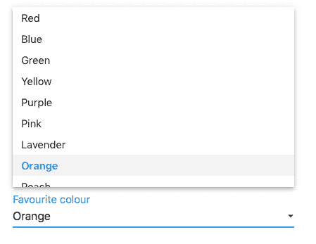
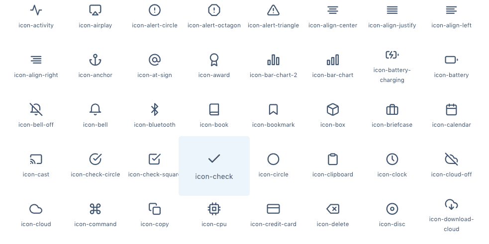
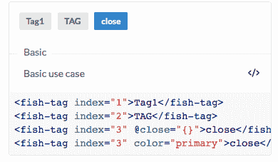
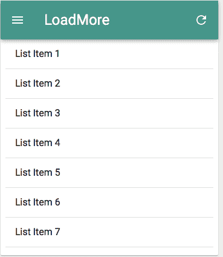
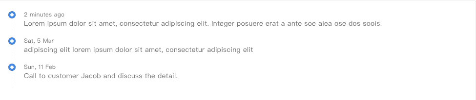

# 2019 年最有用的 18 个 Vue.js UI 库

> 原文：<https://levelup.gitconnected.com/18-useful-vuejs-ui-libraries-in-2019-1c622c6a4184>

照片由 [rawpixel](https://unsplash.com/@rawpixel?utm_source=medium&utm_medium=referral) 在 [Unsplash](https://unsplash.com?utm_source=medium&utm_medium=referral) 上拍摄

所有的前端 web 开发人员都去过那里——找到完美的 UI 库并想，“这正是我需要的*我整理了一些我用过的最有用的 Vue.js UI 库(还有一些我想用的)。希望这有所帮助。所有 Github 明星截至 2019 年 2 月 4 日。*

*免责声明:我试图包含正在更新的库，因为我认为最好的主意是只使用当前正在维护的库——特别是随着 Vue 3.0 的即将发布，未来一年左右的优化和更新将是至关重要的。*

# **1。Vuetify (⭐️ 16433)**

这份名单上不可能没有 Vuetify。作为最受欢迎和维护良好的 Vue 组件库之一，它超级灵活，但对所有项目都很强大。Vuetify 有超过 100 个组件元素，带有一个响应式网格系统，并完全支持事件处理。通过每周的补丁和持续的更新，Vuetify 很可能在几年内仍然是最受欢迎的 Vue 库之一。

*来源:* [*服务栈*](https://docs.servicestack.net/templates-vuetify)

 [## Vue.js 材料组件框架- Vuetify.js

### Vuetify 是一个面向 Vue.js 的语义开发框架，采用材料设计构建，旨在提供所有工具…

vuetifyjs.com](https://vuetifyjs.com/en/) 

# **2。Vue 材料** (⭐️ 7554)

Vue Material 是 Vue.js 和 Material Design 组件之间的集成。有内置的主题、组件和 UI 元素，以及轻松实现定制代码的能力。我非常喜欢 Vue Material，因为它能够构建从 spa 到完整的全栈开发环境的所有类型的项目

 [## Vue 材料-vue . js 的材料设计

### 使用 Material Design 和 Vue.js 构建制作精良的应用程序

vuematerial.io](https://vuematerial.io) 

# **3。元素 UI** (⭐️ 34861)

元素是另一个组件库，它有一堆不同的现成组件。我真的很喜欢 Element 的设计，因为它融合了平面 UI 元素。当您第一次设置 Element 时，它的风格看起来很吸引人，可以在 is 中使用，但是它的简单性为定制和与其他库的集成留下了很大的空间。

https://[element . eleme . I](http://element.eleme.io)o

# **4。布埃菲** (⭐️ 4529)

如果你希望你的项目有一个更简单的 UI 库，这个基于布尔玛的轻量级是一个很好的选择。虽然它的组件比列表中的其他一些库要少，但这也是它的好处之一。保持 Buefy 轻量级，只保留最重要的组件，如下拉菜单、表单等。对于那些只想为一些关键组件使用一个库的开发人员来说，这是最好的选择之一。

 [## Buefy:基于布尔玛的 Vue.js 轻量级 UI 组件

### Buefy 是基于布尔玛框架和设计的 Vue.js 响应式 UI 组件的轻量级库。

buefy.github.io](https://buefy.github.io) 

# **5。类星体框架** (⭐️ 8425)

虽然 Quasar 不仅仅是一个 Vue 库(它可以作为一个独立的项目运行)，但它作为一个 Vue 插件的用途是非常强大的。作为一个完整的前端框架，Quasar 是一个非常受欢迎的 Vue 框架，并且维护得很好。它有利于构建从单页应用程序到服务器渲染应用程序的各种项目——Quasar 可以处理您的许多项目。

 [## 类星体框架

### Quasar 框架-高性能全前端堆栈-单页应用程序，服务器端渲染应用程序，渐进式网络…

quasar-framework.org](http://quasar-framework.org/) 

# **6。VueStrap** (⭐️ 4812)

接下来的两个库都是使用 VueJS 实现类似自举的组件的方法。VueStrap 采用了 Bootstrap 中的所有元素，并拥有可以轻松导入和渲染的等效 Vue 组件。

[*资料来源:VueStrap Docs*](https://yuche.github.io/vue-strap/#button-group)

[https://yuche.github.io/vue-strap](https://yuche.github.io/vue-strap/#button-group)

# **7。自举 Vue** (⭐️ 7789)

与 VueStrap 类似，Bootstrap Vue 也有 Vue 组件，就像 Bootstrap 中的组件一样。就我个人而言，我真的看不出 VueStrap 和 Bootstrap Vue 之间有什么大的区别——两者都能完成工作。我建议你自己多看看它们的文档，看看你更喜欢哪种语法/风格。

 [## 自举 Vue

### 将 Bootstrap 4 组件与 Vue.js 快速集成

bootstrap-vue.js.org](https://bootstrap-vue.js.org) 

# **8。UIV** (⭐️ 718)

Bootstrap 和 Vue 之间的又一次集成。虽然我对 UIV 的了解还不足以直接将其与之前的两个库进行比较，但是有一些关键的东西需要注意。UIV 使用引导 CSS 作为依赖，这使得库本身变得轻量级，根据他们的文档，它支持 SSR(服务器端渲染)

# **9。薄荷 UI** (⭐️ 13405)

Mint UI 是一个 Vue 库，非常适合使用 Vue 构建移动应用。一个轻量级(30 kb gzipped)和高度可定制的解决方案，Mint UI 附带了移动应用程序的基本要素:祝酒词、动作弹出窗口、触摸事件处理程序等等。虽然它可能没有最漂亮的 UI，但它的功能和基于组件的设计使它成为 Vue 开发人员试图构建原生应用程序的优秀发射台。

*触摸事件来自* [*Mint UI 文档*](https://mint-ui.github.io/#!/en)

 [## 薄荷 UI

mint-ui.github.io](https://mint-ui.github.io/#!/en) 

# 10。脆弱性

Vuecidity 是一个基于材质设计的 VueJS 组件库。通过表单元素、指令、布局选项和 UI 组件，Vuecidity 涵盖了几乎所有的基础。通过对材质设计主题的支持，Vuecidity 非常适合喜欢材质设计的开发人员，因为它是一个 Vue 版本。

 [## 欢迎来到 Vue 的 Vuecidity。用于 Vue 的组件库。射流研究…

### Vuecidity 是一个免费的开源软件，在麻省理工学院组件库的许可下用于 Vue.js 框架，受 Google 的启发…

vuecidity.wemakesites.net](https://vuecidity.wemakesites.net) 

# **11。伊维尤** (⭐️ 19675)

iView 是最受欢迎的 UI 库之一，因为它具有出色的定制功能。它支持不同的字体、图标大小、元素大小、无尽的表单选项，以及开发人员构建漂亮的前端所需的几乎所有东西。

*iView**中内置组件的示例*

 *[## iView——基于 Vue.js 的高质量 UI 工具包

### 一个基于 Vue.js 的高质量、功能丰富、API 友好、免费灵活的 UI 工具包。

www.iviewui.com](https://www.iviewui.com)* 

# ***12。深度阅读器** (⭐️ 66)*

*这个模块化框架可能没有其他库那样广泛的用例，但是它的特性非常酷，不能不包括在这个列表中。DeepReader 构建了在线阅读环境，并带有不同的组件，可以添加注释、小部件和不同的工具来创建一个完整的学习/阅读环境。*

**

**来源:*[*deep reader*](https://github.com/deep-philology/DeepReader)*

* [## 深层语言学/深层读本

### 一个高度模块化、基于 Vue.js 的框架，旨在为文本的深度阅读构建在线阅读环境…

github.com](https://github.com/deep-philology/DeepReader) 

# 13。克纳伊 (⭐️ 3616)

KeenUI 是一个受轻量级材质设计影响的库。虽然不像其他 Vue 素材库那样健壮，但它有足够的基础，可以在很多项目中实现。它最有用的特性是表单输入和对用户输入的反应(鼠标悬停、点击)。

*一个输入的例子*[*科瑞*](https://josephuspaye.github.io/Keen-UI)

# *14。武尔马 (⭐️ 45)*

*vul ma——顾名思义——是布尔玛和 Vue 的又一次融合。它目前处于非常早期的阶段，但有潜力与该领域的一些其他工具相匹敌。设计非常时尚，我个人很期待看到他们能做什么。*

 *[## Vulma Docs

vulma-d5667.firebaseapp.com](http://vulma-d5667.firebaseapp.com)* 

# ***15。在 UI** (⭐️ 1795)*

*AT UI 是为前端 web 应用而构建的。由于能够使用 CSS 预处理程序，它非常适合几乎所有的开发团队。就我个人而言，我真的很喜欢 AT UI 默认的最小样式和字体选择，我认为它很直观，很容易添加到任何项目中。与其他库相比，它内置的图标库(Feather)也是一个巨大的优势。*

**

**只是 UI 附带的一些图标**

 *[## AT UI | O2Team

### 一个清新扁平的 UI-Kit，专门用于桌面应用，由 Vue.js 2.0 用♥制作

at-ui.github.io](https://at-ui.github.io/at-ui/)* 

# ***16。鱼界面** (⭐️ 640)*

*Fish UI 是一个组件库，它包含了所有这些组件的大部分相同组件。只是做得非常好。我喜欢他们文档的简单性，并发现在我的项目中实现这个库轻而易举。语法非常直观，我真的很喜欢它附带的 responsive 标记——不是所有这些库都附带的组件。*

**

**响应标签在 Fish UI 中很容易**

*[https://my Liang . github . I](https://myliang.github.io)o*

# ***17。Muse-UI** (⭐️ 7084)*

*Muse UI 是一个受材料设计启发的库，它不仅提供了您所期望的所有核心 web 组件，还包括一些移动组件，如对话框、滑块和响应刷新按钮。*

**

**Muse UI 中的手机 app 组件示例**

 *[## Muse-UI

muse-ui.org](https://muse-ui.org/#/en-US)* 

# *18。⭐️ 1447 号*

*像 Buefy 一样，Vue Blu 是 Vue 和布尔玛的结合。这是非常有用和轻量级的，加上它有一个 NPM，网络包和巴别塔栈伟大的集成。它具有出色的布尔玛集成，并充分利用了 Flexbox 的功能。我最喜欢的组件之一是时间线，它可以轻松创建漂亮的时间线，非常适合更新项目。*

**

**来自 Vue-Blue 文档的示例**

 *[## vue-蓝光

chenz24.github.io](https://chenz24.github.io/vue-blu)** 

**如果你想查看更多有用的 Vue 组件，我真的推荐查看[Awesome Vue](https://www.github.com/vuejs/awesome-vue)——一个惊人的 Vue 库、组件和框架的伟大列表。这是一个探索和获取项目创意的好地方。**

**你最喜欢的 Vue.js 库有哪些？在回复中让我知道！**

**如果你有兴趣了解更多关于 Vue 3 的知识，请下载我的免费 Vue 3 备忘单，里面有一些基本知识，比如合成 API、Vue 3 模板语法和事件处理。**

****** [## 学习 Vue.js -最佳 Vue.js 教程(2019) | gitconnected

### 27 大 Vue.js 教程-免费学习 Vue.js。课程由开发人员提交并投票，使您能够…

gitconnected.com](https://gitconnected.com/learn/vue-js)**